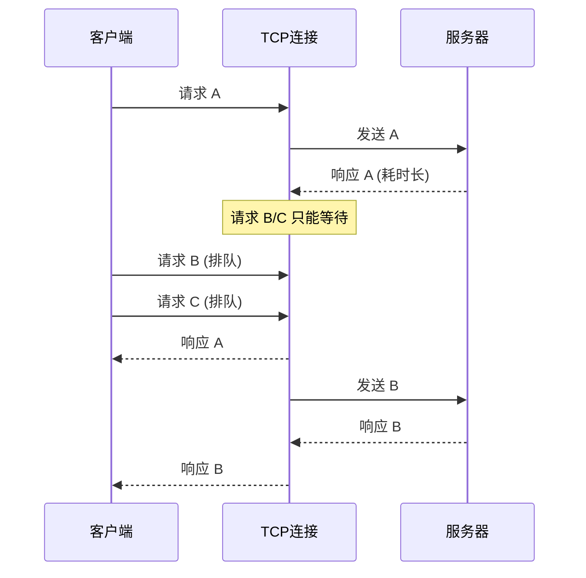

# HTTP/2 诞生背景：从拥堵公路到多车道快线

在深入理解 HTTP/2 之前，先回到熟悉的 HTTP/1.1 世界。想象一条只有一个收费口的老旧公路：每辆货车（请求）都得排队缴费、通过、卸货（响应）。这正是 HTTP/1.1 的真实写照——虽然它在 1990 年代帮助 Web 走向全球，但随着移动互联网、富媒体内容、单页应用的崛起，它的固有缺陷越来越明显。

## HTTP/1.1 的痛点

- **队头阻塞（Head-of-Line Blocking）**：单个 TCP 连接内的请求需要串行处理；一旦队首的响应慢，下游请求统统被拖住。哪怕浏览器打开了 6 条并行连接，也绕不开每条连接里的排队。
- **连接数限制**：为了绕开阻塞，浏览器不得不建立多条 TCP 连接。频繁的慢启动、TLS 握手让延迟雪上加霜，还会浪费服务器资源。
- **头部冗余**：每次请求都要完整发送一大段文本头部（Header），比如同一个 `User-Agent`、`Cookie` 一遍遍重复，既浪费带宽，也增大解析开销。
- **文本协议的不确定性**：HTTP/1.1 依赖文本格式分隔字段，机器处理时需要小心解析，容易被额外空格或大小写差异影响效率。

下图形象地展示了 HTTP/1.1 的队头阻塞困境：

## Google SPDY 与 HTTP/2 的诞生

2009 年 Google 发布实验性协议 SPDY，希望在不改变 HTTP 应用语义（RFC 9110）的前提下，通过全新传输层语法来解决上述瓶颈。SPDY 引入了多路复用、头部压缩、服务器推送等概念。业界验证了它的效果后，IETF 基于 SPDY 的设计整理出 RFC 7540，如今演进到 RFC 9113，正式命名为 HTTP/2。

HTTP/2 的核心理念很清晰：

1. **语义不动**：方法、状态码、头部字段皆沿用 HTTP 语义（RFC 9110）。用户代理、服务端程序无需重写整个业务逻辑。
2. **语法焕新**：传输层从文本行转为二进制帧，让机器以结构化方式交流，减少歧义与冗余。
3. **效率优先**：通过多路复用、优先级、流控等机制，提高 TCP 连接的利用率，降低延迟。

## 设计目标与思维模型

- **像高速公路扩宽车道**：HTTP/2 让单条 TCP 连接充满多条“虚拟车道”，数据流（Stream）互不堵塞。
- **像快递统一封装**：把“散乱的信件”装进尺寸标准的二进制帧，提高解包效率。
- **像老朋友间的默契**：HPACK 让双方记住常用头部字段，不必次次重复自我介绍。

HTTP/2 并非单点提升，而是一次全面升级：它从底层帧结构开始，重新定义了请求的传输方式，让浏览器、CDN、服务器协同更顺畅。接下来章节中，我们将循序渐进，帮助你在保留 HTTP 语义的同时，理解每一个关键机制如何协同工作。***
