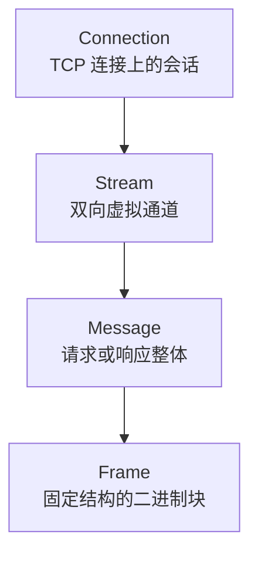

# 二进制分帧层：HTTP/2 的语法革命

HTTP/2 最根本的创新是“二进制分帧层”（Binary Framing Layer）。它像为 HTTP 架起了一个全新的语法工厂：所有请求与响应都先被拆成标准化的二进制帧，再在 TCP 连接里传输。语义（方法、路径、状态码）仍遵循 RFC 9110，但包装方式完全不同。

## 基本对象：连接、流、消息、帧

在 HTTP/2 里，我们可以这样理解层级关系：



- **Connection（连接）**：单个 TCP 连接承载一个 HTTP/2 会话。客户端与服务器通过 SETTINGS 帧协商参数，之后所有流共享这条底层通道。
- **Stream（流）**：在连接中开辟的“虚拟车道”，用 31 bit 的 Stream Identifier 标识。流可以并行存在，支持全双工。
- **Message（消息）**：通常由一个 HEADERS 帧开头，后续跟随一个或多个 DATA 帧组合成完整的请求或响应实体。
- **Frame（帧）**：HTTP/2 的最小传输单元。每个帧都有固定的 9 字节头部，加上可变长度的有效载荷。

## 通用帧格式

所有帧都遵循同一个结构。我们可以将它想象成统一贴好标签的快递箱：

```mermaid
graph TD
    A[Frame Header 9 字节]
    A --> B[Length (24 bits)\n有效载荷长度]
    A --> C[Type (8 bits)\n帧类型]
    A --> D[Flags (8 bits)\n布尔标记]
    A --> E[Reserved + Stream Identifier (1 + 31 bits)\n帧所属流]
    A --> F[Frame Payload\n载荷数据]
```

- **Length**：3 字节，最大 16,383（默认）或更高（通过 SETTINGS 调整）。
- **Type**：比如 `0x0` 表示 DATA，`0x1` 表示 HEADERS，`0x4` 表示 SETTINGS。
- **Flags**：各帧类型专用标志位，如 END_STREAM、END_HEADERS。
- **Stream Identifier**：指明帧属于哪个流。标识符为 0 的帧用于整条连接（例如 SETTINGS、PING）。

## 核心帧类型速览

| 帧类型 | 作用 | 场景示例 |
| --- | --- | --- |
| DATA | 传输实体内容（HTML、JSON、图片片段等） | 服务端向客户端发送响应正文 |
| HEADERS | 携带请求/响应头部字段，含伪头部 | 客户端发起请求，服务器回传状态码 |
| SETTINGS | 连接级别参数协商，不关联具体流 | 握手后双方同步最大帧大小 |
| PRIORITY | 表示流的依赖关系与权重 | 浏览器告知“CSS 比图片更重要” |
| PUSH_PROMISE | 服务端主动声明即将推送的资源 | Server Push 预热 CSS 文件 |
| PING | 探测对端存活与网络延迟 | CDN 检测连接健康度 |
| GOAWAY | 通知对端停止创建新流，准备关闭连接 | 服务端重启前温和收尾 |
| WINDOW_UPDATE | 调整流或连接的流量窗口 | 控制发送方速率，防止被淹没 |

> 小贴士：没有了 HTTP/1.1 的“起始行”，HTTP/2 使用伪头部字段（以冒号开头）来承载方法、路径等信息。例如 `:method: GET`、`:authority: www.example.com`。这些字段必须出现在 HEADERS 帧之中，下一章将结合多路复用具体展示它们的运作方式。

## 与 HTTP/1.1 的对比

- **结构化 vs 文本化**：二进制帧让机器读取字段时无需再扫描换行符；解析更快、错误更少。
- **统一封装 vs 自由拼接**：所有消息都拆成帧，便于插入控制信息（如 PRIORITY、RST_STREAM）；HTTP/1.1 则只能严格按顺序传输。
- **连接共享 vs 连接杂乱**：在 HTTP/2 中，控制帧与数据帧同处一个连接，不需要额外通道。

想要真正释放多路复用的威力，就必须先掌握这一套二进制语法。下一章我们将进入多路复用的世界，看看这些帧如何在单条连接里交织前进。***
