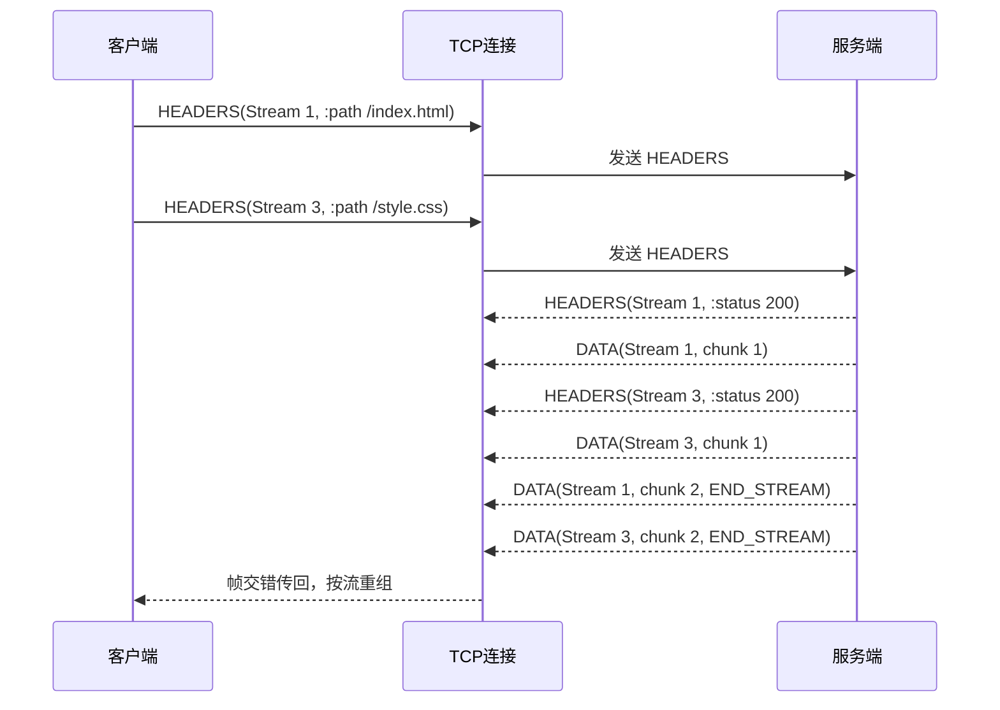

# 多路复用：真正解决队头阻塞的“多车道高速”

HTTP/1.1 的管道化（Pipelining）尝试过在一条连接上同时发起多个请求，但响应仍然必须按顺序返回，一旦第一个响应卡住，后面的请求仍旧排队。HTTP/2 则用多路复用（Multiplexing）把这条路扩宽成多车道：不同流的帧可以交错发送，再按序组装，不再受单个慢请求的拖累。

## 管道化为何失败

- **严格顺序**：管道化要求响应顺序与请求顺序一致，否则客户端难以匹配。
- **中间代理不支持**：许多 HTTP/1.1 代理会拆分或重排请求，导致管道化不稳定。
- **HOL 仍存在**：如果队首响应慢，后面的响应仍旧受阻。

HTTP/2 通过引入帧、流的概念，从根本上打破了“一个连接一次只能处理一个响应”的限制。

## HTTP/2 的多路复用工作流程



- 同一个 TCP 连接承载多个流（Stream 1、Stream 3……）。
- 每个流携带自己的 HEADERS、DATA 帧，帧之间可以交错。
- 客户端根据帧的 Stream Identifier 拼回各自的消息。

## 与 HTTP/1.1 的对比

| 领域 | HTTP/1.1 | HTTP/2 |
| --- | --- | --- |
| 并发策略 | 多条 TCP 连接；每条连接串行 | 单条 TCP 连接；流内并行 |
| 队头阻塞 | 存在：连接级 HOL | 消除：流级别独立控制 |
| 优先级 | 基于建立连接顺序，粗糙 | 明确的依赖树与权重 |
| 中间件友好度 | 管道化易被代理破坏 | 二进制帧在链路上保持一致 |

## 命令行实战：感受多路复用

### 1. 检查站点是否启用 HTTP/2

```bash
curl -v --http2 https://www.cloudflare.com/
```

- 观察 `* Using HTTP2`、`* ALPN, offering h2` 等调试信息。
- 在 `HEADERS` 输出中可以看到伪头部字段，例如 `:status: 200`。

### 2. 利用 `curl --parallel` 触发多请求

`curl` 从 7.66 起支持 `--parallel`，当目标站点支持 HTTP/2 时，会在单条连接内并行拉取多个资源。

```bash
curl --http2 --parallel --parallel-max 5 \
  -O https://example.org/index.html \
  -O https://example.org/style.css \
  -O https://example.org/app.js
```

- 使用 `-w '%{num_connects}\n'` 可以确认实际上只建立了一个 TCP 连接。

### 3. 使用 `nghttp` 观察帧交错

如果安装了 [nghttp2](https://github.com/nghttp2/nghttp2)，可以运行：

```bash
nghttp -nv https://www.cloudflare.com/ | head
```

`-n` 禁止自动拉取依赖资源，`-v` 输出帧日志。你会看到不同 Stream ID 的 HEADERS、DATA 帧交错打印。

## 浏览器中的多路复用视角

- 在 Chrome/Firefox 打开开发者工具 → Network 面板。
- 选中请求列，确认 `Protocol` 字段为 `h2`。
- 查看瀑布图：多个静态资源的时间条几乎同时开始，说明它们在同一个连接上并行传输。
- 对比使用 `--disable-http2` 启动浏览器时的瀑布图，会发现 HTTP/1.1 下的串行加载与重复握手。

## 更稳定的性能

- **减少握手**：单一 TCP 连接意味着更少的 TLS 握手、慢启动影响。
- **更快的队尾响应**：慢请求只会影响自己的流，其他流仍能前进。
- **更精细的调度**：结合 PRIORITY 帧，浏览器可以告诉服务器哪些资源更紧急。

多路复用点燃了 HTTP/2 的性能提升，但为了真正发挥它的威力，还需要配套的流量与资源控制机制。下一章我们将转向头部压缩，看看如何降低每个请求的“话语成本”。***
