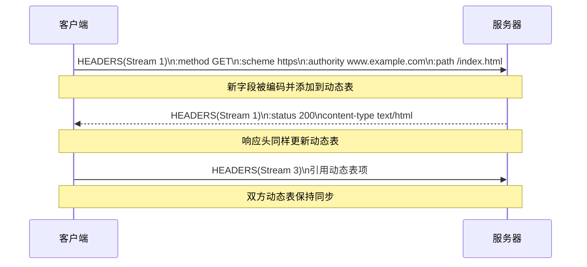

# 头部压缩：HPACK 让“老朋友省口水”

在 HTTP/1.1 时代，每次请求都需要完整地发送头部字段：`Host`、`User-Agent`、`Cookie`……即便只改动一个字段，也要重复整段文本。HPACK（RFC 7541）为 HTTP/2 提供了一套专属的头部压缩算法，通过维护共享字典和专用霍夫曼编码，大幅减少冗余数据。

## HPACK 的三大支柱

1. **静态表（Static Table）**：协议预定义的常用头部列表，如 `:method: GET`、`:status: 200`。它类似“共同的联系人列表”，双方开局就知晓。
2. **动态表（Dynamic Table）**：客户端和服务器在连接期间维护的共享字典，会根据传输的头部不断扩充。像聊天中的常用句子，提过一次后就能用编号代替。
3. **霍夫曼编码（Huffman Coding）**：为 ASCII 字符设计的变长编码，频率越高的字符使用越短的比特串。比 gzip 更适合小体积、键值可预测的 HTTP 头部。

## 动态表如何建立默契

以下序列展示了客户端和服务器如何通过 HEADERS 帧同步更新动态表：



- 第一次请求需要发送完整头部。HPACK 会把键和值写入动态表并分配索引。
- 后续请求只需引用索引，如“`Indexed Header Field Representation`”，即可避免重复传输。
- 若某个头部字段只偶尔使用，也可以选择“`Literal Header Field Without Indexing`”，避免污染动态表。

## 霍夫曼编码为何更适合

- **针对 HTTP 字符集定制**：gzip 设计用于大块数据，对几百字节的头部帮助有限；HPACK 的霍夫曼表专门为常见头部字符优化。
- **安全性**：gzip + TLS 容易受到 CRIME/BREACH 等压缩侧信道攻击。HPACK 的上下文隔离与静态/动态表机制可避免跨请求推测敏感信息。
- **状态独立**：霍夫曼表固定，双方不需协商，降低复杂度。

## HTTP/2 伪头部：语义与语法的桥梁

HPACK 不只压缩传统头部，还引入以冒号开头的“伪头部”字段：

- `:method` 取代 HTTP/1.1 请求行的动词。
- `:scheme` 表示协议（http/https），明确请求上下文。
- `:authority` 等价于 Host + 端口，支持虚拟主机。
- `:path` 对应资源路径，类似原始请求行的 URI。

伪头部必须出现在普通头部之前，且不会出现在转发到下游服务器的请求中（代理必须先转换为 HTTP/1.1 格式）。

## 与 gzip 的对比

| 指标 | gzip | HPACK |
| --- | --- | --- |
| 目标场景 | 通用字节流 | HTTP 头部字段 |
| 压缩上下文 | 每次压缩独立 | 连接级共享字典 |
| 安全风险 | 易受压缩推测攻击 | 设计上规避 CRIME |
| 协议支持 | 需要 Content-Encoding | HTTP/2 内建机制 |

HPACK 的上下文敏感压缩可以在移动网络、IoT 设备等带宽有限的环境中显著降低头部开销，加快首包时间。

## 实战观察：`nghttp` 输出

```bash
nghttp -v https://http2.akamai.com/demo
```

- 在日志中查找 `header-table-size`，了解对端愿意分配的动态表大小。
- 使用 `--header-table-size=<n>` 选项可以模拟客户端支持的最大表尺寸，测试对压缩比的影响。

掌握 HPACK 后，你已经了解 HTTP/2 如何让“话更少但意思不变”。下一章我们会探索服务器主动推送、流控与优先级等高级特性，看看这些机制如何协同配合多路复用。***
