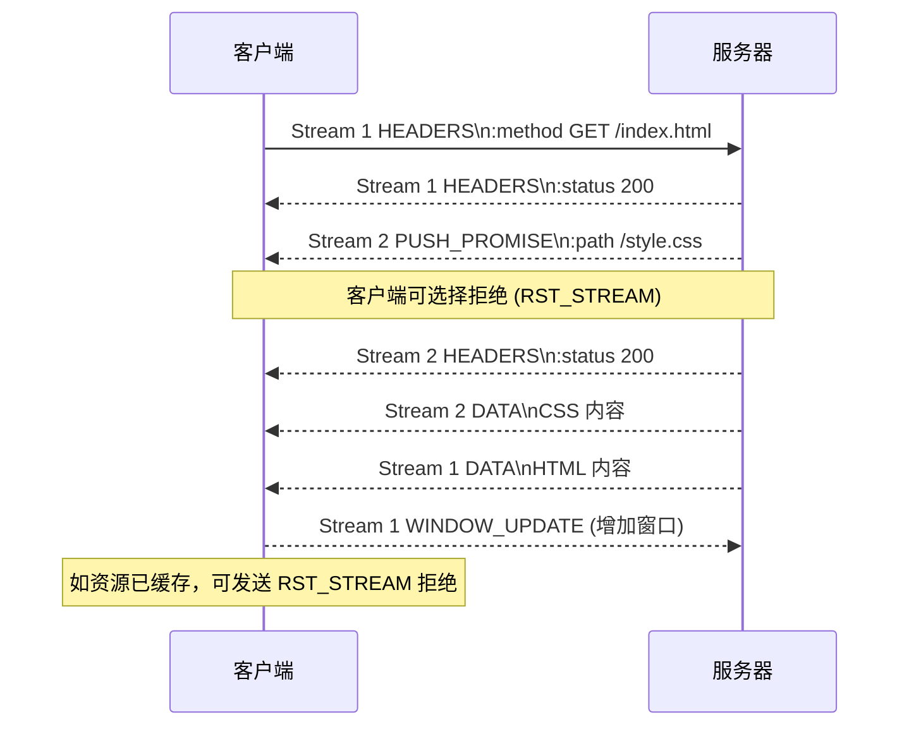

# 高级特性：Server Push、流控与优先级

HTTP/2 在多路复用与头部压缩之外，还带来了三大“细腻调度”能力：服务器主动推送资源、基于窗口的流量控制、流优先级依赖树。这些机制让传输更加高效、可控。

## Server Push：像服务员提前送上配菜

在 HTTP/1.1 中，优化“关键资源”常见做法是内联（Inlining）：比如把 CSS 写进 HTML，牺牲缓存换来首屏速度。HTTP/2 的 Server Push 则允许服务器在客户端请求主资源时，主动推送它可能需要的子资源（CSS、JS、字体），避免额外的往返时延。

- **PUSH_PROMISE 帧**：告知客户端“我准备推送这个资源”，载荷中包含伪头部字段。
- **推送流（Pushed Stream）**：服务器用一个新 Stream ID 发送 HEADERS + DATA。
- **客户端控制权**：客户端可以根据缓存或策略，通过 RST_STREAM 取消推送，避免浪费带宽。

### 与 HTTP/1.1 内联的对比

- **缓存友好**：Server Push 资源仍以独立请求形式出现，可落入浏览器缓存；内联资源无法单独缓存。
- **资源调度**：Push 可以根据优先级调度并与其他流同时传输；内联则阻塞 HTML 解析。
- **风险**：若判断失准，Push 会浪费带宽；HTTP/1.1 内联则只影响单个页面体积。

## 流量控制：WINDOW_UPDATE 的“水闸”

HTTP/2 延续了 TCP 的“滑动窗口”思想，但增加了应用层流控。每条流以及整个连接都拥有独立的接收窗口（初始为 65,535 字节）。接收方消费数据后，需要通过 WINDOW_UPDATE 帧“补充信用额度”。

- **连接级窗口**：防止单一对端在整个连接上泛滥数据。
- **流级窗口**：细粒度地控制某个请求的发送速率，避免大文件抢占带宽。
- **流控关闭**：设置窗口为零即可暂停发送，直到再次发送 WINDOW_UPDATE。

> 类比现实：TCP 是城市的总水管，HTTP/2 流控是每个家庭和小区的水表，确保资源均匀分配。

### 常见调优示例

在 Nginx 中，可以通过 `http2_body_preread_size` 控制每个流的预读大小，防止大文件占满内存；使用 `http2_max_requests` 限制连接内流的数量，避免服务器资源过载。

## 优先级与依赖：请求之间的排队礼仪

HTTP/2 定义了一个树形优先级模型：每个流可以声明自己的依赖父节点和权重（1-256）。服务器根据依赖关系分配发送机会，确保关键资源先行。

- **依赖树**：根节点代表虚拟的“全部请求”。流可以依赖其他流或者根节点。
- **权重**：表示相对重要性，权重越高，分得带宽越多。
- **重新优先**：客户端可在任何时候发送 PRIORITY 帧调整依赖关系。

浏览器往往会：

1. 将 HTML（主文档）挂到根节点；
2. 让 CSS、关键 JS 依赖于 HTML；
3. 让图片、字体等较低优先级资源挂在 CSS/JS 下方。

> 注意：虽然优先级是“建议”，服务器可根据策略决定是否完全遵循。例如 CDN 可能结合实时带宽和缓存命中率自定义调度。

## 实战小技巧

- 使用 `nghttp -v` 可观察 PRIORITY、WINDOW_UPDATE、PUSH_PROMISE 等帧。
- Chrome DevTools 的 Network 面板可以显示推送资源（Push 图标）以及优先级（Priority 列）。
- 在调试 Server Push 时，记得关注浏览器缓存：若资源已缓存且缓存命中，Push 可能被客户端拒绝。

HTTP/2 的这些高级特性让传输更加灵活。但想让它们发挥最大价值，还需要与真实世界的部署环境结合。下一章我们将走进命令行、浏览器与服务器配置，学习如何验证、启用与迁移到 HTTP/2。***
