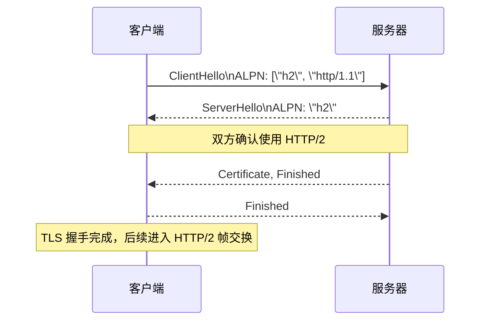

# 实战指南：从协议协商到迁移策略

掌握了 HTTP/2 的原理之后，接下来就是把它应用到真实环境里。本章将覆盖 ALPN 协商过程、命令行与浏览器的验证手法、服务器配置示例，以及从 HTTP/1.1 平滑迁移的建议。

## ALPN：TLS 握手中的协议协商

HTTP/2 主要通过 TLS 上的 ALPN（Application-Layer Protocol Negotiation）协商启用。它让客户端在握手时告知“我支持哪些上层协议”，服务器再选择最合适的一种。



- **必须启用 TLS 1.2+**（Chrome/Firefox 等浏览器要求）。
- 对于明文 HTTP/2（h2c），则通过 HTTP/1.1 的 Upgrade 头部，少见且多用于内部服务。

### 命令行观察 ALPN

```bash
openssl s_client -alpn h2 -connect www.google.com:443 < /dev/null | grep -i alpn
```

如果输出 `ALPN protocol: h2`，说明服务器在握手中选择了 HTTP/2。

## 命令行与工具链

- **curl**：`curl -I --http2 https://example.com` 查看响应头并确认 `HTTP/2 200`。
- **curl --http1.1**：对比 HTTP/1.1 响应时间、握手次数。
- **nghttp**：打印帧级别日志，验证 HEADERS、DATA、PUSH_PROMISE、WINDOW_UPDATE 等。
- **h2c**（来自 nghttp2 包）：用于测试明文 HTTP/2。

### 多连接并发测试

```bash
curl --http2 --parallel --parallel-immediate \
  -O https://example.com/css/app.css \
  -O https://example.com/js/app.js \
  -O https://example.com/img/hero.webp \
  -w 'connections=%{num_connects}\n'
```

输出 `connections=1` 意味着所有资源复用了单一 TCP 连接。

## 浏览器验证要点

- **协议列**：在 Chrome DevTools → Network 面板中添加 `Protocol` 列，确认显示 `h2`。
- **伪头部**：选中任意请求 → Headers → General 区域可以看到 `:method`、`:authority`、`:path`、`:scheme`。
- **Server Push**：当服务器推送资源时，Chrome 会在 Initiator 一栏显示 `Push / ...`，Firefox 会在列表中标注一个闪电图标。
- **瀑布图对比**：记录启用/禁用 HTTP/2 后的瀑布图差异，直观观察多路复用效果。

## Web 服务器配置示例

### Nginx（1.9.5+）

```nginx
server {
    listen 443 ssl http2;
    server_name www.example.com;

    ssl_certificate     /etc/ssl/example.crt;
    ssl_certificate_key /etc/ssl/example.key;
    ssl_protocols       TLSv1.2 TLSv1.3;
    ssl_prefer_server_ciphers off;
    add_header Strict-Transport-Security "max-age=63072000" always;

    # Server Push 示例（慎用）
    http2_push /static/css/app.css;
    http2_push_preload on;

    location / {
        root /var/www/html;
    }
}
```

- `listen 443 ssl http2;` 开启 TLS + HTTP/2。
- `http2_push`、`http2_push_preload` 用于根据 Link 头实现 Server Push（Chromium 97+ 默认关闭 Push，使用时需评估收益）。
- `http2_body_preread_size`、`http2_max_requests` 等指令用于调优流控。

### Apache HTTPD（2.4.17+）

```apache
Protocols h2 http/1.1
H2Push on
H2Direct on
H2StreamMaxMemSize 256000
```

确保已加载 `mod_http2` 和 `mod_ssl` 模块。

## 部署与调试建议

1. **先启用 TLS 最佳实践**：HTTP/2 与 TLS 紧密结合，应确保证书链完整、使用现代加密套件。
2. **监控握手与帧统计**：通过 Nginx `$ssl_alpn_protocol` 日志字段、CDN 分析工具，确认流量命中率。
3. **评估 Server Push**：结合 Real User Monitoring (RUM) 数据和缓存命中率，逐步上线。可考虑改用 `Preload` 头部配合 `Early Hints (103)`。
4. **关注中间设备兼容性**：某些老旧代理可能不支持 HTTP/2，需要回退到 HTTP/1.1 或启用 ALPN 协商的回退路径。

## 迁移策略

- **阶段性灰度**：先在 CDN 或负载均衡层对部分流量启用 HTTP/2。通过 `User-Agent`、地域等维度控制试点范围。
- **保持语义一致**：应用层无需改造；重点在于 TLS、负载均衡配置，以及对 Server Push、优先级的调优。
- **监测关键指标**：关注 TTFB、首屏渲染、连接数、TLS 握手时间。合理的 HTTP/2 部署应显著降低连接数量，改善延迟。
- **回退机制**：保留 HTTP/1.1 支持，确保 ALPN 协商失败时客户端仍可访问。

## 进一步延伸

- HTTP/3（基于 QUIC）在 UDP 上进一步消除 TCP 级别的队头阻塞，可视为 HTTP/2 思路的延伸。
- 了解 CDN、反向代理如何根据 HTTP/2 流优先级调度缓存命中，能够帮助你设计更高效的内容分发策略。

现在，你已经具备从理论到实践的全链路知识，能够分析 HTTP/1.1 的瓶颈、理解 HTTP/2 的核心机制，并在生产环境中验证与调优。祝你在下一次性能优化项目中，稳稳地交出一张“HTTP/2 优化答卷”。***
