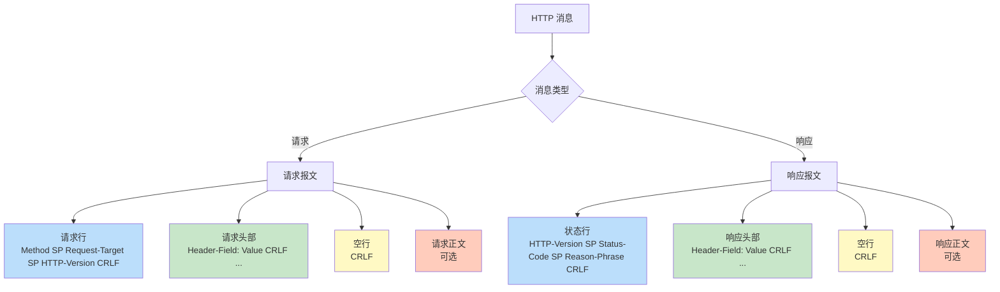
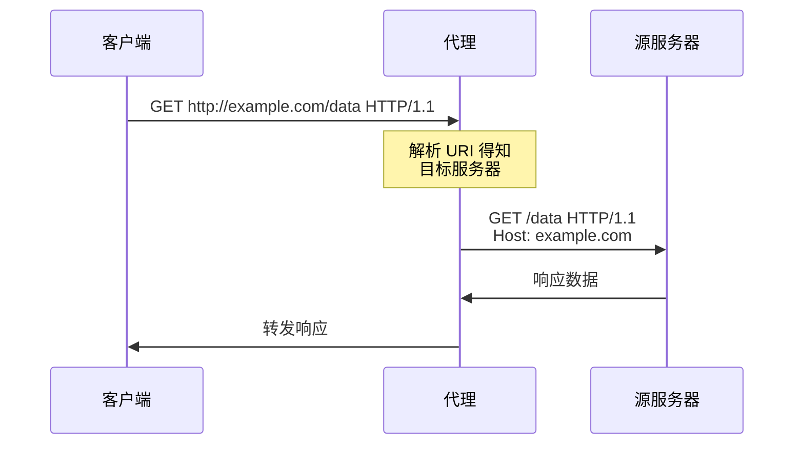
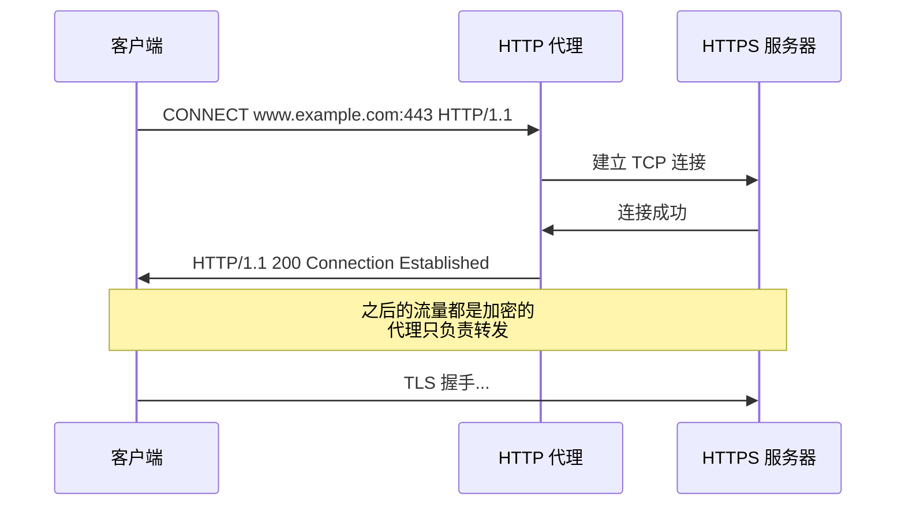
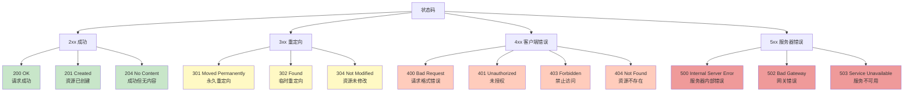
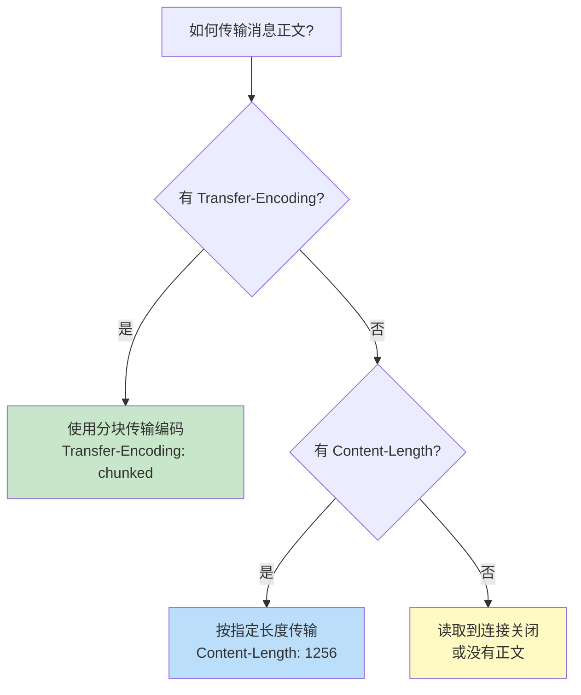
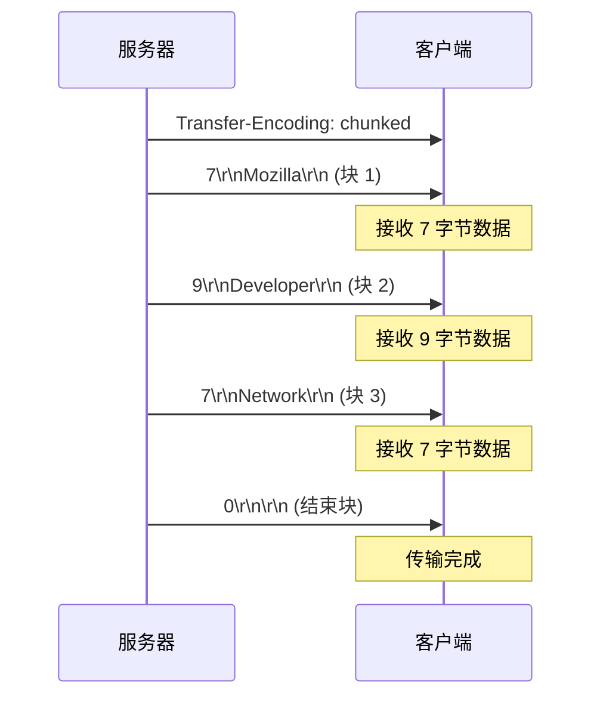

# 第二章:HTTP 报文格式

> 本章基于 RFC 9112 (HTTP/1.1) 和 RFC 9110 (HTTP Semantics) 规范编写

## 目录
- [2.1 HTTP 消息的通用格式](#21-http-消息的通用格式)
- [2.2 请求行详解](#22-请求行详解)
- [2.3 状态行详解](#23-状态行详解)
- [2.4 HTTP 头部字段](#24-http-头部字段)
- [2.5 消息正文与传输机制](#25-消息正文与传输机制)
- [2.6 实战演练](#26-实战演练)

---

## 2.1 HTTP 消息的通用格式

### 消息结构概览

HTTP/1.1 的请求和响应都遵循相同的基本格式 (RFC 9112 Section 2.1):

```
HTTP-message   = start-line CRLF      ← 起始行 + 回车换行
                 *( field-line CRLF )  ← 零个或多个头部字段
                 CRLF                  ← 空行 (标志头部结束)
                 [ message-body ]      ← 可选的消息正文
```

**关键要点**:
- **CRLF** (`\r\n`) - 回车换行,HTTP/1.1 的行结束符
- **起始行** - 请求用请求行,响应用状态行
- **空行必需** - 即使没有消息正文,空行也必须存在

### 可视化结构



### 完整示例对比

#### 请求报文

```http
GET /api/users/1 HTTP/1.1\r\n         ← 请求行
Host: api.example.com\r\n              ← 头部字段
User-Agent: curl/7.84.0\r\n
Accept: application/json\r\n
\r\n                                   ← 空行 (没有请求正文)
```

#### 响应报文

```http
HTTP/1.1 200 OK\r\n                    ← 状态行
Content-Type: application/json\r\n     ← 头部字段
Content-Length: 45\r\n
Date: Mon, 15 Jan 2024 10:30:00 GMT\r\n
\r\n                                   ← 空行
{"id":1,"name":"Alice","age":25}       ← 响应正文
```

**curl 实战 - 查看原始 HTTP 消息**:

```bash
# --trace-ascii - 将完整的 HTTP 消息保存到文件
curl --trace-ascii trace.txt https://www.example.com

# 查看文件内容
cat trace.txt
```

---

## 2.2 请求行详解

### 请求行的语法

```abnf
request-line = method SP request-target SP HTTP-version
```

**组成部分**:
1. **方法 (Method)** - 指定操作类型
2. **SP** - 单个空格 (0x20)
3. **请求目标 (Request Target)** - 要操作的资源
4. **SP** - 单个空格
5. **HTTP 版本** - 协议版本号

### 方法 (Method)

**方法 (Method)** 告诉服务器要执行什么操作,是 **大小写敏感** 的。

| 方法 | 作用 | 示例 |
|------|------|------|
| `GET` | 获取资源 | `GET /index.html` |
| `POST` | 提交数据 | `POST /api/users` |
| `PUT` | 更新/替换资源 | `PUT /api/users/1` |
| `DELETE` | 删除资源 | `DELETE /api/users/1` |
| `HEAD` | 仅获取响应头部 | `HEAD /api/users/1` |
| `OPTIONS` | 查询服务器支持的方法 | `OPTIONS /api/users` |
| `PATCH` | 部分更新资源 | `PATCH /api/users/1` |
| `CONNECT` | 建立隧道连接 | `CONNECT www.example.com:443` |
| `TRACE` | 追踪请求路径 | `TRACE /` |

**详细解释请参见 [第三章: HTTP 方法与状态码](./03-semantics-methods-status.md)**

### 请求目标 (Request Target)

请求目标有 **四种形式** (RFC 9112 Section 3.2):

#### 1. origin-form (最常用)

**格式**: `absolute-path [ "?" query ]`

**使用场景**: 直接请求源服务器

**示例**:

```http
GET /path/to/resource?key=value HTTP/1.1
Host: www.example.com
```

```bash
curl -v "https://api.github.com/search/repositories?q=http&sort=stars"
```

输出:

```
> GET /search/repositories?q=http&sort=stars HTTP/1.1
> Host: api.github.com
```

**要点**:
- 路径必须以 `/` 开头
- 如果原始 URI 的路径为空,必须使用 `/`

```bash
# 错误: 缺少 /
GET www.example.com HTTP/1.1

# 正确: 使用 /
GET / HTTP/1.1
Host: www.example.com
```

#### 2. absolute-form

**格式**: `absolute-URI`

**使用场景**: 请求代理服务器

**示例**:

```http
GET http://www.example.com/pub/index.html HTTP/1.1
Host: www.example.com
```

**为什么需要完整 URI?**

当请求发送到代理服务器时,代理需要知道目标服务器的完整地址:



**curl 示例 - 通过代理请求**:

```bash
curl -x http://proxy.example.com:8080 http://www.target.com/
```

请求行:

```
> GET http://www.target.com/ HTTP/1.1
```

#### 3. authority-form

**格式**: `uri-host ":" port`

**使用场景**: **仅用于 CONNECT 方法**,建立隧道连接

**示例**:

```http
CONNECT www.example.com:443 HTTP/1.1
Host: www.example.com
```

**用途**: HTTPS 通过 HTTP 代理建立加密连接



#### 4. asterisk-form

**格式**: `*`

**使用场景**: **仅用于 OPTIONS 方法**,查询服务器的整体能力

**示例**:

```http
OPTIONS * HTTP/1.1
Host: www.example.com
```

**curl 示例**:

```bash
curl -X OPTIONS https://www.example.com/ -i
```

响应示例:

```http
HTTP/1.1 200 OK
Allow: GET, POST, HEAD, OPTIONS
Content-Length: 0
```

### HTTP 版本

**格式**: `HTTP-name "/" DIGIT "." DIGIT`

**HTTP-name**: 必须是大写的 `"HTTP"`

**示例**:
- `HTTP/1.0` - HTTP 1.0
- `HTTP/1.1` - HTTP 1.1 (本教程重点)
- `HTTP/2` - HTTP/2 (二进制协议,不适用本规范)

**注意**: 版本号是 **大小写敏感** 的,必须大写:

```bash
# ✅ 正确
GET / HTTP/1.1

# ❌ 错误
GET / http/1.1
GET / Http/1.1
```

### 请求行示例汇总

```http
# 1. 常规 GET 请求
GET /index.html HTTP/1.1

# 2. 带查询参数
GET /search?q=http&limit=10 HTTP/1.1

# 3. POST 请求
POST /api/users HTTP/1.1

# 4. 代理请求 (absolute-form)
GET http://www.example.com/path HTTP/1.1

# 5. CONNECT 方法 (authority-form)
CONNECT www.example.com:443 HTTP/1.1

# 6. OPTIONS 查询 (asterisk-form)
OPTIONS * HTTP/1.1
```

---

## 2.3 状态行详解

### 状态行的语法

```abnf
status-line = HTTP-version SP status-code SP [ reason-phrase ]
```

**组成部分**:
1. **HTTP 版本** - 服务器使用的协议版本
2. **SP** - 单个空格
3. **状态码 (Status Code)** - 三位数字
4. **SP** - 单个空格
5. **原因短语 (Reason Phrase)** - 可选的文本描述

**示例**:

```http
HTTP/1.1 200 OK
HTTP/1.1 404 Not Found
HTTP/1.1 500 Internal Server Error
```

### 状态码 (Status Code)

**状态码 (Status Code)** 是一个 **三位十进制数字**,表示请求的处理结果。

**五大类别** (首位数字表示类别):

| 类别 | 含义 | 示例 |
|------|------|------|
| `1xx` | **信息性响应** (Informational) | `100 Continue` |
| `2xx` | **成功** (Successful) | `200 OK` |
| `3xx` | **重定向** (Redirection) | `301 Moved Permanently` |
| `4xx` | **客户端错误** (Client Error) | `404 Not Found` |
| `5xx` | **服务器错误** (Server Error) | `500 Internal Server Error` |

**详细的状态码列表和使用场景请参见 [第三章](./03-semantics-methods-status.md)**

#### 常见状态码速查



### 原因短语 (Reason Phrase)

**原因短语 (Reason Phrase)** 是状态码的文本描述,**仅供人类阅读**,客户端程序 **应该忽略** 原因短语,只依赖状态码。

**标准原因短语**:

```http
HTTP/1.1 200 OK
HTTP/1.1 404 Not Found
HTTP/1.1 500 Internal Server Error
```

**自定义原因短语** (允许但不推荐):

```http
HTTP/1.1 200 Success
HTTP/1.1 404 Page Does Not Exist
HTTP/1.1 500 Oops Something Went Wrong
```

**重要**: RFC 9112 明确指出,即使原因短语为空,状态码后的空格仍 **必须存在**:

```http
# ✅ 正确: 原因短语为空但保留空格
HTTP/1.1 200

# ❌ 错误: 缺少空格
HTTP/1.1 200
```

**curl 示例 - 查看状态行**:

```bash
curl -I https://www.example.com
```

输出:

```http
HTTP/1.1 200 OK
Age: 345678
Cache-Control: max-age=604800
Content-Type: text/html; charset=UTF-8
Date: Mon, 15 Jan 2024 10:30:00 GMT
```

---

## 2.4 HTTP 头部字段

### 头部字段的语法

**格式**: `field-name ":" OWS field-value OWS`

- **field-name** - 头部字段名 (大小写不敏感)
- **":"** - 冒号分隔符
- **OWS** - Optional WhiteSpace (可选的空白符,但建议在冒号后加一个空格)
- **field-value** - 头部字段值

**示例**:

```http
Host: www.example.com
Content-Type: application/json
Content-Length: 45
User-Agent: Mozilla/5.0 (Windows NT 10.0; Win64; x64)
```

### 头部字段的分类

#### 1. 通用头部 (General Headers)

**适用于请求和响应**

| 头部字段 | 作用 | 示例 |
|----------|------|------|
| `Date` | 消息生成的日期和时间 | `Date: Mon, 15 Jan 2024 10:30:00 GMT` |
| `Connection` | 控制连接行为 | `Connection: keep-alive` |
| `Cache-Control` | 缓存指令 | `Cache-Control: no-cache` |
| `Trailer` | 指示消息尾部包含哪些字段 | `Trailer: Expires` |

#### 2. 请求头部 (Request Headers)

**仅用于请求**

| 头部字段 | 作用 | 示例 |
|----------|------|------|
| `Host` | **必需!** 目标服务器的域名和端口 | `Host: www.example.com` |
| `User-Agent` | 客户端类型 | `User-Agent: curl/7.84.0` |
| `Accept` | 可接受的内容类型 | `Accept: application/json` |
| `Accept-Language` | 可接受的语言 | `Accept-Language: zh-CN,en;q=0.9` |
| `Accept-Encoding` | 可接受的编码方式 | `Accept-Encoding: gzip, deflate` |
| `Authorization` | 身份认证信息 | `Authorization: Bearer token123` |
| `Referer` | 来源页面的 URI | `Referer: https://www.google.com/` |
| `Cookie` | 客户端保存的 Cookie | `Cookie: session=abc123` |

#### 3. 响应头部 (Response Headers)

**仅用于响应**

| 头部字段 | 作用 | 示例 |
|----------|------|------|
| `Server` | 服务器软件信息 | `Server: nginx/1.22.0` |
| `Set-Cookie` | 设置 Cookie | `Set-Cookie: session=abc123; HttpOnly` |
| `Location` | 重定向目标 URI | `Location: https://www.example.com/new-page` |
| `Retry-After` | 重试的时间间隔 | `Retry-After: 120` |
| `Allow` | 资源支持的 HTTP 方法 | `Allow: GET, POST, HEAD` |

#### 4. 实体头部 (Entity Headers)

**描述消息正文**

| 头部字段 | 作用 | 示例 |
|----------|------|------|
| `Content-Type` | 正文的媒体类型 | `Content-Type: application/json` |
| `Content-Length` | 正文的字节数 | `Content-Length: 1256` |
| `Content-Encoding` | 正文的编码方式 | `Content-Encoding: gzip` |
| `Content-Language` | 正文的语言 | `Content-Language: zh-CN` |
| `Content-Location` | 资源的备用 URI | `Content-Location: /index.html` |
| `Last-Modified` | 资源的最后修改时间 | `Last-Modified: Wed, 21 Oct 2023 07:28:00 GMT` |
| `ETag` | 资源的实体标签 | `ETag: "686897696a7c876b7e"` |

### 重要头部详解

#### Host (请求头部)

**作用**: 指定目标服务器的域名和端口号

**为什么是必需的?**

在 HTTP/1.1 中,**一台物理服务器可以托管多个域名** (虚拟主机),服务器通过 `Host` 头部来区分请求的是哪个网站。

```
            ┌─ www.site1.com (虚拟主机 1)
IP: 1.2.3.4 ┼─ www.site2.com (虚拟主机 2)
            └─ www.site3.com (虚拟主机 3)
```

**格式**:

```http
Host: <hostname>[:<port>]
```

**示例**:

```http
# 默认端口 (80 或 443)
Host: www.example.com

# 自定义端口
Host: www.example.com:8080
```

**Nginx 虚拟主机配置示例**:

```nginx
# 虚拟主机 1
server {
    listen 80;
    server_name www.site1.com;
    root /var/www/site1;
}

# 虚拟主机 2
server {
    listen 80;
    server_name www.site2.com;
    root /var/www/site2;
}
```

**curl 示例 - 查看 Host 头部**:

```bash
curl -v https://www.example.com
```

输出:

```
> GET / HTTP/1.1
> Host: www.example.com
> User-Agent: curl/7.84.0
```

#### Content-Type (实体头部)

**作用**: 指定消息正文的媒体类型 (MIME 类型)

**格式**: `Content-Type: <media-type>[; charset=<charset>]`

**常见媒体类型**:

| 媒体类型 | 说明 | 示例 |
|----------|------|------|
| `text/plain` | 纯文本 | `Content-Type: text/plain; charset=utf-8` |
| `text/html` | HTML 文档 | `Content-Type: text/html; charset=utf-8` |
| `application/json` | JSON 数据 | `Content-Type: application/json` |
| `application/xml` | XML 数据 | `Content-Type: application/xml` |
| `application/x-www-form-urlencoded` | 表单数据 (URL 编码) | `Content-Type: application/x-www-form-urlencoded` |
| `multipart/form-data` | 表单数据 (支持文件上传) | `Content-Type: multipart/form-data; boundary=----...` |
| `image/jpeg` | JPEG 图片 | `Content-Type: image/jpeg` |
| `image/png` | PNG 图片 | `Content-Type: image/png` |
| `application/octet-stream` | 二进制数据 | `Content-Type: application/octet-stream` |

**curl 示例 - 发送 JSON 数据**:

```bash
curl -X POST https://api.example.com/users \
  -H "Content-Type: application/json" \
  -d '{"name":"Alice","age":25}'
```

请求:

```http
POST /users HTTP/1.1
Host: api.example.com
Content-Type: application/json
Content-Length: 28

{"name":"Alice","age":25}
```

**curl 示例 - 上传文件**:

```bash
curl -X POST https://api.example.com/upload \
  -F "file=@photo.jpg" \
  -F "description=My Photo"
```

请求 (简化):

```http
POST /upload HTTP/1.1
Host: api.example.com
Content-Type: multipart/form-data; boundary=----WebKitFormBoundary...

------WebKitFormBoundary...
Content-Disposition: form-data; name="file"; filename="photo.jpg"
Content-Type: image/jpeg

[二进制图片数据]
------WebKitFormBoundary...
Content-Disposition: form-data; name="description"

My Photo
------WebKitFormBoundary...--
```

#### Content-Length (实体头部)

**作用**: 指定消息正文的字节数

**格式**: `Content-Length: <length>`

**示例**:

```http
Content-Length: 1256
Content-Length: 0
```

**重要规则**:
1. **与 `Transfer-Encoding` 互斥** - 如果使用分块传输编码 (`Transfer-Encoding: chunked`),则 **不能** 包含 `Content-Length`
2. **计算方式** - 按字节计数,不是字符数 (注意 UTF-8 编码)

**示例 - 字符数 vs 字节数**:

```python
# Python 示例
text = "你好"  # 两个中文字符
len(text)                    # 2 (字符数)
len(text.encode('utf-8'))    # 6 (字节数,UTF-8 编码每个中文字符 3 字节)
```

因此 `Content-Length` 应该是 `6`,不是 `2`。

**curl 示例**:

```bash
curl -X POST https://httpbin.org/post \
  -H "Content-Type: text/plain" \
  -d "Hello World"
```

请求:

```http
POST /post HTTP/1.1
Host: httpbin.org
Content-Type: text/plain
Content-Length: 11           ← "Hello World" 有 11 个字节

Hello World
```

#### Cache-Control (通用头部)

**作用**: 控制缓存行为 (详见 [第六章: HTTP 缓存机制](./06-caching.md))

**常用指令**:

**请求指令**:
- `no-cache` - 强制向服务器验证
- `no-store` - 不要缓存
- `max-age=<seconds>` - 缓存的最大寿命

**响应指令**:
- `public` - 可以被共享缓存 (CDN、代理) 缓存
- `private` - 只能被私有缓存 (浏览器) 缓存
- `no-cache` - 必须验证后才能使用缓存
- `no-store` - 不要缓存
- `max-age=<seconds>` - 缓存的最大寿命
- `must-revalidate` - 过期后必须验证

**示例**:

```http
# 响应头: 缓存 1 小时
Cache-Control: public, max-age=3600

# 响应头: 不要缓存
Cache-Control: no-store

# 请求头: 强制重新验证
Cache-Control: no-cache
```

**Nginx 配置示例**:

```nginx
location /static/ {
    # 静态资源缓存 1 年
    add_header Cache-Control "public, max-age=31536000";
}

location /api/ {
    # API 响应不缓存
    add_header Cache-Control "no-store";
}
```

### 头部字段的规则

#### 1. 字段名大小写不敏感

```http
# 以下都是等价的
Host: www.example.com
host: www.example.com
HOST: www.example.com
HoSt: www.example.com
```

**约定**: 通常使用 **首字母大写** (`Host`)

#### 2. 字段值前后可以有空白符

```http
# 以下都是有效的
Content-Type: application/json
Content-Type:application/json
Content-Type:  application/json
```

**约定**: 冒号后加 **一个空格** (`Content-Type: application/json`)

#### 3. 同名字段可以合并

如果有多个同名头部字段,可以合并为一个,用逗号分隔:

```http
# 原始
Accept-Encoding: gzip
Accept-Encoding: deflate

# 等价于
Accept-Encoding: gzip, deflate
```

#### 4. 头部字段名和冒号之间不能有空白符

```http
# ❌ 错误: 字段名和冒号之间有空格
Host : www.example.com

# ✅ 正确
Host: www.example.com
```

**安全原因**: 历史上,一些服务器对空白符的处理不一致,导致安全漏洞 (请求走私攻击)。RFC 9112 明确要求服务器 **必须拒绝** 字段名和冒号之间有空白符的请求。

---

## 2.5 消息正文与传输机制

### 消息正文的确定

**请求中**:
- 通过 `Content-Length` 或 `Transfer-Encoding` 头部指示

**响应中** (RFC 9112 Section 6.3):
1. **HEAD 请求的响应** - 总是没有正文
2. **1xx、204、304 状态码** - 总是没有正文
3. **2xx 响应 CONNECT 请求** - 没有正文 (连接变成隧道)
4. **`Transfer-Encoding` 存在** - 优先级高于 `Content-Length`
5. **仅有 `Content-Length`** - 按指定长度读取
6. **都没有** - 读取到连接关闭

### Content-Length vs Transfer-Encoding



#### 方式 1: Content-Length

**适用场景**: 预先知道正文的完整长度

**示例**:

```http
POST /api/users HTTP/1.1
Host: api.example.com
Content-Type: application/json
Content-Length: 28

{"name":"Alice","age":25}
```

**curl 示例**:

```bash
curl -X POST https://httpbin.org/post \
  -H "Content-Type: application/json" \
  -d '{"name":"Alice","age":25}'
```

输出 (服务器回显的请求):

```json
{
  "headers": {
    "Content-Length": "28",
    "Content-Type": "application/json"
  },
  "json": {
    "name": "Alice",
    "age": 25
  }
}
```

#### 方式 2: 分块传输编码 (Chunked Transfer Encoding)

**适用场景**:
- 正文长度未知 (如动态生成的内容、流式传输)
- 服务器希望尽快开始发送响应

**格式**:

```http
HTTP/1.1 200 OK
Content-Type: text/plain
Transfer-Encoding: chunked

7\r\n          ← 块大小 (十六进制) = 7 字节
Mozilla\r\n    ← 块数据
9\r\n          ← 块大小 (十六进制) = 9 字节
Developer\r\n  ← 块数据
7\r\n
Network\r\n
0\r\n          ← 结束块 (大小为 0)
\r\n           ← 结束标志
```

**分块传输流程**:



**curl 示例 - 模拟分块传输**:

```bash
# 使用 Node.js 创建一个返回分块数据的服务器
node -e '
const http = require("http");
http.createServer((req, res) => {
  res.writeHead(200, {"Content-Type": "text/plain", "Transfer-Encoding": "chunked"});
  res.write("Chunk 1\n");
  setTimeout(() => { res.write("Chunk 2\n"); }, 1000);
  setTimeout(() => { res.write("Chunk 3\n"); res.end(); }, 2000);
}).listen(8000);
' &

# 请求这个服务器
curl -v http://localhost:8000
```

输出:

```http
< HTTP/1.1 200 OK
< Content-Type: text/plain
< Transfer-Encoding: chunked
<
Chunk 1
Chunk 2    ← 1 秒后出现
Chunk 3    ← 再过 1 秒后出现
```

**分块传输的语法** (RFC 9112 Section 7.1):

```abnf
chunked-body   = *chunk
                 last-chunk
                 trailer-section
                 CRLF

chunk          = chunk-size [ chunk-ext ] CRLF
                 chunk-data CRLF

chunk-size     = 1*HEXDIG        ; 十六进制数字
last-chunk     = "0" [ chunk-ext ] CRLF
chunk-data     = <chunk-size> octets

trailer-section = *( field-line CRLF )  ; 可选的尾部字段
```

**Nginx 配置示例 - 启用分块传输**:

```nginx
location /stream {
    proxy_pass http://backend;
    proxy_buffering off;           # 关闭缓冲,启用分块传输
    proxy_http_version 1.1;
}
```

#### 方式 3: 读取到连接关闭

**适用场景**: HTTP/1.0 中常见,现代 HTTP/1.1 中 **不推荐**

**特点**:
- 没有 `Content-Length` 和 `Transfer-Encoding`
- 客户端持续读取,直到服务器关闭连接

**缺点**:
- 无法使用持久连接 (每次请求都要建立新连接)
- 无法判断传输是否完整 (可能是网络中断)

**示例** (HTTP/1.0):

```http
HTTP/1.0 200 OK
Content-Type: text/html

<html>
<body>Hello World</body>
</html>
[服务器关闭连接]
```

### Transfer-Encoding 的其他编码

除了 `chunked`,`Transfer-Encoding` 还支持其他编码 (通常用于压缩):

| 编码 | 说明 |
|------|------|
| `chunked` | 分块传输编码 |
| `compress` | Unix compress 压缩 (已废弃) |
| `deflate` | zlib 压缩 |
| `gzip` | gzip 压缩 |

**组合使用** (先压缩,再分块):

```http
Transfer-Encoding: gzip, chunked
```

**注意**: 现代实践中,**压缩通常使用 `Content-Encoding` 而非 `Transfer-Encoding`**。

---

## 2.6 实战演练

### 练习 1: 使用 curl 查看完整的 HTTP 报文

**目标**: 查看一次 HTTP 请求和响应的完整报文

```bash
curl -v https://www.example.com
```

**任务**:
1. 找出请求行
2. 列举所有请求头部
3. 找出状态行
4. 列举所有响应头部
5. 观察响应正文的开始部分

<details>
<summary>点击查看答案</summary>

**请求报文**:

```http
> GET / HTTP/1.1
> Host: www.example.com
> User-Agent: curl/7.84.0
> Accept: */*
```

**分析**:
- **请求行**: `GET / HTTP/1.1`
- **请求头部**: `Host`, `User-Agent`, `Accept`

**响应报文**:

```http
< HTTP/1.1 200 OK
< Age: 345678
< Cache-Control: max-age=604800
< Content-Type: text/html; charset=UTF-8
< Date: Mon, 15 Jan 2024 10:30:00 GMT
< Etag: "3147526947+gzip"
< Expires: Mon, 22 Jan 2024 10:30:00 GMT
< Last-Modified: Thu, 17 Oct 2019 07:18:26 GMT
< Server: ECS (nyb/1D1B)
< Vary: Accept-Encoding
< X-Cache: HIT
< Content-Length: 1256
<
<!doctype html>
<html>
...
```

**分析**:
- **状态行**: `HTTP/1.1 200 OK`
- **响应头部**: `Age`, `Cache-Control`, `Content-Type`, `Date`, 等
- **响应正文**: HTML 文档
</details>

### 练习 2: 分析 POST 请求

**目标**: 发送 JSON 数据并观察 `Content-Type` 和 `Content-Length` 头部

```bash
curl -X POST https://httpbin.org/post \
  -H "Content-Type: application/json" \
  -d '{"name":"Bob","age":30}'
```

**任务**:
1. `Content-Length` 的值是多少?
2. 服务器回显的 JSON 数据是什么?
3. 响应的状态码是什么?

<details>
<summary>点击查看答案</summary>

```http
> POST /post HTTP/1.1
> Host: httpbin.org
> Content-Type: application/json
> Content-Length: 26
>
> {"name":"Bob","age":30}

< HTTP/1.1 200 OK
< Content-Type: application/json
<
{
  "json": {
    "name": "Bob",
    "age": 30
  },
  "headers": {
    "Content-Length": "26",
    "Content-Type": "application/json"
  }
}
```

**分析**:
- **Content-Length**: `26` (字节数)
- **服务器回显**: `{"name":"Bob","age":30}`
- **状态码**: `200 OK`
</details>

### 练习 3: 观察重定向

**目标**: 观察 `301` 重定向的响应

```bash
curl -I http://github.com
```

**任务**:
1. 状态码是多少?
2. `Location` 头部指向哪里?
3. 为什么使用 `301` 而不是 `302`?

<details>
<summary>点击查看答案</summary>

```http
HTTP/1.1 301 Moved Permanently
Content-Length: 0
Location: https://github.com/
```

**分析**:
- **状态码**: `301 Moved Permanently` (永久重定向)
- **Location**: `https://github.com/` (从 HTTP 重定向到 HTTPS)
- **为什么 301?**: 这是一个永久性的重定向 (HTTP → HTTPS),浏览器会缓存这个重定向规则

如果要让 curl 自动跟随重定向:

```bash
curl -L http://github.com
```
</details>

### 练习 4: 浏览器开发者工具

1. 打开 Chrome 浏览器
2. 按 `F12` 打开开发者工具
3. 切换到 "Network" 标签
4. 访问 `https://www.github.com`
5. 点击第一个请求,查看:
   - **General** - 请求方法、状态码、远程地址
   - **Request Headers** - 所有请求头部
   - **Response Headers** - 所有响应头部
   - **Response** - 响应正文

**观察点**:
- 浏览器发送了哪些 `Accept-*` 头部?
- 服务器返回的 `Content-Encoding` 是什么? (可能是 `gzip`)
- 哪些资源使用了缓存? (看 "Status" 列中的 "disk cache" 或 "memory cache")

---

## 本章小结

### 核心要点

1. **HTTP 消息的通用格式**:
   - 起始行 (请求行/状态行) + 头部字段 + 空行 + 消息正文 (可选)
   - 行结束符是 `CRLF` (`\r\n`)

2. **请求行**: `方法 SP 请求目标 SP HTTP版本`
   - 请求目标有四种形式: `origin-form` (最常用)、`absolute-form`、`authority-form`、`asterisk-form`

3. **状态行**: `HTTP版本 SP 状态码 SP 原因短语`
   - 状态码分五大类: `1xx` 信息、`2xx` 成功、`3xx` 重定向、`4xx` 客户端错误、`5xx` 服务器错误

4. **HTTP 头部字段**:
   - 格式: `字段名: 字段值`
   - 字段名大小写不敏感,但字段名和冒号之间 **不能有空格**
   - 分类: 通用头部、请求头部、响应头部、实体头部

5. **消息正文传输**:
   - `Content-Length` - 预先知道长度
   - `Transfer-Encoding: chunked` - 分块传输,长度未知
   - `Transfer-Encoding` 优先级高于 `Content-Length`

### 下一章预告

在 [第三章: HTTP 语义 - 方法与状态码](./03-semantics-methods-status.md) 中,我们将详细讲解:
- HTTP 方法的完整列表和使用场景 (GET、POST、PUT、DELETE、HEAD、OPTIONS 等)
- 方法的属性: 安全性 (Safe)、幂等性 (Idempotent)
- 五大类状态码的详细说明和使用案例
- 常见的错误状态码和调试技巧

---

## 参考资料

- [RFC 9112 - HTTP/1.1](https://www.rfc-editor.org/rfc/rfc9112.html)
- [RFC 9110 - HTTP Semantics](https://www.rfc-editor.org/rfc/rfc9110.html)
- [MDN - HTTP Messages](https://developer.mozilla.org/en-US/docs/Web/HTTP/Messages)
- [MDN - HTTP Headers](https://developer.mozilla.org/en-US/docs/Web/HTTP/Headers)
