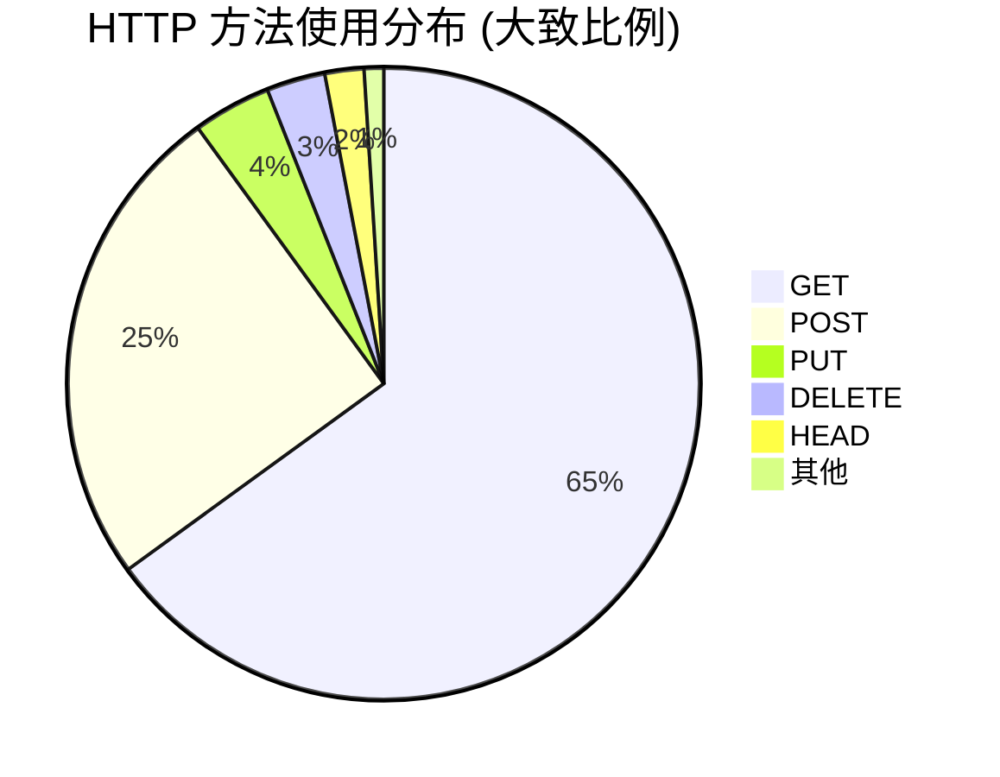
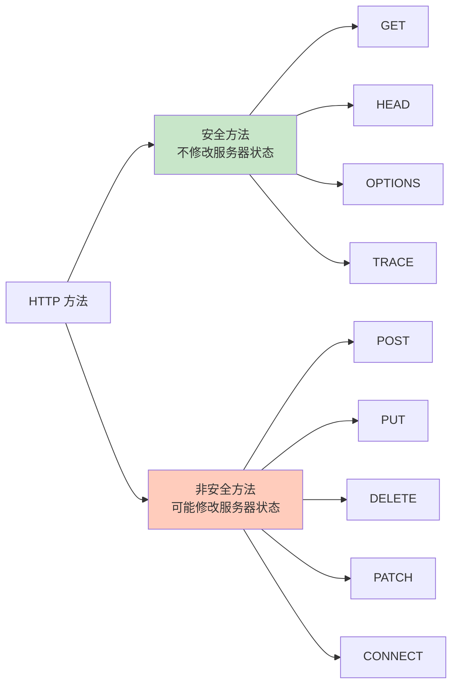
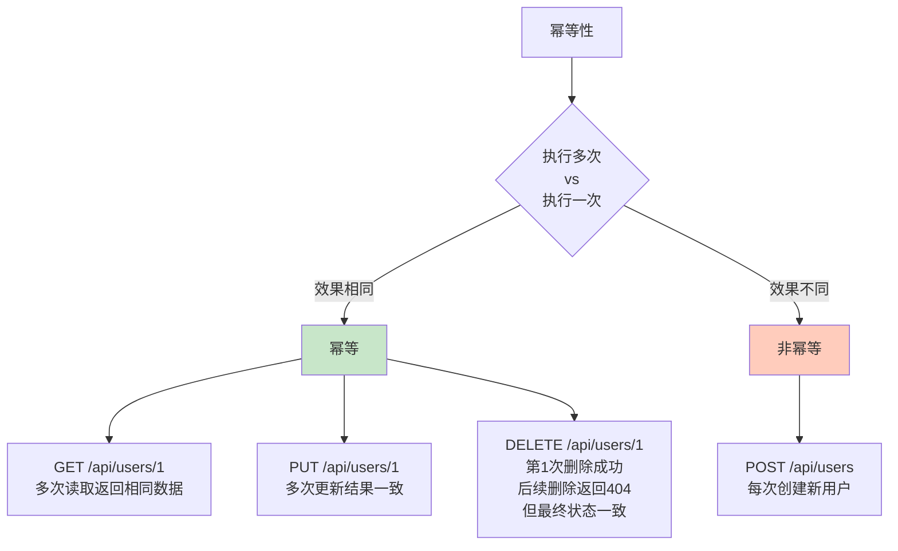
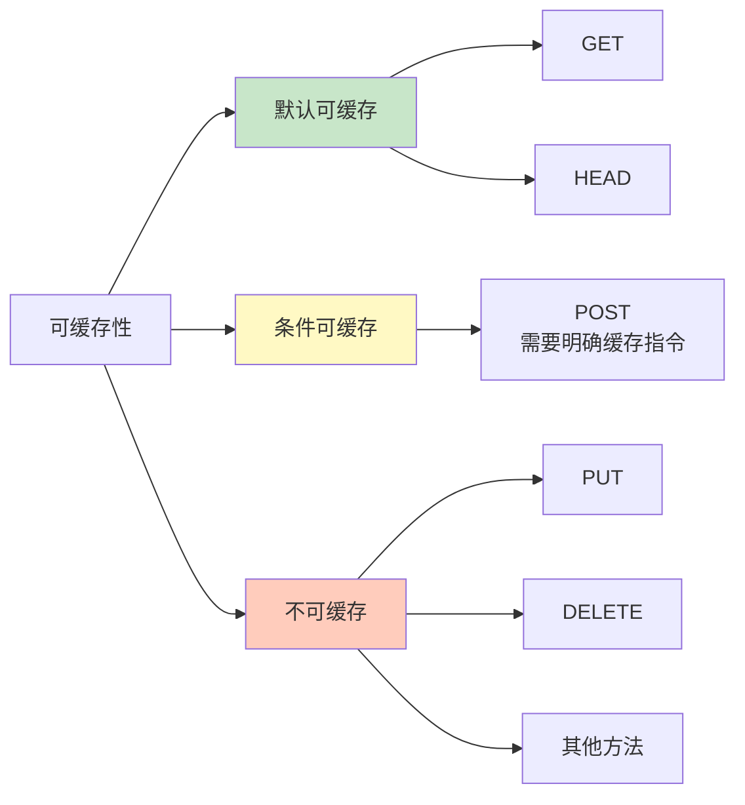
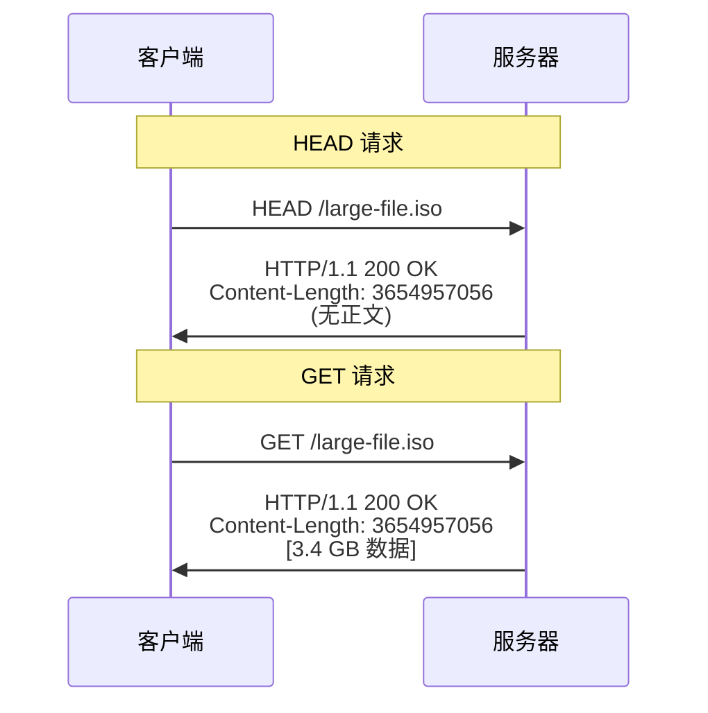
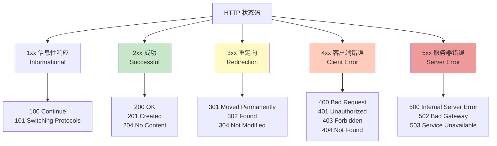
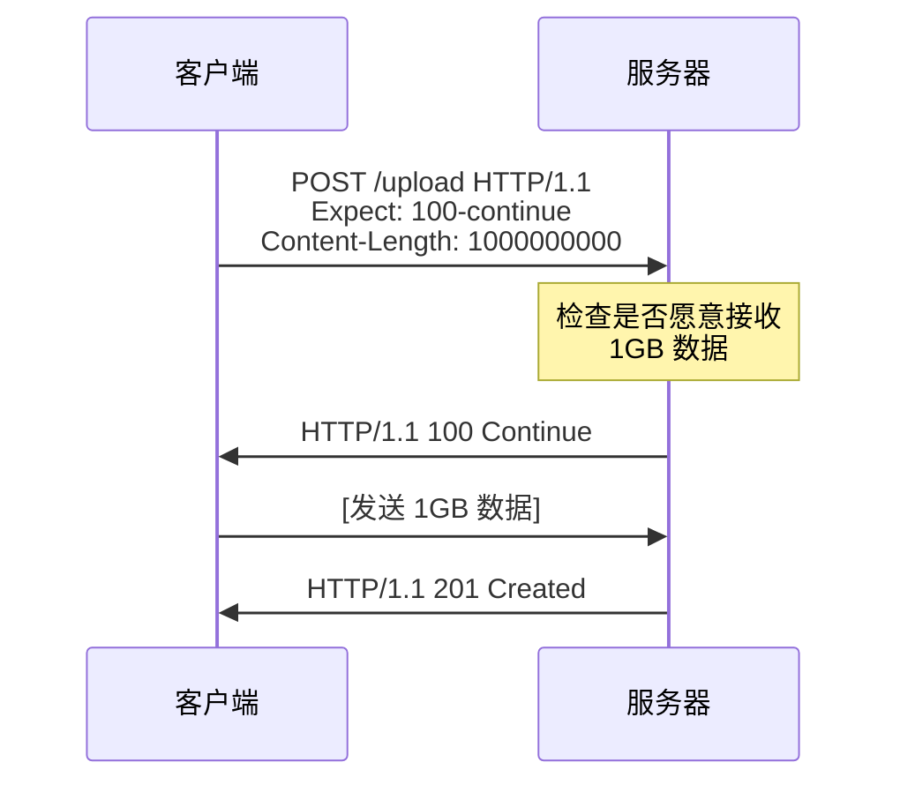
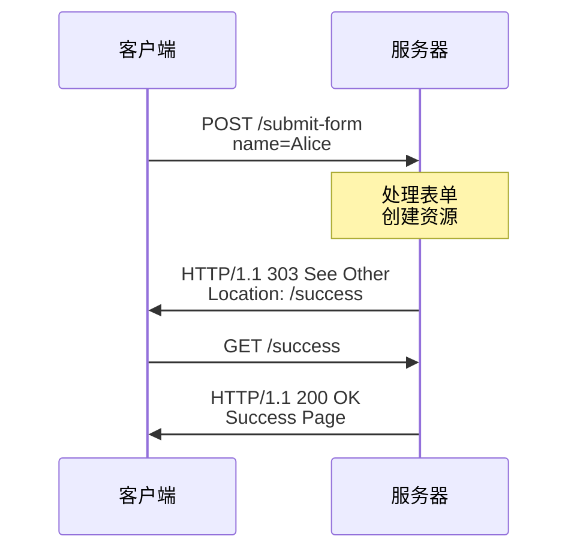
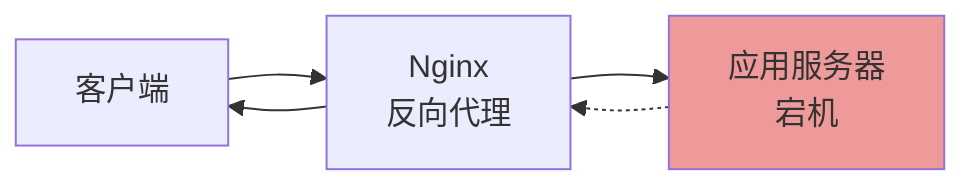

# 第三章: HTTP 方法与状态码

> 本章基于 RFC 9110 (HTTP Semantics) 规范编写

## 目录
- [3.1 HTTP 方法概述](#31-http-方法概述)
- [3.2 方法的属性](#32-方法的属性)
- [3.3 标准 HTTP 方法详解](#33-标准-http-方法详解)
- [3.4 HTTP 状态码详解](#34-http-状态码详解)
- [3.5 实战演练](#35-实战演练)

---

## 3.1 HTTP 方法概述

### 什么是 HTTP 方法?

**HTTP 方法 (HTTP Method)** 也叫 **HTTP 动词 (HTTP Verb)**,用于告诉服务器要对资源执行什么操作。

**类比**: HTTP 方法就像对文件的操作:
- `GET` - 查看文件 (读取)
- `POST` - 创建新文件 (新建)
- `PUT` - 覆盖文件 (更新/替换)
- `DELETE` - 删除文件 (删除)

### 标准方法列表

RFC 9110 定义了 9 个标准 HTTP 方法:

| 方法 | 作用 | 常见用途 | RFC 章节 |
|------|------|----------|----------|
| `GET` | 获取资源 | 查询数据、获取网页 | Section 9.3.1 |
| `HEAD` | 获取资源的元信息 | 检查资源是否存在、获取文件大小 | Section 9.3.2 |
| `POST` | 提交数据 | 表单提交、创建资源 | Section 9.3.3 |
| `PUT` | 更新/替换资源 | 完整更新资源 | Section 9.3.4 |
| `DELETE` | 删除资源 | 删除数据 | Section 9.3.5 |
| `CONNECT` | 建立隧道连接 | HTTPS 代理 | Section 9.3.6 |
| `OPTIONS` | 查询服务器能力 | CORS 预检请求 | Section 9.3.7 |
| `TRACE` | 追踪请求路径 | 调试 (很少使用) | Section 9.3.8 |
| `PATCH` | 部分更新资源 | 增量更新 | RFC 5789 |

### 方法的使用频率



---

## 3.2 方法的属性

### 安全性 (Safe)

**安全方法 (Safe Method)**: 不会修改服务器状态,只读取数据。

**安全方法**: `GET`, `HEAD`, `OPTIONS`, `TRACE`

**非安全方法**: `POST`, `PUT`, `DELETE`, `PATCH`, `CONNECT`



**重要**: "安全"指的是 **对服务器的影响**,不是网络传输的安全性。

**示例**:

```bash
# 安全方法 - 只读取,不修改
GET /api/users/1 HTTP/1.1

# 非安全方法 - 修改服务器数据
POST /api/users HTTP/1.1
Content-Type: application/json

{"name":"Alice"}
```

### 幂等性 (Idempotent)

**幂等方法 (Idempotent Method)**: 多次执行相同的请求,效果与执行一次相同。

**幂等方法**: `GET`, `HEAD`, `PUT`, `DELETE`, `OPTIONS`, `TRACE`

**非幂等方法**: `POST`, `PATCH` (通常), `CONNECT`



**示例**:

```bash
# 幂等: DELETE - 删除一次和删除多次效果相同
DELETE /api/users/1 HTTP/1.1
# 第1次: 200 OK (删除成功)
# 第2次: 404 Not Found (已经不存在)
# 第3次: 404 Not Found
# 最终状态: 用户1被删除

# 非幂等: POST - 每次都创建新用户
POST /api/users HTTP/1.1
{"name":"Alice"}
# 第1次: 201 Created {"id":1,"name":"Alice"}
# 第2次: 201 Created {"id":2,"name":"Alice"}  ← 创建了新用户
# 第3次: 201 Created {"id":3,"name":"Alice"}  ← 又创建了新用户
```

### 可缓存性 (Cacheable)

**可缓存方法**: 响应可以被缓存以供后续使用。

**默认可缓存**: `GET`, `HEAD`

**条件可缓存**: `POST` (需要明确的缓存指令,实际很少缓存)



### 方法属性对比表

| 方法 | 安全 | 幂等 | 可缓存 |
|------|------|------|--------|
| `GET` | ✅ | ✅ | ✅ |
| `HEAD` | ✅ | ✅ | ✅ |
| `POST` | ❌ | ❌ | 🟡 条件 |
| `PUT` | ❌ | ✅ | ❌ |
| `DELETE` | ❌ | ✅ | ❌ |
| `CONNECT` | ❌ | ❌ | ❌ |
| `OPTIONS` | ✅ | ✅ | ❌ |
| `TRACE` | ✅ | ✅ | ❌ |
| `PATCH` | ❌ | ❌ | ❌ |

---

## 3.3 标准 HTTP 方法详解

### GET - 获取资源

**作用**: 获取指定资源的表示形式 (数据)。

**特性**:
- ✅ 安全
- ✅ 幂等
- ✅ 可缓存

**请求格式**:

```http
GET <request-target> HTTP/1.1
Host: <hostname>
[其他请求头部]
```

**典型用途**:
1. 获取网页
2. 查询 API 数据
3. 下载文件

**示例 1: 获取网页**

```bash
curl -v https://www.example.com
```

请求:

```http
GET / HTTP/1.1
Host: www.example.com
User-Agent: curl/7.84.0
Accept: */*
```

响应:

```http
HTTP/1.1 200 OK
Content-Type: text/html; charset=UTF-8
Content-Length: 1256

<!DOCTYPE html>
<html>
<head><title>Example Domain</title></head>
<body>...</body>
</html>
```

**示例 2: 查询 API 数据**

```bash
curl https://api.github.com/users/octocat
```

请求:

```http
GET /users/octocat HTTP/1.1
Host: api.github.com
Accept: application/json
```

响应:

```http
HTTP/1.1 200 OK
Content-Type: application/json; charset=utf-8

{
  "login": "octocat",
  "id": 583231,
  "name": "The Octocat",
  "public_repos": 8
}
```

**示例 3: 带查询参数**

```bash
curl "https://api.github.com/search/repositories?q=http&sort=stars&order=desc"
```

请求:

```http
GET /search/repositories?q=http&sort=stars&order=desc HTTP/1.1
Host: api.github.com
```

**GET 的最佳实践**:

✅ **应该**:
- 用于读取数据
- 查询参数放在 URL 中
- 可以被缓存
- 可以加入书签

❌ **不应该**:
- 修改服务器状态
- 传递敏感信息 (密码等) - URL 会被记录在日志中
- 超长的 URL (建议不超过 2000 字符)

**常见状态码**:
- `200 OK` - 成功获取资源
- `304 Not Modified` - 资源未修改 (缓存有效)
- `404 Not Found` - 资源不存在

### HEAD - 获取元信息

**作用**: 与 GET 相同,但 **只返回响应头部,不返回响应正文**。

**特性**:
- ✅ 安全
- ✅ 幂等
- ✅ 可缓存

**典型用途**:
1. 检查资源是否存在
2. 获取资源的元信息 (大小、最后修改时间)
3. 检查链接有效性

**示例 1: 检查资源是否存在**

```bash
curl -I https://www.example.com
```

请求:

```http
HEAD / HTTP/1.1
Host: www.example.com
```

响应 (只有头部):

```http
HTTP/1.1 200 OK
Content-Type: text/html; charset=UTF-8
Content-Length: 1256
Last-Modified: Thu, 17 Oct 2019 07:18:26 GMT
Etag: "3147526947"
```

**示例 2: 获取文件大小**

```bash
curl -I https://releases.ubuntu.com/22.04/ubuntu-22.04-desktop-amd64.iso
```

响应:

```http
HTTP/1.1 200 OK
Content-Length: 3654957056         ← 文件大小: ~3.4 GB
Content-Type: application/x-iso9660-image
Accept-Ranges: bytes
Last-Modified: Wed, 20 Apr 2022 15:30:00 GMT
```

**HEAD vs GET**:



**常见用途**:
- 断点续传前检查文件信息
- 网站监控 (检查页面是否可访问)
- 网络爬虫 (判断是否需要下载完整内容)

### POST - 提交数据

**作用**: 向服务器提交数据,通常导致状态改变或产生副作用。

**特性**:
- ❌ 非安全
- ❌ 非幂等
- 🟡 条件可缓存

**典型用途**:
1. 表单提交
2. 创建新资源
3. 触发服务器端处理

**示例 1: 表单提交 (application/x-www-form-urlencoded)**

```bash
curl -X POST https://httpbin.org/post \
  -d "username=alice&password=secret123"
```

请求:

```http
POST /post HTTP/1.1
Host: httpbin.org
Content-Type: application/x-www-form-urlencoded
Content-Length: 34

username=alice&password=secret123
```

**示例 2: 创建资源 (application/json)**

```bash
curl -X POST https://api.example.com/users \
  -H "Content-Type: application/json" \
  -d '{"name":"Alice","email":"alice@example.com","age":25}'
```

请求:

```http
POST /users HTTP/1.1
Host: api.example.com
Content-Type: application/json
Content-Length: 53

{"name":"Alice","email":"alice@example.com","age":25}
```

响应:

```http
HTTP/1.1 201 Created
Location: /users/123
Content-Type: application/json

{"id":123,"name":"Alice","email":"alice@example.com","age":25}
```

**示例 3: 文件上传 (multipart/form-data)**

```bash
curl -X POST https://api.example.com/upload \
  -F "file=@photo.jpg" \
  -F "description=My vacation photo"
```

请求:

```http
POST /upload HTTP/1.1
Host: api.example.com
Content-Type: multipart/form-data; boundary=----WebKitFormBoundary7MA4YWxkTrZu0gW

------WebKitFormBoundary7MA4YWxkTrZu0gW
Content-Disposition: form-data; name="file"; filename="photo.jpg"
Content-Type: image/jpeg

[二进制图片数据]
------WebKitFormBoundary7MA4YWxkTrZu0gW
Content-Disposition: form-data; name="description"

My vacation photo
------WebKitFormBoundary7MA4YWxkTrZu0gW--
```

**POST vs GET**:

| 对比项 | GET | POST |
|--------|-----|------|
| 数据位置 | URL 查询参数 | 请求正文 |
| 数据长度 | 受 URL 长度限制 (~2000 字符) | 理论上无限制 |
| 缓存 | 默认可缓存 | 通常不缓存 |
| 浏览器历史 | 参数保存在历史记录 | 不保存在历史记录 |
| 书签 | 可以加书签 | 不能加书签 |
| 安全性 | URL 会被记录在日志 | 相对安全 (但仍需 HTTPS) |
| 幂等性 | 幂等 | 非幂等 |

**常见状态码**:
- `200 OK` - 请求成功,响应包含结果
- `201 Created` - 资源创建成功
- `202 Accepted` - 请求已接受,但处理未完成
- `400 Bad Request` - 请求格式错误
- `409 Conflict` - 资源冲突 (如重复创建)

### PUT - 更新/替换资源

**作用**: 用请求的内容 **完整替换** 目标资源。

**特性**:
- ❌ 非安全
- ✅ 幂等 (多次执行结果相同)
- ❌ 不可缓存

**PUT 的语义**: "如果资源存在,则替换;如果不存在,则创建"

**示例 1: 更新用户信息**

```bash
curl -X PUT https://api.example.com/users/123 \
  -H "Content-Type: application/json" \
  -d '{"id":123,"name":"Alice Smith","email":"alice.smith@example.com","age":26}'
```

请求:

```http
PUT /users/123 HTTP/1.1
Host: api.example.com
Content-Type: application/json

{"id":123,"name":"Alice Smith","email":"alice.smith@example.com","age":26}
```

响应:

```http
HTTP/1.1 200 OK
Content-Type: application/json

{"id":123,"name":"Alice Smith","email":"alice.smith@example.com","age":26}
```

**PUT 的幂等性**:

```bash
# 第1次 PUT
PUT /users/123
{"name":"Alice","age":26}
# 结果: {"id":123,"name":"Alice","age":26}

# 第2次 PUT (相同内容)
PUT /users/123
{"name":"Alice","age":26}
# 结果: {"id":123,"name":"Alice","age":26}  ← 与第1次相同

# 第3次 PUT (相同内容)
PUT /users/123
{"name":"Alice","age":26}
# 结果: {"id":123,"name":"Alice","age":26}  ← 仍然相同
```

**PUT vs POST**:

| 对比项 | PUT | POST |
|--------|-----|------|
| 语义 | 替换资源 | 提交数据 (可能创建资源) |
| 幂等性 | 幂等 | 非幂等 |
| URI | 明确指向资源 (`/users/123`) | 通常指向集合 (`/users`) |
| 创建资源 | 客户端指定 ID | 服务器生成 ID |

**示例 - PUT vs POST 创建资源**:

```bash
# POST: 服务器生成 ID
POST /users
{"name":"Alice"}
→ 201 Created, Location: /users/123

POST /users
{"name":"Alice"}
→ 201 Created, Location: /users/124  ← 又创建了新资源 (非幂等)

# PUT: 客户端指定 ID
PUT /users/999
{"id":999,"name":"Alice"}
→ 201 Created

PUT /users/999
{"id":999,"name":"Alice"}
→ 200 OK                        ← 替换现有资源 (幂等)
```

**常见状态码**:
- `200 OK` - 更新成功,响应包含更新后的资源
- `201 Created` - 资源创建成功
- `204 No Content` - 更新成功,但无响应正文
- `400 Bad Request` - 请求格式错误
- `404 Not Found` - 目标资源不存在 (如果不允许 PUT 创建)

### DELETE - 删除资源

**作用**: 删除指定的资源。

**特性**:
- ❌ 非安全
- ✅ 幂等 (多次删除结果相同)
- ❌ 不可缓存

**示例 1: 删除用户**

```bash
curl -X DELETE https://api.example.com/users/123
```

请求:

```http
DELETE /users/123 HTTP/1.1
Host: api.example.com
```

响应:

```http
HTTP/1.1 204 No Content
```

**DELETE 的幂等性**:

```bash
# 第1次 DELETE
DELETE /users/123
→ 200 OK 或 204 No Content

# 第2次 DELETE (资源已不存在)
DELETE /users/123
→ 404 Not Found            ← 虽然返回 404,但最终状态一致 (资源被删除)

# 第3次 DELETE
DELETE /users/123
→ 404 Not Found            ← 仍然 404
```

**常见状态码**:
- `200 OK` - 删除成功,响应包含删除的资源信息
- `204 No Content` - 删除成功,无响应正文 (最常用)
- `202 Accepted` - 删除请求已接受,但未立即执行
- `404 Not Found` - 资源不存在

**软删除 vs 硬删除**:

```bash
# 硬删除: 物理删除数据
DELETE /users/123
→ 从数据库中删除记录

# 软删除: 标记为删除,数据仍保留
DELETE /users/123
→ UPDATE users SET deleted=1 WHERE id=123
```

### PATCH - 部分更新资源

**作用**: 对资源进行 **部分修改**,只更新指定字段。

**特性**:
- ❌ 非安全
- ❌ 通常非幂等 (取决于实现)
- ❌ 不可缓存

**PATCH vs PUT**:

| 对比项 | PUT | PATCH |
|--------|-----|-------|
| 更新方式 | 完整替换 | 部分更新 |
| 请求正文 | 完整的资源表示 | 仅需要更新的字段 |
| 未指定字段 | 被删除或置空 | 保持不变 |

**示例 1: 更新单个字段**

```bash
curl -X PATCH https://api.example.com/users/123 \
  -H "Content-Type: application/json" \
  -d '{"age":27}'
```

请求:

```http
PATCH /users/123 HTTP/1.1
Host: api.example.com
Content-Type: application/json

{"age":27}
```

响应:

```http
HTTP/1.1 200 OK
Content-Type: application/json

{"id":123,"name":"Alice Smith","email":"alice.smith@example.com","age":27}
```

**对比 PUT 和 PATCH**:

```bash
# 原始资源
GET /users/123
→ {"id":123,"name":"Alice","email":"alice@example.com","age":25}

# PUT: 完整替换 (未指定的字段会丢失)
PUT /users/123
{"name":"Alice Smith"}
→ {"id":123,"name":"Alice Smith"}  ← email 和 age 丢失!

# PATCH: 部分更新 (未指定的字段保持不变)
PATCH /users/123
{"name":"Alice Smith"}
→ {"id":123,"name":"Alice Smith","email":"alice@example.com","age":25}  ← email 和 age 保留
```

**示例 2: JSON Patch 格式 (RFC 6902)**

```bash
curl -X PATCH https://api.example.com/users/123 \
  -H "Content-Type: application/json-patch+json" \
  -d '[
    {"op":"replace","path":"/age","value":27},
    {"op":"add","path":"/city","value":"Beijing"}
  ]'
```

请求:

```http
PATCH /users/123 HTTP/1.1
Host: api.example.com
Content-Type: application/json-patch+json

[
  {"op":"replace","path":"/age","value":27},
  {"op":"add","path":"/city","value":"Beijing"}
]
```

**常见状态码**:
- `200 OK` - 更新成功,响应包含更新后的资源
- `204 No Content` - 更新成功,无响应正文
- `400 Bad Request` - 请求格式错误
- `404 Not Found` - 资源不存在

### OPTIONS - 查询服务器能力

**作用**: 查询服务器对特定资源支持的 HTTP 方法和其他选项。

**特性**:
- ✅ 安全
- ✅ 幂等
- ❌ 不可缓存

**典型用途**:
1. 查询资源支持的方法
2. CORS 预检请求 (Preflight Request)

**示例 1: 查询资源支持的方法**

```bash
curl -X OPTIONS https://api.example.com/users/123 -i
```

请求:

```http
OPTIONS /users/123 HTTP/1.1
Host: api.example.com
```

响应:

```http
HTTP/1.1 204 No Content
Allow: GET, HEAD, PUT, PATCH, DELETE, OPTIONS
```

**示例 2: 查询服务器整体能力 (asterisk-form)**

```bash
curl -X OPTIONS https://api.example.com/ -i \
  --request-target "*"
```

请求:

```http
OPTIONS * HTTP/1.1
Host: api.example.com
```

响应:

```http
HTTP/1.1 204 No Content
Allow: GET, HEAD, POST, PUT, PATCH, DELETE, OPTIONS
```

**示例 3: CORS 预检请求**

浏览器在发送跨域请求前,会自动发送 OPTIONS 预检请求:

```http
OPTIONS /api/users HTTP/1.1
Host: api.example.com
Origin: https://www.myapp.com
Access-Control-Request-Method: POST
Access-Control-Request-Headers: Content-Type
```

服务器响应:

```http
HTTP/1.1 204 No Content
Access-Control-Allow-Origin: https://www.myapp.com
Access-Control-Allow-Methods: GET, POST, PUT, DELETE
Access-Control-Allow-Headers: Content-Type
Access-Control-Max-Age: 86400
```

**Nginx CORS 配置示例**:

```nginx
location /api/ {
    if ($request_method = 'OPTIONS') {
        add_header 'Access-Control-Allow-Origin' '*';
        add_header 'Access-Control-Allow-Methods' 'GET, POST, PUT, DELETE, OPTIONS';
        add_header 'Access-Control-Allow-Headers' 'Content-Type, Authorization';
        add_header 'Access-Control-Max-Age' 1728000;
        return 204;
    }
}
```

### CONNECT - 建立隧道连接

**作用**: 建立到目标服务器的隧道连接,主要用于 HTTPS 代理。

**特性**:
- ❌ 非安全
- ❌ 非幂等
- ❌ 不可缓存

**使用场景**: 客户端通过 HTTP 代理访问 HTTPS 网站。

**工作流程**:

```mermaid
sequenceDiagram
    participant C as 客户端
    participant P as HTTP 代理
    participant S as HTTPS 服务器

    C->>P: CONNECT www.example.com:443 HTTP/1.1
    P->>S: 建立 TCP 连接
    S->>P: TCP 连接建立
    P->>C: HTTP/1.1 200 Connection Established

    Note over C,P,S: 隧道建立完成,代理仅转发数据

    C->>S: TLS 握手 (加密)
    S->>C: TLS 握手响应

    Note over C,S: 之后的所有流量都是加密的<br/>代理无法查看内容

    C->>S: GET / HTTP/1.1 (加密)
    S->>C: HTTP/1.1 200 OK (加密)
```

**请求示例**:

```http
CONNECT www.example.com:443 HTTP/1.1
Host: www.example.com
```

**代理响应**:

```http
HTTP/1.1 200 Connection Established
```

**curl 示例 - 通过代理访问 HTTPS**:

```bash
curl -x http://proxy.example.com:8080 https://www.google.com
```

### TRACE - 追踪请求路径

**作用**: 回显服务器收到的请求,用于诊断。

**特性**:
- ✅ 安全
- ✅ 幂等
- ❌ 不可缓存

**安全警告**: TRACE 可能泄露敏感信息,**生产环境通常禁用**。

**请求示例**:

```http
TRACE / HTTP/1.1
Host: www.example.com
```

**响应示例**:

```http
HTTP/1.1 200 OK
Content-Type: message/http
Content-Length: 78

TRACE / HTTP/1.1
Host: www.example.com
User-Agent: curl/7.84.0
```

**Nginx 禁用 TRACE**:

```nginx
location / {
    if ($request_method = 'TRACE') {
        return 405;  # Method Not Allowed
    }
}
```

---

## 3.4 HTTP 状态码详解

### 状态码概述

**HTTP 状态码 (Status Code)** 是一个三位数字,表示服务器对请求的处理结果。

**五大类别**:



### 1xx - 信息性响应

**含义**: 请求已接收,继续处理。

#### 100 Continue

**作用**: 客户端应继续发送请求正文。

**使用场景**: 客户端要发送大量数据前,先用 `Expect: 100-continue` 头部询问服务器是否愿意接收。



**curl 示例**:

```bash
curl -X POST https://httpbin.org/post \
  -H "Expect: 100-continue" \
  -d @large-file.dat
```

#### 101 Switching Protocols

**作用**: 服务器同意切换协议。

**使用场景**: WebSocket 升级

```http
# 客户端请求升级到 WebSocket
GET /chat HTTP/1.1
Host: server.example.com
Upgrade: websocket
Connection: Upgrade
Sec-WebSocket-Key: dGhlIHNhbXBsZSBub25jZQ==
Sec-WebSocket-Version: 13

# 服务器响应
HTTP/1.1 101 Switching Protocols
Upgrade: websocket
Connection: Upgrade
Sec-WebSocket-Accept: s3pPLMBiTxaQ9kYGzzhZRbK+xOo=
```

### 2xx - 成功

**含义**: 请求已成功被服务器接收、理解并处理。

#### 200 OK

**作用**: 请求成功,响应包含请求的数据。

**最常见的成功状态码**。

**示例**:

```bash
curl https://api.github.com/users/octocat
```

响应:

```http
HTTP/1.1 200 OK
Content-Type: application/json

{"login":"octocat","id":583231,...}
```

#### 201 Created

**作用**: 资源创建成功,通常用于 POST 或 PUT 请求。

**最佳实践**: 响应应包含 `Location` 头部,指向新创建的资源。

**示例**:

```bash
curl -X POST https://api.example.com/users \
  -H "Content-Type: application/json" \
  -d '{"name":"Alice"}'
```

响应:

```http
HTTP/1.1 201 Created
Location: /users/123
Content-Type: application/json

{"id":123,"name":"Alice"}
```

#### 202 Accepted

**作用**: 请求已接受,但处理未完成 (异步处理)。

**使用场景**: 长时间运行的任务

**示例**:

```bash
curl -X POST https://api.example.com/reports/generate \
  -d '{"type":"annual","year":2023}'
```

响应:

```http
HTTP/1.1 202 Accepted
Location: /reports/tasks/456

{"taskId":456,"status":"processing"}
```

客户端后续查询任务状态:

```bash
curl https://api.example.com/reports/tasks/456
```

响应:

```http
HTTP/1.1 200 OK

{"taskId":456,"status":"completed","downloadUrl":"/reports/2023-annual.pdf"}
```

#### 204 No Content

**作用**: 请求成功,但无内容返回。

**使用场景**: DELETE、PUT 等不需要返回数据的操作

**示例**:

```bash
curl -X DELETE https://api.example.com/users/123
```

响应:

```http
HTTP/1.1 204 No Content
```

#### 206 Partial Content

**作用**: 部分内容,用于断点续传。

**示例 - 下载文件的一部分**:

```bash
curl -H "Range: bytes=0-1023" https://example.com/large-file.zip
```

请求:

```http
GET /large-file.zip HTTP/1.1
Host: example.com
Range: bytes=0-1023
```

响应:

```http
HTTP/1.1 206 Partial Content
Content-Range: bytes 0-1023/1048576
Content-Length: 1024

[前 1024 字节的数据]
```

### 3xx - 重定向

**含义**: 需要客户端采取进一步操作来完成请求。

#### 301 Moved Permanently

**作用**: 资源已 **永久** 移动到新位置。

**特点**: 浏览器会缓存这个重定向。

**示例 - HTTP 重定向到 HTTPS**:

```bash
curl -I http://github.com
```

响应:

```http
HTTP/1.1 301 Moved Permanently
Location: https://github.com/
```

**Nginx 配置**:

```nginx
server {
    listen 80;
    server_name example.com;
    return 301 https://$server_name$request_uri;
}
```

#### 302 Found

**作用**: 资源 **临时** 移动到新位置。

**特点**: 浏览器不会缓存这个重定向。

**示例**:

```http
HTTP/1.1 302 Found
Location: /temporary-page
```

#### 303 See Other

**作用**: 重定向到另一个 URI,且必须使用 GET 方法。

**使用场景**: POST 后重定向到 GET (Post-Redirect-Get 模式)



**好处**: 防止用户刷新页面时重复提交表单。

#### 304 Not Modified

**作用**: 资源未修改,使用缓存版本。

**使用场景**: 条件请求,配合 `If-Modified-Since` 或 `If-None-Match`

**示例**:

```bash
curl -H "If-None-Match: \"686897696a7c876b7e\"" \
  https://www.example.com/
```

请求:

```http
GET / HTTP/1.1
Host: www.example.com
If-None-Match: "686897696a7c876b7e"
```

响应:

```http
HTTP/1.1 304 Not Modified
ETag: "686897696a7c876b7e"
Cache-Control: max-age=604800
```

**详见 [第六章: HTTP 缓存机制](./06-caching.md)**

#### 307 Temporary Redirect

**作用**: 临时重定向,且 **保持原请求方法**。

**302 vs 307**:

| 状态码 | 重定向后的方法 |
|--------|----------------|
| `302` | POST → GET (大多数浏览器的行为) |
| `307` | POST → POST (严格保持原方法) |

**示例**:

```http
HTTP/1.1 307 Temporary Redirect
Location: /new-location
```

#### 308 Permanent Redirect

**作用**: 永久重定向,且 **保持原请求方法**。

**301 vs 308**:

| 状态码 | 重定向后的方法 |
|--------|----------------|
| `301` | POST → GET (大多数浏览器的行为) |
| `308` | POST → POST (严格保持原方法) |

### 4xx - 客户端错误

**含义**: 客户端的请求有错误。

#### 400 Bad Request

**作用**: 请求格式错误,服务器无法理解。

**常见原因**:
- JSON 格式错误
- 缺少必需参数
- 参数类型错误

**示例**:

```bash
curl -X POST https://api.example.com/users \
  -H "Content-Type: application/json" \
  -d '{"name":}'  # JSON 格式错误
```

响应:

```http
HTTP/1.1 400 Bad Request
Content-Type: application/json

{"error":"Invalid JSON format"}
```

#### 401 Unauthorized

**作用**: 未授权,需要身份验证。

**注意**: 虽然叫 "Unauthorized",但实际是 "Unauthenticated" (未认证) 的意思。

**示例**:

```bash
curl https://api.github.com/user
```

响应:

```http
HTTP/1.1 401 Unauthorized
WWW-Authenticate: Bearer realm="GitHub API"

{"message":"Requires authentication"}
```

**提供认证后**:

```bash
curl -H "Authorization: Bearer ghp_xxxxx" https://api.github.com/user
```

响应:

```http
HTTP/1.1 200 OK

{"login":"yourname","id":123456,...}
```

#### 403 Forbidden

**作用**: 服务器理解请求,但拒绝执行。

**与 401 的区别**:
- `401` - 未认证,提供凭证可能成功
- `403` - 已认证,但权限不足,提供凭证也无法成功

**示例**:

```bash
curl -X DELETE https://api.github.com/repos/torvalds/linux \
  -H "Authorization: Bearer your_token"
```

响应:

```http
HTTP/1.1 403 Forbidden

{"message":"You don't have permission to delete this repository"}
```

#### 404 Not Found

**作用**: 请求的资源不存在。

**最常见的客户端错误**。

**示例**:

```bash
curl https://api.github.com/users/thisuserdoesnotexist123456
```

响应:

```http
HTTP/1.1 404 Not Found

{"message":"Not Found"}
```

**Nginx 自定义 404 页面**:

```nginx
error_page 404 /404.html;
location = /404.html {
    root /usr/share/nginx/html;
    internal;
}
```

#### 405 Method Not Allowed

**作用**: 不支持该 HTTP 方法。

**响应必须包含 `Allow` 头部**,列出支持的方法。

**示例**:

```bash
curl -X DELETE https://www.example.com/
```

响应:

```http
HTTP/1.1 405 Method Not Allowed
Allow: GET, HEAD, OPTIONS

{"error":"DELETE method is not allowed on this resource"}
```

#### 409 Conflict

**作用**: 请求与服务器当前状态冲突。

**常见场景**: 重复创建资源

**示例**:

```bash
curl -X POST https://api.example.com/users \
  -d '{"username":"alice","email":"alice@example.com"}'
```

第一次:

```http
HTTP/1.1 201 Created

{"id":123,"username":"alice"}
```

第二次 (用户名已存在):

```http
HTTP/1.1 409 Conflict

{"error":"Username 'alice' already exists"}
```

#### 413 Content Too Large

**作用**: 请求正文过大,服务器拒绝处理。

**示例**:

```bash
curl -X POST https://api.example.com/upload \
  -F "file=@10gb-file.zip"
```

响应:

```http
HTTP/1.1 413 Content Too Large

{"error":"File size exceeds 100MB limit"}
```

**Nginx 配置上传限制**:

```nginx
client_max_body_size 100M;
```

#### 429 Too Many Requests

**作用**: 请求过于频繁,触发限流。

**响应应包含 `Retry-After` 头部**。

**示例**:

```bash
# 发送大量请求
for i in {1..1000}; do curl https://api.github.com/users/octocat; done
```

响应 (超过限流后):

```http
HTTP/1.1 429 Too Many Requests
Retry-After: 60
X-RateLimit-Limit: 60
X-RateLimit-Remaining: 0
X-RateLimit-Reset: 1705315200

{"message":"API rate limit exceeded"}
```

### 5xx - 服务器错误

**含义**: 服务器在处理请求时发生错误。

#### 500 Internal Server Error

**作用**: 服务器内部错误,无法完成请求。

**最常见的服务器错误**,通常是代码 bug。

**示例**:

```http
HTTP/1.1 500 Internal Server Error

{"error":"Internal Server Error"}
```

**调试方法**: 查看服务器日志

```bash
# Nginx 错误日志
tail -f /var/log/nginx/error.log

# Node.js 应用日志
pm2 logs app-name
```

#### 502 Bad Gateway

**作用**: 网关/代理收到上游服务器的无效响应。

**常见原因**:
- 上游服务器宕机
- 上游服务器响应超时
- 上游服务器返回无效响应



**示例**:

```http
HTTP/1.1 502 Bad Gateway

<html>
<head><title>502 Bad Gateway</title></head>
<body>
<center><h1>502 Bad Gateway</h1></center>
<hr><center>nginx/1.22.0</center>
</body>
</html>
```

**Nginx 配置 - 上游超时**:

```nginx
location /api/ {
    proxy_pass http://backend;
    proxy_connect_timeout 5s;
    proxy_read_timeout 30s;
}
```

#### 503 Service Unavailable

**作用**: 服务暂时不可用,通常是临时状态。

**常见原因**:
- 服务器过载
- 服务器维护
- 上游服务器全部不可用

**响应应包含 `Retry-After` 头部**。

**示例**:

```http
HTTP/1.1 503 Service Unavailable
Retry-After: 120

{"error":"Service temporarily unavailable, please try again in 2 minutes"}
```

**Nginx 维护模式**:

```nginx
# 返回 503 进行维护
location / {
    return 503;
}

error_page 503 @maintenance;
location @maintenance {
    rewrite ^(.*)$ /maintenance.html break;
}
```

#### 504 Gateway Timeout

**作用**: 网关/代理等待上游服务器响应超时。

**与 502 的区别**:
- `502` - 收到无效响应
- `504` - 根本没收到响应 (超时)

**示例**:

```http
HTTP/1.1 504 Gateway Timeout

{"error":"Upstream request timeout"}
```

---

## 3.5 实战演练

### 练习 1: 测试不同的 HTTP 方法

**目标**: 使用 httpbin.org 测试各种 HTTP 方法

```bash
# GET
curl https://httpbin.org/get

# POST
curl -X POST https://httpbin.org/post -d "key=value"

# PUT
curl -X PUT https://httpbin.org/put -d "key=value"

# DELETE
curl -X DELETE https://httpbin.org/delete

# PATCH
curl -X PATCH https://httpbin.org/patch -d "key=value"
```

**观察**: 服务器回显的请求信息

### 练习 2: 观察重定向

```bash
# 不跟随重定向
curl -I http://github.com

# 跟随重定向
curl -L -I http://github.com
```

**任务**:
1. 第一个响应的状态码是什么?
2. `Location` 头部指向哪里?
3. 跟随重定向后的最终状态码是什么?

### 练习 3: 触发 404 错误

```bash
curl -I https://www.github.com/this-page-does-not-exist
```

**任务**: 观察 404 响应的头部

### 练习 4: 模拟 PUT 和 PATCH 的区别

使用 httpbin.org:

```bash
# PUT - 完整替换
curl -X PUT https://httpbin.org/put \
  -H "Content-Type: application/json" \
  -d '{"name":"Alice","age":25}'

# PATCH - 部分更新
curl -X PATCH https://httpbin.org/patch \
  -H "Content-Type: application/json" \
  -d '{"age":26}'
```

**任务**: 对比两者的请求和响应

---

## 本章小结

### 核心要点

1. **HTTP 方法定义操作类型**:
   - `GET` - 获取资源
   - `POST` - 提交数据
   - `PUT` - 完整替换资源
   - `DELETE` - 删除资源
   - `PATCH` - 部分更新资源
   - `HEAD` - 仅获取头部
   - `OPTIONS` - 查询服务器能力

2. **方法的属性**:
   - **安全**: GET, HEAD, OPTIONS, TRACE
   - **幂等**: GET, HEAD, PUT, DELETE, OPTIONS, TRACE
   - **可缓存**: GET, HEAD, (POST)

3. **状态码五大类**:
   - `1xx` - 信息性响应
   - `2xx` - 成功 (200, 201, 204)
   - `3xx` - 重定向 (301, 302, 304)
   - `4xx` - 客户端错误 (400, 401, 403, 404)
   - `5xx` - 服务器错误 (500, 502, 503)

### 下一章预告

在 [第四章: 连接管理与性能优化](./04-connection-and-performance.md) 中,我们将详细讲解:
- HTTP/1.0 短连接 vs HTTP/1.1 持久连接
- Keep-Alive 机制与配置
- 管道化 (Pipelining) 及其问题
- 分块传输编码的应用
- 连接超时与重试策略
- Nginx 性能优化配置

---

## 参考资料

- [RFC 9110 - HTTP Semantics](https://www.rfc-editor.org/rfc/rfc9110.html)
- [RFC 5789 - PATCH Method](https://www.rfc-editor.org/rfc/rfc5789.html)
- [MDN - HTTP Request Methods](https://developer.mozilla.org/en-US/docs/Web/HTTP/Methods)
- [MDN - HTTP Response Status Codes](https://developer.mozilla.org/en-US/docs/Web/HTTP/Status)
