# 第四章: 连接管理与性能优化

> 本章基于 RFC 9112 (HTTP/1.1) Section 9 规范编写

## 目录
- [4.1 HTTP 连接模型演进](#41-http-连接模型演进)
- [4.2 持久连接 (Keep-Alive)](#42-持久连接-keep-alive)
- [4.3 管道化 (Pipelining)](#43-管道化-pipelining)
- [4.4 连接管理最佳实践](#44-连接管理最佳实践)
- [4.5 性能优化策略](#45-性能优化策略)
- [4.6 实战演练](#46-实战演练)

---

## 4.1 HTTP 连接模型演进

### HTTP/1.0: 短连接模型

**特点**: 每个 HTTP 请求都需要建立一个新的 TCP 连接。

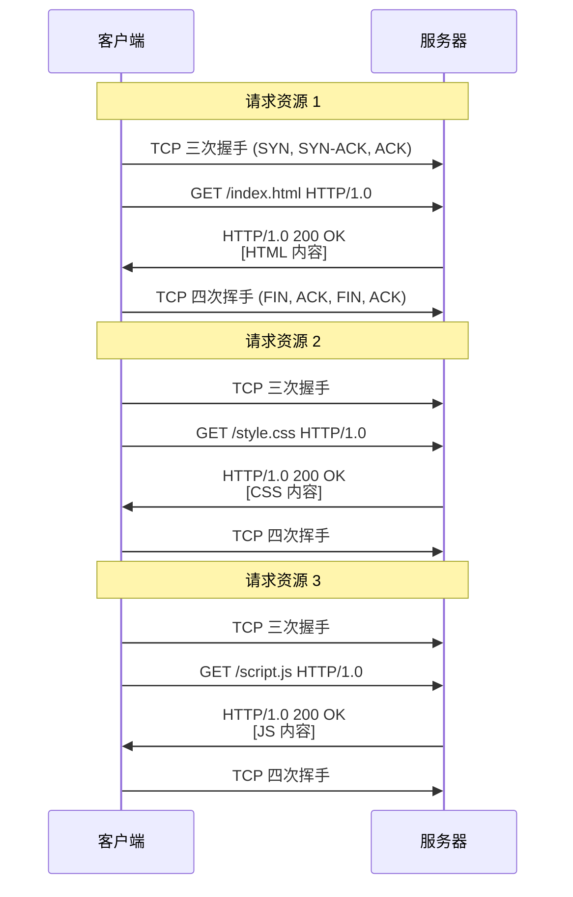

**性能问题**:

1. **TCP 握手开销**:
   - 三次握手: 1.5 个 RTT (Round-Trip Time)
   - TLS 握手 (HTTPS): 额外 2 个 RTT
   - 总计: 3.5 个 RTT 才能开始传输数据

2. **TCP 慢启动**:
   - 每个新连接都从较小的拥塞窗口开始
   - 无法充分利用带宽

3. **连接数限制**:
   - 大量 TIME_WAIT 状态的连接
   - 消耗服务器资源

**示例 - HTTP/1.0 请求**:

```bash
# 使用 HTTP/1.0 (默认关闭连接)
curl -0 http://www.example.com/
```

请求:

```http
GET / HTTP/1.0
Host: www.example.com
Connection: close       ← HTTP/1.0 默认关闭连接
```

响应:

```http
HTTP/1.0 200 OK
Connection: close
Content-Length: 1256

[HTML 内容]
[服务器关闭连接]
```

### HTTP/1.1: 持久连接模型

**特点**: 默认开启持久连接,一个 TCP 连接可以发送多个 HTTP 请求。

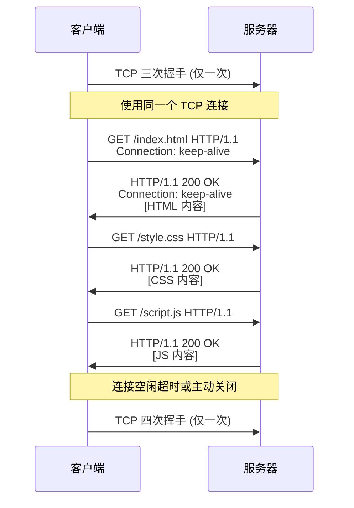

**性能提升**:

| 指标 | HTTP/1.0 | HTTP/1.1 | 提升 |
|------|----------|----------|------|
| TCP 握手次数 (3 个资源) | 3 次 | 1 次 | **66%** |
| 总 RTT (无 TLS) | 4.5 RTT | 1.5 RTT | **66%** |
| 总 RTT (HTTPS) | 10.5 RTT | 3.5 RTT | **66%** |
| 服务器 TIME_WAIT 连接 | 多 | 少 | **节省资源** |

---

## 4.2 持久连接 (Keep-Alive)

### Connection 头部

**格式**: `Connection: <directive>`

**常见指令**:
- `keep-alive` - 保持连接打开 (HTTP/1.1 默认)
- `close` - 关闭连接

**HTTP/1.1 默认行为**:

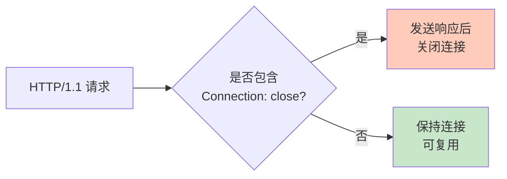

**示例 1: 默认持久连接**

```bash
curl -v http://www.example.com/
```

请求:

```http
GET / HTTP/1.1
Host: www.example.com
User-Agent: curl/7.84.0
Accept: */*
# 注意: HTTP/1.1 不需要显式指定 Connection: keep-alive
```

响应:

```http
HTTP/1.1 200 OK
Content-Type: text/html
Content-Length: 1256
# 默认保持连接

[HTML 内容]
```

**示例 2: 显式关闭连接**

```bash
curl -H "Connection: close" http://www.example.com/
```

请求:

```http
GET / HTTP/1.1
Host: www.example.com
Connection: close       ← 客户端要求关闭连接
```

响应:

```http
HTTP/1.1 200 OK
Connection: close       ← 服务器确认会关闭连接
Content-Length: 1256

[HTML 内容]
[连接关闭]
```

### Keep-Alive 头部 (非标准,已废弃)

**注意**: `Keep-Alive` 头部在 HTTP/1.1 中 **已被废弃**,但某些服务器仍可能使用。

**格式**: `Keep-Alive: timeout=<seconds>, max=<requests>`

**示例** (HTTP/1.0):

```http
HTTP/1.0 200 OK
Connection: keep-alive
Keep-Alive: timeout=5, max=100     ← 超时 5 秒,最多 100 个请求
Content-Length: 1256
```

**HTTP/1.1 不使用 Keep-Alive 头部**,而是通过其他机制控制连接:

1. **超时机制**: 服务器配置的空闲超时时间
2. **Content-Length**: 确定消息边界
3. **Transfer-Encoding: chunked**: 分块传输

### 持久连接的要求

**RFC 9112 Section 9.3 规定**: 使用持久连接必须满足:

1. **消息边界明确**: 必须能确定消息的结束位置
   - 使用 `Content-Length` 头部
   - 使用 `Transfer-Encoding: chunked`
   - 1xx、204、304 状态码 (无消息正文)

2. **正确处理 Connection 头部**:
   - 客户端可以发送 `Connection: close` 表示这是最后一个请求
   - 服务器可以返回 `Connection: close` 表示会关闭连接

**示例 - 错误的持久连接 (缺少 Content-Length)**:

```http
HTTP/1.1 200 OK
Content-Type: text/html
# 没有 Content-Length 或 Transfer-Encoding

<html>...</html>
[服务器关闭连接以标志消息结束]
```

**问题**: 客户端无法区分是正常结束还是网络中断,无法复用连接。

**正确做法**:

```http
HTTP/1.1 200 OK
Content-Type: text/html
Content-Length: 52          ← 明确指定正文长度

<html>...</html>
```

或使用分块传输:

```http
HTTP/1.1 200 OK
Content-Type: text/html
Transfer-Encoding: chunked  ← 使用分块传输

34\r\n
<html>...</html>\r\n
0\r\n
\r\n
```

### 连接超时

**服务器超时**: 空闲连接在一定时间后自动关闭。

**Nginx 配置**:

```nginx
http {
    keepalive_timeout 65;          # 空闲连接保持 65 秒
    keepalive_requests 100;        # 单个连接最多处理 100 个请求
}
```

**Apache 配置**:

```apache
KeepAlive On
KeepAliveTimeout 5
MaxKeepAliveRequests 100
```

**Node.js (Express) 配置**:

```javascript
const server = app.listen(3000);
server.keepAliveTimeout = 65000;  // 65 秒
server.headersTimeout = 66000;    // 略大于 keepAliveTimeout
```

**超时流程**:

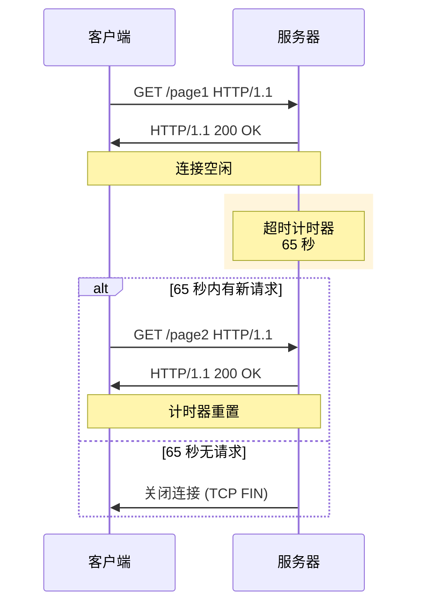

### 客户端连接池

**浏览器连接池**: 浏览器维护到同一服务器的多个并发连接。

**连接池大小限制** (RFC 9112 建议):
- 同一主机: 最多 **6 个并发连接**
- 不同主机: 无限制

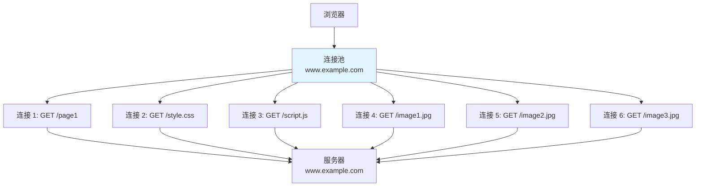

**浏览器连接数查看**:

1. 打开 Chrome DevTools (F12)
2. 切换到 "Network" 标签
3. 访问一个网页
4. 观察 "Waterfall" 列 - 可以看到资源加载的并发情况

**curl 模拟多个请求 (复用连接)**:

```bash
# 使用 curl 的 --next 选项在同一个连接发送多个请求
curl http://www.example.com/ \
  --next http://www.example.com/style.css \
  --next http://www.example.com/script.js
```

---

## 4.3 管道化 (Pipelining)

### 什么是管道化?

**管道化 (Pipelining)**: 在同一个 TCP 连接上,客户端可以 **连续发送多个请求,无需等待前一个请求的响应**。

**非管道化** (HTTP/1.1 默认):

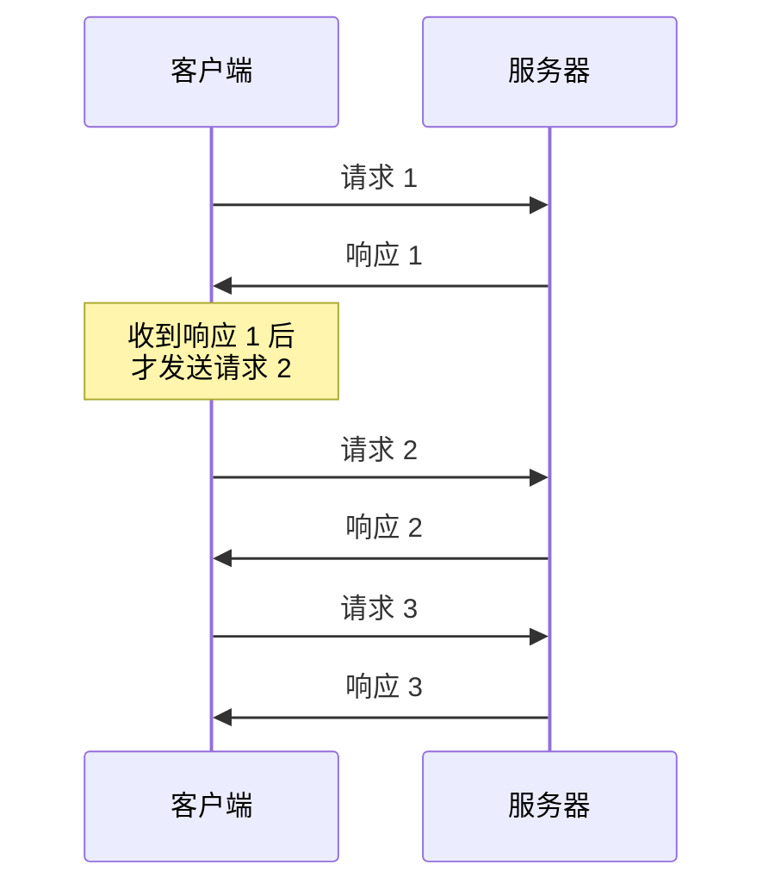

**管道化**:

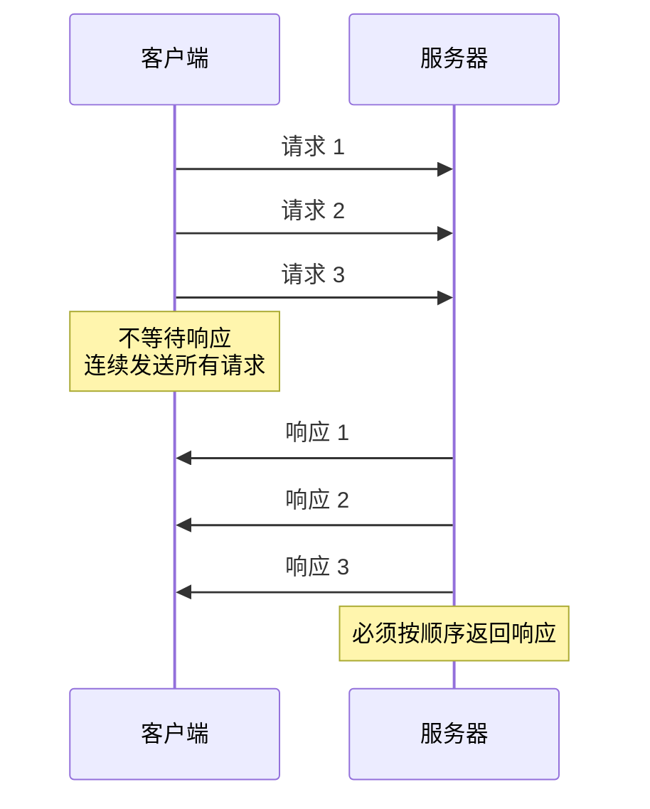

### 管道化的优势

**理论性能提升**:

假设:
- RTT (往返时延) = 100ms
- 每个资源下载时间 = 50ms

**非管道化** (3 个资源):
```
请求1 (100ms RTT) + 下载1 (50ms) = 150ms
请求2 (100ms RTT) + 下载2 (50ms) = 150ms
请求3 (100ms RTT) + 下载3 (50ms) = 150ms
总计: 450ms
```

**管道化** (3 个资源):
```
请求1,2,3 (100ms RTT) + 下载1 (50ms) + 下载2 (50ms) + 下载3 (50ms) = 250ms
总计: 250ms  ← 节省 44%
```

### 管道化的问题

**核心问题: 队头阻塞 (Head-of-Line Blocking)**

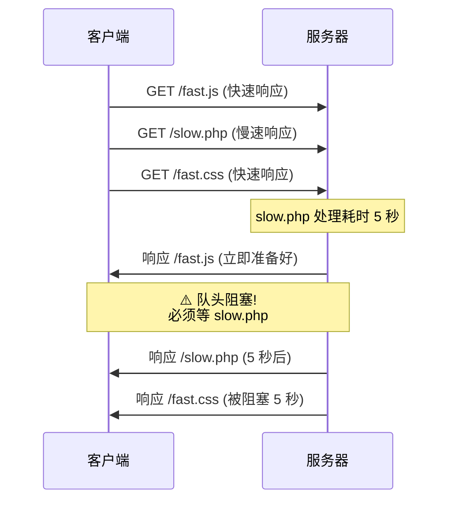

**问题**: 即使 `/fast.css` 已经准备好,也必须等待 `/slow.php` 完成,因为响应 **必须按顺序** 返回。

### 其他问题

1. **中间代理不兼容**: 许多代理不支持管道化,可能丢弃或错误处理请求

2. **非幂等方法风险**: 如果使用 POST 等非幂等方法,失败后难以重试

3. **实现复杂**: 客户端和服务器都需要复杂的逻辑处理管道化

4. **浏览器默认禁用**: 主流浏览器 (Chrome、Firefox) 都已禁用管道化

### 管道化的现状

**结论**: 管道化虽然理论上有性能优势,但由于队头阻塞和兼容性问题,**在实践中基本被弃用**。

**替代方案**:
- **HTTP/2**: 多路复用 (Multiplexing),真正解决队头阻塞
- **HTTP/3**: 基于 QUIC,连接级别的多路复用

---

## 4.4 连接管理最佳实践

### 客户端最佳实践

#### 1. 复用连接

```javascript
// Node.js - 使用 HTTP Agent 连接池
const http = require('http');

const agent = new http.Agent({
  keepAlive: true,              // 启用持久连接
  keepAliveMsecs: 1000,         // TCP keep-alive 间隔
  maxSockets: 10,               // 单个主机最大连接数
  maxFreeSockets: 5,            // 空闲连接池大小
});

http.get('http://example.com/', { agent }, (res) => {
  // 连接会被复用
});
```

#### 2. 合理设置超时

```javascript
// Node.js
const options = {
  hostname: 'example.com',
  timeout: 5000,                // 5 秒超时
};

const req = http.get(options, (res) => {
  // 处理响应
});

req.on('timeout', () => {
  req.destroy();                // 超时后销毁连接
});
```

#### 3. 优雅关闭连接

```http
GET /last-request HTTP/1.1
Host: example.com
Connection: close        ← 告知服务器这是最后一个请求
```

### 服务器最佳实践

#### 1. 配置合理的超时时间

**Nginx**:

```nginx
http {
    # 客户端连接超时
    client_body_timeout 12s;
    client_header_timeout 12s;

    # 持久连接超时
    keepalive_timeout 65s;
    keepalive_requests 100;

    # 向上游服务器的连接超时
    proxy_connect_timeout 5s;
    proxy_send_timeout 60s;
    proxy_read_timeout 60s;
}
```

**Node.js (Express)**:

```javascript
const server = app.listen(3000);

// 持久连接超时
server.keepAliveTimeout = 65000;  // 65 秒

// 请求头超时 (应略大于 keepAliveTimeout)
server.headersTimeout = 66000;

// 整个请求超时
server.timeout = 120000;           // 120 秒
```

#### 2. 上游连接池 (反向代理)

**Nginx 上游连接池**:

```nginx
upstream backend {
    server 127.0.0.1:8080;

    keepalive 32;               # 保持 32 个空闲连接
}

server {
    location / {
        proxy_pass http://backend;
        proxy_http_version 1.1;               # 必须使用 HTTP/1.1
        proxy_set_header Connection "";       # 清除 Connection 头部
    }
}
```

**工作原理**:

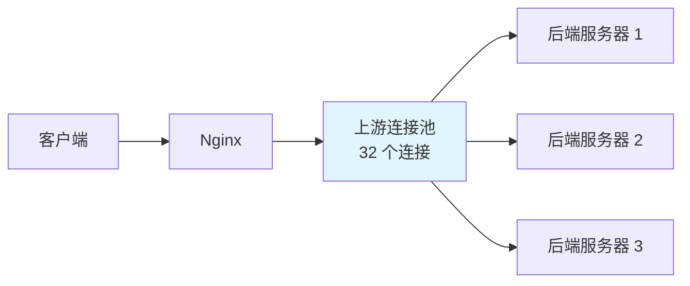

#### 3. 连接限制

**Nginx 限制并发连接数**:

```nginx
http {
    # 限制单个 IP 的并发连接数
    limit_conn_zone $binary_remote_addr zone=addr:10m;

    server {
        location /download/ {
            limit_conn addr 2;   # 每个 IP 最多 2 个并发连接
        }
    }
}
```

### 连接关闭策略

**何时关闭连接?**

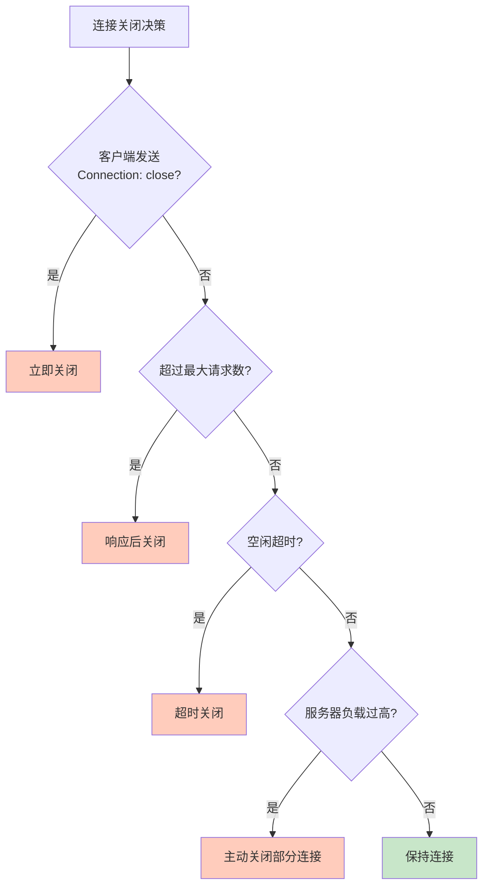

**示例 - Nginx 负载过高时关闭连接**:

```nginx
http {
    # 当 worker 连接数超过 90% 时,不再保持持久连接
    keepalive_disable msie6;
    keepalive_timeout 65s;

    # 每个 worker 最大连接数
    events {
        worker_connections 1024;
    }
}
```

---

## 4.5 性能优化策略

### 1. 减少 HTTP 请求数量

**策略**:
- ✅ 合并 CSS/JS 文件
- ✅ 使用 CSS Sprites (雪碧图)
- ✅ 内联小资源 (Base64 编码)
- ✅ 使用 HTTP/2 Server Push

**示例 - 合并文件**:

```html
<!-- ❌ 不好: 3 个请求 -->
<link rel="stylesheet" href="header.css">
<link rel="stylesheet" href="main.css">
<link rel="stylesheet" href="footer.css">

<!-- ✅ 好: 1 个请求 -->
<link rel="stylesheet" href="bundle.css">
```

**Webpack 打包配置**:

```javascript
// webpack.config.js
module.exports = {
  entry: './src/index.js',
  output: {
    filename: 'bundle.js',  // 合并为单个文件
  },
};
```

### 2. 域名分片 (Domain Sharding)

**原理**: 浏览器对同一域名有并发连接数限制 (6 个),使用多个子域名突破限制。

```html


```

**Nginx 配置 - 多个子域名指向同一服务器**:

```nginx
server {
    listen 80;
    server_name img1.example.com img2.example.com img3.example.com;
    root /var/www/images;
}
```

**注意**: 域名分片在 HTTP/2 中 **不推荐**,因为 HTTP/2 支持多路复用。

### 3. 启用 Gzip 压缩

**Nginx 配置**:

```nginx
http {
    gzip on;
    gzip_vary on;
    gzip_min_length 1024;        # 小于 1KB 不压缩
    gzip_comp_level 6;           # 压缩级别 1-9
    gzip_types
        text/plain
        text/css
        text/javascript
        application/javascript
        application/json
        application/xml;
}
```

**效果**:

```bash
# 未压缩
curl -I https://www.example.com/app.js
Content-Length: 524288          # 512 KB

# 启用 Gzip
curl -I -H "Accept-Encoding: gzip" https://www.example.com/app.js
Content-Length: 102400          # 100 KB  ← 压缩 80%
Content-Encoding: gzip
```

### 4. 启用 HTTP/2

**Nginx 配置**:

```nginx
server {
    listen 443 ssl http2;        # 启用 HTTP/2
    server_name www.example.com;

    ssl_certificate /path/to/cert.pem;
    ssl_certificate_key /path/to/key.pem;

    # HTTP/2 推送
    location / {
        http2_push /style.css;
        http2_push /script.js;
    }
}
```

**HTTP/2 优势**:
- ✅ 多路复用 - 解决队头阻塞
- ✅ 头部压缩 - 减少传输数据
- ✅ 服务器推送 - 提前发送资源

### 5. 使用 CDN

**CDN (Content Delivery Network)** - 将静态资源部署到离用户更近的边缘节点。

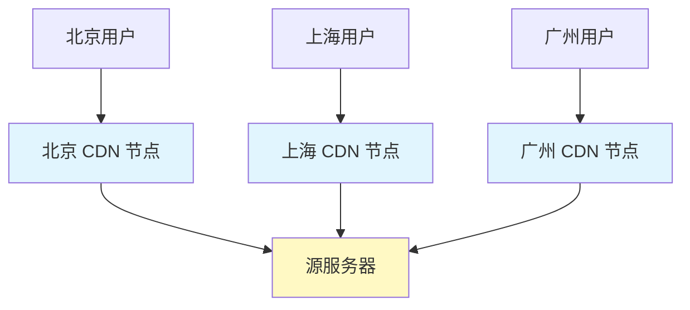

**示例 - 使用 CDN**:

```html
<!-- ❌ 直接从源服务器加载 -->
<script src="https://www.example.com/jquery.min.js"></script>

<!-- ✅ 从 CDN 加载 -->
<script src="https://cdn.jsdelivr.net/npm/jquery@3.6.0/dist/jquery.min.js"></script>
```

### 6. 启用缓存

**详见 [第六章: HTTP 缓存机制](./06-caching.md)**

```nginx
location ~* \.(jpg|jpeg|png|gif|ico|css|js)$ {
    expires 1y;                          # 缓存 1 年
    add_header Cache-Control "public";
}
```

---

## 4.6 实战演练

### 练习 1: 观察持久连接

使用 `telnet` 手动发送 HTTP 请求:

```bash
telnet www.example.com 80
```

```http
GET / HTTP/1.1
Host: www.example.com

```

**任务**:
1. 发送第一个请求后,连接是否关闭?
2. 再发送第二个请求,观察是否复用连接

### 练习 2: 测试连接超时

```bash
# 使用 curl 测试连接超时
curl --keepalive-time 60 http://www.example.com/
```

**任务**: 等待 60 秒后再次请求,观察是否建立新连接

### 练习 3: 浏览器 Network Waterfall

1. 打开 Chrome DevTools (F12)
2. 访问一个资源较多的网站 (如 `https://www.github.com`)
3. 观察 "Network" → "Waterfall" 列

**任务**:
1. 观察并发连接数 (通常是 6 个)
2. 哪些资源被并行加载?
3. 哪些资源被串行加载 (受连接数限制)?

### 练习 4: 对比 HTTP/1.1 vs HTTP/2

**HTTP/1.1**:

```bash
curl -I --http1.1 https://www.google.com
```

**HTTP/2**:

```bash
curl -I --http2 https://www.google.com
```

**任务**: 对比响应头部的差异

---

## 本章小结

### 核心要点

1. **HTTP/1.0 vs HTTP/1.1**:
   - HTTP/1.0: 短连接,每个请求建立新连接
   - HTTP/1.1: 持久连接,复用 TCP 连接,大幅提升性能

2. **持久连接 (Keep-Alive)**:
   - HTTP/1.1 默认开启
   - 通过 `Connection` 头部控制
   - 需要明确的消息边界 (`Content-Length` 或 `Transfer-Encoding: chunked`)
   - 服务器配置超时和最大请求数

3. **管道化 (Pipelining)**:
   - 理论上可提升性能
   - 实践中存在队头阻塞问题
   - 浏览器基本已禁用
   - HTTP/2 多路复用是真正的解决方案

4. **性能优化策略**:
   - 减少 HTTP 请求数量 (合并文件、雪碧图)
   - 启用 Gzip 压缩
   - 使用 CDN
   - 启用 HTTP/2
   - 合理配置缓存

### 下一章预告

在 [第五章: 内容协商](./05-content-negotiation.md) 中,我们将详细讲解:
- 内容协商的三种类型 (主动协商、被动协商、透明协商)
- Accept、Accept-Language、Accept-Encoding 等协商头部
- 质量值 (q-value) 的使用
- Content-Type、Content-Encoding、Content-Language 响应头部
- Vary 头部在缓存中的作用

---

## 参考资料

- [RFC 9112 - HTTP/1.1 Connection Management](https://www.rfc-editor.org/rfc/rfc9112.html#section-9)
- [MDN - Connection Management](https://developer.mozilla.org/en-US/docs/Web/HTTP/Connection_management_in_HTTP_1.x)
- [High Performance Browser Networking](https://hpbn.co/)
