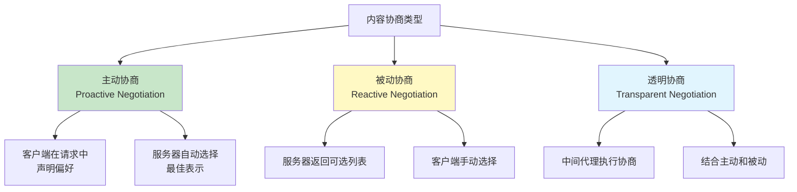
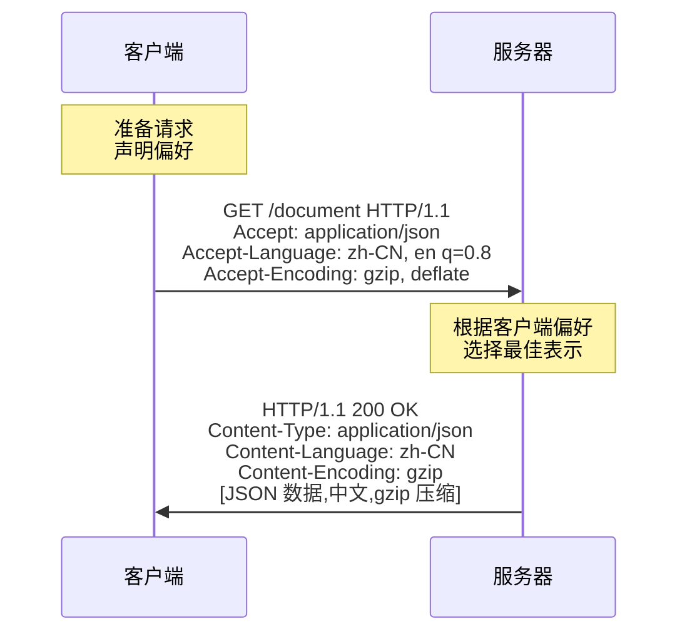
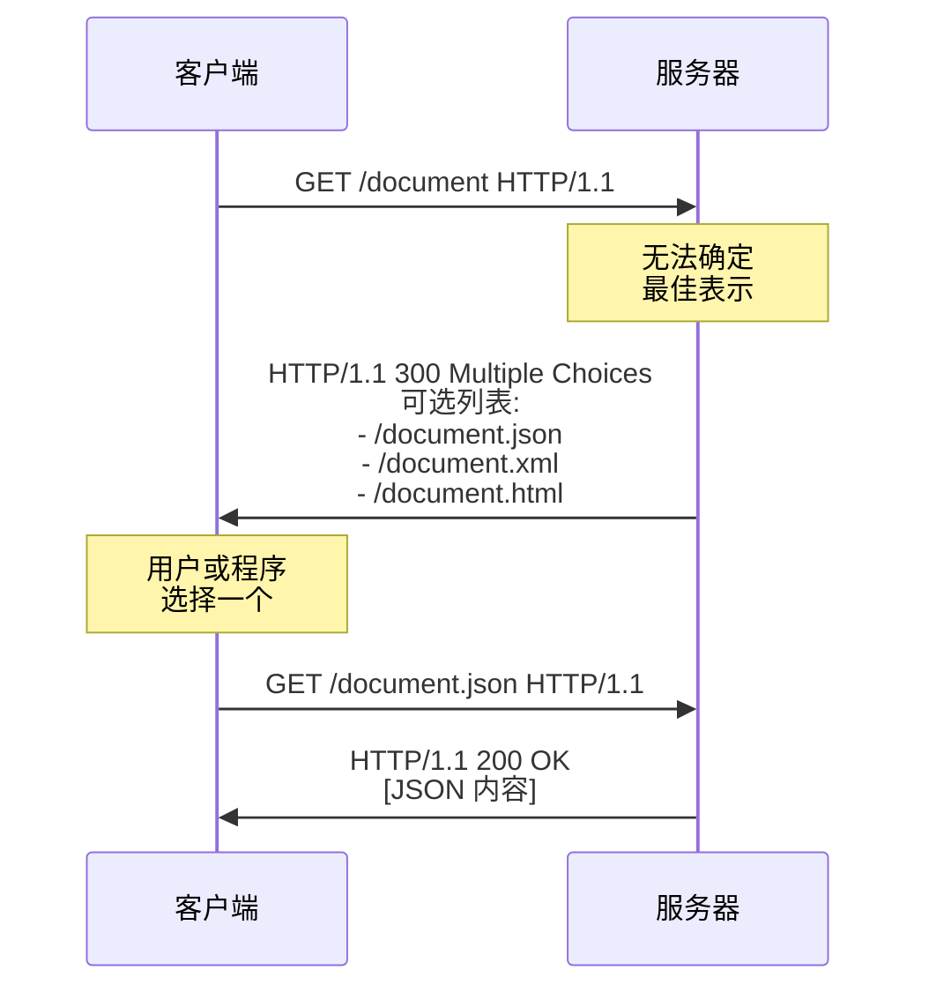
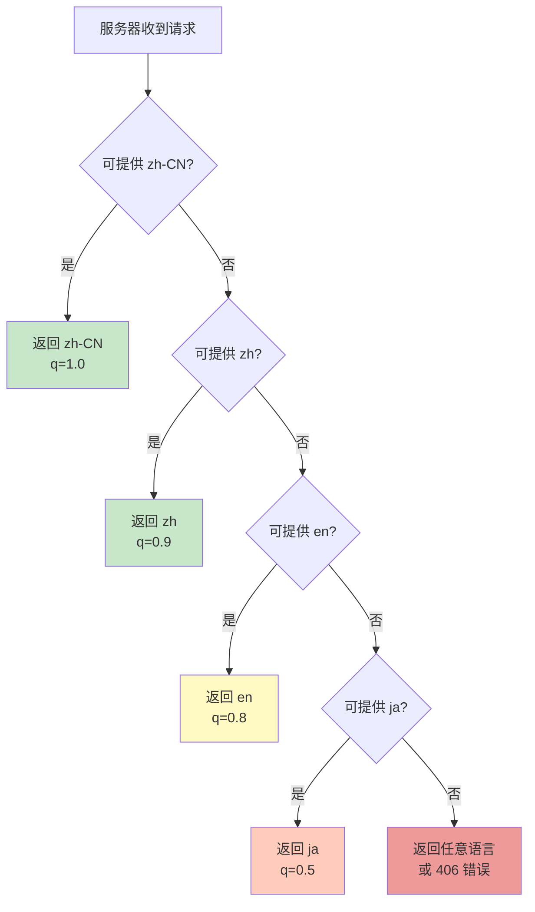
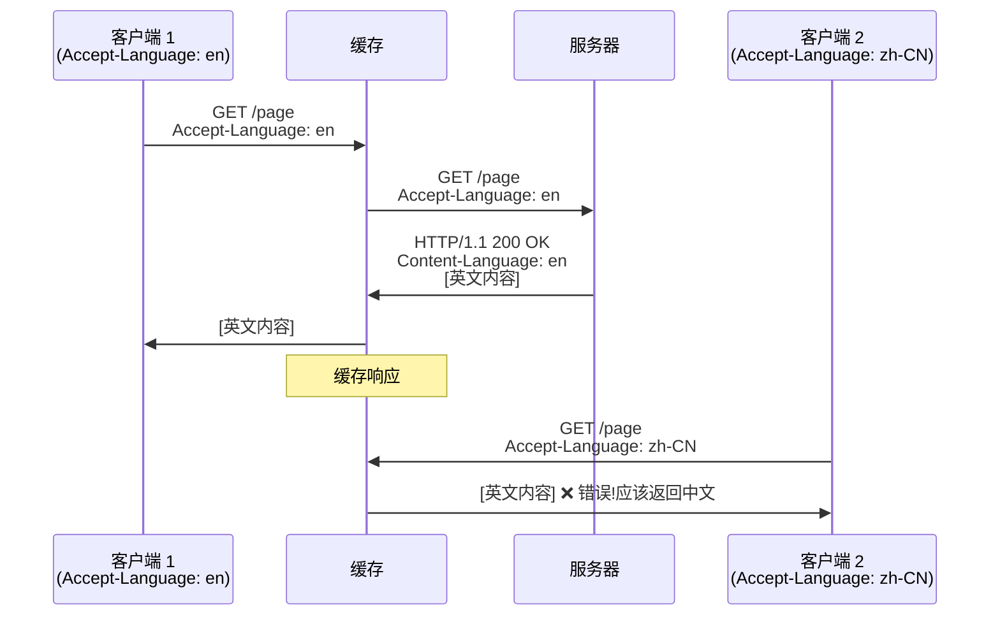
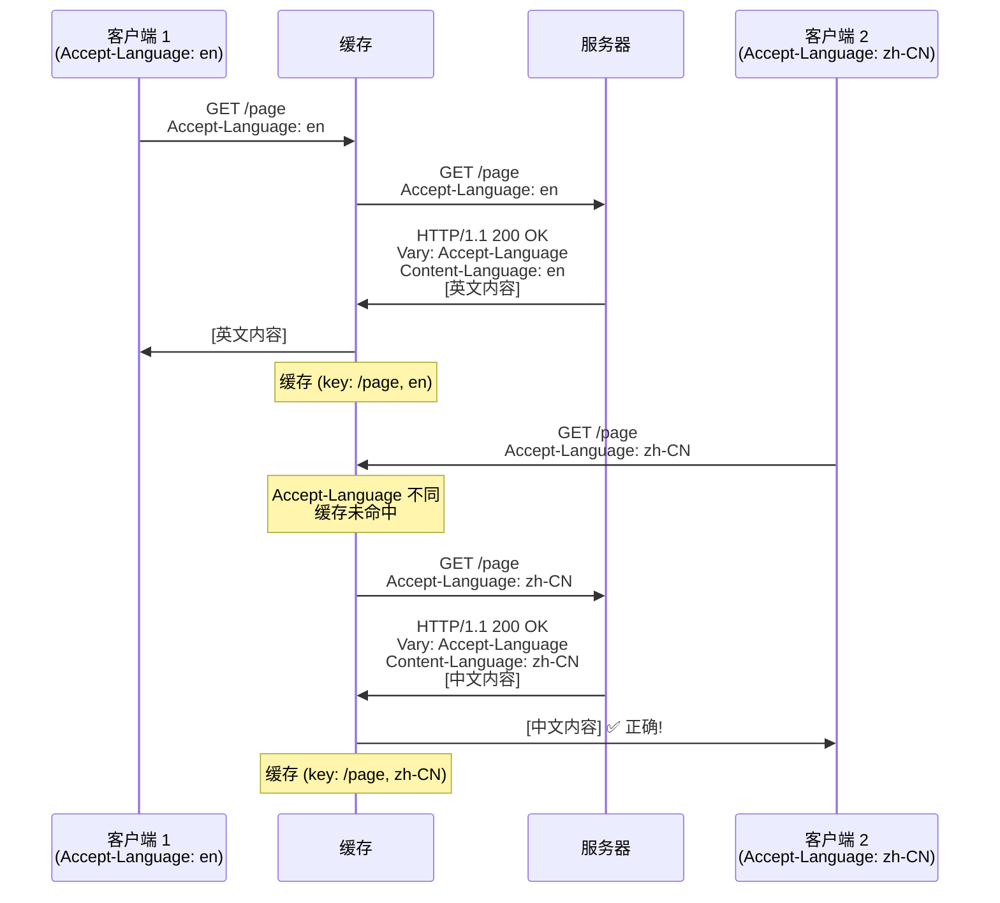

# 第五章: 内容协商

> 本章基于 RFC 9110 Section 12 (Content Negotiation) 规范编写

## 目录

- [5.1 内容协商概述](#51-内容协商概述)
- [5.2 主动协商 (Proactive Negotiation)](#52-主动协商-proactive-negotiation)
- [5.3 被动协商 (Reactive Negotiation)](#53-被动协商-reactive-negotiation)
- [5.4 质量值 (Quality Values)](#54-质量值-quality-values)
- [5.5 Vary 头部与缓存](#55-vary-头部与缓存)
- [5.6 实战演练](#56-实战演练)

---

## 5.1 内容协商概述

### 什么是内容协商?

**内容协商 (Content Negotiation)** 是指 **同一个 URI 可以返回不同表示形式的资源**,服务器根据客户端的偏好选择最合适的版本。

**类比**: 就像去餐厅点餐:

- 你告诉服务员你的饮食偏好 (不吃辣、素食、海鲜过敏)
- 服务员根据你的偏好推荐菜品
- 同一道"宫保鸡丁",可以做成不辣版、素食版、海鲜版

### 为什么需要内容协商?

**常见场景**:

1. **多语言支持**:
   - 同一网页,中文用户看中文版,英文用户看英文版
   - URI: `https://www.example.com/about`
   - 中文版: `about.zh-CN.html`
   - 英文版: `about.en.html`

2. **多种数据格式**:
   - API 返回 JSON 或 XML
   - URI: `https://api.example.com/users/1`
   - JSON: `{"id":1,"name":"Alice"}`
   - XML: `<user><id>1</id><name>Alice</name></user>`

3. **图片格式选择**:
   - 现代浏览器支持 WebP,旧浏览器只支持 JPEG
   - URI: `https://cdn.example.com/photo.webp`
   - WebP 版本: 小文件,高质量
   - JPEG 版本: 兼容性好

4. **压缩编码**:
   - 支持 gzip 的客户端接收压缩内容
   - 不支持 gzip 的客户端接收原始内容

### 内容协商的类型

RFC 9110 定义了三种内容协商类型:



**对比表**:

| 类型         | 谁选择? | 优点                  | 缺点                     |
|------------|-------|---------------------|------------------------|
| **主动协商** | 服务器  | 一次请求搞定,简单高效 | 服务器需要猜测客户端偏好 |
| **被动协商** | 客户端  | 客户端完全控制        | 需要多次请求,增加延迟    |
| **透明协商** | 代理    | 结合两者优点          | 实现复杂,很少使用        |

**本章重点**: **主动协商** (最常用)

---

## 5.2 主动协商 (Proactive Negotiation)

### 工作流程



### Accept - 内容类型协商

**作用**: 客户端告诉服务器可接受的 **媒体类型 (MIME Type)**。

**格式**: `Accept: <media-type>[;<parameter>][;q=<quality>], ...`

**示例**:

```http
Accept: text/html, application/json, */*
```

**常见媒体类型**:

| 媒体类型                 | 说明            | 典型文件 |
|--------------------------|---------------|----------|
| `text/html`              | HTML 文档       | `.html`  |
| `text/plain`             | 纯文本          | `.txt`   |
| `text/css`               | CSS 样式表      | `.css`   |
| `application/json`       | JSON 数据       | `.json`  |
| `application/xml`        | XML 数据        | `.xml`   |
| `application/javascript` | JavaScript 代码 | `.js`    |
| `image/jpeg`             | JPEG 图片       | `.jpg`   |
| `image/png`              | PNG 图片        | `.png`   |
| `image/webp`             | WebP 图片       | `.webp`  |
| `video/mp4`              | MP4 视频        | `.mp4`   |

**通配符**:

- `*/*` - 任意类型
- `image/*` - 任意图片类型
- `text/*` - 任意文本类型

**curl 示例 - 请求 JSON 格式**:

```bash
curl -H "Accept: application/json" https://api.github.com/users/octocat
```

请求:

```http
GET /users/octocat HTTP/1.1
Host: api.github.com
Accept: application/json
```

响应:

```http
HTTP/1.1 200 OK
Content-Type: application/json; charset=utf-8

{"login":"octocat","id":583231,...}
```

**curl 示例 - 请求 XML 格式**:

```bash
curl -H "Accept: application/xml" https://api.example.com/users/1
```

请求:

```http
GET /users/1 HTTP/1.1
Host: api.example.com
Accept: application/xml
```

响应:

```http
HTTP/1.1 200 OK
Content-Type: application/xml

<user><id>1</id><name>Alice</name></user>
```

**服务器端实现 (Node.js + Express)**:

```javascript
app.get('/users/:id', (req, res) => {
  const user = { id: 1, name: 'Alice' };

  // 根据 Accept 头部返回不同格式
  res.format({
    'application/json': () => {
      res.json(user);
    },
    'application/xml': () => {
      res.type('application/xml');
      res.send(`<user><id>${user.id}</id><name>${user.name}</name></user>`);
    },
    'text/html': () => {
      res.send(`<h1>User ${user.id}</h1><p>Name: ${user.name}</p>`);
    },
    'default': () => {
      res.status(406).send('Not Acceptable');  // 406 错误
    }
  });
});
```

**406 Not Acceptable**: 服务器无法提供客户端可接受的内容类型。

```bash
curl -H "Accept: application/pdf" https://api.example.com/users/1
```

响应:

```http
HTTP/1.1 406 Not Acceptable
Content-Type: application/json

{"error":"Requested content type not supported"}
```

### Accept-Language - 语言协商

**作用**: 客户端告诉服务器可接受的 **自然语言**。

**格式**: `Accept-Language: <language>[;q=<quality>], ...`

**语言标签** (RFC 5646):

- `zh-CN` - 简体中文 (中国)
- `zh-TW` - 繁体中文 (台湾)
- `en-US` - 英语 (美国)
- `en-GB` - 英语 (英国)
- `ja` - 日语
- `fr` - 法语

**浏览器默认行为**:

Chrome 浏览器 (中文环境) 发送:

```http
Accept-Language: zh-CN,zh;q=0.9,en;q=0.8
```

**解读**:

- **首选**: `zh-CN` (简体中文,质量值 1.0)
- **次选**: `zh` (任意中文,质量值 0.9)
- **备选**: `en` (英语,质量值 0.8)

**curl 示例**:

```bash
curl -H "Accept-Language: zh-CN" https://www.example.com
```

请求:

```http
GET / HTTP/1.1
Host: www.example.com
Accept-Language: zh-CN
```

响应 (中文版):

```http
HTTP/1.1 200 OK
Content-Type: text/html; charset=utf-8
Content-Language: zh-CN

<!DOCTYPE html>
<html lang="zh-CN">
<head><title>示例网站</title></head>
<body><h1>欢迎</h1></body>
</html>
```

**服务器端实现 (Nginx)**:

```nginx
map $http_accept_language $lang {
    default en;
    ~^zh zh;
    ~^en en;
    ~^ja ja;
}

server {
    location / {
        # 根据语言返回不同文件
        try_files /index.$lang.html /index.en.html =404;
    }
}
```

**文件结构**:

```
/var/www/html/
  ├── index.zh.html      # 中文版
  ├── index.en.html      # 英文版
  └── index.ja.html      # 日文版
```

**服务器端实现 (Node.js + i18n)**:

```javascript
const i18n = require('i18n');

i18n.configure({
  locales: ['en', 'zh-CN', 'ja'],
  directory: __dirname + '/locales',
  defaultLocale: 'en'
});

app.use(i18n.init);

app.get('/', (req, res) => {
  res.send(res.__('welcome'));  // 根据 Accept-Language 返回对应语言
});
```

### Accept-Encoding - 编码协商

**作用**: 客户端告诉服务器可接受的 **内容编码 (压缩算法)**。

**格式**: `Accept-Encoding: <encoding>[;q=<quality>], ...`

**常见编码**:

| 编码       | 说明                   | 压缩率    | 速度 |
|------------|----------------------|-----------|------|
| `gzip`     | GNU zip,最常用         | 70-90%    | 中   |
| `deflate`  | zlib 压缩              | 类似 gzip | 中   |
| `br`       | Brotli,现代算法        | 75-95%    | 慢   |
| `compress` | Unix compress (已废弃) | -         | -    |
| `identity` | 不压缩 (默认)          | 0%        | -    |
| `*`        | 任意编码               | -         | -    |

**浏览器默认行为**:

```http
Accept-Encoding: gzip, deflate, br
```

**curl 示例**:

```bash
curl -H "Accept-Encoding: gzip" https://www.example.com
```

请求:

```http
GET / HTTP/1.1
Host: www.example.com
Accept-Encoding: gzip
```

响应 (gzip 压缩):

```http
HTTP/1.1 200 OK
Content-Type: text/html
Content-Encoding: gzip
Content-Length: 1024        # 压缩后大小

[二进制 gzip 数据]
```

**未压缩 vs 压缩**:

```bash
# 未压缩
curl https://www.example.com/app.js -o app.js
# 文件大小: 524 KB

# 启用 gzip
curl -H "Accept-Encoding: gzip" https://www.example.com/app.js \
  --compressed -o app.js
# 文件大小: 105 KB  ← 压缩 80%
```

**Nginx 配置 - 启用 Gzip**:

```nginx
http {
    gzip on;                          # 启用 gzip
    gzip_vary on;                     # 添加 Vary: Accept-Encoding
    gzip_min_length 1024;             # 小于 1KB 不压缩
    gzip_comp_level 6;                # 压缩级别 1-9 (默认 6)
    gzip_types
        text/plain
        text/css
        text/javascript
        application/javascript
        application/json
        application/xml
        image/svg+xml;                # 需要压缩的类型
}
```

**Brotli 压缩** (更高压缩率,现代浏览器支持):

```nginx
http {
    brotli on;
    brotli_comp_level 6;
    brotli_types
        text/plain
        text/css
        application/javascript
        application/json;
}
```

**对比 Gzip vs Brotli**:

| 文件类型   | 原始大小 | Gzip (-6)   | Brotli (-6) | 节省    |
|------------|----------|-------------|-------------|---------|
| HTML       | 100 KB   | 25 KB (75%) | 22 KB (78%) | **+3%** |
| CSS        | 50 KB    | 12 KB (76%) | 10 KB (80%) | **+4%** |
| JavaScript | 200 KB   | 60 KB (70%) | 52 KB (74%) | **+4%** |

### Accept-Charset - 字符集协商 (已废弃)

**注意**: `Accept-Charset` 头部在现代 Web 中 **很少使用**,因为:

- UTF-8 已成为事实标准
- 大多数内容都使用 UTF-8 编码

**历史格式**: `Accept-Charset: utf-8, iso-8859-1;q=0.5`

**现代做法**: 直接在 `Content-Type` 中指定字符集:

```http
Content-Type: text/html; charset=utf-8
```

### 内容协商的响应头部

服务器通过以下头部告知实际返回的内容表示:

| 请求头部          | 响应头部           | 说明           |
|-------------------|--------------------|--------------|
| `Accept`          | `Content-Type`     | 实际的媒体类型 |
| `Accept-Language` | `Content-Language` | 实际的语言     |
| `Accept-Encoding` | `Content-Encoding` | 实际的编码方式 |

**完整示例**:

```bash
curl -v https://www.example.com/ \
  -H "Accept: text/html" \
  -H "Accept-Language: zh-CN" \
  -H "Accept-Encoding: gzip"
```

请求:

```http
GET / HTTP/1.1
Host: www.example.com
Accept: text/html
Accept-Language: zh-CN
Accept-Encoding: gzip
```

响应:

```http
HTTP/1.1 200 OK
Content-Type: text/html; charset=utf-8       ← 对应 Accept
Content-Language: zh-CN                      ← 对应 Accept-Language
Content-Encoding: gzip                       ← 对应 Accept-Encoding
Vary: Accept-Encoding, Accept-Language       ← 缓存变化维度

[gzip 压缩的中文 HTML]
```

---

## 5.3 被动协商 (Reactive Negotiation)

### 工作流程



### 300 Multiple Choices

**状态码**: `300 Multiple Choices`

**响应示例**:

```http
HTTP/1.1 300 Multiple Choices
Content-Type: text/html
Location: /document.json         # 推荐的默认选项

<html>
<body>
  <h1>Multiple Representations Available</h1>
  <ul>
    <li><a href="/document.json">JSON format</a></li>
    <li><a href="/document.xml">XML format</li>
    <li><a href="/document.html">HTML format</a></li>
  </ul>
</body>
</html>
```

**使用场景**:

- API 版本选择
- 文档格式选择
- 语言版本选择

**实际应用**: 被动协商在现代 Web 中 **很少使用**,因为:

- 增加请求次数,降低性能
- 用户体验不好
- 主动协商已足够强大

---

## 5.4 质量值 (Quality Values)

### 什么是质量值?

**质量值 (q-value, Quality Value)** 用于表示客户端对不同选项的 **偏好程度**。

**范围**: `0.0` 到 `1.0` (最多 3 位小数)

**默认值**: `1.0` (最高优先级)

**格式**: `<option>;q=<value>`

### 示例

```http
Accept-Language: zh-CN, zh;q=0.9, en;q=0.8, ja;q=0.5, *;q=0.1
```

**解读**:

| 语言       | 质量值       | 优先级 |
|------------|--------------|-------|
| `zh-CN`    | `1.0` (默认) | 最高   |
| `zh`       | `0.9`        | 高     |
| `en`       | `0.8`        | 中     |
| `ja`       | `0.5`        | 低     |
| `*` (任意) | `0.1`        | 最低   |

**服务器选择逻辑**:



### Accept 头部的质量值

```http
Accept: text/html, application/xhtml+xml, application/xml;q=0.9, image/webp, */*;q=0.8
```

**解读**:

| 媒体类型                | 质量值       | 优先级 |
|-------------------------|--------------|-------|
| `text/html`             | `1.0` (默认) | 最高   |
| `application/xhtml+xml` | `1.0`        | 最高   |
| `image/webp`            | `1.0`        | 最高   |
| `application/xml`       | `0.9`        | 高     |
| `*/*` (任意)            | `0.8`        | 中     |

**curl 示例**:

```bash
curl -H "Accept: application/json;q=1.0, application/xml;q=0.5" \
  https://api.example.com/data
```

**服务器逻辑**:

1. 优先返回 JSON (q=1.0)
2. 如果不支持 JSON,返回 XML (q=0.5)
3. 如果都不支持,返回 406 错误

### Accept-Encoding 的质量值

```http
Accept-Encoding: br;q=1.0, gzip;q=0.8, *;q=0.1
```

**解读**:

- 最优先 Brotli 压缩 (q=1.0)
- 次优先 Gzip 压缩 (q=0.8)
- 接受其他编码 (q=0.1)
- `identity` (不压缩) 质量值为 0,表示 **禁止**

**特殊值 `q=0`**: 明确表示 **不接受** 该选项。

```http
Accept-Encoding: gzip, deflate, br, identity;q=0
```

**含义**: 接受 gzip、deflate、br,但 **不接受未压缩** 的内容。

### 服务器端质量值计算

**算法**:

1. 列出所有服务器可提供的表示
2. 与客户端的 Accept 头部匹配
3. 计算每个表示的质量值
4. 选择质量值最高的表示

**示例**:

客户端请求:

```http
Accept: text/*, text/html, text/html;level=1, */*
```

服务器可提供:

- `text/html;level=1` - 匹配 `text/html;level=1` (最具体) → **q=1.0**
- `text/html` - 匹配 `text/html` → q=1.0
- `text/plain` - 匹配 `text/*` → q=1.0
- `image/jpeg` - 匹配 `*/*` → q=1.0

**结果**: 选择 `text/html;level=1` (最具体的匹配)

---

## 5.5 Vary 头部与缓存

### Vary 头部的作用

**Vary** 头部告诉缓存,响应的内容取决于哪些请求头部,用于 **缓存变化维度**。

**格式**: `Vary: <header-name>, ...`

**为什么需要 Vary?**

没有 Vary 的问题:



**使用 Vary 解决**:



### 常见 Vary 值

```http
# 根据语言缓存不同版本
Vary: Accept-Language

# 根据编码缓存不同版本
Vary: Accept-Encoding

# 根据多个维度缓存
Vary: Accept-Language, Accept-Encoding

# 根据用户代理缓存 (移动端 vs 桌面端)
Vary: User-Agent
```

**Nginx 自动添加 Vary**:

```nginx
http {
    gzip on;
    gzip_vary on;        # 自动添加 Vary: Accept-Encoding
}
```

响应:

```http
HTTP/1.1 200 OK
Content-Encoding: gzip
Vary: Accept-Encoding    ← Nginx 自动添加
```

### Vary: * (特殊值)

**含义**: 响应取决于 **未知的或未列出的因素**,缓存 **不应** 重用此响应。

```http
Vary: *
```

**使用场景**: 响应取决于:

- Cookie (用户登录状态)
- 客户端 IP 地址
- 时间
- 其他不可预测的因素

**示例 - 个性化内容**:

```http
HTTP/1.1 200 OK
Vary: *              ← 响应因用户而异,不应缓存
Content-Type: text/html

<h1>Welcome back, Alice!</h1>
```

**避免滥用 Vary: ***:

- 会禁用缓存,严重影响性能
- 仅在确实需要时使用

---

## 5.6 实战演练

### 练习 1: 测试 Accept 头部

```bash
# 请求 JSON
curl -H "Accept: application/json" https://api.github.com/users/octocat

# 请求 HTML (如果支持)
curl -H "Accept: text/html" https://api.github.com/users/octocat
```

**任务**: 对比两个响应的 `Content-Type`

### 练习 2: 测试 Accept-Language

```bash
# 请求中文版
curl -H "Accept-Language: zh-CN" https://www.wikipedia.org

# 请求英文版
curl -H "Accept-Language: en-US" https://www.wikipedia.org
```

**任务**: 观察响应的 `Content-Language` 和页面语言

### 练习 3: 测试 Accept-Encoding

```bash
# 不压缩
curl -H "Accept-Encoding: identity" https://www.example.com/ -o uncompressed.html

# Gzip 压缩
curl -H "Accept-Encoding: gzip" https://www.example.com/ --compressed -o compressed.html

# 对比文件大小
ls -lh uncompressed.html compressed.html
```

**任务**: 计算压缩率

### 练习 4: 观察 Vary 头部

```bash
# 观察响应头部
curl -I https://www.google.com
```

**任务**:

1. `Vary` 头部的值是什么?
2. 为什么 Google 使用这些 Vary 值?

### 练习 5: 测试质量值

```bash
curl -H "Accept: application/json;q=0.5, application/xml;q=1.0" \
  https://httpbin.org/headers
```

**任务**: 如果服务器同时支持 JSON 和 XML,会返回哪种格式?

---

## 本章小结

### 核心要点

1. **内容协商的三种类型**:
   - **主动协商** (最常用): 客户端声明偏好,服务器自动选择
   - **被动协商** (很少用): 服务器返回可选列表,客户端手动选择
   - **透明协商** (极少用): 代理执行协商

2. **主动协商的请求头部**:
   - `Accept` - 可接受的媒体类型
   - `Accept-Language` - 可接受的语言
   - `Accept-Encoding` - 可接受的编码方式

3. **质量值 (q-value)**:
   - 范围: `0.0` 到 `1.0`
   - 默认: `1.0` (最高优先级)
   - `q=0` 表示不接受
   - 用于表达偏好程度

4. **响应头部**:
   - `Content-Type` - 实际的媒体类型
   - `Content-Language` - 实际的语言
   - `Content-Encoding` - 实际的编码方式

5. **Vary 头部**:
   - 指定缓存变化维度
   - 确保缓存返回正确的变体
   - `Vary: *` 禁用缓存

### 下一章预告

在 [第六章: HTTP 缓存机制](./06-caching.md) 中,我们将详细讲解:

- HTTP 缓存的工作原理
- 强缓存 vs 协商缓存
- `Cache-Control` 指令详解
- `ETag` 和 `Last-Modified` 验证机制
- 缓存新鲜度计算
- Nginx 缓存配置实战

---

## 参考资料

- [RFC 9110 - HTTP Semantics: Content Negotiation](https://www.rfc-editor.org/rfc/rfc9110.html#section-12)
- [MDN - Content Negotiation](https://developer.mozilla.org/en-US/docs/Web/HTTP/Content_negotiation)
- [MDN - Accept](https://developer.mozilla.org/en-US/docs/Web/HTTP/Headers/Accept)
- [MDN - Vary](https://developer.mozilla.org/en-US/docs/Web/HTTP/Headers/Vary)
