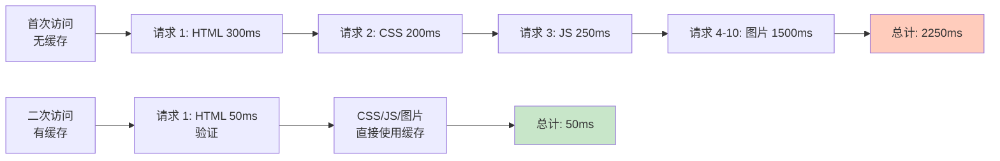
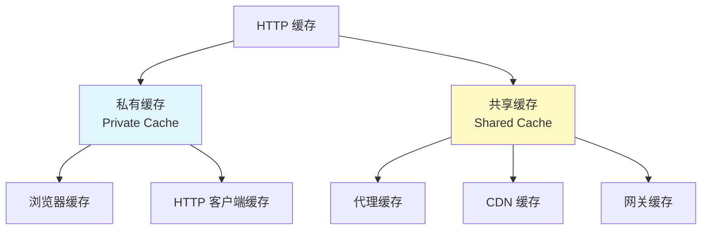
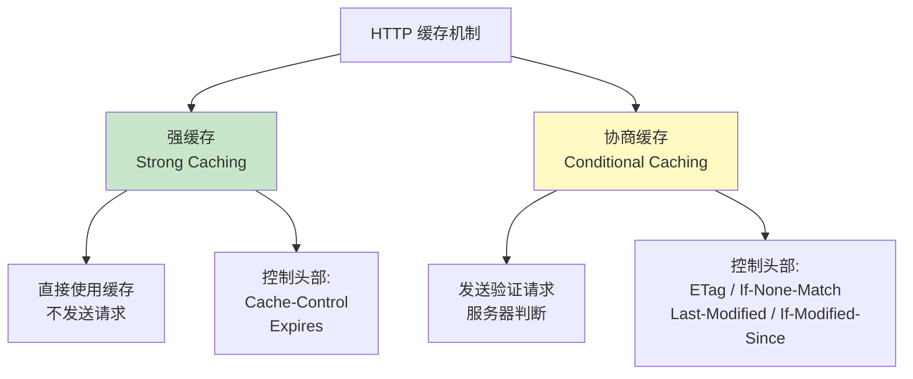
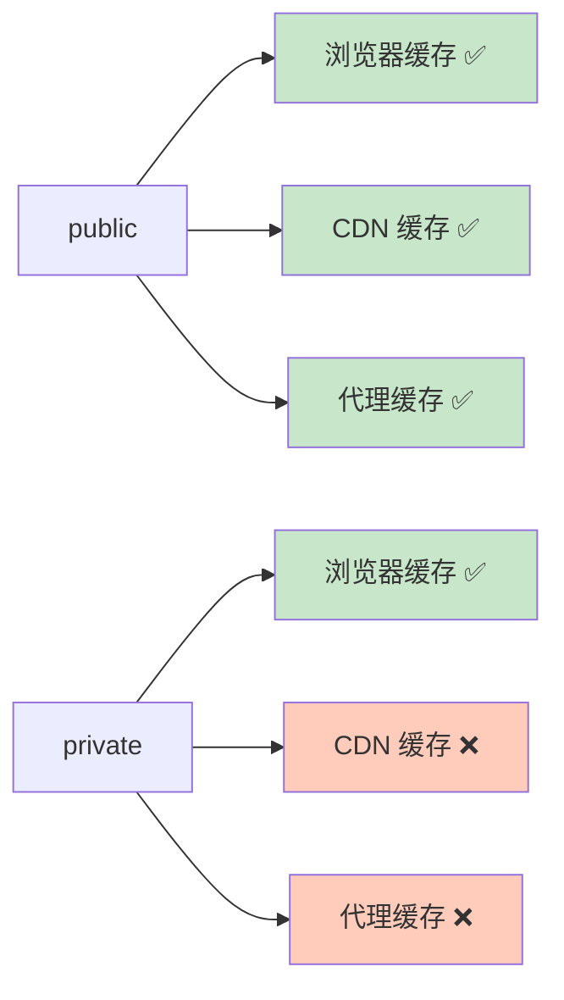
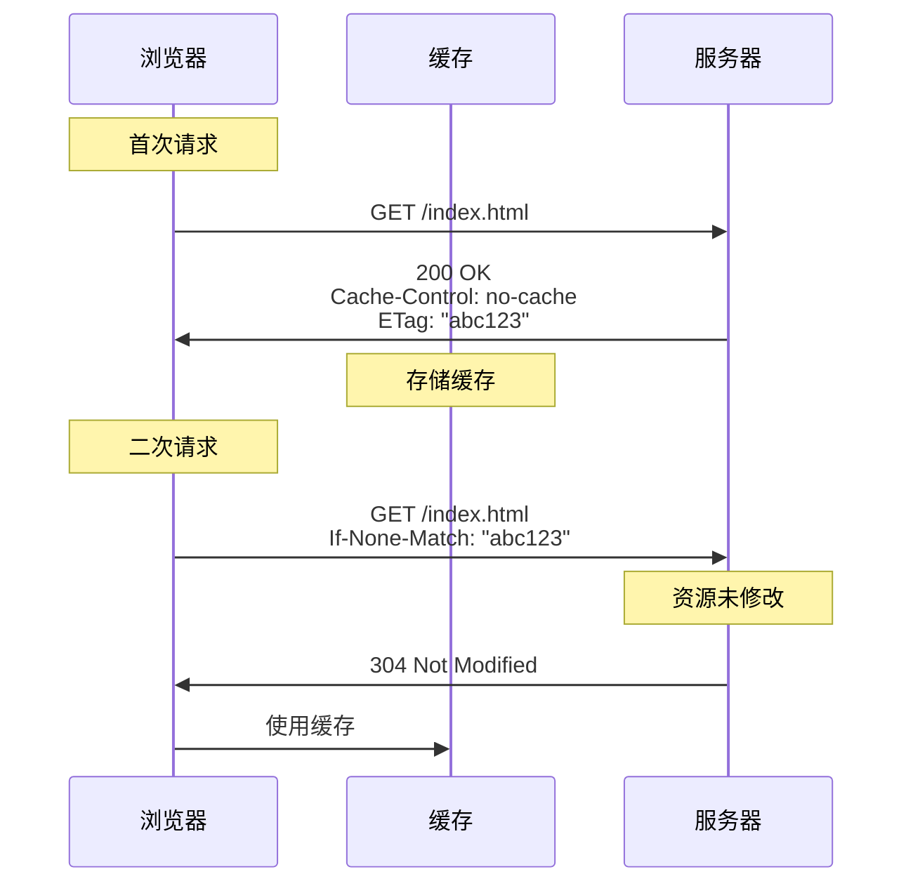
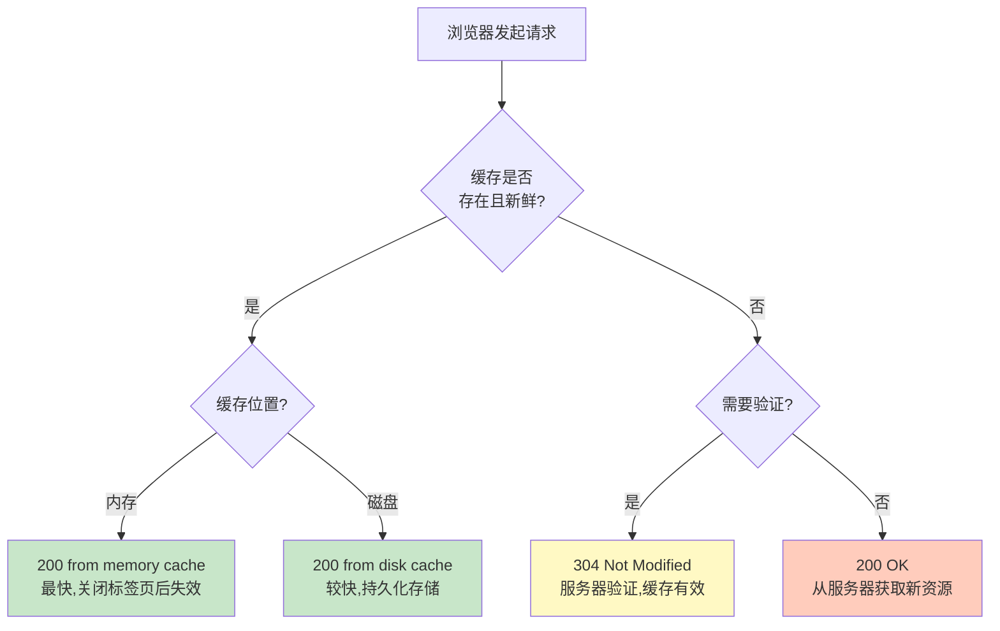
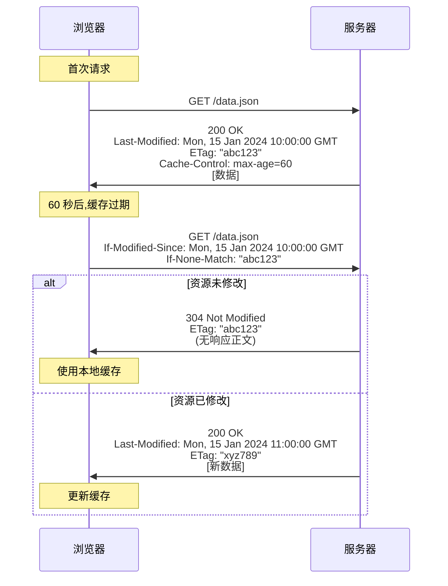
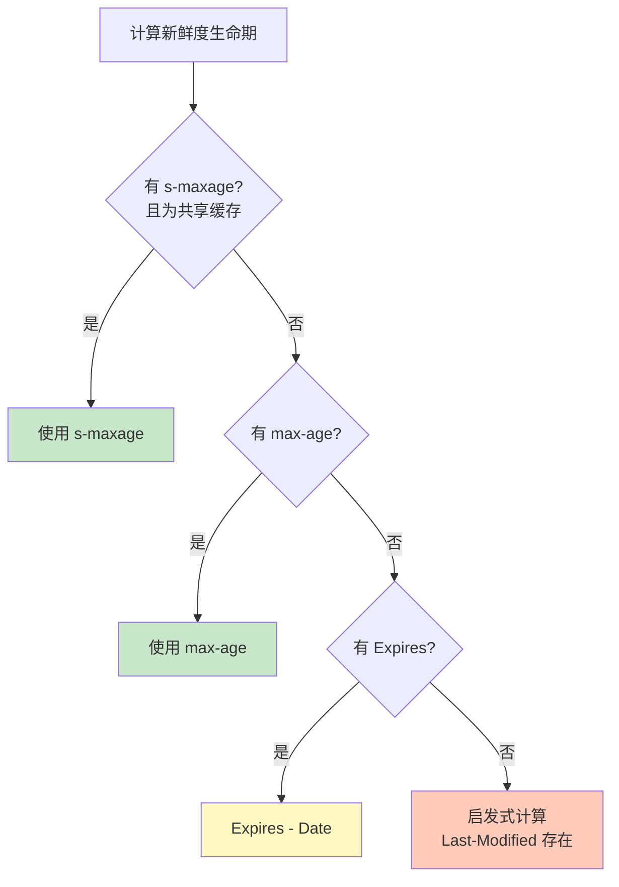

# 第六章: HTTP 缓存机制

> 本章基于 RFC 9111 (HTTP Caching) 规范编写

## 目录
- [6.1 HTTP 缓存概述](#61-http-缓存概述)
- [6.2 强缓存 (Strong Caching)](#62-强缓存-strong-caching)
- [6.3 协商缓存 (Conditional Requests)](#63-协商缓存-conditional-requests)
- [6.4 缓存新鲜度计算](#64-缓存新鲜度计算)
- [6.5 缓存配置最佳实践](#65-缓存配置最佳实践)
- [6.6 实战演练](#66-实战演练)

---

## 6.1 HTTP 缓存概述

### 什么是 HTTP 缓存?

**HTTP 缓存 (HTTP Caching)** 是一种存储 HTTP 响应副本的机制,以便在后续请求中直接使用,而无需再次从服务器获取。

**类比**: HTTP 缓存就像 **图书馆的图书借阅**:
- **首次借书**: 从图书馆借书 (从服务器获取资源)
- **续借**: 如果书还在你手上且未过期,无需再去图书馆 (使用本地缓存)
- **还书再借**: 如果书过期了,需要还书确认是否有新版本 (缓存验证)

### 为什么需要缓存?

**性能提升**:

| 指标 | 无缓存 | 有缓存 | 提升 |
|------|--------|--------|------|
| 响应时间 | 200-500ms (网络延迟) | 0-10ms (本地读取) | **95%+** |
| 带宽消耗 | 100% | 10-30% (仅验证请求) | **70-90%** |
| 服务器负载 | 100% | 20-40% (减少请求) | **60-80%** |
| 用户体验 | 普通 | 极快 | **显著改善** |

**示例 - 加载一个网页**:



### HTTP 缓存的类型



**私有缓存 (Private Cache)**:
- **位置**: 客户端 (浏览器、移动应用)
- **作用域**: 单个用户
- **特点**: 可以缓存个性化内容 (如用户登录后的页面)

**共享缓存 (Shared Cache)**:
- **位置**: 代理服务器、CDN、网关
- **作用域**: 多个用户
- **特点**: 只能缓存非个性化内容

### HTTP 缓存的两种机制



**对比表**:

| 机制 | 发送请求? | 响应状态码 | 何时使用? |
|------|-----------|------------|-----------|
| **强缓存** | ❌ 否 | 200 (from cache) | 缓存未过期 |
| **协商缓存** | ✅ 是 | 304 Not Modified | 缓存已过期,需验证 |

---

## 6.2 强缓存 (Strong Caching)

### Cache-Control 头部

**Cache-Control** 是 HTTP/1.1 引入的缓存控制头部,功能强大,**优先级高于** `Expires`。

**格式**: `Cache-Control: <directive>[, <directive>]*`

#### 响应指令 (Response Directives)

**1. max-age=\<seconds\>**

**作用**: 指定资源的最大缓存时间 (秒)。

```http
Cache-Control: max-age=3600     # 缓存 1 小时
```

**示例**:

```bash
curl -I https://www.example.com/logo.png
```

响应:

```http
HTTP/1.1 200 OK
Cache-Control: max-age=86400    # 缓存 1 天 (86400 秒)
Content-Type: image/png
Date: Mon, 15 Jan 2024 10:00:00 GMT

[图片数据]
```

**缓存过期时间**: `Date + max-age = Mon, 15 Jan 2024 10:00:00 + 86400s = Tue, 16 Jan 2024 10:00:00`

**浏览器行为**:
- 在 `Tue, 16 Jan 2024 10:00:00` 之前,直接使用缓存,不发送请求
- 在 Chrome DevTools 中显示 `200 (from disk cache)` 或 `200 (from memory cache)`

**2. public vs private**

**public**:

```http
Cache-Control: public, max-age=3600
```

**含义**: 响应可以被 **任何缓存** (浏览器、CDN、代理) 存储。

**使用场景**: 静态资源 (CSS、JS、图片)

**private**:

```http
Cache-Control: private, max-age=3600
```

**含义**: 响应 **只能被私有缓存** (浏览器) 存储,**不能被共享缓存** (CDN、代理) 存储。

**使用场景**: 个性化内容 (用户登录后的页面)

**对比**:



**3. no-cache**

**⚠️ 常见误解**: `no-cache` **不是** "不缓存",而是 **每次都需要验证**。

```http
Cache-Control: no-cache
```

**含义**: 缓存可以存储响应,但在使用前 **必须** 向服务器验证。

**流程**:



**使用场景**: 需要保证数据是最新的,但允许缓存以节省带宽。

**4. no-store**

```http
Cache-Control: no-store
```

**含义**: **完全禁止缓存**,每次都必须从服务器获取。

**与 no-cache 的区别**:

| 指令 | 存储缓存? | 发送请求? | 使用场景 |
|------|-----------|-----------|----------|
| `no-cache` | ✅ 是 | ✅ 每次验证 | 需要最新数据,但可节省带宽 |
| `no-store` | ❌ 否 | ✅ 每次重新获取 | 敏感信息 (银行账户、医疗记录) |

**示例**:

```http
# 银行账户页面
Cache-Control: no-store, private
```

**5. must-revalidate**

```http
Cache-Control: max-age=3600, must-revalidate
```

**含义**: 缓存过期后,**必须** 向服务器验证,不能使用过期缓存。

**使用场景**: 确保数据的准确性 (如库存数量、价格)

**6. s-maxage=\<seconds\>**

```http
Cache-Control: max-age=300, s-maxage=3600
```

**含义**: 为 **共享缓存** (CDN、代理) 指定不同的缓存时间。

**优先级**: `s-maxage` > `max-age` (仅对共享缓存)

**示例**:

```http
Cache-Control: max-age=60, s-maxage=3600, public
```

**解读**:
- **浏览器**: 缓存 60 秒
- **CDN/代理**: 缓存 3600 秒 (1 小时)

**使用场景**: CDN 加速,让 CDN 缓存更长时间。

#### 请求指令 (Request Directives)

**1. max-age=\<seconds\>**

客户端可以指定可接受的最大缓存年龄:

```http
Cache-Control: max-age=0
```

**含义**: 不接受缓存,强制重新验证。

**浏览器刷新行为**:
- **普通刷新** (F5): 发送 `Cache-Control: max-age=0` - 验证缓存
- **强制刷新** (Ctrl+F5): 发送 `Cache-Control: no-cache` - 忽略缓存

**2. no-cache**

```http
Cache-Control: no-cache
```

**含义**: 不使用缓存,强制从服务器获取。

**3. no-store**

```http
Cache-Control: no-store
```

**含义**: 禁止存储响应 (很少使用)。

#### Cache-Control 组合示例

```http
# 静态资源 (CSS/JS/图片) - 长时间缓存
Cache-Control: public, max-age=31536000    # 1 年

# HTML 页面 - 需要验证
Cache-Control: no-cache

# API 响应 - 短时间缓存
Cache-Control: private, max-age=60

# 敏感数据 - 禁止缓存
Cache-Control: no-store, private

# CDN 加速 - 不同缓存时间
Cache-Control: public, max-age=300, s-maxage=3600
```

### Expires 头部 (HTTP/1.0,已过时)

**格式**: `Expires: <HTTP-date>`

```http
Expires: Wed, 21 Oct 2025 07:28:00 GMT
```

**含义**: 资源的过期时间 (绝对时间)。

**问题**:
- 依赖客户端和服务器的时钟同步
- 如果客户端时钟不准确,缓存会失效

**优先级**: `Cache-Control: max-age` > `Expires`

**示例**:

```http
# 两者同时存在,使用 Cache-Control
Cache-Control: max-age=3600
Expires: Wed, 21 Oct 2025 07:28:00 GMT
```

**Nginx 配置**:

```nginx
location ~* \.(jpg|jpeg|png|gif|ico|css|js)$ {
    expires 1y;                     # 设置 Expires 为 1 年后
    add_header Cache-Control "public, max-age=31536000";
}
```

响应:

```http
HTTP/1.1 200 OK
Expires: Thu, 15 Jan 2025 10:00:00 GMT
Cache-Control: public, max-age=31536000
```

### 浏览器缓存位置

**Chrome DevTools 中的缓存状态**:



**观察方法**:

1. 打开 Chrome DevTools (F12)
2. 切换到 "Network" 标签
3. 勾选 "Disable cache" 可以禁用缓存
4. 访问网页,观察 "Size" 列:
   - `from memory cache` - 内存缓存
   - `from disk cache` - 磁盘缓存
   - 数字 (如 `1.2 MB`) - 从网络获取

---

## 6.3 协商缓存 (Conditional Requests)

### 缓存验证流程



### Last-Modified / If-Modified-Since

**Last-Modified** (响应头部):

```http
Last-Modified: Mon, 15 Jan 2024 10:00:00 GMT
```

**含义**: 资源的最后修改时间。

**If-Modified-Since** (请求头部):

```http
If-Modified-Since: Mon, 15 Jan 2024 10:00:00 GMT
```

**含义**: 如果资源在此时间后修改过,返回新资源;否则返回 304。

**示例 - 首次请求**:

```bash
curl -I https://www.example.com/style.css
```

响应:

```http
HTTP/1.1 200 OK
Last-Modified: Mon, 15 Jan 2024 10:00:00 GMT
Cache-Control: max-age=3600
Content-Length: 5120
```

**示例 - 验证请求**:

```bash
curl -I -H "If-Modified-Since: Mon, 15 Jan 2024 10:00:00 GMT" \
  https://www.example.com/style.css
```

响应 (资源未修改):

```http
HTTP/1.1 304 Not Modified
Last-Modified: Mon, 15 Jan 2024 10:00:00 GMT
Cache-Control: max-age=3600
# 注意: 无 Content-Length,无响应正文
```

**Last-Modified 的问题**:

1. **精度限制**: 只能精确到秒,1 秒内的多次修改无法区分
2. **时钟依赖**: 依赖服务器时钟准确性
3. **内容相同但时间变化**: 文件内容未变但时间戳变了 (如重新部署)

### ETag / If-None-Match

**ETag (Entity Tag)** 是资源的 **唯一标识符**,通常是内容的哈希值。

**ETag** (响应头部):

```http
ETag: "686897696a7c876b7e"
```

**If-None-Match** (请求头部):

```http
If-None-Match: "686897696a7c876b7e"
```

**含义**: 如果资源的 ETag 与此值不匹配 (资源已修改),返回新资源;否则返回 304。

**示例 - 首次请求**:

```bash
curl -I https://www.example.com/app.js
```

响应:

```http
HTTP/1.1 200 OK
ETag: "abc123def456"
Cache-Control: max-age=3600
Content-Length: 102400
```

**示例 - 验证请求**:

```bash
curl -I -H 'If-None-Match: "abc123def456"' \
  https://www.example.com/app.js
```

响应 (资源未修改):

```http
HTTP/1.1 304 Not Modified
ETag: "abc123def456"
Cache-Control: max-age=3600
```

**ETag 的类型**:

**强 ETag (Strong ETag)**:

```http
ETag: "abc123"      # 无 W/ 前缀
```

**含义**: 资源的 **字节级完全相同**。

**弱 ETag (Weak ETag)**:

```http
ETag: W/"abc123"    # 有 W/ 前缀
```

**含义**: 资源 **语义上等价**,但字节可能不完全相同 (如 gzip 压缩)。

**示例**:

```http
# 原始文件
ETag: "abc123"
Content-Length: 10240

# gzip 压缩后
ETag: W/"abc123"       # 弱 ETag,内容等价但字节不同
Content-Encoding: gzip
Content-Length: 2048
```

### ETag vs Last-Modified

| 对比项 | Last-Modified | ETag |
|--------|---------------|------|
| **精度** | 秒级 | 字节级 |
| **唯一性** | 时间戳 (可能重复) | 哈希值 (几乎唯一) |
| **性能** | 读取文件时间 (快) | 计算哈希 (慢) |
| **优先级** | 低 | **高** |
| **使用场景** | 静态文件 | 动态内容、CDN |

**优先级**: 如果同时存在,**ETag 优先**。

```bash
curl -I -H "If-Modified-Since: Mon, 15 Jan 2024 10:00:00 GMT" \
  -H 'If-None-Match: "abc123"' \
  https://www.example.com/
```

服务器会 **优先** 检查 `If-None-Match`,如果匹配则返回 304,**忽略** `If-Modified-Since`。

### Nginx 配置 ETag

**Nginx 默认启用 ETag**:

```nginx
http {
    etag on;    # 默认开启
}
```

**生成规则**: `ETag = 文件最后修改时间 + 文件大小`

**禁用 ETag** (不推荐):

```nginx
location / {
    etag off;
}
```

**Node.js 生成 ETag**:

```javascript
const crypto = require('crypto');

function generateETag(content) {
  return crypto.createHash('md5').update(content).digest('hex');
}

app.get('/data', (req, res) => {
  const data = { message: 'Hello World' };
  const content = JSON.stringify(data);
  const etag = `"${generateETag(content)}"`;

  // 检查 If-None-Match
  if (req.headers['if-none-match'] === etag) {
    return res.status(304).end();  // 资源未修改
  }

  res.setHeader('ETag', etag);
  res.json(data);
});
```

---

## 6.4 缓存新鲜度计算

### 新鲜度算法 (RFC 9111 Section 4.2)

**新鲜度 (Freshness)** 决定缓存是否可以直接使用,还是需要验证。

**公式**:

```
response_is_fresh = (freshness_lifetime > current_age)
```

#### 1. 计算新鲜度生命期 (Freshness Lifetime)

**优先级**:



**示例 1: max-age**:

```http
Date: Mon, 15 Jan 2024 10:00:00 GMT
Cache-Control: max-age=3600

freshness_lifetime = 3600 秒
```

**示例 2: Expires**:

```http
Date: Mon, 15 Jan 2024 10:00:00 GMT
Expires: Mon, 15 Jan 2024 11:00:00 GMT

freshness_lifetime = Expires - Date = 11:00 - 10:00 = 3600 秒
```

**示例 3: 启发式新鲜度** (无明确过期时间):

```http
Date: Mon, 15 Jan 2024 10:00:00 GMT
Last-Modified: Mon, 08 Jan 2024 10:00:00 GMT

# RFC 建议使用 (Date - Last-Modified) * 10%
freshness_lifetime = (10:00 - 08 Jan 10:00) * 0.1
                   = 7 天 * 0.1
                   = 16.8 小时
```

#### 2. 计算资源年龄 (Current Age)

**公式**:

```
apparent_age = max(0, response_time - Date头部的值)
corrected_age_value = Age头部的值 + response_delay
corrected_initial_age = max(apparent_age, corrected_age_value)
resident_time = now - response_time
current_age = corrected_initial_age + resident_time
```

**简化版**:

```
current_age = (now - Date) + Age头部的值
```

**示例**:

```http
# 服务器响应
Date: Mon, 15 Jan 2024 10:00:00 GMT
Age: 120                                    # 已在缓存中存在 120 秒
Cache-Control: max-age=3600

# 客户端本地时间: Mon, 15 Jan 2024 10:10:00 GMT

apparent_age = 10:10:00 - 10:00:00 = 600 秒
current_age = 600 + 120 = 720 秒

freshness_lifetime = 3600 秒
response_is_fresh = (3600 > 720) = true    # 缓存仍新鲜
```

### Age 头部

**Age** 头部表示响应在缓存中已存在的时间 (秒)。

```http
Age: 3600    # 缓存了 1 小时
```

**示例 - CDN 缓存**:

```bash
curl -I https://cdn.example.com/logo.png
```

响应:

```http
HTTP/1.1 200 OK
Date: Mon, 15 Jan 2024 10:00:00 GMT
Cache-Control: public, max-age=86400
Age: 43200                              # 在 CDN 缓存了 12 小时
X-Cache: HIT                            # CDN 缓存命中

剩余新鲜时间 = max-age - Age = 86400 - 43200 = 43200 秒 (12 小时)
```

---

## 6.5 缓存配置最佳实践

### 缓存策略表

| 资源类型 | 缓存策略 | 原因 |
|----------|----------|------|
| **HTML** | `no-cache` 或 `max-age=0` | 需要保证最新,但可验证 |
| **CSS/JS (带版本号)** | `max-age=31536000, public` | 内容不变,可长期缓存 |
| **图片 (静态)** | `max-age=2592000, public` | 不常更新,缓存 30 天 |
| **API 响应 (用户数据)** | `private, max-age=60` | 个性化,短时间缓存 |
| **API 响应 (公共数据)** | `public, max-age=300` | 可共享,缓存 5 分钟 |
| **敏感数据** | `no-store, private` | 完全禁止缓存 |

### Nginx 完整配置示例

```nginx
http {
    # 启用 gzip 和 etag
    gzip on;
    gzip_vary on;
    etag on;

    # HTML - 需要验证
    location ~* \.html$ {
        add_header Cache-Control "no-cache, public";
    }

    # CSS/JS (带版本号) - 长期缓存
    location ~* \.(css|js)$ {
        expires 1y;
        add_header Cache-Control "public, max-age=31536000, immutable";
    }

    # 图片 - 中期缓存
    location ~* \.(jpg|jpeg|png|gif|ico|svg)$ {
        expires 30d;
        add_header Cache-Control "public, max-age=2592000";
    }

    # 字体 - 长期缓存
    location ~* \.(woff|woff2|ttf|otf)$ {
        expires 1y;
        add_header Cache-Control "public, max-age=31536000";
        add_header Access-Control-Allow-Origin "*";  # 跨域字体
    }

    # API - 不缓存或短时间缓存
    location /api/ {
        add_header Cache-Control "no-store, private";
    }
}
```

### 文件指纹 (Cache Busting)

**问题**: 如果 CSS/JS 文件更新了,但浏览器仍使用旧缓存怎么办?

**解决方案**: **文件指纹 (Cache Busting)** - 在文件名中添加版本号或内容哈希。

**方法 1: 版本号**:

```html
<!-- 旧版本 -->
<link rel="stylesheet" href="/style.css?v=1.0.0">

<!-- 新版本 (URL 变化,缓存失效) -->
<link rel="stylesheet" href="/style.css?v=1.0.1">
```

**问题**: 查询参数可能被某些缓存忽略。

**方法 2: 文件名哈希** (推荐):

```html
<!-- 旧版本 -->
<link rel="stylesheet" href="/style.abc123.css">

<!-- 新版本 (文件名变化,缓存失效) -->
<link rel="stylesheet" href="/style.xyz789.css">
```

**Webpack 配置**:

```javascript
// webpack.config.js
module.exports = {
  output: {
    filename: '[name].[contenthash].js',  // 内容哈希
    chunkFilename: '[name].[contenthash].js',
  },
};
```

**生成的文件**:

```
main.abc123def456.js        # 内容哈希
vendor.xyz789abc123.js
```

### immutable 指令

**immutable** 是 `Cache-Control` 的一个扩展指令,表示资源 **永远不会改变**。

```http
Cache-Control: public, max-age=31536000, immutable
```

**作用**: 告诉浏览器即使用户强制刷新 (Ctrl+F5),也不要重新验证此资源。

**使用场景**: 带内容哈希的静态资源。

```nginx
location ~* \.(css|js)$ {
    expires 1y;
    add_header Cache-Control "public, max-age=31536000, immutable";
}
```

**浏览器支持**: Firefox、Safari、Edge、Chrome (部分支持)

---

## 6.6 实战演练

### 练习 1: 观察强缓存

```bash
# 首次请求
curl -I https://www.example.com/logo.png

# 观察 Cache-Control 和 Expires 头部
```

**任务**:
1. 记录 `Cache-Control` 的值
2. 计算缓存过期时间
3. 在过期前再次请求,观察是否发送网络请求

### 练习 2: 测试协商缓存

```bash
# 首次请求,获取 ETag
curl -I https://www.example.com/app.js

# 使用 ETag 验证
curl -I -H "If-None-Match: \"获取到的ETag值\"" \
  https://www.example.com/app.js
```

**任务**: 观察响应状态码 (应该是 304)

### 练习 3: 浏览器缓存观察

1. 打开 Chrome DevTools (F12)
2. 切换到 "Network" 标签
3. 访问 `https://www.github.com`
4. 观察 "Size" 列:
   - 哪些资源来自缓存?
   - 哪些资源是 304 Not Modified?
   - 哪些资源是 200 OK (从网络获取)?

### 练习 4: 强制刷新 vs 普通刷新

1. 访问一个网页
2. 按 `F5` (普通刷新),观察 Network 面板
3. 按 `Ctrl+F5` (强制刷新),再次观察

**任务**: 对比两次刷新的请求头部和缓存使用情况

### 练习 5: 禁用缓存调试

在 Chrome DevTools 中:

1. 勾选 "Disable cache"
2. 刷新页面
3. 观察所有资源都从网络加载

**任务**: 对比启用/禁用缓存的加载时间

---

## 本章小结

### 核心要点

1. **HTTP 缓存的两种机制**:
   - **强缓存**: 直接使用缓存,不发送请求 (`Cache-Control`, `Expires`)
   - **协商缓存**: 发送验证请求,服务器判断是否使用缓存 (`ETag`, `Last-Modified`)

2. **Cache-Control 指令**:
   - **响应指令**: `max-age`, `public`, `private`, `no-cache`, `no-store`, `must-revalidate`, `s-maxage`
   - **请求指令**: `max-age`, `no-cache`, `no-store`

3. **缓存验证**:
   - `ETag` / `If-None-Match` - 基于内容哈希,精确
   - `Last-Modified` / `If-Modified-Since` - 基于修改时间,秒级精度

4. **缓存新鲜度**:
   - `freshness_lifetime` = `max-age` 或 `Expires - Date` 或启发式计算
   - `current_age` = `(now - Date) + Age`
   - `response_is_fresh = (freshness_lifetime > current_age)`

5. **最佳实践**:
   - HTML: `no-cache` (需要验证)
   - CSS/JS (带版本号): `max-age=31536000, immutable` (长期缓存)
   - 图片: `max-age=2592000` (30 天缓存)
   - API 用户数据: `private, max-age=60` (短时间缓存)
   - 敏感数据: `no-store, private` (禁止缓存)
   - 使用文件指纹 (哈希) 实现缓存失效

---

## 教程总结

恭喜你完成了 HTTP/1.1 完整教程!让我们回顾一下学到的内容:

### 六大核心主题

1. **[第一章: HTTP 核心概念](./01-introduction.md)**
   - HTTP 的演进历程
   - 客户端-服务器模型
   - URI 资源定位
   - 请求与响应结构
   - HTTP 的无状态特性

2. **[第二章: HTTP 报文格式](./02-message-format.md)**
   - 请求行和状态行语法
   - HTTP 头部字段规范
   - Content-Length vs Transfer-Encoding
   - 分块传输编码

3. **[第三章: HTTP 方法与状态码](./03-methods-and-status.md)**
   - 9 个标准 HTTP 方法
   - 方法的安全性、幂等性、可缓存性
   - 五大类状态码详解
   - 常见状态码使用场景

4. **[第四章: 连接管理与性能优化](./04-connection-management.md)**
   - HTTP/1.0 短连接 vs HTTP/1.1 持久连接
   - Keep-Alive 机制
   - 管道化及其问题
   - 性能优化策略

5. **[第五章: 内容协商](./05-content-negotiation.md)**
   - 主动协商、被动协商、透明协商
   - Accept 系列头部
   - 质量值 (q-value)
   - Vary 头部与缓存

6. **[第六章: HTTP 缓存机制](./06-caching.md)** (本章)
   - 强缓存与协商缓存
   - Cache-Control 指令
   - ETag 和 Last-Modified
   - 缓存新鲜度计算
   - 缓存配置最佳实践

### 继续学习

**推荐下一步**:

1. **HTTP/2**: 多路复用、服务器推送、头部压缩
2. **HTTP/3**: 基于 QUIC,改用 UDP 传输
3. **HTTPS/TLS**: 加密传输、证书机制
4. **WebSocket**: 全双工通信协议
5. **RESTful API 设计**: 基于 HTTP 的 API 最佳实践

**实践项目建议**:

- 搭建一个静态网站并配置缓存策略
- 实现一个支持内容协商的 RESTful API
- 使用 Nginx 配置反向代理和 CDN
- 性能优化实战 (Lighthouse 评分优化)

---

## 参考资料

- [RFC 9111 - HTTP Caching](https://www.rfc-editor.org/rfc/rfc9111.html)
- [RFC 9110 - HTTP Semantics](https://www.rfc-editor.org/rfc/rfc9110.html)
- [MDN - HTTP Caching](https://developer.mozilla.org/en-US/docs/Web/HTTP/Caching)
- [MDN - Cache-Control](https://developer.mozilla.org/en-US/docs/Web/HTTP/Headers/Cache-Control)
- [Google Web Fundamentals - HTTP Caching](https://web.dev/http-cache/)
