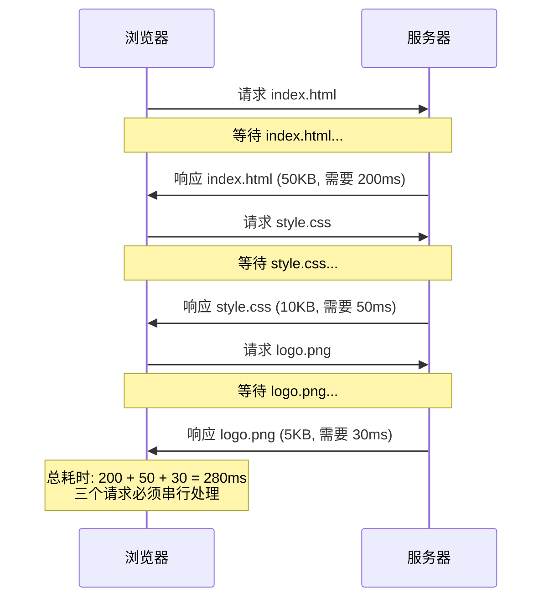
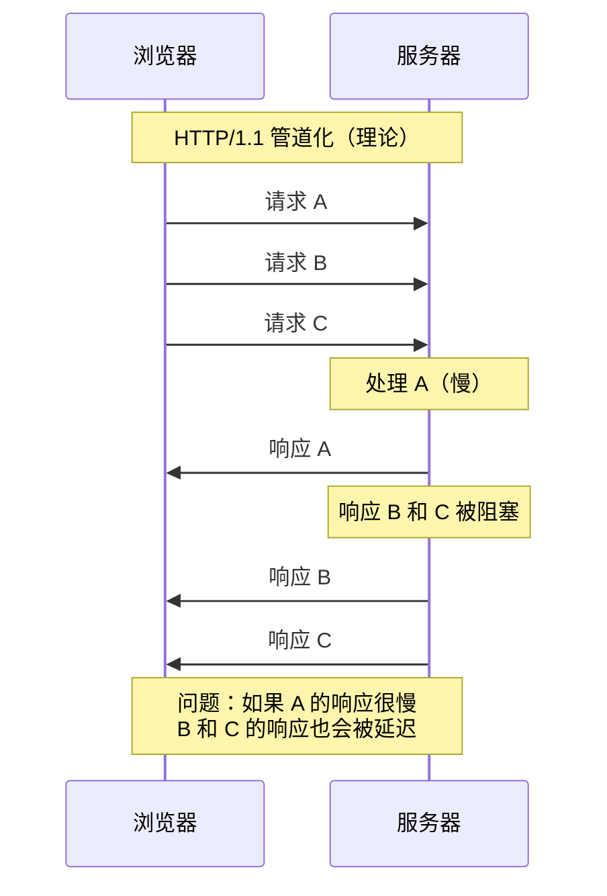
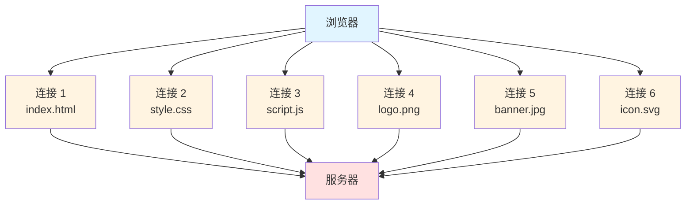
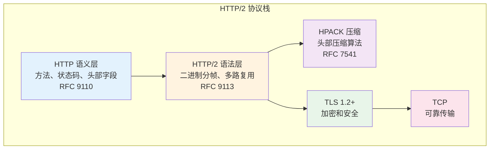

# HTTP/2 诞生背景与核心概念

## 目录
- [HTTP/1.1 的时代困境](#http11-的时代困境)
- [SPDY：HTTP/2 的前身](#spdyhttp2-的前身)
- [HTTP/2 的设计目标](#http2-的设计目标)
- [HTTP/2 概览](#http2-概览)

---

## HTTP/1.1 的时代困境

想象一下，你在一家快餐店排队点餐。HTTP/1.1 的工作方式就像这样：每个顾客必须等前面的人完全点完餐、拿到食物、离开窗口后，才能开始点自己的餐。即使你只想要一杯咖啡，也要等前面那位点了十个汉堡的顾客完全搞定。

这就是 HTTP/1.1 面临的核心问题。让我们深入了解这些痛点：

### 1. 队头阻塞（Head-of-Line Blocking）

**什么是队头阻塞？**

在 HTTP/1.1 中，即使使用了持久连接（Keep-Alive），浏览器在同一个 TCP 连接上也必须按顺序处理请求和响应。如果第一个请求的响应很慢（比如一个大型图片），后续所有请求都会被阻塞，即使它们请求的是很小的资源。



**现实影响：**

一个典型的现代网页需要加载 80-100 个资源（HTML、CSS、JavaScript、图片、字体等）。如果每个请求都要等待前一个完成，页面加载时间会变得非常长。

**HTTP/1.1 的妥协方案：**

浏览器通过打开多个 TCP 连接来缓解这个问题。Chrome 浏览器允许每个域名最多 6 个并发连接。但这带来了新的问题：

- **连接开销**：每个 TCP 连接都需要三次握手（约 100ms）
- **内存消耗**：每个连接需要维护独立的缓冲区
- **服务器压力**：需要同时管理大量连接
- **拥塞控制**：每个连接独立进行慢启动

### 2. HTTP 管道化（Pipelining）的失败

HTTP/1.1 曾引入管道化（Pipelining）特性，允许在同一连接上发送多个请求而不等待响应。听起来很美好，但实际上：



**为什么管道化失败了？**

1. **响应必须按顺序返回**：即使请求 B 的处理完成了，也必须等待请求 A 的响应发送完毕
2. **代理服务器不兼容**：许多中间代理不正确处理管道化请求
3. **重试困难**：如果连接中断，很难确定哪些请求已经处理
4. **队头阻塞依然存在**：慢响应会阻塞所有后续响应

结果：主流浏览器默认禁用了管道化功能。

### 3. 头部冗余问题

每个 HTTP 请求都需要携带完整的头部信息。对于同一个网站的多次请求，这些头部信息高度重复：

**典型的请求头部：**

```http
GET /api/users HTTP/1.1
Host: api.example.com
User-Agent: Mozilla/5.0 (Macintosh; Intel Mac OS X 10_15_7) AppleWebKit/537.36
Accept: application/json,text/html,application/xhtml+xml,application/xml;q=0.9,*/*;q=0.8
Accept-Language: zh-CN,zh;q=0.9,en;q=0.8
Accept-Encoding: gzip, deflate, br
Cookie: session_id=abc123def456; user_pref=dark_mode; analytics_id=xyz789
Referer: https://example.com/dashboard
Connection: keep-alive
Cache-Control: no-cache
```

**问题分析：**

- **大小**：这个头部约 400-500 字节
- **重复性**：对同一网站的每个请求，90% 的头部内容都相同
- **Cookie 膨胀**：Cookie 可能包含大量状态信息，每次请求都要发送
- **浪费带宽**：加载一个包含 100 个资源的页面，仅头部就可能浪费 40-50KB

**计算示例：**

```
100 个请求 × 500 字节头部 = 50,000 字节 = 约 50KB
在 3G 网络（下行 1Mbps = 125KB/s）上：
仅传输头部就需要：50KB ÷ 125KB/s = 0.4 秒
```

### 4. 连接数限制

由于单连接的队头阻塞问题，浏览器需要打开多个连接：



**多连接的代价：**

1. **TCP 握手开销**：每个连接需要一次完整的 TCP 三次握手
2. **慢启动**：每个新连接都需要经历 TCP 慢启动过程
3. **服务器资源**：需要维护大量连接状态
4. **网络拥塞**：多个连接竞争带宽，可能导致拥塞

### 5. 资源优先级问题

HTTP/1.1 无法明确表达资源的优先级。浏览器只能通过调整请求顺序来暗示优先级，但这种方式：

- **不够精确**：无法细粒度控制
- **易受干扰**：网络条件变化会打乱顺序
- **服务器不知情**：服务器无法根据重要性调度响应

**实际影响：**

一个关键的 CSS 文件可能排在大型图片之后，导致页面长时间无法正常显示（FOUC - Flash of Unstyled Content）。

---

## SPDY：HTTP/2 的前身

### SPDY 的诞生

2009 年，Google 启动了 SPDY（读作 "speedy"）项目，目标是解决 HTTP/1.1 的性能瓶颈。SPDY 不是 HTTP 的替代品，而是在 HTTP 和 TCP 之间增加了一个会话层。

**SPDY 的核心创新：**

1. **多路复用**：在单个 TCP 连接上并行传输多个请求/响应
2. **请求优先级**：允许客户端指定请求的相对重要性
3. **头部压缩**：使用压缩算法减少头部大小
4. **服务器推送**：服务器可以主动推送资源

### SPDY 的影响

SPDY 在 Google 自己的服务（如 Gmail、Google Search）上取得了显著的性能提升：

- 页面加载时间减少 **27-60%**
- 用户体验明显改善

这些成功促使 IETF（Internet Engineering Task Force）在 2012 年决定基于 SPDY 开发 HTTP/2 标准。

---

## HTTP/2 的设计目标

HTTP/2（RFC 9113）在 2015 年正式发布，其设计目标包括：

### 1. 性能优化

- **降低延迟**：通过多路复用和头部压缩
- **提高吞吐量**：更好地利用网络带宽
- **减少连接数**：单连接处理所有请求

### 2. 兼容性

- **语义兼容**：保持与 HTTP/1.1 相同的语义（方法、状态码、头部字段）
- **平滑升级**：支持从 HTTP/1.1 自动升级
- **向后兼容**：可以降级到 HTTP/1.1

### 3. 安全性

- **推荐 TLS**：虽然规范允许明文，但浏览器实现都要求使用 HTTPS
- **现代密码套件**：要求使用强加密算法

---

## HTTP/2 概览

### 核心改进对比

| 特性 | HTTP/1.1 | HTTP/2 |
|------|----------|--------|
| **协议格式** | 文本协议 | 二进制协议 |
| **连接复用** | 管道化（失败）| 多路复用（成功）|
| **并发性** | 6 个连接/域 | 1 个连接，无限流 |
| **头部处理** | 明文、重复 | HPACK 压缩 |
| **优先级** | 无 | 流依赖和权重 |
| **服务器推送** | 无 | 支持 |
| **流控** | TCP 层 | 应用层精细控制 |

### 性能提升

根据实际测试和部署数据：

- **页面加载时间**：平均减少 **25-50%**
- **首次渲染时间**：改善 **30-60%**
- **带宽利用率**：提升 **15-25%**（头部压缩）
- **服务器负载**：减少连接数 **80-90%**

### 架构层次



**关键理解：**

- **HTTP/2 改变了"怎么传"（语法层），而不是"传什么"（语义层）**
- 请求方法（GET、POST）、状态码（200、404）、头部字段（Content-Type）的含义保持不变
- 这种设计使得应用程序可以无缝迁移到 HTTP/2

---

## 总结：从问题到解决方案

让我们用一个完整的类比来理解 HTTP/1.1 到 HTTP/2 的演进：

### HTTP/1.1：多个收费站

想象一条高速公路有 6 个收费站（6 个 TCP 连接），每个收费站只能让车辆（请求）一辆接一辆地通过：

- 如果前面的大货车（大文件）很慢，后面的小轿车（小文件）也得等
- 需要同时维护多个收费站（连接），成本高
- 每辆车都要出示完整的通行证（重复的头部）

### HTTP/2：超宽高速公路

HTTP/2 就像把多个收费站合并成一条超宽的高速公路：

- **多路复用**：多辆车（多个流）可以并行行驶，互不阻塞
- **二进制分帧**：每辆车都装在标准化的集装箱（帧）里，机器容易处理
- **头部压缩**：老客户不需要每次都出示完整通行证，"你好，我是常客 #123" 就够了
- **优先级**：紧急车辆（关键资源）可以优先通行
- **服务器推送**：收费站看到你的通行证，提前猜到你要去的地方，主动给你发送地图

---

## 下一步

在接下来的章节中，我们将深入探讨：

1. **二进制分帧层**：HTTP/2 的基石，连接、流、消息和帧的关系
2. **多路复用机制**：如何在单个连接上并行传输多个流
3. **HPACK 头部压缩**：静态表、动态表和霍夫曼编码的工作原理
4. **服务器推送**：如何减少往返时间
5. **流控与优先级**：应用层的精细化控制

让我们继续这段探索之旅！

---

## 参考资料

- RFC 9113: HTTP/2 协议规范
- RFC 9110: HTTP 语义
- RFC 7541: HPACK 头部压缩
