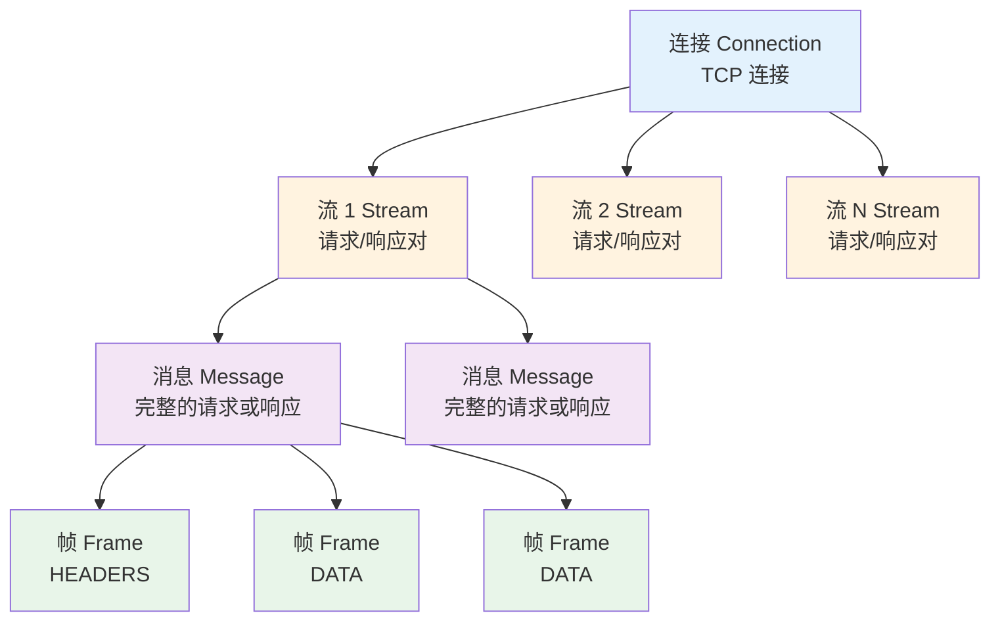
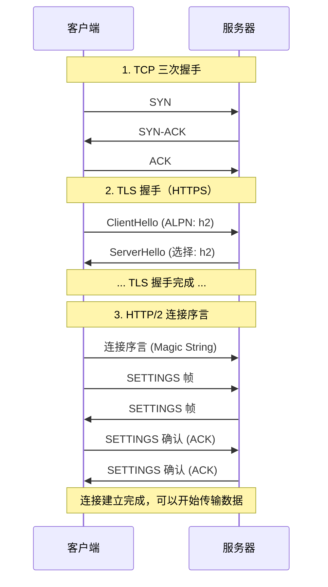
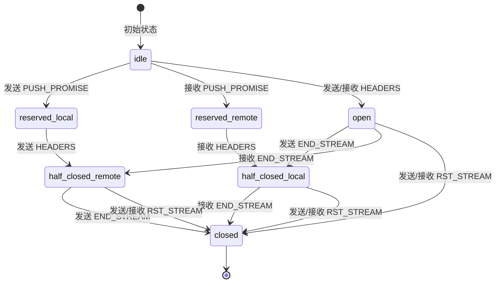
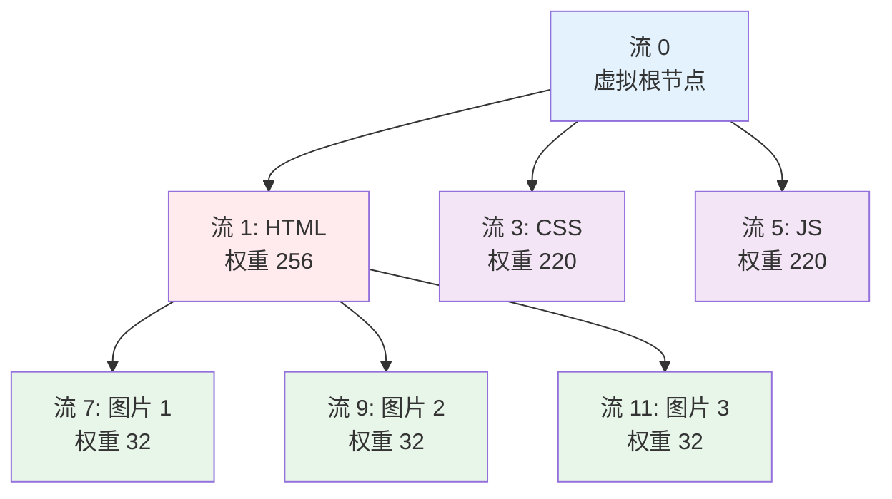
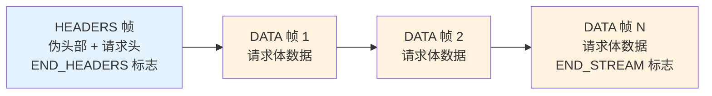
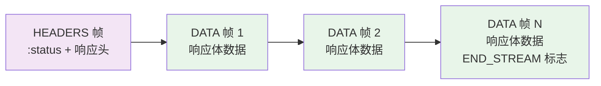
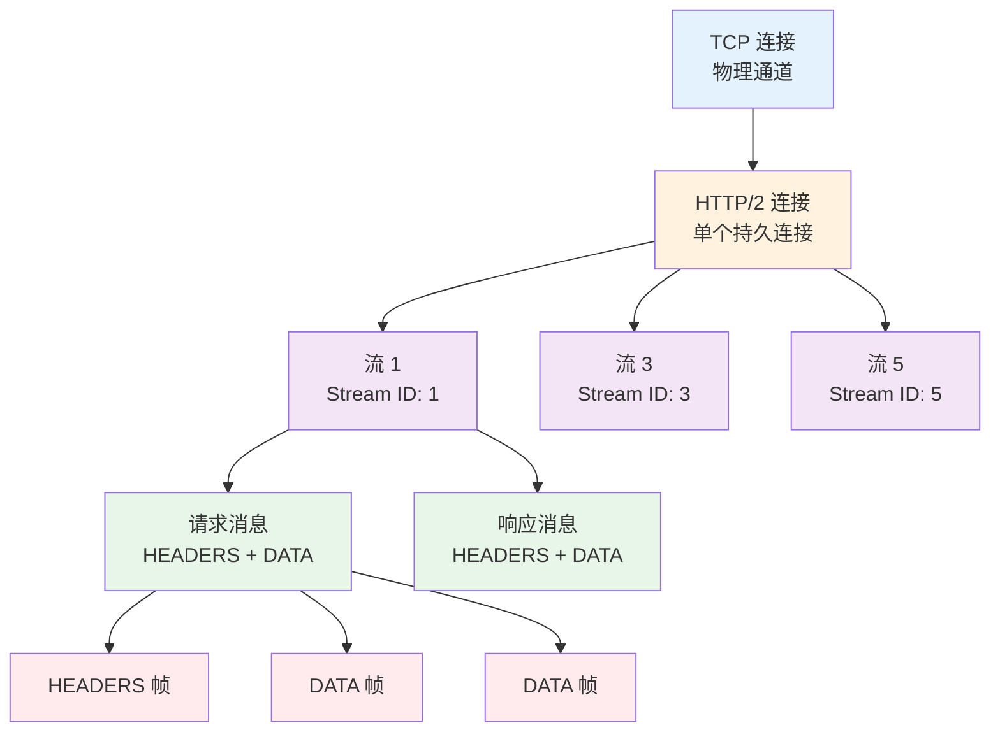

# 核心概念：二进制分帧层

## 目录
- [从文本到二进制：革命性的转变](#从文本到二进制革命性的转变)
- [核心概念层次结构](#核心概念层次结构)
- [连接（Connection）](#连接connection)
- [流（Stream）](#流stream)
- [消息（Message）](#消息message)
- [帧（Frame）](#帧frame)
- [核心帧类型详解](#核心帧类型详解)
- [实战观察：使用工具查看 HTTP/2](#实战观察使用工具查看-http2)

---

## 从文本到二进制：革命性的转变

### HTTP/1.1：人类可读的文本协议

在 HTTP/1.1 中，所有的请求和响应都是纯文本格式，就像我们平时写的信件一样：

**HTTP/1.1 请求示例：**

```http
GET /index.html HTTP/1.1\r\n
Host: www.example.com\r\n
User-Agent: Mozilla/5.0\r\n
Accept: text/html\r\n
\r\n
```

**优点：**
- 人类可读，便于调试
- 使用 telnet 就能手工发送请求
- 容易理解和学习

**缺点：**
- **解析复杂**：需要字符串扫描、查找换行符、处理各种边界情况
- **容错性差**：多一个空格、少一个换行符都可能导致解析失败
- **效率低下**：解析文本比解析二进制慢 **3-5 倍**
- **大小膨胀**：文本表示的数字比二进制大得多（如 "1234" vs 4 字节整数）

### HTTP/2：机器友好的二进制协议

HTTP/2 将所有数据都封装成二进制帧（Frame），就像把散乱的信件统一装入标准化的、贴好标签的快递箱中：

**类比理解：**

| HTTP/1.1 | HTTP/2 |
|----------|--------|
| 手写信件（文本） | 快递箱（二进制帧） |
| 每封信格式不同 | 统一的帧结构 |
| 需要人工阅读整理 | 机器自动识别处理 |
| 容易出错（字迹不清） | 结构严格，易于解析 |
| 大小不固定 | 固定长度头部 |

**二进制协议的优势：**

1. **解析高效**：固定长度的字段，直接按位置读取
2. **错误明确**：要么是合法的帧，要么是错误，没有模糊地带
3. **紧凑表示**：二进制编码更节省空间
4. **扩展性强**：新增帧类型不会影响解析逻辑

---

## 核心概念层次结构

HTTP/2 引入了四个层次的概念，它们的关系像俄罗斯套娃：



**层次关系总结：**

```
连接（Connection）
  └── 流（Stream）× 无限个
        └── 消息（Message）× 2 个（请求 + 响应）
              └── 帧（Frame）× 多个
```

让我们逐层深入理解。

---

## 连接（Connection）

### 定义

**连接（Connection）**是客户端和服务器之间的单个 TCP 连接。在 HTTP/2 中，一个连接可以承载任意数量的双向流。

### 关键特性

1. **单连接模型**：一个域名通常只需要一个 TCP 连接
2. **持久连接**：连接一旦建立，会保持打开状态
3. **双向通信**：客户端和服务器都可以主动发送帧

### 连接建立过程



### 连接序言（Connection Preface）

HTTP/2 连接必须以一个特殊的"魔法字符串"开始：

```
PRI * HTTP/2.0\r\n\r\nSM\r\n\r\n
```

这个字符串的目的是：

1. **快速识别**：服务器可以立即识别这是 HTTP/2 连接
2. **避免混淆**：如果误连到 HTTP/1.1 服务器，会被视为非法请求而拒绝
3. **协议确认**：客户端明确表明要使用 HTTP/2

### 连接参数：SETTINGS 帧

连接建立后，双方交换 SETTINGS 帧来协商连接参数：

| 参数 | 说明 | 默认值 |
|------|------|--------|
| SETTINGS_HEADER_TABLE_SIZE | HPACK 动态表大小 | 4096 字节 |
| SETTINGS_ENABLE_PUSH | 是否允许服务器推送 | 1（启用） |
| SETTINGS_MAX_CONCURRENT_STREAMS | 最大并发流数量 | 无限制 |
| SETTINGS_INITIAL_WINDOW_SIZE | 流控窗口初始大小 | 65535 字节 |
| SETTINGS_MAX_FRAME_SIZE | 最大帧大小 | 16384 字节 |
| SETTINGS_MAX_HEADER_LIST_SIZE | 最大头部列表大小 | 无限制 |

---

## 流（Stream）

### 定义

**流（Stream）**是连接中的一个独立的、双向的帧序列。每个流有唯一的标识符（Stream ID），用于在单个 HTTP/2 连接上多路复用多个请求和响应。

**关键类比：**

如果连接是一条超宽的高速公路，那么流就是公路上并行行驶的车道。每辆车（帧）都标记着自己属于哪条车道（Stream ID）。

### 流标识符（Stream ID）

- **客户端发起的流**：奇数 ID（1, 3, 5, 7, ...）
- **服务器发起的流**：偶数 ID（2, 4, 6, 8, ...）
- **流 ID 0**：保留用于连接级别的控制帧（如 SETTINGS、PING）

**为什么这样设计？**

- 避免 ID 冲突：客户端和服务器各用各的号段
- 无需协商：双方独立分配 ID
- 快速识别：看 ID 就知道是谁发起的

### 流的生命周期

流有五种状态，遵循严格的状态机：



**状态说明：**

1. **idle（空闲）**：流 ID 已保留，但尚未使用
2. **reserved (local/remote)**：流已通过 PUSH_PROMISE 保留，但尚未发送/接收 HEADERS
3. **open（打开）**：流正在活跃使用，双向都可以发送帧
4. **half-closed (local/remote)**：一端已发送 END_STREAM，只能单向传输
5. **closed（关闭）**：流已完成或被重置

### 流的优先级

HTTP/2 允许客户端为流指定优先级，包括：

- **依赖关系**：一个流可以依赖另一个流
- **权重**：在同一父节点下的流，按权重分配资源（1-256）

**优先级树示例：**



**理解：**

- HTML（流 1）优先级最高（权重 256）
- CSS 和 JS（流 3, 5）次之（权重 220）
- 图片（流 7, 9, 11）依赖于 HTML，等 HTML 完成后再加载
- 同级图片按权重平均分配带宽

---

## 消息（Message）

### 定义

**消息（Message）**是一个完整的 HTTP 请求或响应，由一个或多个帧组成。

**关键理解：**

- 每个流携带两个消息：一个请求消息和一个响应消息
- 消息是逻辑概念，实际传输的是帧
- 消息的边界由 END_STREAM 标志标记

### 请求消息结构



**伪头部字段（Pseudo-Header Fields）：**

HTTP/2 用伪头部字段替代了 HTTP/1.1 的请求行：

| HTTP/1.1 | HTTP/2 |
|----------|--------|
| `GET /index.html HTTP/1.1` | `:method: GET` |
| `Host: example.com` | `:authority: example.com` |
| - | `:scheme: https` |
| - | `:path: /index.html` |

**完整请求示例：**

```
:method: GET
:scheme: https
:authority: www.example.com
:path: /api/users/123
accept: application/json
user-agent: Mozilla/5.0
authorization: Bearer token123
```

**为什么使用伪头部？**

1. **统一处理**：所有元数据都是头部字段，简化处理逻辑
2. **HPACK 压缩**：伪头部也可以被压缩
3. **扩展性**：方便添加新的元数据

### 响应消息结构



**伪头部字段：**

响应只有一个伪头部：

```
:status: 200
content-type: application/json
cache-control: max-age=3600
content-length: 1024
```

---

## 帧（Frame）

### 定义

**帧（Frame）**是 HTTP/2 通信的最小单位。所有帧共享一个通用的 9 字节头部，后跟可变长度的负载。

### 通用帧结构

```
+-----------------------------------------------+
|                 Length (24)                   |
+---------------+---------------+---------------+
|   Type (8)    |   Flags (8)   |
+-+-------------+---------------+-------------------------------+
|R|                 Stream Identifier (31)                      |
+=+=============================================================+
|                   Frame Payload (0...)                      ...
+---------------------------------------------------------------+
```

**字段说明：**

| 字段 | 长度 | 说明 |
|------|------|------|
| **Length** | 24 位 | 负载长度（0-16,777,215 字节），默认最大 16,384 |
| **Type** | 8 位 | 帧类型（0-255） |
| **Flags** | 8 位 | 特定于帧类型的标志位 |
| **R** | 1 位 | 保留位，必须为 0 |
| **Stream Identifier** | 31 位 | 流标识符（0-2,147,483,647） |
| **Frame Payload** | 可变 | 帧负载数据 |

**设计巧思：**

1. **固定头部**：9 字节头部长度固定，解析快速
2. **长度前置**：先读取长度，再读取负载，避免缓冲区溢出
3. **类型和标志分离**：便于扩展新帧类型和标志
4. **31 位流 ID**：支持超过 21 亿个流

### 帧的分类

HTTP/2 定义了 10 种核心帧类型：

| 类型值 | 帧类型 | 用途 |
|--------|--------|------|
| 0x0 | DATA | 传输应用数据 |
| 0x1 | HEADERS | 传输头部字段 |
| 0x2 | PRIORITY | 调整流优先级 |
| 0x3 | RST_STREAM | 终止流 |
| 0x4 | SETTINGS | 连接参数配置 |
| 0x5 | PUSH_PROMISE | 服务器推送通知 |
| 0x6 | PING | 测量往返时间 |
| 0x7 | GOAWAY | 优雅关闭连接 |
| 0x8 | WINDOW_UPDATE | 流控窗口更新 |
| 0x9 | CONTINUATION | 延续头部块 |

---

## 核心帧类型详解

### 1. DATA 帧（0x0）

**用途**：传输 HTTP 消息体数据。

**帧结构：**

```
+---------------+
|Pad Length? (8)|
+---------------+-----------------------------------------------+
|                            Data (*)                         ...
+---------------------------------------------------------------+
|                           Padding (*)                       ...
+---------------------------------------------------------------+
```

**标志位：**

- `END_STREAM (0x1)`：表示这是流的最后一帧
- `PADDED (0x8)`：表示存在填充数据

**示例：**

```
Length: 1024
Type: DATA (0x0)
Flags: END_STREAM (0x1)
Stream ID: 13
Payload: [1024 字节的响应体数据]
```

**使用场景：**

- 发送 HTTP 请求体（如 POST 表单数据）
- 发送 HTTP 响应体（如 JSON、HTML 内容）

### 2. HEADERS 帧（0x1）

**用途**：传输 HTTP 头部字段，使用 HPACK 压缩。

**帧结构：**

```
+---------------+
|Pad Length? (8)|
+-+-------------+-----------------------------------------------+
|E|                 Stream Dependency? (31)                     |
+-+-------------+-----------------------------------------------+
|  Weight? (8)  |
+-+-------------+-----------------------------------------------+
|                   Header Block Fragment (*)                 ...
+---------------------------------------------------------------+
|                           Padding (*)                       ...
+---------------------------------------------------------------+
```

**标志位：**

- `END_STREAM (0x1)`：结束流
- `END_HEADERS (0x4)`：结束头部块
- `PADDED (0x8)`：包含填充
- `PRIORITY (0x20)`：包含优先级信息

**示例：请求头部**

```
Length: 256
Type: HEADERS (0x1)
Flags: END_HEADERS (0x4)
Stream ID: 1
Payload: [HPACK 编码的头部]
  :method: GET
  :scheme: https
  :authority: api.example.com
  :path: /users
  accept: application/json
```

### 3. PRIORITY 帧（0x2）

**用途**：调整流的优先级。

**帧结构：**

```
+-+-------------------------------------------------------------+
|E|                  Stream Dependency (31)                     |
+-+-------------+-----------------------------------------------+
|   Weight (8)  |
+-+-------------+
```

**字段说明：**

- **E（Exclusive）**：独占标志，是否独占父节点
- **Stream Dependency**：依赖的流 ID
- **Weight**：权重（1-256）

**示例：**

```
Length: 5
Type: PRIORITY (0x2)
Flags: 0
Stream ID: 7
Stream Dependency: 1 (依赖流 1)
Weight: 64
```

### 4. RST_STREAM 帧（0x3）

**用途**：立即终止流，释放资源。

**帧结构：**

```
+---------------------------------------------------------------+
|                        Error Code (32)                        |
+---------------------------------------------------------------+
```

**常见错误码：**

| 错误码 | 名称 | 说明 |
|--------|------|------|
| 0x0 | NO_ERROR | 正常关闭 |
| 0x1 | PROTOCOL_ERROR | 协议错误 |
| 0x2 | INTERNAL_ERROR | 内部错误 |
| 0x3 | FLOW_CONTROL_ERROR | 流控错误 |
| 0x8 | CANCEL | 客户端取消 |
| 0xb | ENHANCE_YOUR_CALM | 请求过于频繁 |

**示例：取消请求**

```
Length: 4
Type: RST_STREAM (0x3)
Flags: 0
Stream ID: 13
Error Code: CANCEL (0x8)
```

### 5. SETTINGS 帧（0x4）

**用途**：配置连接参数，必须在流 ID 0 上发送。

**帧结构：**

每个设置项 6 字节（标识符 2 字节 + 值 4 字节）：

```
+-------------------------------+
|       Identifier (16)         |
+-------------------------------+-------------------------------+
|                        Value (32)                             |
+---------------------------------------------------------------+
```

**标志位：**

- `ACK (0x1)`：确认收到对方的 SETTINGS

**示例：初始设置**

```
Length: 18 (3 个设置项)
Type: SETTINGS (0x4)
Flags: 0
Stream ID: 0
Settings:
  SETTINGS_MAX_CONCURRENT_STREAMS (0x3): 100
  SETTINGS_INITIAL_WINDOW_SIZE (0x4): 65535
  SETTINGS_MAX_FRAME_SIZE (0x5): 16384
```

### 6. PUSH_PROMISE 帧（0x5）

**用途**：通知客户端服务器即将推送资源。

**帧结构：**

```
+---------------+
|Pad Length? (8)|
+-+-------------+-----------------------------------------------+
|R|                  Promised Stream ID (31)                    |
+-+-----------------------------+-------------------------------+
|                   Header Block Fragment (*)                 ...
+---------------------------------------------------------------+
|                           Padding (*)                       ...
+---------------------------------------------------------------+
```

**示例：推送 CSS**

```
Length: 180
Type: PUSH_PROMISE (0x5)
Flags: END_HEADERS (0x4)
Stream ID: 1 (关联的请求流)
Promised Stream ID: 2
Headers:
  :method: GET
  :scheme: https
  :authority: example.com
  :path: /style.css
```

### 7. PING 帧（0x6）

**用途**：测量往返时间（RTT）或保持连接活跃。

**帧结构：**

```
+---------------------------------------------------------------+
|                      Opaque Data (64)                         |
+---------------------------------------------------------------+
```

**标志位：**

- `ACK (0x1)`：PING 响应

**示例：心跳检测**

```
发送：
Length: 8
Type: PING (0x6)
Flags: 0
Stream ID: 0
Data: 0x0123456789abcdef

接收：
Length: 8
Type: PING (0x6)
Flags: ACK (0x1)
Stream ID: 0
Data: 0x0123456789abcdef (相同数据)
```

### 8. GOAWAY 帧（0x7）

**用途**：优雅地关闭连接，告知对方最后处理的流 ID。

**帧结构：**

```
+-+-------------------------------------------------------------+
|R|                  Last-Stream-ID (31)                        |
+-+-------------------------------------------------------------+
|                      Error Code (32)                          |
+---------------------------------------------------------------+
|                  Additional Debug Data (*)                    |
+---------------------------------------------------------------+
```

**示例：服务器重启**

```
Length: 12
Type: GOAWAY (0x7)
Flags: 0
Stream ID: 0
Last-Stream-ID: 47 (最后处理的流)
Error Code: NO_ERROR (0x0)
Debug Data: "Server restarting"
```

### 9. WINDOW_UPDATE 帧（0x8）

**用途**：更新流控窗口大小，控制数据发送速率。

**帧结构：**

```
+-+-------------------------------------------------------------+
|R|              Window Size Increment (31)                     |
+-+-------------------------------------------------------------+
```

**示例：增加窗口**

```
Length: 4
Type: WINDOW_UPDATE (0x8)
Flags: 0
Stream ID: 13
Window Size Increment: 32768 (增加 32KB)
```

### 10. CONTINUATION 帧（0x9）

**用途**：延续 HEADERS 或 PUSH_PROMISE 的头部块。

**帧结构：**

```
+---------------------------------------------------------------+
|                   Header Block Fragment (*)                 ...
+---------------------------------------------------------------+
```

**标志位：**

- `END_HEADERS (0x4)`：结束头部块

**使用场景：**

当头部字段太大，单个 HEADERS 帧无法容纳时：

```
帧序列：
1. HEADERS (无 END_HEADERS 标志)
2. CONTINUATION
3. CONTINUATION
4. CONTINUATION (带 END_HEADERS 标志)
```

---

## 实战观察：使用工具查看 HTTP/2

### 1. 使用 curl 查看帧交换

**安装支持 HTTP/2 的 curl：**

```bash
# macOS
brew install curl

# 验证 HTTP/2 支持
curl --version | grep HTTP2
```

**详细观察 HTTP/2 通信：**

```bash
curl -v --http2 https://www.google.com
```

**输出示例：**

```
* ALPN, offering h2
* ALPN, offering http/1.1
* TLSv1.3 (OUT), TLS handshake, Client hello (1):
* TLSv1.3 (IN), TLS handshake, Server hello (2):
* ALPN, server accepted to use h2      <-- 协商成功
* Using HTTP2, server supports multi-use
* Connection state changed (HTTP/2 confirmed)
* Copying HTTP/2 data in stream buffer to connection buffer after upgrade
* Using Stream ID: 1 (easy handle 0x7f9c08010000)
> GET / HTTP/2
> Host: www.google.com
> user-agent: curl/7.77.0
> accept: */*
>
* Connection state changed (MAX_CONCURRENT_STREAMS == 100)
< HTTP/2 200
< content-type: text/html; charset=UTF-8
< content-length: 12345
...
```

### 2. 使用 nghttp2 工具

**安装 nghttp2：**

```bash
# macOS
brew install nghttp2

# Linux
sudo apt-get install nghttp2-client
```

**详细查看帧信息：**

```bash
nghttp -nv https://www.cloudflare.com
```

**输出示例：**

```
[  0.123] send SETTINGS frame <length=12, flags=0x00, stream_id=0>
          (niv=2)
          [SETTINGS_MAX_CONCURRENT_STREAMS(0x03):100]
          [SETTINGS_INITIAL_WINDOW_SIZE(0x04):65535]

[  0.145] recv SETTINGS frame <length=18, flags=0x00, stream_id=0>
          (niv=3)
          [SETTINGS_MAX_CONCURRENT_STREAMS(0x03):128]
          [SETTINGS_INITIAL_WINDOW_SIZE(0x04):65536]
          [SETTINGS_MAX_FRAME_SIZE(0x05):16777215]

[  0.150] send HEADERS frame <length=47, flags=0x05, stream_id=1>
          ; END_STREAM | END_HEADERS
          (padlen=0)
          ; Open new stream
          :method: GET
          :path: /
          :scheme: https
          :authority: www.cloudflare.com
          accept: */*
          user-agent: nghttp2/1.43.0

[  0.234] recv HEADERS frame <length=123, flags=0x04, stream_id=1>
          ; END_HEADERS
          :status: 200
          content-type: text/html; charset=utf-8
          content-length: 5432

[  0.240] recv DATA frame <length=4096, flags=0x00, stream_id=1>
[  0.242] recv DATA frame <length=1336, flags=0x01, stream_id=1>
          ; END_STREAM
```

### 3. 使用 Wireshark 抓包分析

**步骤：**

1. 启动 Wireshark，选择网络接口（如 Wi-Fi）
2. 设置过滤器：`http2`
3. 访问支持 HTTP/2 的网站
4. 查看捕获的帧

**Wireshark 显示的帧结构：**

```
Frame 42: HEADERS
  Length: 256
  Type: HEADERS (1)
  Flags: 0x04 (END_HEADERS)
  Stream Identifier: 1
  Header Block Fragment:
    :method: GET
    :scheme: https
    :authority: example.com
    :path: /api/data
```

### 4. 浏览器开发者工具

**Chrome DevTools：**

1. 打开开发者工具（F12）
2. 切换到 **Network** 面板
3. 访问网站
4. 右键点击请求 → **Protocol** 列显示 `h2`
5. 查看 **Timing** 标签，观察多路复用效果

**查看伪头部字段：**

在 **Headers** 标签中，你会看到：

```
Request Headers:
  :method: GET
  :authority: example.com
  :scheme: https
  :path: /api/users
  accept: application/json
  user-agent: Mozilla/5.0 ...
```

---

## 总结：二进制分帧层的精髓

### 核心关系图



### 关键要点

1. **二进制分帧是基础**：所有 HTTP/2 的高级特性都建立在二进制分帧层之上
2. **连接复用**：单个 TCP 连接承载多个流，消除连接开销
3. **流的独立性**：每个流有独立的 ID 和状态，互不干扰
4. **帧的交错传输**：不同流的帧可以交错发送，实现真正的多路复用
5. **消息的完整性**：通过 END_STREAM 和 END_HEADERS 标志确保消息完整
6. **优先级和流控**：通过 PRIORITY 和 WINDOW_UPDATE 帧实现精细控制

### 与 HTTP/1.1 的本质区别

| 维度 | HTTP/1.1 | HTTP/2 |
|------|----------|--------|
| **协议格式** | 文本，人类可读 | 二进制，机器高效 |
| **传输单位** | 完整的请求/响应 | 可拆分的帧 |
| **多路复用** | 无（管道化失败） | 有（流级别） |
| **优先级** | 隐式（请求顺序） | 显式（依赖和权重） |
| **流控** | TCP 层 | 应用层 + TCP 层 |
| **扩展性** | 困难（文本解析） | 容易（新帧类型） |

---

## 下一步

现在我们理解了 HTTP/2 的基础架构，接下来将深入探讨：

1. **多路复用机制**：帧如何交错传输，彻底解决队头阻塞
2. **HPACK 头部压缩**：如何用静态表、动态表和霍夫曼编码压缩头部
3. **服务器推送**：如何减少往返时间
4. **流控与优先级**：如何精细控制资源分配

让我们继续探索 HTTP/2 的核心特性！

---

## 参考资料

- RFC 9113: HTTP/2 (Section 4 - HTTP Frames)
- RFC 9113: HTTP/2 (Section 5 - Streams and Multiplexing)
