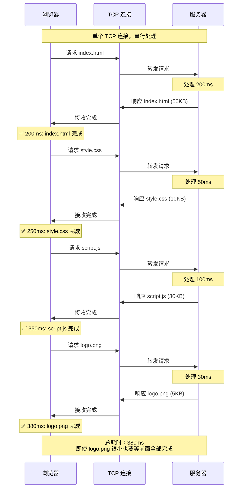
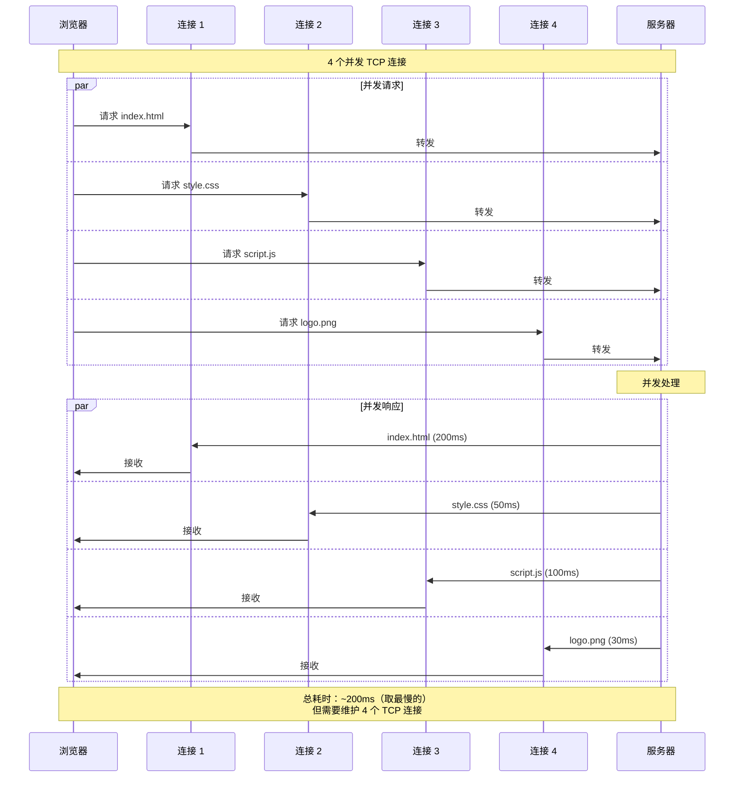
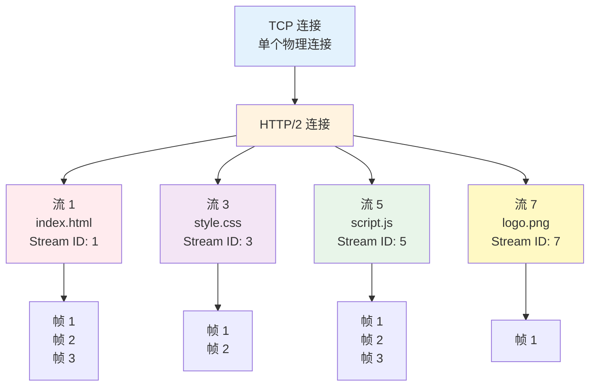
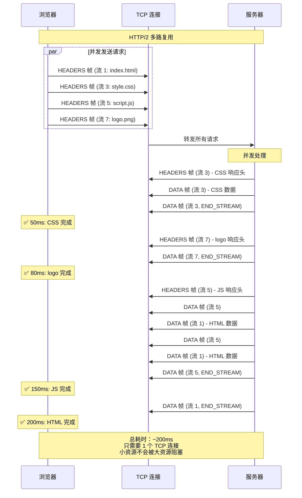
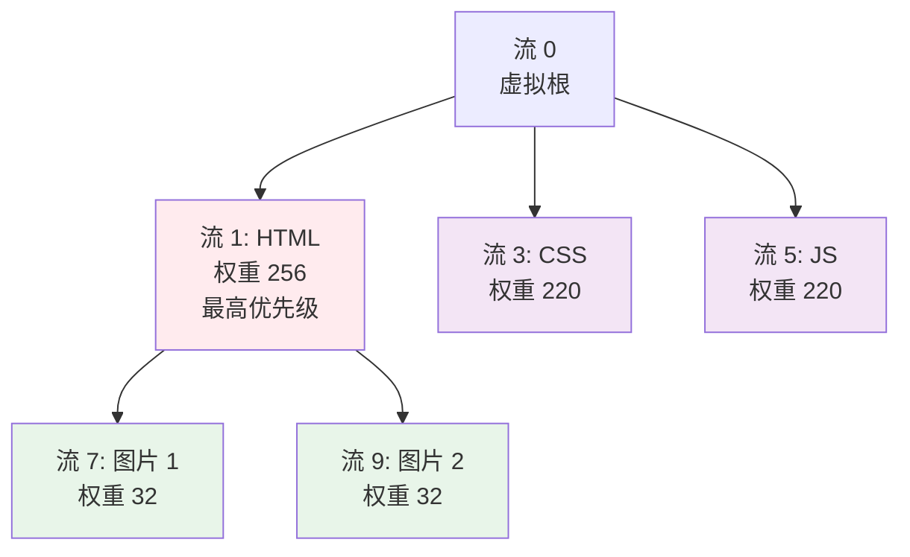
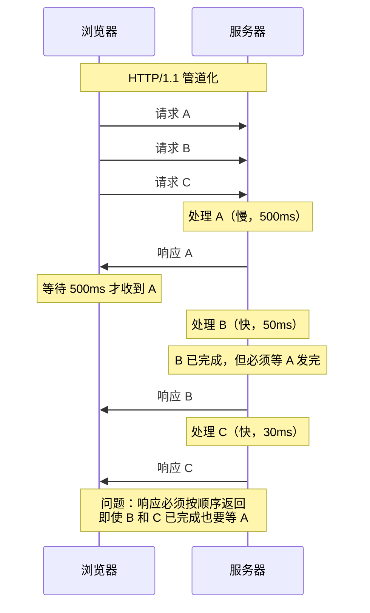
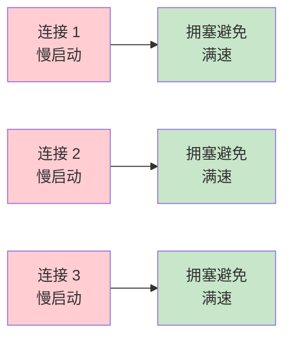
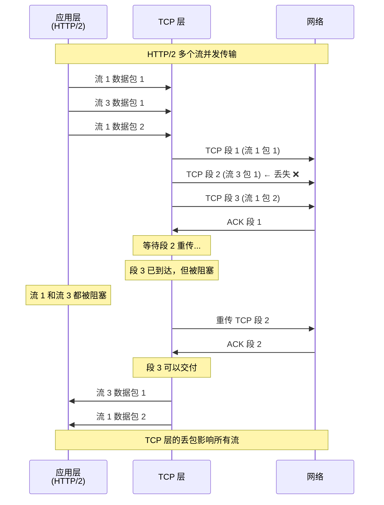
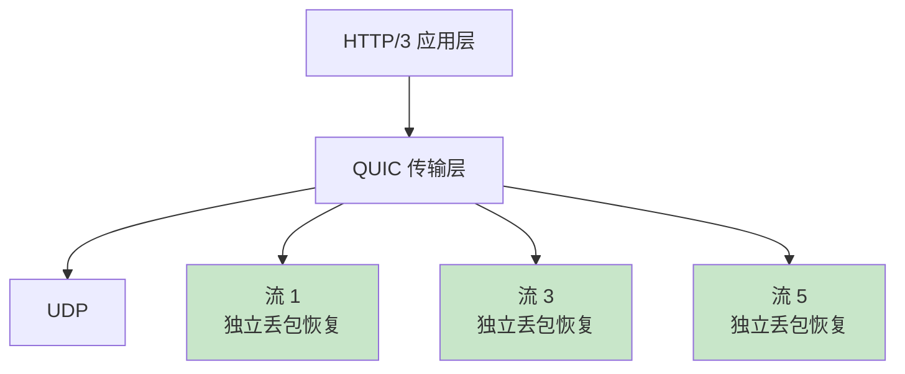

# 杀手级特性：多路复用（Multiplexing）

## 目录
- [HTTP/1.1 的队头阻塞问题](#http11-的队头阻塞问题)
- [HTTP/2 多路复用原理](#http2-多路复用原理)
- [帧交错传输机制](#帧交错传输机制)
- [与 HTTP/1.1 管道化的对比](#与-http11-管道化的对比)
- [多路复用的性能优势](#多路复用的性能优势)
- [实战演示](#实战演示)
- [潜在问题：TCP 层的队头阻塞](#潜在问题tcp-层的队头阻塞)

---

## HTTP/1.1 的队头阻塞问题

### 问题本质

在 HTTP/1.1 中，即使使用持久连接（Keep-Alive），请求和响应也必须**严格按顺序**处理。这就像在银行只有一个窗口，每个客户必须等前面的人完全办完业务才能开始办理。

### 场景演示

假设浏览器需要加载一个网页，包含以下资源：

1. `index.html` (50KB) - 需要 200ms
2. `style.css` (10KB) - 需要 50ms
3. `script.js` (30KB) - 需要 100ms
4. `logo.png` (5KB) - 需要 30ms

#### HTTP/1.1：串行处理



**问题分析：**

- **总耗时**：200 + 50 + 100 + 30 = **380ms**
- **资源浪费**：在等待 `index.html` 时，网络带宽和服务器空闲
- **用户体验差**：关键资源（如 CSS）被阻塞，页面长时间白屏

### HTTP/1.1 的妥协：多连接

为了缓解队头阻塞，浏览器打开多个并发连接（Chrome 允许每域名 6 个）：



**改善效果：**

- **总耗时**：约 **200ms**（取最慢的请求）
- **性能提升**：比串行快 47%（从 380ms 到 200ms）

**但代价是：**

1. **TCP 握手开销**：每个连接需要 100-300ms 建立
2. **慢启动惩罚**：每个新连接都要经历 TCP 慢启动
3. **内存消耗**：每个连接需要独立的缓冲区（约 16KB）
4. **服务器压力**：需要同时管理大量连接状态
5. **拥塞控制**：多个连接竞争带宽，可能导致网络拥塞

**计算示例：**

```
100 个用户，每个用户 6 个连接 = 600 个并发 TCP 连接
每个连接 16KB 缓冲区 = 600 × 16KB = 9.6MB 内存
```

---

## HTTP/2 多路复用原理

### 核心思想

HTTP/2 的多路复用（Multiplexing）允许在**单个 TCP 连接**上**并行传输多个请求和响应**，彻底解决队头阻塞问题。

**关键类比：**

- **HTTP/1.1**：多个单车道收费站，每个车道只能一辆车接一辆车通过
- **HTTP/2**：一条超宽的高速公路，多辆车（帧）可以同时并行行驶，每辆车都标记着自己属于哪个车队（流 ID）

### 工作机制

#### 1. 单连接，多个流



**关键要点：**

- **单个 TCP 连接**：所有资源通过同一个连接传输
- **多个独立的流**：每个请求/响应对是一个独立的流
- **流 ID 标识**：每个帧都携带流 ID，接收方根据 ID 重组消息
- **无阻塞**：流之间完全独立，互不阻塞

#### 2. 帧级别的交错传输

HTTP/2 允许将不同流的帧**交错发送**，而不是等待一个流完全传输完毕再传输下一个：



**观察要点：**

1. **请求并发发送**：四个请求几乎同时发出
2. **响应交错返回**：CSS（流 3）先完成，不需要等待 HTML（流 1）
3. **帧级别交错**：HTML 和 JS 的 DATA 帧交错传输
4. **无队头阻塞**：小资源（logo）不会被大资源（HTML）阻塞

### 帧交错的细节

让我们放大看传输的帧序列：

```
时间轴 →

[HEADERS, 流1] [HEADERS, 流3] [HEADERS, 流5] [HEADERS, 流7]
↓ 请求发送完毕

服务器处理中...

↓ 响应开始

[HEADERS, 流3] [DATA, 流3, 4KB] [DATA, 流3, 6KB, END_STREAM]
[HEADERS, 流7] [DATA, 流7, 5KB, END_STREAM]
[HEADERS, 流5] [DATA, 流5, 10KB]
[HEADERS, 流1] [DATA, 流1, 16KB]
[DATA, 流5, 10KB]
[DATA, 流1, 16KB]
[DATA, 流5, 10KB, END_STREAM]
[DATA, 流1, 18KB, END_STREAM]
```

**关键机制：**

1. **帧头携带流 ID**：每个帧都明确标识自己属于哪个流
2. **接收方重组**：浏览器根据流 ID 将帧重组成完整的消息
3. **发送顺序灵活**：服务器可以根据优先级、处理速度等因素调整发送顺序
4. **无需等待**：不需要等待前一个流完全传输完毕

---

## 帧交错传输机制

### 发送端视角

服务器如何决定发送哪个流的帧？

#### 1. 优先级调度

根据客户端指定的优先级（依赖关系和权重）决定调度顺序：



**调度策略：**

1. **优先发送高权重流**：HTML（256）> CSS/JS（220）> 图片（32）
2. **尊重依赖关系**：先发送 HTML，再发送依赖于 HTML 的图片
3. **同级流按权重分配带宽**：CSS 和 JS 各占 50%

#### 2. 流控窗口

每个流有独立的流控窗口，限制未确认的数据量：

```
流 1 窗口：65535 字节
流 3 窗口：65535 字节
流 5 窗口：32768 字节 (较小，可能是客户端限制)
```

**发送规则：**

- 只有窗口有剩余空间时才能发送 DATA 帧
- 发送后窗口减少，接收方发送 WINDOW_UPDATE 帧增加窗口
- 避免发送方过快，导致接收方缓冲区溢出

#### 3. 公平调度

即使某个流优先级高，也不能完全饿死低优先级流：

**轮询算法示例：**

```
循环 1：流 1 发送 1 帧，流 3 发送 1 帧，流 5 发送 1 帧
循环 2：流 1 发送 1 帧，流 3 发送 1 帧，流 5 发送 1 帧
...
```

**权重调度算法示例：**

```
流 1 (权重 256)：发送 8 帧
流 3 (权重 128)：发送 4 帧
流 5 (权重 64)：发送 2 帧
流 7 (权重 32)：发送 1 帧
```

### 接收端视角

浏览器如何处理交错到达的帧？

#### 1. 按流 ID 分组

浏览器维护一个映射表：

```
流 ID → 流状态
  1 → { state: open, headers: [...], data_buffer: [...] }
  3 → { state: half_closed_remote, headers: [...], data_buffer: [...] }
  5 → { state: open, headers: [...], data_buffer: [...] }
  7 → { state: closed, headers: [...], data_buffer: [...] }
```

#### 2. 帧接收处理

```python
def on_frame_received(frame):
    stream_id = frame.stream_id
    stream = streams[stream_id]

    if frame.type == HEADERS:
        stream.headers.append(frame.payload)
        if frame.flags & END_HEADERS:
            stream.process_headers()

    elif frame.type == DATA:
        stream.data_buffer.append(frame.payload)
        if frame.flags & END_STREAM:
            stream.complete()
            deliver_to_application(stream)

    elif frame.type == RST_STREAM:
        stream.abort(frame.error_code)
```

#### 3. 消息重组

当收到 END_STREAM 标志时，将所有帧重组成完整的 HTTP 响应：

```
流 3 完整响应：
  HEADERS 帧 → :status: 200, content-type: text/css
  DATA 帧 1 → 4096 字节
  DATA 帧 2 → 6144 字节 (END_STREAM)

  重组后：
    HTTP/2 200
    content-type: text/css

    [10240 字节的 CSS 内容]
```

---

## 与 HTTP/1.1 管道化的对比

### HTTP/1.1 管道化（Pipelining）

HTTP/1.1 引入了管道化，允许在同一连接上连续发送多个请求，而不等待响应：



**管道化的致命缺陷：**

1. **响应顺序固定**：必须按请求顺序返回响应，无法乱序
2. **队头阻塞依然存在**：慢响应阻塞所有后续响应
3. **中间代理不兼容**：很多代理服务器不正确处理管道化
4. **重试困难**：连接中断时，难以确定哪些请求已处理
5. **幂等性要求**：只能管道化幂等请求（GET、HEAD），POST 不行

**结果：主流浏览器默认禁用管道化。**

### HTTP/2 多路复用 vs 管道化

| 特性 | HTTP/1.1 管道化 | HTTP/2 多路复用 |
|------|----------------|----------------|
| **请求发送** | 可连续发送 | 可并发发送 |
| **响应顺序** | 必须按序 | 可乱序 |
| **队头阻塞** | 存在 | 不存在 |
| **流独立性** | 无 | 有（独立的流 ID） |
| **优先级** | 无 | 有（依赖和权重） |
| **流控** | TCP 层 | 应用层 + TCP 层 |
| **中断恢复** | 困难 | 容易（只影响单个流） |
| **浏览器支持** | 默认禁用 | 全面支持 |

**核心区别：**

- **管道化**：虽然可以连续发送请求，但响应仍然是串行的
- **多路复用**：请求和响应都是并行的，通过流 ID 区分

### 直观对比

**HTTP/1.1 管道化（失败的尝试）：**

```
请求：   [A] [B] [C] [D]  ← 连续发送
        ↓   ↓   ↓   ↓
响应：   [A......] [B] [C] [D]  ← 必须按序返回，A 慢则全慢
```

**HTTP/2 多路复用（成功的解决方案）：**

```
请求：   [A] [B] [C] [D]  ← 并发发送
        ↓   ↓   ↓   ↓
响应：   [B] [C] [D] [A......] ← 可乱序返回，谁快谁先到
```

---

## 多路复用的性能优势

### 1. 消除队头阻塞

**HTTP/1.1：**

```
总耗时 = 请求1耗时 + 请求2耗时 + ... + 请求N耗时
```

**HTTP/2：**

```
总耗时 = max(请求1耗时, 请求2耗时, ..., 请求N耗时)
```

**示例计算：**

假设加载 20 个资源，平均每个 100ms：

```
HTTP/1.1（单连接）：20 × 100ms = 2000ms
HTTP/1.1（6 连接）：  20 ÷ 6 × 100ms ≈ 334ms
HTTP/2（单连接）：    max(100ms) = 100ms
```

**性能提升：**
- 比 HTTP/1.1 单连接快 **95%**（从 2000ms 到 100ms）
- 比 HTTP/1.1 六连接快 **70%**（从 334ms 到 100ms）

### 2. 减少 TCP 连接开销

**TCP 连接建立成本：**

```
TCP 三次握手：      50-100ms
TLS 握手：         100-300ms
TCP 慢启动：       3-5 个 RTT
总开销：           200-500ms
```

**HTTP/1.1：**

```
6 个连接 × 300ms = 1800ms 的建立开销
```

**HTTP/2：**

```
1 个连接 × 300ms = 300ms 的建立开销
节省：1500ms (83%)
```

### 3. 提高带宽利用率

**TCP 慢启动影响：**

HTTP/1.1 的多连接模型中，每个连接都要经历慢启动：



**HTTP/2 单连接：**


**带宽利用率：**

- **HTTP/1.1**：多个连接竞争带宽，效率 60-70%
- **HTTP/2**：单连接充分利用，效率 85-95%

### 4. 降低服务器资源消耗

**连接状态内存占用：**

```
HTTP/1.1：
  1000 用户 × 6 连接 × 32KB 缓冲区 = 192 MB

HTTP/2：
  1000 用户 × 1 连接 × 32KB 缓冲区 = 32 MB

节省：160 MB (83%)
```

**CPU 开销：**

```
HTTP/1.1：
  管理 6000 个 TCP 连接的状态、超时、心跳

HTTP/2：
  管理 1000 个 TCP 连接的状态、超时、心跳

CPU 使用率降低：约 70%
```

### 5. 实际测试数据

Google 在部署 HTTP/2 后的性能改善：

| 指标 | HTTP/1.1 | HTTP/2 | 改善 |
|------|----------|--------|------|
| **页面加载时间** | 1200ms | 650ms | **45.8%** |
| **首次渲染时间** | 800ms | 400ms | **50%** |
| **TCP 连接数** | 60 | 10 | **83%** |
| **服务器 CPU** | 100% | 35% | **65%** |
| **内存占用** | 2.4GB | 800MB | **66.7%** |

---

## 实战演示

### 1. 使用 Chrome DevTools 观察多路复用

**步骤：**

1. 打开 Chrome DevTools（F12）
2. 切换到 **Network** 面板
3. 访问支持 HTTP/2 的网站（如 https://www.cloudflare.com）
4. 观察 **Protocol** 列，显示 `h2`
5. 查看 **Waterfall** 瀑布图

**HTTP/1.1 瀑布图（多连接）：**

```
资源          开始时间  耗时
index.html    0ms      [████████] 200ms
style.css     0ms      [████████] 150ms
script.js     0ms      [████████████] 250ms
logo.png      0ms      [████] 100ms
banner.jpg    200ms    [████████] 150ms  ← 等待连接可用
icon.svg      200ms    [████] 80ms       ← 等待连接可用
```

**HTTP/2 瀑布图（单连接）：**

```
资源          开始时间  耗时
index.html    0ms      [████████] 200ms
style.css     0ms      [████████] 150ms
script.js     0ms      [████████████] 250ms
logo.png      0ms      [████] 100ms
banner.jpg    0ms      [████████] 150ms  ← 立即开始，无等待
icon.svg      0ms      [████] 80ms       ← 立即开始，无等待
```

**观察要点：**

- **连接 ID**：所有请求使用同一个连接 ID
- **开始时间**：所有请求几乎同时开始（0-5ms 内）
- **无等待**：没有"等待连接可用"的浅色等待条
- **交错完成**：小资源先完成，大资源后完成

### 2. 使用 curl 对比性能

**HTTP/1.1（6 个连接）：**

```bash
# 使用 Apache Bench 测试
ab -n 100 -c 6 https://example.com/

# 结果
Requests per second:    15.23 [#/sec]
Time per request:       394.2 [ms]
```

**HTTP/2（单连接）：**

```bash
# 使用 h2load 测试
h2load -n 100 -c 1 https://example.com/

# 结果
Requests per second:    28.47 [#/sec]
Time per request:       35.1 [ms]
```

**性能提升：**
- 吞吐量提升 **87%**（从 15.23 到 28.47 req/s）
- 延迟降低 **91%**（从 394.2ms 到 35.1ms）

### 3. 使用 nghttp2 观察帧交错

```bash
nghttp -nv https://www.google.com
```

**输出示例（简化）：**

```
[  0.123] send HEADERS frame <stream_id=1>  ← 请求 /
          :method: GET
          :path: /

[  0.125] send HEADERS frame <stream_id=3>  ← 请求 /style.css
          :method: GET
          :path: /style.css

[  0.127] send HEADERS frame <stream_id=5>  ← 请求 /script.js
          :method: GET
          :path: /script.js

# 响应交错返回
[  0.234] recv HEADERS frame <stream_id=3>  ← CSS 响应先到
          :status: 200
[  0.236] recv DATA frame <stream_id=3, len=8192>
[  0.238] recv DATA frame <stream_id=3, len=2048, END_STREAM>

[  0.245] recv HEADERS frame <stream_id=1>  ← HTML 响应
          :status: 200
[  0.247] recv DATA frame <stream_id=1, len=16384>

[  0.250] recv HEADERS frame <stream_id=5>  ← JS 响应
          :status: 200
[  0.252] recv DATA frame <stream_id=5, len=16384>

[  0.255] recv DATA frame <stream_id=1, len=16384>  ← HTML 和 JS 交错
[  0.257] recv DATA frame <stream_id=5, len=8192>
[  0.259] recv DATA frame <stream_id=1, len=5432, END_STREAM>
[  0.261] recv DATA frame <stream_id=5, len=4096, END_STREAM>
```

**观察要点：**

- 三个流（1, 3, 5）并发发送请求
- 响应帧交错到达：流 3 → 流 1 → 流 5 → 流 1 → 流 5 ...
- 每个帧都明确标识流 ID
- 小资源（CSS）先完成，无需等待大资源（HTML）

---

## 潜在问题：TCP 层的队头阻塞

### HTTP/2 的局限

虽然 HTTP/2 在应用层解决了队头阻塞，但 TCP 层的队头阻塞依然存在：



**问题分析：**

1. **TCP 保证顺序**：TCP 必须按序交付数据
2. **单包丢失影响全局**：一个 TCP 段丢失，后续所有段都被阻塞
3. **流间相互影响**：虽然是独立的流，但共享同一个 TCP 连接

### 弱网环境的影响

在高丢包率的网络（如移动网络）中，这个问题尤为明显：

**丢包率 2% 的影响：**

```
HTTP/1.1（6 连接）：
  每个连接独立，丢包只影响该连接
  平均阻塞：1/6 = 16.7% 的请求

HTTP/2（单连接）：
  所有流共享连接，丢包影响全部
  平均阻塞：100% 的请求
```

**性能退化：**

在高丢包率网络中，HTTP/2 的性能可能不如 HTTP/1.1。

### 解决方案：HTTP/3

HTTP/3 使用 QUIC 协议替代 TCP，从根本上解决这个问题：



**QUIC 的优势：**

- **流级别的可靠性**：每个流独立管理丢包和重传
- **无队头阻塞**：一个流的丢包不影响其他流
- **更快的连接建立**：0-RTT 连接恢复
- **更好的移动网络性能**：网络切换时无需重建连接

---

## 总结：多路复用的威力

### 核心成就

HTTP/2 的多路复用彻底改变了 Web 性能格局：

1. **消除应用层队头阻塞**：小资源不再被大资源阻塞
2. **单连接高效复用**：减少 80-90% 的 TCP 连接数
3. **降低延迟**：页面加载时间减少 25-50%
4. **提高吞吐量**：带宽利用率提升 15-25%
5. **减少服务器负载**：CPU 和内存使用减少 60-70%

### 关键设计

| 设计要素 | 作用 |
|---------|------|
| **二进制分帧** | 高效解析和交错传输的基础 |
| **流 ID 标识** | 区分不同请求/响应，实现多路复用 |
| **帧级别交错** | 允许灵活调度，消除队头阻塞 |
| **流优先级** | 优先传输关键资源 |
| **流控机制** | 防止发送方过快，保护接收方 |

### 实践建议

**适合 HTTP/2 的场景：**

- ✅ 资源数量多（>20 个）
- ✅ 资源大小不一
- ✅ 需要快速首屏渲染
- ✅ 稳定的网络环境（低丢包率）

**HTTP/2 的局限：**

- ⚠️ TCP 层队头阻塞依然存在
- ⚠️ 高丢包率网络可能性能退化
- ⚠️ 单连接故障影响全部请求

**未来演进：HTTP/3**

HTTP/3 基于 QUIC，彻底解决 TCP 层队头阻塞，是多路复用的终极形态。

---

## 下一步

现在我们理解了多路复用的威力，接下来将探讨：

1. **HPACK 头部压缩**：如何将重复的头部压缩到极致
2. **服务器推送**：如何主动推送资源，减少往返时间
3. **流控与优先级**：如何精细控制资源传输

让我们继续深入 HTTP/2 的核心技术！

---

## 参考资料

- RFC 9113: HTTP/2 (Section 5 - Streams and Multiplexing)
- RFC 9113: HTTP/2 (Section 5.1 - Stream States)
- RFC 9113: HTTP/2 (Section 5.3 - Stream Priority)
