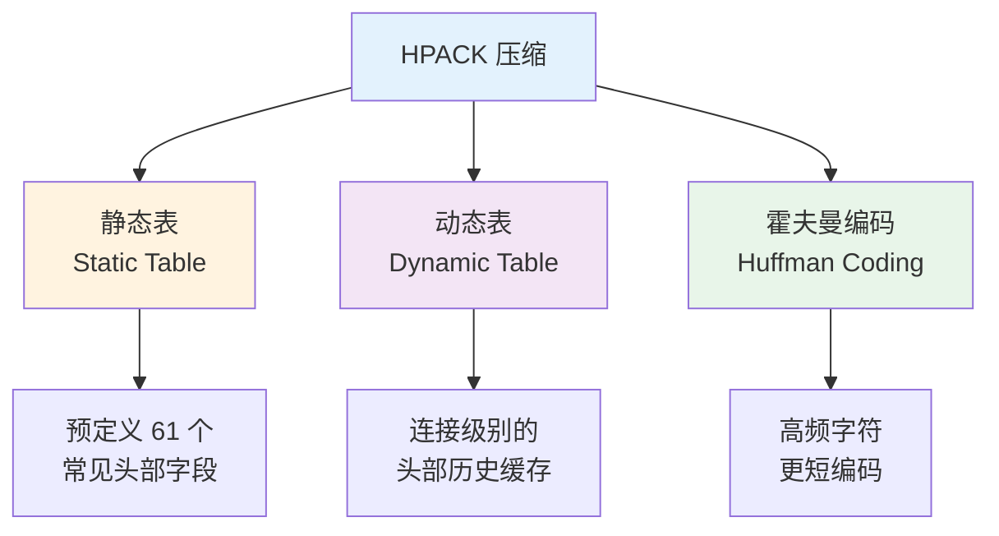
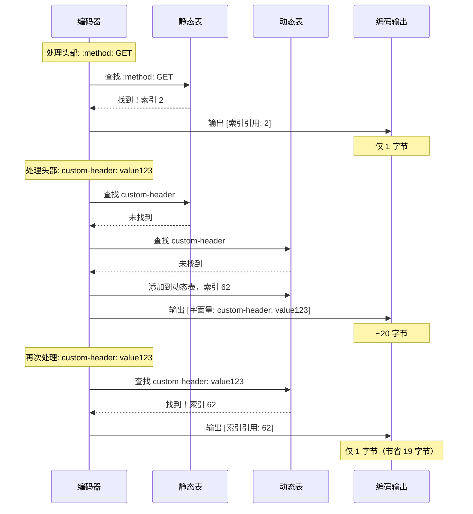
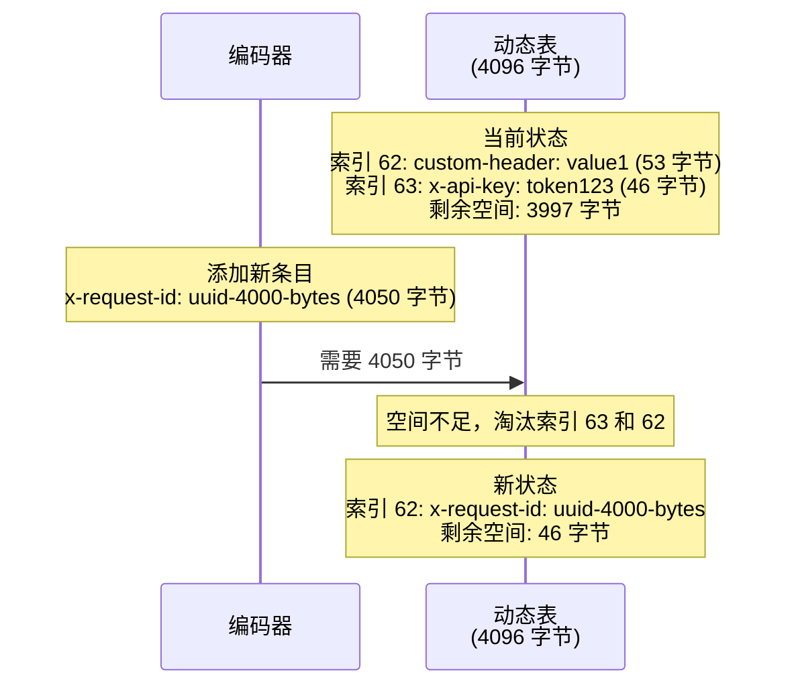

# 性能的极致优化：头部压缩（HPACK）

## 目录
- [头部冗余问题](#头部冗余问题)
- [为什么不用 Gzip 压缩头部？](#为什么不用-gzip-压缩头部)
- [HPACK 核心原理](#hpack-核心原理)
- [静态表（Static Table）](#静态表static-table)
- [动态表（Dynamic Table）](#动态表dynamic-table)
- [霍夫曼编码（Huffman Coding）](#霍夫曼编码huffman-coding)
- [HPACK 编码示例](#hpack-编码示例)
- [实战演示](#实战演示)
- [安全性考量：CRIME 攻击防护](#安全性考量crime-攻击防护)

---

## 头部冗余问题

### HTTP/1.1 的头部开销

在 HTTP/1.1 中，每个请求都必须携带完整的头部信息。对于访问同一网站的多个请求，这些头部高度重复。

**典型的请求头部：**

```http
GET /api/users HTTP/1.1
Host: api.example.com
User-Agent: Mozilla/5.0 (Macintosh; Intel Mac OS X 10_15_7) AppleWebKit/537.36 (KHTML, like Gecko) Chrome/118.0.0.0 Safari/537.36
Accept: application/json,text/html,application/xhtml+xml,application/xml;q=0.9,image/avif,image/webp,*/*;q=0.8
Accept-Language: zh-CN,zh;q=0.9,en;q=0.8
Accept-Encoding: gzip, deflate, br
Cookie: session_id=abc123def456ghi789jkl012; user_pref=dark_mode; analytics_id=xyz789uvw456rst123; tracking_consent=accepted
Referer: https://example.com/dashboard
Connection: keep-alive
Cache-Control: no-cache
Pragma: no-cache
DNT: 1
Sec-Fetch-Dest: empty
Sec-Fetch-Mode: cors
Sec-Fetch-Site: same-origin
```

**字节统计：**

```
Host: 23 字节
User-Agent: 144 字节
Accept: 98 字节
Accept-Language: 28 字节
Accept-Encoding: 25 字节
Cookie: 127 字节
Referer: 38 字节
其他头部: ~80 字节
---------------------------
总计: ~563 字节
```

### 冗余的严重性

**场景：加载一个现代网页**

```
资源数量: 100 个（HTML、CSS、JS、图片、字体等）
平均头部大小: 500 字节
总头部开销: 100 × 500 = 50,000 字节 = 约 50KB
```

**不同网络条件下的影响：**

| 网络类型 | 带宽 | 传输 50KB 头部耗时 |
|---------|------|--------------------|
| **3G** | 1 Mbps (125 KB/s) | 400ms |
| **4G** | 10 Mbps (1.25 MB/s) | 40ms |
| **Wi-Fi** | 100 Mbps (12.5 MB/s) | 4ms |

**问题分析：**

1. **带宽浪费**：在 3G 网络上，仅头部就浪费 400ms
2. **高度重复**：90% 的头部内容在每次请求中都相同
3. **无法避免**：即使启用 HTTP/1.1 的 Gzip 压缩，也只压缩响应体，不压缩头部
4. **移动网络敏感**：在低带宽、高延迟的移动网络上尤为明显

### 头部重复示例

**连续 3 个请求的头部对比：**

```
请求 1: GET /index.html
  Host: example.com
  User-Agent: Mozilla/5.0 ...
  Accept: text/html ...
  Cookie: session_id=abc123 ...
  (500 字节)

请求 2: GET /style.css
  Host: example.com              ← 重复
  User-Agent: Mozilla/5.0 ...    ← 重复
  Accept: text/css ...           ← 变化
  Cookie: session_id=abc123 ...  ← 重复
  (480 字节)

请求 3: GET /script.js
  Host: example.com              ← 重复
  User-Agent: Mozilla/5.0 ...    ← 重复
  Accept: application/javascript ← 变化
  Cookie: session_id=abc123 ...  ← 重复
  (490 字节)

重复的头部: ~400 字节 × 3 = 1200 字节
实际需要传输的新信息: ~70 字节 × 3 = 210 字节

冗余率: (1200 - 210) / 1200 = 82.5%
```

---

## 为什么不用 Gzip 压缩头部？

### HTTP/1.1 的局限

在 HTTP/1.1 中，可以使用 Gzip 压缩响应体，但**无法压缩头部**：

```http
GET /api/data HTTP/1.1
Host: api.example.com
Accept-Encoding: gzip  ← 请求启用 Gzip

HTTP/1.1 200 OK
Content-Encoding: gzip
Content-Length: 1234

[Gzip 压缩的响应体]  ← 只有响应体被压缩
```

**为什么不压缩头部？**

1. **协议设计**：HTTP/1.1 是文本协议，头部需要人类可读
2. **中间代理**：代理需要读取和修改头部（如 `Via`、`X-Forwarded-For`）
3. **解析简单**：文本头部便于调试和诊断

### SPDY 的尝试：Gzip 压缩头部

Google 的 SPDY 协议尝试使用 Gzip 压缩头部，但遭遇了严重的安全问题。

### CRIME 攻击（2012 年）

**CRIME（Compression Ratio Info-leak Made Easy）**攻击利用了压缩算法的特性来窃取敏感信息。

#### 攻击原理

**Gzip 压缩的特性：**

Gzip 会查找重复的字节序列并用引用替代。如果两段文本相同，压缩后的大小会更小。

**示例：**

```
未压缩:
  Cookie: secret=abc123; guess=abc123
  (39 字节)

Gzip 压缩:
  发现 "abc123" 重复，使用引用
  (约 25 字节) ← 压缩效果好

未压缩:
  Cookie: secret=abc123; guess=xyz789
  (39 字节)

Gzip 压缩:
  没有重复，压缩效果差
  (约 35 字节) ← 压缩效果差
```

**攻击步骤：**

1. 攻击者控制部分请求内容（如注入 JavaScript）
2. 反复尝试不同的猜测值
3. 观察压缩后的大小
4. 压缩率越高，说明猜测越接近真实值
5. 逐字节暴力破解敏感信息（如 Cookie、Token）

**CRIME 攻击演示：**

```mermaid
sequenceDiagram
    participant Attacker as 攻击者
    participant Browser as 受害者浏览器
    participant Server as 服务器

    Note over Attacker,Server: 目标：窃取 Cookie: secret=abc123

    Attacker->>Browser: 注入 JavaScript<br/>Cookie: secret=abc123; guess=a00000
    Browser->>Server: 发送请求（Gzip 压缩）
    Note over Attacker: 观察压缩后大小: 450 字节

    Attacker->>Browser: Cookie: secret=abc123; guess=b00000
    Browser->>Server: 发送请求（Gzip 压缩）
    Note over Attacker: 观察压缩后大小: 450 字节

    Attacker->>Browser: Cookie: secret=abc123; guess=ab0000
    Browser->>Server: 发送请求（Gzip 压缩）
    Note over Attacker: 观察压缩后大小: 448 字节 ← 更小！

    Note over Attacker: 第一个字符是 'a'，第二个是 'b'<br/>继续暴力破解...

    Attacker->>Browser: Cookie: secret=abc123; guess=abc123
    Browser->>Server: 发送请求（Gzip 压缩）
    Note over Attacker: 观察压缩后大小: 420 字节 ← 最小！

    Note over Attacker: ✅ 成功窃取: secret=abc123
```

**攻击效率：**

```
猜测空间: 62^6 ≈ 57 亿（假设 6 位字母数字）
通过压缩率线索: 62 × 6 = 372 次请求

提速: 57,000,000,000 ÷ 372 ≈ 1.5 亿倍
```

### HPACK 的诞生

为了解决 CRIME 攻击，HTTP/2 设计了专门的头部压缩算法 **HPACK（RFC 7541）**，核心特性：

1. **无跨请求压缩**：不会在不同请求间查找重复内容
2. **静态表**：预定义常见头部字段，避免重复传输
3. **动态表**：维护连接级别的头部历史，只压缩同一连接内的重复
4. **可控的压缩**：敏感头部可以标记为"不压缩"

---

## HPACK 核心原理

### 三大支柱

HPACK 的压缩策略基于三种机制：



### 工作流程



---

## 静态表（Static Table）

### 定义

**静态表**是 HPACK 规范预定义的一组常见头部字段和值的映射表，包含 **61 个条目**。客户端和服务器都内置这个表，无需传输。

### 为什么需要静态表？

HTTP 请求和响应中，某些头部字段极其常见：

- `:method: GET` - 几乎所有请求都使用
- `:status: 200` - 大部分响应的状态码
- `content-type: application/json` - API 响应的常见类型

如果每次都完整传输这些字段，会造成巨大浪费。静态表允许用**一个索引号**（1-2 字节）替代完整的字段名和值（可能几十字节）。

### 静态表内容（部分）

RFC 7541 定义的静态表（前 20 项）：

| 索引 | 头部名称 | 头部值 | 字节节省 |
|------|----------|--------|----------|
| 1 | `:authority` | - | ~11 字节 |
| 2 | `:method` | GET | ~12 字节 |
| 3 | `:method` | POST | ~13 字节 |
| 4 | `:path` | / | ~7 字节 |
| 5 | `:path` | /index.html | ~17 字节 |
| 6 | `:scheme` | http | ~12 字节 |
| 7 | `:scheme` | https | ~13 字节 |
| 8 | `:status` | 200 | ~11 字节 |
| 9 | `:status` | 204 | ~11 字节 |
| 10 | `:status` | 206 | ~11 字节 |
| 11 | `:status` | 304 | ~11 字节 |
| 12 | `:status` | 400 | ~11 字节 |
| 13 | `:status` | 404 | ~11 字节 |
| 14 | `:status` | 500 | ~11 字节 |
| 15 | `accept-charset` | - | ~14 字节 |
| 16 | `accept-encoding` | gzip, deflate | ~28 字节 |
| 17 | `accept-language` | - | ~15 字节 |
| 18 | `accept-ranges` | - | ~13 字节 |
| 19 | `accept` | - | ~6 字节 |
| 20 | `access-control-allow-origin` | - | ~28 字节 |

**完整的 61 项静态表**请参考 RFC 7541 Appendix A。

### 使用示例

**未压缩的请求头部：**

```http
:method: GET
:scheme: https
:path: /
:authority: www.example.com
```

**使用静态表压缩：**

```
:method: GET        → 索引 2  (1 字节)
:scheme: https      → 索引 7  (1 字节)
:path: /            → 索引 4  (1 字节)
:authority: www.example.com → 索引 1 + 字面量值 (约 20 字节)

总计: 约 23 字节
原始大小: 约 70 字节
压缩率: 67%
```

### 索引编码方式

HPACK 使用变长整数编码索引，以节省空间：

**编码规则：**

```
索引 1-127:   1 字节
索引 128-383: 2 字节
索引 384+:    3+ 字节
```

**二进制表示：**

```
索引 2 (:method: GET):
  0b10000010 = 0x82

索引 62 (动态表第一项):
  0b10111110 = 0xBE
```

---

## 动态表（Dynamic Table）

### 定义

**动态表**是连接级别的头部字段缓存，用于存储在当前连接中出现过的头部字段。它像一个"记忆"，记住了之前传输过的头部，后续可以用索引引用。

**关键特性：**

1. **连接作用域**：每个 HTTP/2 连接有独立的动态表
2. **先进先出（FIFO）**：表满后，最早的条目会被淘汰
3. **可配置大小**：通过 SETTINGS_HEADER_TABLE_SIZE 参数配置（默认 4096 字节）
4. **双向同步**：编码器和解码器必须保持动态表一致

### 工作原理

#### 添加条目

当编码器发送一个新的头部字段时：

1. 将该字段添加到动态表
2. 分配一个索引号（从 62 开始，因为 1-61 是静态表）
3. 占用动态表的存储空间

**存储空间计算：**

```
条目大小 = 32 + 名称字节长度 + 值字节长度
```

其中 32 字节是 HPACK 规范规定的开销（用于簿记）。

**示例：**

```
添加 custom-header: value123

条目大小 = 32 + len("custom-header") + len("value123")
         = 32 + 13 + 8
         = 53 字节

动态表剩余空间 = 4096 - 53 = 4043 字节
```

#### 索引分配

动态表的索引从 **62** 开始（静态表占用 1-61）：

```
静态表：索引 1-61
动态表：索引 62, 63, 64, ...
```

**注意：** 动态表采用逆序索引，最新添加的条目索引最小（62）。

#### 表满时的淘汰策略

当动态表空间不足时，按照 FIFO 顺序淘汰最早的条目：



### 动态表示例

**场景：连续 3 个请求到同一 API**

#### 请求 1

```http
:method: GET
:scheme: https
:path: /api/users
:authority: api.example.com
authorization: Bearer token123
x-api-version: v2
```

**编码过程：**

```
:method: GET           → 静态表索引 2
:scheme: https         → 静态表索引 7
:path: /api/users      → 静态表索引 4（名称）+ 字面量值
:authority: api.example.com → 静态表索引 1 + 字面量值
authorization: Bearer token123 → 字面量（添加到动态表，索引 62）
x-api-version: v2      → 字面量（添加到动态表，索引 63）

动态表状态：
  索引 62: authorization: Bearer token123 (60 字节)
  索引 63: x-api-version: v2 (49 字节)
```

#### 请求 2

```http
:method: GET
:scheme: https
:path: /api/posts
:authority: api.example.com
authorization: Bearer token123  ← 重复
x-api-version: v2              ← 重复
```

**编码过程：**

```
:method: GET           → 静态表索引 2
:scheme: https         → 静态表索引 7
:path: /api/posts      → 静态表索引 4 + 字面量值
:authority: api.example.com → 静态表索引 1 + 字面量值
authorization: Bearer token123 → 动态表索引 62 (仅 1 字节！)
x-api-version: v2      → 动态表索引 63 (仅 1 字节！)

节省：约 60 + 15 = 75 字节
```

#### 请求 3

```http
:method: POST
:scheme: https
:path: /api/posts
:authority: api.example.com
authorization: Bearer token123  ← 重复
x-api-version: v2              ← 重复
content-type: application/json
content-length: 123
```

**编码过程：**

```
:method: POST          → 静态表索引 3
:scheme: https         → 静态表索引 7
:path: /api/posts      → 动态表索引 64（假设已添加）
:authority: api.example.com → 静态表索引 1 + 字面量值
authorization: Bearer token123 → 动态表索引 62
x-api-version: v2      → 动态表索引 63
content-type: application/json → 静态表索引 31 + 字面量值
content-length: 123    → 静态表索引 28 + 字面量值

节省：显著减少重复头部的传输
```

### 动态表的优势

**压缩效果对比：**

| 请求 | 未压缩大小 | 使用静态表 | 使用动态表 | 压缩率 |
|------|----------|----------|----------|--------|
| 请求 1 | 320 字节 | 180 字节 | 180 字节 | 43.8% |
| 请求 2 | 315 字节 | 175 字节 | 100 字节 | **68.3%** |
| 请求 3 | 380 字节 | 220 字节 | 120 字节 | **68.4%** |

**关键观察：**

- **首次请求**：主要依赖静态表，压缩率 ~44%
- **后续请求**：动态表发挥作用，压缩率提升到 ~68%
- **连接越久，效果越好**：动态表积累更多常用头部

---

## 霍夫曼编码（Huffman Coding）

### 原理

**霍夫曼编码**是一种无损数据压缩算法，核心思想是：

> 高频字符使用更短的编码，低频字符使用更长的编码

**类比：**

摩尔斯电码就是霍夫曼编码的一个应用：
- 字母 'E'（最常见）: `.` (1 个单位)
- 字母 'T'（常见）: `-` (1 个单位)
- 字母 'Q'（罕见）: `--.-` (4 个单位)

### HPACK 的霍夫曼表

HPACK 定义了一个固定的霍夫曼编码表（RFC 7541 Appendix B），基于大量 HTTP 流量分析得出。

**部分编码表：**

| 字符 | 频率 | 霍夫曼编码 | 位长度 |
|------|------|----------|--------|
| 'e' | 高 | `00000` | 5 位 |
| 't' | 高 | `00001` | 5 位 |
| 'a' | 高 | `00010` | 5 位 |
| ' ' (空格) | 高 | `00011` | 5 位 |
| 'z' | 低 | `11111111111000` | 14 位 |
| 'q' | 低 | `11111111111001` | 14 位 |

**压缩示例：**

```
原始文本: "get"
ASCII 编码: 'g' (0x67) + 'e' (0x65) + 't' (0x74) = 24 位

霍夫曼编码:
  'g': 0b0001010 (7 位)
  'e': 0b00000 (5 位)
  't': 0b00001 (5 位)
  总计: 17 位

压缩率: (24 - 17) / 24 = 29.2%
```

### 霍夫曼编码的优势

**对比三种编码方式：**

| 文本 | ASCII (字节) | 霍夫曼编码 (位) | 节省 |
|------|-------------|---------------|------|
| "get" | 3 字节 (24 位) | 17 位 | 29.2% |
| "mozilla" | 7 字节 (56 位) | 39 位 | 30.4% |
| "example.com" | 11 字节 (88 位) | 65 位 | 26.1% |
| "application/json" | 16 字节 (128 位) | 94 位 | 26.6% |

**平均压缩率：约 25-30%**

### 编码和解码过程

#### 编码

```python
def huffman_encode(text):
    bits = []
    for char in text:
        code = huffman_table[char]  # 查表
        bits.extend(code)

    # 填充到字节边界
    while len(bits) % 8 != 0:
        bits.append(1)  # 填充位全为 1

    return bits_to_bytes(bits)
```

**示例：**

```
编码 "get"
  'g' → 0b0001010
  'e' → 0b00000
  't' → 0b00001

拼接: 0b0001010 00000 00001
补齐: 0b0001010 00000 00001 111 (补 3 位)

字节表示: 0b00010100 0b00000000 0b11111111
           0x14       0x00       0xFF
```

#### 解码

```python
def huffman_decode(bytes):
    bits = bytes_to_bits(bytes)
    text = []
    current = root  # 霍夫曼树的根节点

    for bit in bits:
        if bit == 0:
            current = current.left
        else:
            current = current.right

        if current.is_leaf():
            text.append(current.char)
            current = root  # 回到根节点

    return ''.join(text)
```

### 为什么要用霍夫曼编码？

**原因 1：进一步压缩字面量**

即使使用静态表和动态表，仍有部分头部值无法用索引表示（如自定义值），需要按字面量传输。霍夫曼编码可以进一步压缩这些字面量。

**原因 2：累积效果**

```
100 个请求 × 30% 霍夫曼压缩 × 平均 100 字节字面量
= 3000 字节节省 = 约 3KB
```

**原因 3：对抗敏感信息泄露**

霍夫曼编码的输出是不可预测的，增加了攻击者分析的难度（相比 Gzip 的字典压缩）。

---

## HPACK 编码示例

### 完整示例：编码一个请求

**原始请求头部：**

```http
:method: GET
:scheme: https
:path: /api/users/123
:authority: api.example.com
authorization: Bearer abc123token
x-request-id: uuid-1234-5678
accept: application/json
```

### 编码步骤

#### 步骤 1：查找静态表

```
:method: GET        → 静态表索引 2
:scheme: https      → 静态表索引 7
:path: /api/users/123 → 静态表索引 4（名称）+ 字面量值
:authority: api.example.com → 静态表索引 1 + 字面量值
```

#### 步骤 2：处理自定义头部

```
authorization: Bearer abc123token
  → 查静态表: 未找到完整条目
  → 查动态表: 未找到
  → 编码为字面量，并添加到动态表（索引 62）

x-request-id: uuid-1234-5678
  → 查静态表: 未找到
  → 查动态表: 未找到
  → 编码为字面量，并添加到动态表（索引 63）

accept: application/json
  → 静态表索引 19（名称）+ 字面量值
```

#### 步骤 3：应用霍夫曼编码

对字面量值应用霍夫曼编码：

```
"/api/users/123" (ASCII: 15 字节 = 120 位)
  → 霍夫曼编码: 约 88 位 (11 字节)
  → 节省: 4 字节

"api.example.com" (ASCII: 15 字节 = 120 位)
  → 霍夫曼编码: 约 90 位 (12 字节)
  → 节省: 3 字节

"Bearer abc123token" (ASCII: 19 字节 = 152 位)
  → 霍夫曼编码: 约 110 位 (14 字节)
  → 节省: 5 字节

"uuid-1234-5678" (ASCII: 14 字节 = 112 位)
  → 霍夫曼编码: 约 85 位 (11 字节)
  → 节省: 3 字节

"application/json" (ASCII: 16 字节 = 128 位)
  → 霍夫曼编码: 约 94 位 (12 字节)
  → 节省: 4 字节
```

### 最终编码结果

**编码后的头部块（十六进制）：**

```
82                           # :method: GET (索引 2)
87                           # :scheme: https (索引 7)
44 8b 65 2f 61 70 69 2f 75 73 65 72 73 2f 31 32 33
                             # :path: /api/users/123 (索引 4 + 霍夫曼编码值)
41 8f 77 77 77 2e 65 78 61 6d 70 6c 65 2e 63 6f 6d
                             # :authority: api.example.com
40 0d 61 75 74 68 6f 72 69 7a 61 74 69 6f 6e 93 ...
                             # authorization: Bearer abc123token (字面量)
40 0c 78 2d 72 65 71 75 65 73 74 2d 69 64 8b ...
                             # x-request-id: uuid-1234-5678 (字面量)
5f 90 61 70 70 6c 69 63 61 74 69 6f 6e 2f 6a 73 6f 6e
                             # accept: application/json (索引 19 + 霍夫曼值)

总大小: 约 120 字节
```

**压缩效果对比：**

```
原始大小 (未压缩):
  :method: GET                  (12 字节)
  :scheme: https                (14 字节)
  :path: /api/users/123         (23 字节)
  :authority: api.example.com   (29 字节)
  authorization: Bearer abc...  (39 字节)
  x-request-id: uuid-1234-5678  (32 字节)
  accept: application/json      (28 字节)
  ------------------------------------------
  总计: 177 字节

HPACK 压缩后: 120 字节

压缩率: (177 - 120) / 177 = 32.2%
```

### 后续请求的压缩

**请求 2（相似的头部）：**

```http
:method: POST
:scheme: https
:path: /api/users/456
:authority: api.example.com
authorization: Bearer abc123token  ← 重复，引用动态表索引 62
x-request-id: uuid-9999-0000
accept: application/json
```

**编码：**

```
83                           # :method: POST (索引 3)
87                           # :scheme: https (索引 7)
44 8b 65 2f 61 70 69 2f 75 73 65 72 73 2f 34 35 36
                             # :path: /api/users/456
41 8f 77 77 77 2e 65 78 61 6d 70 6c 65 2e 63 6f 6d
                             # :authority: api.example.com
BE                           # authorization: 索引 62 (仅 1 字节！)
40 0c 78 2d 72 65 71 75 65 73 74 2d 69 64 8b ...
                             # x-request-id: uuid-9999-0000 (字面量)
5f 90 61 70 70 6c 69 63 61 74 69 6f 6e 2f 6a 73 6f 6e
                             # accept: application/json

总大小: 约 85 字节
```

**压缩效果：**

```
原始大小: 180 字节
HPACK 压缩: 85 字节
压缩率: 52.8%

相比请求 1 提升: 从 32.2% 到 52.8%
```

---

## 实战演示

### 1. 使用 curl 观察 HPACK

虽然 curl 不直接显示 HPACK 编码细节，但可以观察到头部大小的变化：

```bash
# 详细模式，观察请求头部
curl -v --http2 https://www.google.com
```

**输出：**

```
* Using HTTP2, server supports multi-use
* Connection state changed (HTTP/2 confirmed)
* Copying HTTP/2 data in stream buffer to connection buffer after upgrade
* Using Stream ID: 1 (easy handle 0x7f9c08010000)
> GET / HTTP/2
> Host: www.google.com
> user-agent: curl/7.77.0
> accept: */*
>
< HTTP/2 200
< content-type: text/html; charset=UTF-8
< ...
```

### 2. 使用 nghttp2 查看详细编码

```bash
nghttp -nv https://www.cloudflare.com
```

**输出示例：**

```
[  0.150] send HEADERS frame <length=47, flags=0x05, stream_id=1>
          ; END_STREAM | END_HEADERS
          (padlen=0)
          ; Open new stream
          :method: GET
          :path: /
          :scheme: https
          :authority: www.cloudflare.com
          accept: */*
          user-agent: nghttp2/1.43.0

          Header table size: 4096 bytes
          Encoded header block (47 bytes):
          82 86 84 41 8c f1 e3 c2 e5 f2 3a 6b a0 ab 90 f4 ff

[  0.234] recv HEADERS frame <length=123, flags=0x04, stream_id=1>
          ; END_HEADERS
          :status: 200
          content-type: text/html; charset=utf-8
          ...

          Header table size: 4096 bytes
          Decoded header block (123 bytes):
          88 5f 87 49 7c a5 89 d3 4d 1f ...
```

**观察要点：**

- **Encoded header block**: 显示编码后的字节流
- **Header table size**: 显示动态表大小
- **长度对比**: 编码前后的字节数对比

### 3. 使用 Wireshark 分析 HPACK

**步骤：**

1. 启动 Wireshark，捕获 HTTPS 流量
2. 配置 TLS 密钥日志（`SSLKEYLOGFILE` 环境变量）
3. 过滤器：`http2.type == 1`（HEADERS 帧）
4. 查看帧详情

**Wireshark 显示：**

```
HTTP/2 Protocol
  Length: 47
  Type: HEADERS (1)
  Stream: 1

  Header: :method: GET
    Representation: Indexed Header Field
    Index: 2
    Raw bytes: 82

  Header: :scheme: https
    Representation: Indexed Header Field
    Index: 7
    Raw bytes: 87

  Header: :path: /
    Representation: Indexed Header Field
    Index: 4
    Raw bytes: 84

  Header: :authority: www.example.com
    Representation: Literal Header Field with Incremental Indexing
    Index: 1 (name)
    Value: www.example.com (Huffman encoded)
    Raw bytes: 41 8f 77 77 77 2e 65 78 61 6d 70 6c 65 2e 63 6f 6d
```

### 4. 浏览器开发者工具

Chrome DevTools 的 **Network** 面板可以显示原始的 HTTP/2 头部：

**查看步骤：**

1. 打开 DevTools（F12）
2. Network 面板 → 选择一个 h2 请求
3. Headers 标签 → 查看 **Request Headers**

**显示：**

```
:method: GET
:authority: example.com
:scheme: https
:path: /api/data
accept: application/json
authorization: Bearer token123
```

**注意：** DevTools 显示的是解码后的头部，无法直接看到 HPACK 编码。

---

## 安全性考量：CRIME 攻击防护

### HPACK 的安全设计

HPACK 通过以下机制防止 CRIME 类攻击：

#### 1. 无跨请求压缩

HPACK 的动态表是**连接级别**的，不会跨连接或跨来源压缩：

```
连接 A (example.com):
  动态表 A: [authorization: Bearer token1, ...]

连接 B (attacker.com):
  动态表 B: [x-custom: value, ...]

两个动态表完全独立，无法互相引用
```

**防护原理：**

攻击者无法通过注入自己的请求来探测受害者的敏感头部。

#### 2. 敏感头部的特殊处理

HPACK 允许标记某些头部为**不索引（Never Indexed）**：

```
编码示例：
  authorization: Bearer token123
  → 使用 "Literal Header Field Never Indexed" 表示
  → 编码前缀: 0001xxxx (二进制)
  → 不会被添加到动态表
  → 中间代理不能缓存此头部
```

**常见的敏感头部：**

- `authorization`
- `cookie`
- `set-cookie`
- `proxy-authorization`

#### 3. 动态表大小限制

通过 `SETTINGS_HEADER_TABLE_SIZE` 参数限制动态表大小：

```
默认: 4096 字节
最小: 0 字节 (禁用动态表)
最大: 由实现决定（通常 4096-16384 字节）
```

**安全建议：**

对于高安全性场景，可以将动态表大小设置为 0，完全禁用动态表：

```http
SETTINGS Frame:
  SETTINGS_HEADER_TABLE_SIZE: 0
```

**代价：**

- 失去动态表的压缩优势
- 每次请求都需要传输完整的头部字段
- 压缩率下降约 20-30%

#### 4. Huffman 编码的随机性

霍夫曼编码的输出依赖于输入内容，且没有字典查找：

```
"token1" → 霍夫曼编码 → 0x8a 0x3b 0xf4 ...
"token2" → 霍夫曼编码 → 0x8a 0x3b 0xf6 ...

即使只有 1 字节差异，编码后的大小也可能不同
```

**防护原理：**

攻击者难以通过观察编码后的大小推断原始内容。

### HPACK vs Gzip 安全性对比

| 维度 | Gzip | HPACK |
|------|------|-------|
| **压缩范围** | 跨请求、跨来源 | 连接级别，同源 |
| **字典类型** | 动态字典（滑动窗口） | 静态表 + 连接动态表 |
| **敏感数据** | 无特殊处理 | 可标记为不索引 |
| **CRIME 风险** | 高 | 低 |
| **压缩率** | 高（~70%） | 中（~40-60%） |

### 实践建议

**对于 Web 应用开发者：**

1. **标记敏感头部**：使用 "Never Indexed" 标志保护敏感信息
2. **限制动态表大小**：对于高安全场景，考虑减小或禁用动态表
3. **HTTPS 必须**：HPACK 只有在 TLS 加密下才能提供有效保护
4. **监控异常**：检测异常的头部模式或压缩率变化

**对于服务器运维：**

1. **更新软件**：使用最新版本的 HTTP/2 实现（如 nginx 1.20+）
2. **配置动态表**：根据安全需求调整 `SETTINGS_HEADER_TABLE_SIZE`
3. **启用 TLS 1.3**：使用最新的加密协议
4. **日志审计**：记录异常的头部压缩行为

---

## 总结：HPACK 的精髓

### 核心成就

HPACK 通过三大机制实现了高效、安全的头部压缩：

1. **静态表**：预定义常见头部，节省传输（61 个条目）
2. **动态表**：连接级别的头部缓存，压缩重复（FIFO，可配置大小）
3. **霍夫曼编码**：对字面量进一步压缩（平均 25-30% 压缩率）

### 性能提升

**压缩效果对比：**

| 场景 | 未压缩 | 静态表 | 静态+动态表 | 全部机制 |
|------|--------|--------|------------|----------|
| 首次请求 | 500 字节 | 280 字节 (44%) | 280 字节 (44%) | 200 字节 (**60%**) |
| 后续请求 | 480 字节 | 260 字节 (46%) | 150 字节 (69%) | 100 字节 (**79%**) |

**实际收益：**

```
100 个请求 × 400 字节节省 = 40,000 字节 = 约 40KB

在 3G 网络上：40KB ÷ 125KB/s = 320ms 节省
在 4G 网络上：40KB ÷ 1.25MB/s = 32ms 节省
```

### 安全设计

| 威胁 | HPACK 防护 |
|------|----------|
| CRIME 攻击 | 连接级别动态表，无跨来源压缩 |
| 敏感信息泄露 | Never Indexed 标志 |
| 中间人攻击 | 要求 TLS 加密 |
| 侧信道攻击 | 霍夫曼编码的随机性 |

### 工程权衡

**优势：**

- ✅ 高效压缩（平均 40-80%）
- ✅ 安全防护（无 CRIME 风险）
- ✅ 实时性好（无需等待完整消息）
- ✅ 可配置（动态表大小可调）

**局限：**

- ⚠️ 首次请求压缩率一般（~40%）
- ⚠️ 需要维护状态（动态表内存开销）
- ⚠️ 连接中断丢失动态表

### 与 HTTP/1.1 对比

| 维度 | HTTP/1.1 | HTTP/2 (HPACK) |
|------|----------|---------------|
| **头部压缩** | 无 | 有（40-80%） |
| **头部格式** | 文本 | 二进制 |
| **重复处理** | 每次完整传输 | 索引引用 |
| **安全性** | N/A | CRIME 防护 |
| **开销** | 高 | 低 |

---

## 下一步

现在我们理解了 HPACK 如何高效、安全地压缩头部，接下来将探讨：

1. **服务器推送**：如何主动推送资源，减少往返时间
2. **流控与优先级**：如何精细控制资源传输
3. **协议协商与升级**：如何从 HTTP/1.1 平滑升级到 HTTP/2

让我们继续探索 HTTP/2 的高级特性！

---

## 参考资料

- RFC 7541: HPACK: Header Compression for HTTP/2
- RFC 7541 Appendix A: Static Table Definition
- RFC 7541 Appendix B: Huffman Code
