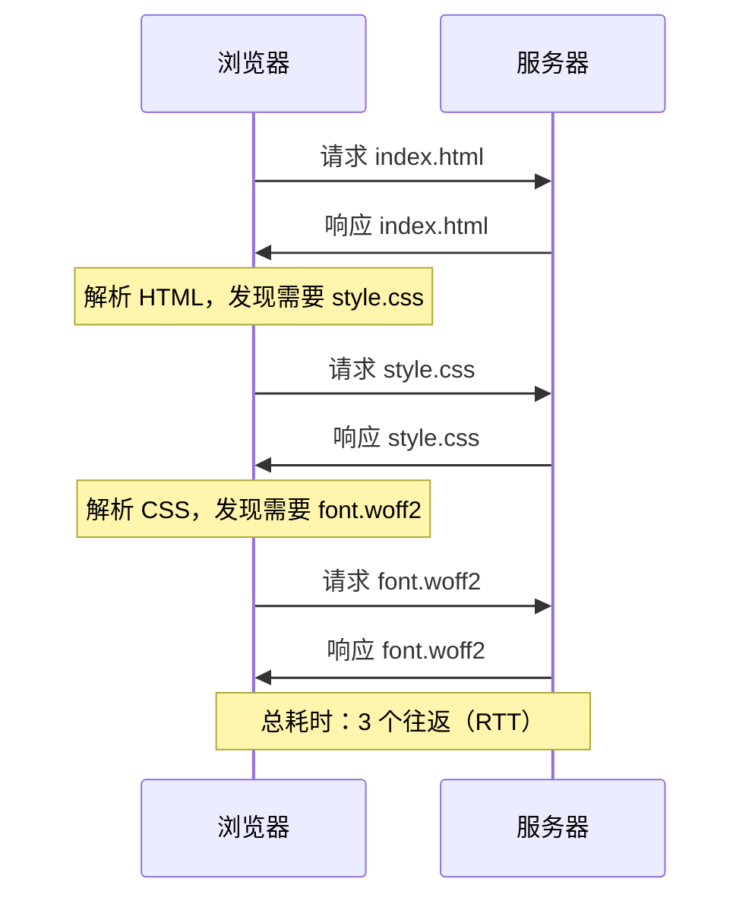
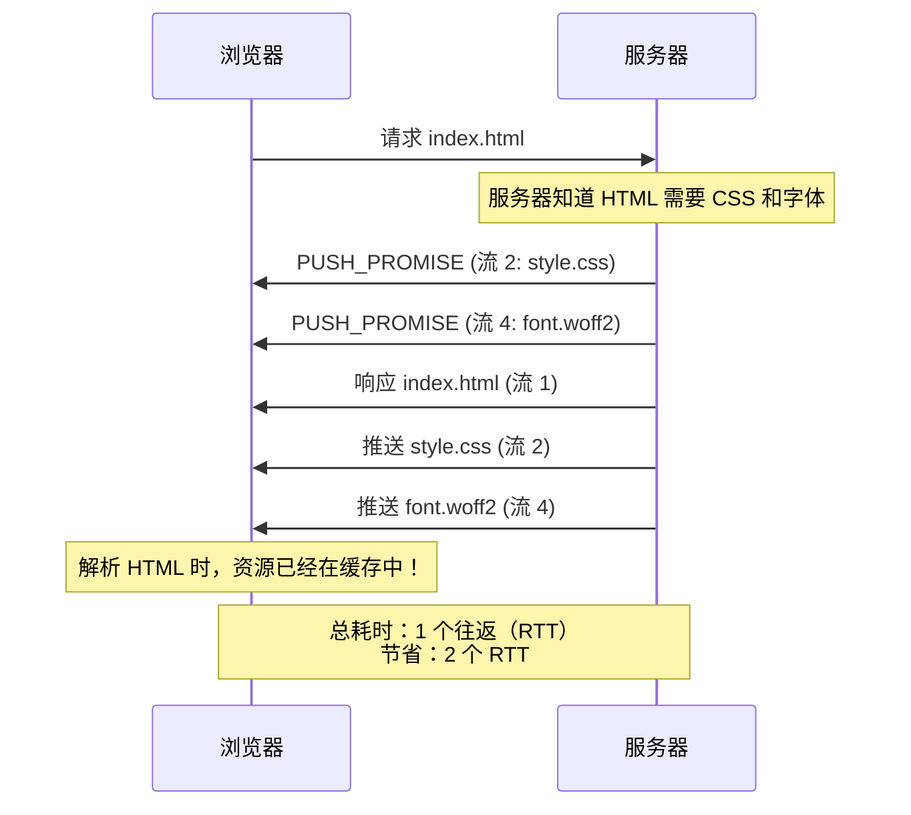
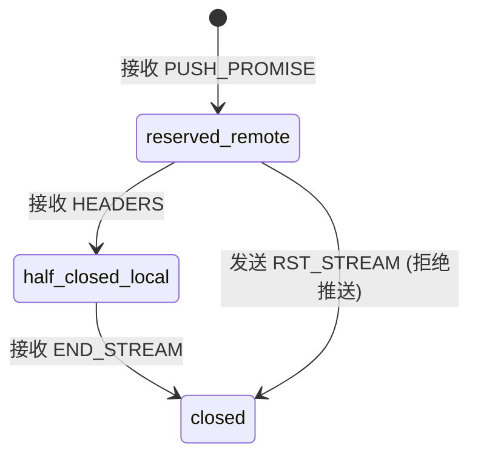
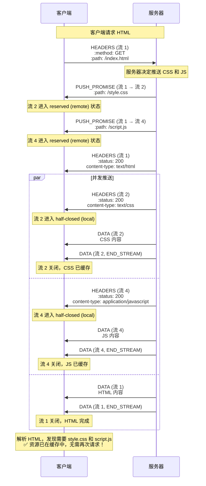
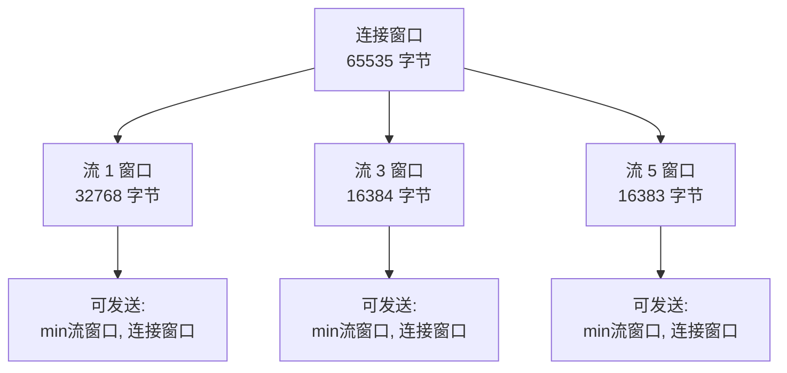
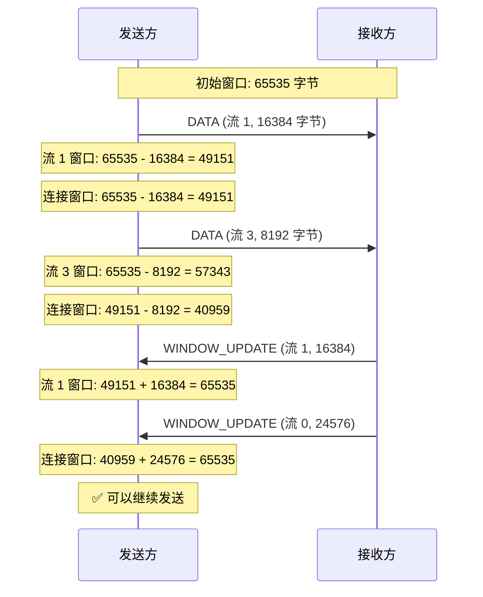
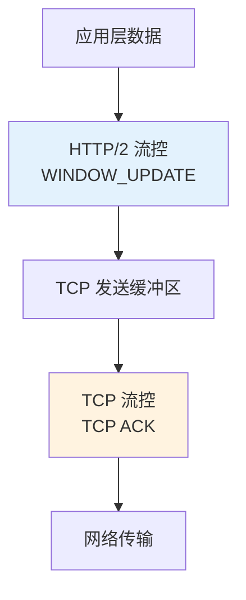
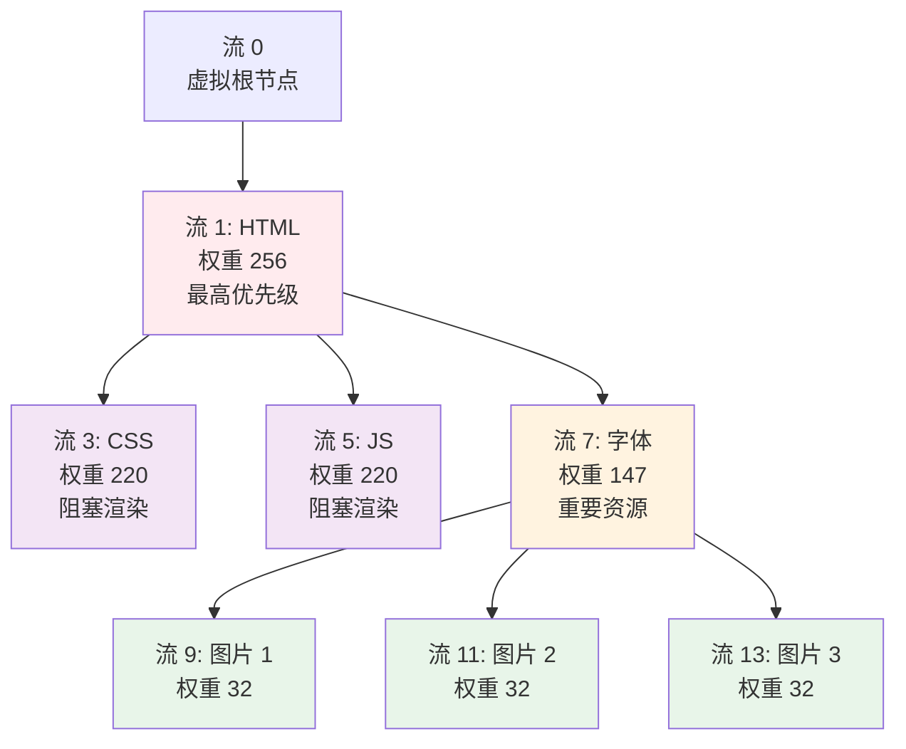
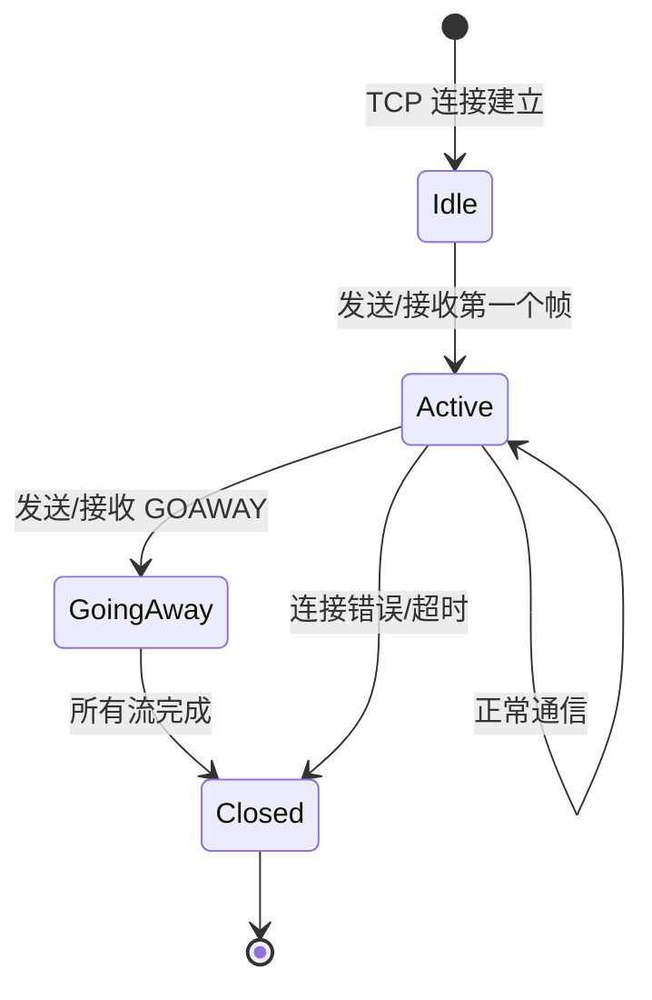
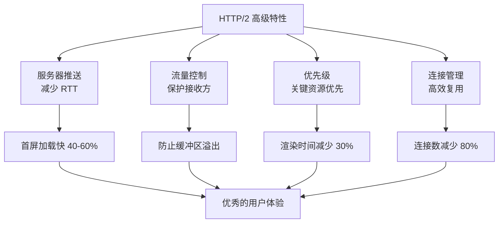

# 服务器推送与高级特性

## 目录
- [服务器推送（Server Push）](#服务器推送server-push)
- [流量控制（Flow Control）](#流量控制flow-control)
- [流优先级（Stream Priority）](#流优先级stream-priority)
- [连接管理](#连接管理)
- [错误处理](#错误处理)

---

## 服务器推送（Server Push）

### 什么是服务器推送？

**服务器推送（Server Push）**允许服务器在客户端请求之前，主动推送资源到客户端缓存。这是 HTTP/2 的一个革命性特性，可以显著减少页面加载时间。

**传统 HTTP/1.1 流程：**



**HTTP/2 服务器推送流程：**



### 工作原理

#### 1. PUSH_PROMISE 帧

服务器通过发送 `PUSH_PROMISE` 帧来通知客户端即将推送资源：

**PUSH_PROMISE 帧结构：**

```
+---------------+
|Pad Length? (8)|
+-+-------------+-----------------------------------------------+
|R|                  Promised Stream ID (31)                    |
+-+-----------------------------+-------------------------------+
|                   Header Block Fragment (*)                 ...
+---------------------------------------------------------------+
|                           Padding (*)                       ...
+---------------------------------------------------------------+
```

**字段说明：**

- **Promised Stream ID**：推送流的 ID（必须是服务器发起的偶数 ID）
- **Header Block Fragment**：推送资源的请求头部（HPACK 编码）

**示例：**

```
Length: 45
Type: PUSH_PROMISE (0x5)
Flags: END_HEADERS (0x4)
Stream ID: 1 (关联的客户端请求流)
Promised Stream ID: 2

Headers (请求头部):
  :method: GET
  :scheme: https
  :authority: example.com
  :path: /style.css
```

#### 2. 推送流的生命周期



**状态说明：**

1. **reserved (remote)**：客户端接收到 PUSH_PROMISE，流已保留
2. **half-closed (local)**：客户端接收到 HEADERS，服务器可以发送数据
3. **closed**：推送完成或被拒绝

#### 3. 完整的推送流程



### 推送决策

服务器如何决定推送哪些资源？

#### 1. 静态分析

分析 HTML 内容，识别关键资源：

```html
<!DOCTYPE html>
<html>
<head>
  <link rel="stylesheet" href="/style.css">  ← 推送候选
  <script src="/app.js"></script>            ← 推送候选
</head>
<body>
             ← 可选推送
</body>
</html>
```

**推送优先级：**

1. **高优先级**：阻塞渲染的资源（CSS、同步 JS）
2. **中优先级**：重要的异步资源（字体、关键图片）
3. **低优先级**：非关键资源（analytics、广告）

#### 2. Link 头部提示

客户端或服务器可以使用 `Link` 头部提示推送：

```http
HTTP/2 200
Content-Type: text/html
Link: </style.css>; rel=preload; as=style
Link: </app.js>; rel=preload; as=script
Link: </logo.png>; rel=preload; as=image

<html>...
```

服务器解析 `Link` 头部，决定推送：

```
rel=preload + as=style  → 推送
rel=preload + as=script → 推送
rel=preload + as=image  → 可选推送（根据策略）
```

#### 3. 历史记录和机器学习

高级实现可以基于历史访问模式预测：

```
用户访问 /index.html：
  → 90% 接下来请求 /style.css
  → 80% 接下来请求 /app.js
  → 60% 接下来请求 /logo.png

决策：推送 style.css 和 app.js
```

### 客户端控制

#### 1. 拒绝推送

客户端可以发送 `RST_STREAM` 帧拒绝推送：

```
场景：客户端缓存中已有该资源

Server->>Client: PUSH_PROMISE (流 2: /style.css)

Client->>Server: RST_STREAM (流 2)<br/>Error Code: CANCEL (0x8)

Note: 服务器停止推送，释放资源
```

#### 2. 禁用推送

客户端可以通过 `SETTINGS` 帧禁用所有推送：

```
Client->>Server: SETTINGS<br/>SETTINGS_ENABLE_PUSH: 0

Note: 服务器不再发送 PUSH_PROMISE
```

### 适用场景

#### ✅ 适合推送的场景

1. **关键渲染路径资源**
   - CSS 样式表
   - 同步 JavaScript
   - Web 字体

2. **可预测的依赖**
   - HTML 中引用的图片
   - API 响应中包含的下一步资源

3. **首次访问优化**
   - 新用户没有缓存的资源

**示例：单页应用（SPA）**

```
用户访问 /app
  → 推送 app.js（主应用代码）
  → 推送 vendor.js（第三方库）
  → 推送 app.css（样式）

页面加载时间：减少 40-60%
```

#### ❌ 不适合推送的场景

1. **不可预测的资源**
   - 用户行为驱动的资源（点击加载的图片）
   - 个性化内容（用户特定的数据）

2. **大文件**
   - 视频、大型图片（浪费带宽）

3. **低优先级资源**
   - Analytics 脚本
   - 广告资源

4. **已缓存的资源**
   - 客户端缓存中已有的资源（浪费推送）

### 性能收益

**场景：加载一个 SPA 应用**

**HTTP/1.1（无推送）：**

```
RTT 1: 请求 index.html         → 200ms
RTT 2: 请求 app.js, vendor.js  → 200ms
RTT 3: 请求 app.css, fonts     → 200ms
--------------------------------------------
总耗时: 600ms
```

**HTTP/2（有推送）：**

```
RTT 1: 请求 index.html
       + 推送 app.js, vendor.js, app.css, fonts → 200ms
--------------------------------------------
总耗时: 200ms

性能提升: (600 - 200) / 600 = 66.7%
```

### 实战配置

#### Nginx 配置

**启用 HTTP/2 推送：**

```nginx
server {
    listen 443 ssl http2;
    server_name example.com;

    # 方法 1：使用 http2_push 指令
    location = /index.html {
        http2_push /style.css;
        http2_push /app.js;
        http2_push /font.woff2;
    }

    # 方法 2：使用 Link 头部（推荐）
    location = /index.html {
        add_header Link "</style.css>; rel=preload; as=style";
        add_header Link "</app.js>; rel=preload; as=script";
        http2_push_preload on;  # 自动解析 Link 头部
    }

    # 限制推送并发数
    http2_max_concurrent_pushes 10;
}
```

#### Apache 配置

```apache
<VirtualHost *:443>
    ServerName example.com
    Protocols h2 http/1.1

    # 启用 HTTP/2 推送
    <Location /index.html>
        Header add Link "</style.css>; rel=preload; as=style"
        Header add Link "</app.js>; rel=preload; as=script"
    </Location>

    H2Push on
    H2PushPriority application/javascript after
    H2PushPriority text/css before
</VirtualHost>
```

### 推送的局限性

#### 1. 缓存失效

如果客户端已缓存资源，推送会浪费带宽：

**问题：**

```
用户第二次访问：
  → 服务器推送 style.css
  → 客户端：我已经有了！（拒绝推送）
  → 浪费：已发送的数据（可能几 KB）
```

**解决方案：**

- 使用 Cookie 跟踪已推送的资源
- 客户端发送 `cache-digest` 头部（实验性）

#### 2. 推送过多

过度推送会适得其反：

```
推送 10 个资源，每个 50KB = 500KB
如果用户只需要 2 个资源（100KB）
浪费：400KB 带宽

在 3G 网络上：400KB ÷ 125KB/s = 3.2 秒浪费
```

#### 3. 浏览器支持

虽然所有现代浏览器都支持 HTTP/2，但推送支持参差不齐：

| 浏览器 | 推送支持 | 限制 |
|--------|---------|------|
| Chrome 90+ | ✅ 支持 | 移除推送（实验性禁用） |
| Firefox | ✅ 支持 | 完整支持 |
| Safari | ✅ 支持 | 完整支持 |
| Edge | ✅ 支持 | 完整支持 |

**注意：** Chrome 正在逐步移除 HTTP/2 推送支持，推荐使用 **Early Hints (103 status)** 替代。

---

## 流量控制（Flow Control）

### 为什么需要流量控制？

在 HTTP/2 中，多个流共享同一个 TCP 连接。如果某个流发送数据过快，可能导致：

1. **接收方缓冲区溢出**：内存耗尽
2. **慢速流被饿死**：快速流占用所有带宽
3. **TCP 连接阻塞**：TCP 接收窗口满

**类比：**

想象一条高速公路（TCP 连接），多辆卡车（流）在运输货物。如果某辆卡车开得太快，会导致：
- 目的地仓库（接收缓冲区）装不下
- 其他卡车被堵在后面
- 整条高速公路拥堵

### 流量控制机制

HTTP/2 实现了**应用层流量控制**，独立于 TCP 的流量控制。

#### 1. 流控窗口

每个流和连接都有一个**流控窗口（Flow Control Window）**，表示可以发送但尚未确认的数据量。

**初始窗口大小：**

```
默认值: 65535 字节 (64KB - 1)
可配置: 通过 SETTINGS_INITIAL_WINDOW_SIZE 参数
范围: 0 - 2^31-1 (2GB)
```

**两级窗口：**

1. **流级别窗口**：每个流独立的窗口
2. **连接级别窗口**：所有流共享的全局窗口



#### 2. WINDOW_UPDATE 帧

接收方通过发送 `WINDOW_UPDATE` 帧来增加窗口大小：

**WINDOW_UPDATE 帧结构：**

```
+-+-------------------------------------------------------------+
|R|              Window Size Increment (31)                     |
+-+-------------------------------------------------------------+
```

**字段说明：**

- **Window Size Increment**：窗口增量（1 到 2^31-1 字节）

**示例：**

```
Length: 4
Type: WINDOW_UPDATE (0x8)
Flags: 0
Stream ID: 13 (流级别)
Window Size Increment: 32768 (增加 32KB)
```

#### 3. 流控工作流程



### 流控策略

#### 1. 立即更新策略

接收方在接收到数据后立即更新窗口：

```python
def on_data_received(stream_id, data):
    buffer.append(data)
    process_data(data)

    # 立即更新窗口
    send_window_update(stream_id, len(data))
    send_window_update(0, len(data))  # 连接级别
```

**优点：**

- 发送方可以持续发送
- 最大化吞吐量

**缺点：**

- 频繁发送 WINDOW_UPDATE 帧
- 增加网络开销

#### 2. 批量更新策略

积累一定量的数据后再更新窗口：

```python
def on_data_received(stream_id, data):
    buffer.append(data)
    consumed_bytes[stream_id] += len(data)

    # 每消费 32KB 更新一次窗口
    if consumed_bytes[stream_id] >= 32768:
        send_window_update(stream_id, consumed_bytes[stream_id])
        send_window_update(0, consumed_bytes[stream_id])
        consumed_bytes[stream_id] = 0
```

**优点：**

- 减少 WINDOW_UPDATE 帧数量
- 降低网络开销

**缺点：**

- 发送方可能需要等待
- 可能降低吞吐量

#### 3. 自适应策略

根据网络条件和接收速度动态调整：

```python
def adaptive_window_update(stream_id, data):
    consumed_bytes[stream_id] += len(data)

    # 计算处理速率
    processing_rate = len(data) / elapsed_time

    # 根据速率调整更新阈值
    if processing_rate > 1_000_000:  # 1 MB/s
        threshold = 65536  # 高速场景，64KB 更新一次
    else:
        threshold = 16384  # 低速场景，16KB 更新一次

    if consumed_bytes[stream_id] >= threshold:
        send_window_update(stream_id, consumed_bytes[stream_id])
        consumed_bytes[stream_id] = 0
```

### 流控错误处理

#### 1. 流控错误（FLOW_CONTROL_ERROR）

当发送方超出窗口大小时，接收方发送 `RST_STREAM` 或 `GOAWAY` 帧：

**示例：**

```
流 1 窗口: 10000 字节
发送方发送: 15000 字节的 DATA 帧

接收方响应:
  RST_STREAM (流 1)
  Error Code: FLOW_CONTROL_ERROR (0x3)
```

#### 2. 窗口溢出检测

接收方必须检测窗口溢出：

```python
def check_flow_control(stream_id, data_length):
    available = flow_control_window[stream_id]

    if data_length > available:
        # 流控错误
        send_rst_stream(stream_id, FLOW_CONTROL_ERROR)
        return False

    # 更新窗口
    flow_control_window[stream_id] -= data_length
    return True
```

### 流控与 TCP 的关系

HTTP/2 流控是**应用层**的，独立于 TCP 流控：



**两层流控的协同：**

- **HTTP/2 流控**：控制应用层数据发送速率，保护接收方
- **TCP 流控**：控制网络层传输速率，防止网络拥塞

**为什么需要两层？**

1. **细粒度控制**：HTTP/2 可以独立控制每个流，TCP 只能控制整个连接
2. **缓冲区管理**：应用层可以根据业务逻辑调整缓冲区
3. **多路复用友好**：避免慢速流阻塞整个连接

---

## 流优先级（Stream Priority）

### 优先级的必要性

在多路复用环境中，多个流共享带宽。如果不区分优先级，可能导致：

```
关键 CSS（10KB）和大图片（1MB）同时传输
  → 图片占用 99% 带宽
  → CSS 传输缓慢
  → 页面长时间白屏（FOUC）
```

### 优先级模型

HTTP/2 使用**依赖树（Dependency Tree）**模型表示优先级：

#### 1. 依赖关系

每个流可以依赖另一个流：

```
流 A 依赖流 B → 先传输流 B，再传输流 A
```

#### 2. 权重（Weight）

同级流通过权重分配带宽：

```
权重范围: 1-256
带宽分配 = 权重 / 总权重
```

#### 3. 独占标志（Exclusive）

独占依赖会重新组织依赖树：

```
流 A 独占依赖流 B
  → 流 B 的所有子节点变成流 A 的子节点
  → 流 A 成为流 B 的唯一子节点
```

### 优先级树示例

**场景：加载一个网页**



**调度顺序：**

1. **流 1（HTML）**：优先级最高，独占带宽
2. **流 3, 5（CSS, JS）**：HTML 完成后，按权重分配（各 50%）
3. **流 7（字体）**：CSS/JS 完成后开始传输
4. **流 9, 11, 13（图片）**：字体完成后，按权重均分（各 33%）

### 带宽分配算法

#### 1. 按权重分配

假设总带宽 1 Mbps，三个流同时传输：

```
流 1 权重: 256
流 3 权重: 128
流 5 权重: 64

总权重: 256 + 128 + 64 = 448

流 1 带宽: 1 Mbps × (256 / 448) = 571 Kbps
流 3 带宽: 1 Mbps × (128 / 448) = 286 Kbps
流 5 带宽: 1 Mbps × (64 / 448) = 143 Kbps
```

#### 2. 依赖关系优先

如果流 3 依赖流 1：

```
流 1 (HTML) 先传输，完成后：
  → 流 3 (CSS) 开始传输
  → 流 5 (JS) 开始传输（如果也依赖流 1）
```

#### 3. 深度优先遍历

服务器按照深度优先顺序调度流：

```python
def schedule_streams(tree, bandwidth):
    # 深度优先遍历依赖树
    for stream in depth_first_traversal(tree):
        if stream.has_data():
            # 按权重分配带宽
            stream_bandwidth = bandwidth * (stream.weight / total_weight)
            send_data(stream, stream_bandwidth)
```

### PRIORITY 帧

客户端通过 `PRIORITY` 帧动态调整优先级：

**PRIORITY 帧结构：**

```
+-+-------------------------------------------------------------+
|E|                  Stream Dependency (31)                     |
+-+-------------+-----------------------------------------------+
|   Weight (8)  |
+-+-------------+
```

**字段说明：**

- **E (Exclusive)**：独占标志
- **Stream Dependency**：依赖的流 ID
- **Weight**：权重（1-256）

**示例：**

```
场景：用户滚动到页面底部，需要加载更多图片

客户端发送:
  PRIORITY (流 15)
  Exclusive: 0
  Stream Dependency: 0 (依赖根节点)
  Weight: 200 (高优先级)

效果：流 15 的优先级提升，图片快速加载
```

### 浏览器的优先级策略

#### Chrome 的优先级模型

```
关键资源优先级:
  1. HTML (最高)
  2. CSS (高)
  3. 字体 (中高)
  4. 同步 JS (中高)
  5. 异步 JS (中)
  6. 图片 (中低)
  7. XHR (可变)
```

**优先级调整：**

- **可见区域的图片**：优先级提升
- **懒加载图片**：优先级降低
- **preload 资源**：优先级提升

#### Firefox 的优先级模型

```
优先级组:
  Urgent: HTML, CSS
  High: 同步 JS, 字体
  Medium: 异步 JS, 可见图片
  Low: 不可见图片, 预取资源
  Lowest: 追踪脚本, 广告
```

### 优先级的局限性

#### 1. 服务器实现差异

不是所有服务器都完美实现优先级调度：

```
简单实现：忽略优先级，按流 ID 顺序调度
复杂实现：按依赖树和权重精确调度

实际效果：差异很大
```

#### 2. 网络条件影响

在高延迟、高丢包网络中，优先级效果减弱：

```
理想情况（低延迟）：
  CSS 100ms，图片 500ms
  总耗时: 500ms

糟糕网络（高延迟）：
  CSS 300ms，图片 800ms
  总耗时: 800ms（优先级效果不明显）
```

#### 3. 客户端控制有限

服务器可能不遵守客户端指定的优先级：

```
客户端: 流 3 优先级 256
服务器: 我认为流 5 更重要，先传输流 5

结果: 客户端期望与实际不符
```

---

## 连接管理

### 连接生命周期



### GOAWAY 帧

**GOAWAY 帧**用于优雅地关闭连接，通知对方最后处理的流 ID。

**GOAWAY 帧结构：**

```
+-+-------------------------------------------------------------+
|R|                  Last-Stream-ID (31)                        |
+-+-------------------------------------------------------------+
|                      Error Code (32)                          |
+---------------------------------------------------------------+
|                  Additional Debug Data (*)                    |
+---------------------------------------------------------------+
```

**字段说明：**

- **Last-Stream-ID**：最后处理的流 ID
- **Error Code**：错误码
- **Debug Data**：可选的调试信息

**示例：服务器重启**

```
服务器发送:
  GOAWAY
  Last-Stream-ID: 47
  Error Code: NO_ERROR (0x0)
  Debug Data: "Server restarting for maintenance"

含义：
  → 流 1-47 已完成或正在处理
  → 流 49+ 未处理，客户端应重新发送
```

### 连接重用

HTTP/2 鼓励重用连接：

**同源连接重用：**

```
https://example.com/api/users
https://example.com/api/posts
https://example.com/static/logo.png

→ 使用同一个 HTTP/2 连接
```

**连接合并（Connection Coalescing）：**

如果多个域名指向同一 IP 且证书有效，可以合并连接：

```
证书: *.example.com

域名:
  api.example.com  → 12.34.56.78
  cdn.example.com  → 12.34.56.78
  www.example.com  → 12.34.56.78

→ 三个域名共享一个 HTTP/2 连接
```

### PING 帧

**PING 帧**用于测量往返时间（RTT）或保持连接活跃。

**PING 帧结构：**

```
+---------------------------------------------------------------+
|                      Opaque Data (64)                         |
+---------------------------------------------------------------+
```

**使用示例：**

```
客户端发送:
  PING
  Flags: 0
  Data: 0x0123456789abcdef

服务器响应:
  PING
  Flags: ACK (0x1)
  Data: 0x0123456789abcdef (相同数据)

RTT = 响应时间 - 发送时间
```

---

## 错误处理

### 错误类型

HTTP/2 定义了两类错误：

1. **连接错误**：影响整个连接，必须关闭连接
2. **流错误**：只影响单个流，流被终止但连接继续

### 错误码

| 错误码 | 名称 | 类型 | 说明 |
|--------|------|------|------|
| 0x0 | NO_ERROR | - | 正常关闭 |
| 0x1 | PROTOCOL_ERROR | 连接 | 协议违规 |
| 0x2 | INTERNAL_ERROR | - | 内部错误 |
| 0x3 | FLOW_CONTROL_ERROR | - | 流控错误 |
| 0x4 | SETTINGS_TIMEOUT | 连接 | SETTINGS 超时 |
| 0x5 | STREAM_CLOSED | 流 | 流已关闭 |
| 0x6 | FRAME_SIZE_ERROR | - | 帧大小错误 |
| 0x7 | REFUSED_STREAM | 流 | 拒绝处理流 |
| 0x8 | CANCEL | 流 | 流被取消 |
| 0x9 | COMPRESSION_ERROR | 连接 | HPACK 错误 |
| 0xa | CONNECT_ERROR | - | CONNECT 方法错误 |
| 0xb | ENHANCE_YOUR_CALM | - | 请求过于频繁 |
| 0xc | INADEQUATE_SECURITY | 连接 | 安全性不足 |
| 0xd | HTTP_1_1_REQUIRED | 连接 | 需要 HTTP/1.1 |

### RST_STREAM 帧

**RST_STREAM 帧**用于立即终止流：

**RST_STREAM 帧结构：**

```
+---------------------------------------------------------------+
|                        Error Code (32)                        |
+---------------------------------------------------------------+
```

**使用场景：**

1. **取消请求**：用户取消页面加载
2. **拒绝推送**：客户端不需要推送的资源
3. **流错误**：检测到流级别的错误

**示例：取消请求**

```
用户点击"停止"按钮

浏览器发送:
  RST_STREAM (流 7)
  Error Code: CANCEL (0x8)

服务器停止发送流 7 的数据
```

---

## 总结：高级特性的协同

### 特性组合

HTTP/2 的高级特性协同工作，实现最佳性能：



### 实践建议

**1. 服务器推送**

- ✅ 推送关键渲染路径资源（CSS、JS）
- ✅ 使用 `Link: rel=preload` 头部
- ❌ 避免推送大文件或非关键资源
- ❌ 注意缓存状态，避免重复推送

**2. 流量控制**

- ✅ 使用自适应窗口更新策略
- ✅ 根据网络条件调整窗口大小
- ❌ 避免窗口过小（降低吞吐量）
- ❌ 避免窗口过大（内存压力）

**3. 优先级**

- ✅ 正确设置资源优先级（HTML > CSS > JS > 图片）
- ✅ 动态调整优先级（可见区域资源）
- ❌ 不要过度依赖优先级（服务器实现差异）

**4. 连接管理**

- ✅ 重用连接（同源、连接合并）
- ✅ 使用 GOAWAY 优雅关闭
- ✅ 使用 PING 保持活跃
- ❌ 避免过早关闭连接

---

## 下一步

现在我们掌握了 HTTP/2 的所有核心特性，接下来将探讨：

1. **协议协商与升级**：如何从 HTTP/1.1 平滑升级到 HTTP/2
2. **实战迁移指南**：如何配置服务器和优化应用
3. **HTTP/2 vs HTTP/3**：下一代协议的演进

让我们继续探索 HTTP/2 的实战应用！

---

## 参考资料

- RFC 9113: HTTP/2 (Section 8 - HTTP Message Exchanges)
- RFC 9113: HTTP/2 (Section 6 - Frame Definitions)
- RFC 9113: HTTP/2 (Section 5.3 - Stream Priority)
