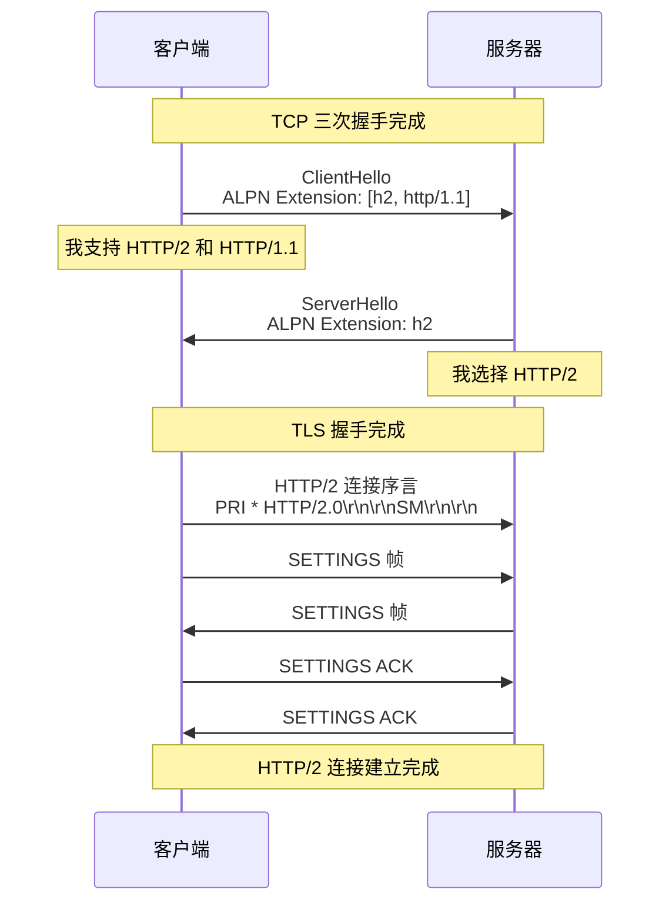
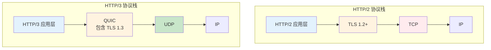

# 实战应用与迁移指南

## 目录
- [协议协商与升级](#协议协商与升级)
- [服务器配置实战](#服务器配置实战)
- [应用优化策略](#应用优化策略)
- [性能监控与调优](#性能监控与调优)
- [迁移最佳实践](#迁移最佳实践)
- [常见问题与解决方案](#常见问题与解决方案)
- [HTTP/2 vs HTTP/3](#http2-vs-http3)

---

## 协议协商与升级

### TLS 协议协商：ALPN

**ALPN（Application-Layer Protocol Negotiation）**是在 TLS 握手期间协商应用层协议的标准机制（RFC 7301）。

#### ALPN 协商流程



#### ClientHello 中的 ALPN 扩展

```
ClientHello
  ...
  Extension: application_layer_protocol_negotiation (16)
    ALPN Extension Length: 14
    ALPN Protocol Name Length: 2
    ALPN Protocol Name: h2
    ALPN Protocol Name Length: 8
    ALPN Protocol Name: http/1.1
```

**协议标识符：**

| 协议 | ALPN 标识符 |
|------|-----------|
| HTTP/2 over TLS | `h2` |
| HTTP/1.1 over TLS | `http/1.1` |
| HTTP/2 Cleartext | `h2c` |
| HTTP/3 | `h3` |

#### ServerHello 中的 ALPN 选择

```
ServerHello
  ...
  Extension: application_layer_protocol_negotiation (16)
    ALPN Extension Length: 3
    ALPN Protocol Name Length: 2
    ALPN Protocol Name: h2
```

**选择规则：**

1. 服务器从客户端列表中选择一个支持的协议
2. 通常优先选择更新的协议（h2 > http/1.1）
3. 如果无匹配，连接可能失败或降级到默认协议

#### 使用 OpenSSL 查看 ALPN

```bash
# 查看服务器支持的 ALPN 协议
openssl s_client -alpn h2,http/1.1 -connect www.google.com:443 -servername www.google.com
```

**输出示例：**

```
CONNECTED(00000005)
depth=2 C = US, O = Google Trust Services LLC, CN = GTS Root R1
...
SSL-Session:
    Protocol  : TLSv1.3
    Cipher    : TLS_AES_256_GCM_SHA384
    ALPN protocol: h2        ← 协商成功，使用 HTTP/2
    ...
```

### HTTP/1.1 升级机制

虽然浏览器实际上不使用，但 RFC 9113 定义了从 HTTP/1.1 升级到 HTTP/2 的机制。

#### 升级请求

```http
GET / HTTP/1.1
Host: example.com
Connection: Upgrade, HTTP2-Settings
Upgrade: h2c
HTTP2-Settings: AAMAAABkAARAAAAAAAIAAAAA
```

**字段说明：**

- `Upgrade: h2c`：请求升级到 HTTP/2 Cleartext
- `HTTP2-Settings`：Base64 编码的 SETTINGS 帧内容

#### 服务器响应

**接受升级：**

```http
HTTP/1.1 101 Switching Protocols
Connection: Upgrade
Upgrade: h2c

[后续使用 HTTP/2 通信]
```

**拒绝升级：**

```http
HTTP/1.1 200 OK
Content-Type: text/html

[正常的 HTTP/1.1 响应]
```

#### 为什么浏览器不使用升级？

1. **额外往返**：需要一次完整的 HTTP/1.1 请求/响应
2. **复杂性**：实现复杂，容易出错
3. **ALPN 更高效**：在 TLS 握手期间完成协商
4. **安全性**：浏览器强制 HTTPS，直接使用 ALPN

### HTTP/2 连接序言

一旦通过 ALPN 协商成功，客户端必须发送**连接序言（Connection Preface）**：

#### 客户端序言

```
PRI * HTTP/2.0\r\n\r\nSM\r\n\r\n
```

**十六进制表示：**

```
50 52 49 20 2a 20 48 54 54 50 2f 32 2e 30 0d 0a
0d 0a 53 4d 0d 0a 0d 0a
```

**为什么是这个字符串？**

1. **快速识别**：服务器立即知道这是 HTTP/2
2. **避免误解析**：如果发到 HTTP/1.1 服务器，会被视为非法请求
3. **向后兼容**：开头是 "PRI"，像 HTTP 方法，但又不合法

#### SETTINGS 帧交换

序言后，双方交换 SETTINGS 帧：

```
客户端 → 服务器:
  SETTINGS
    SETTINGS_MAX_CONCURRENT_STREAMS: 100
    SETTINGS_INITIAL_WINDOW_SIZE: 65535

服务器 → 客户端:
  SETTINGS
    SETTINGS_MAX_CONCURRENT_STREAMS: 128
    SETTINGS_INITIAL_WINDOW_SIZE: 65536
    SETTINGS_MAX_FRAME_SIZE: 16777215

客户端 → 服务器:
  SETTINGS ACK

服务器 → 客户端:
  SETTINGS ACK
```

---

## 服务器配置实战

### Nginx 配置

#### 基本 HTTP/2 启用

```nginx
server {
    listen 443 ssl http2;  # 启用 HTTP/2
    server_name example.com;

    # TLS 证书
    ssl_certificate /path/to/cert.pem;
    ssl_certificate_key /path/to/key.pem;

    # TLS 协议版本（HTTP/2 要求 TLS 1.2+）
    ssl_protocols TLSv1.2 TLSv1.3;

    # 现代密码套件
    ssl_ciphers 'ECDHE-ECDSA-AES128-GCM-SHA256:ECDHE-RSA-AES128-GCM-SHA256';
    ssl_prefer_server_ciphers on;

    location / {
        root /var/www/html;
        index index.html;
    }
}
```

#### HTTP/2 推送配置

```nginx
server {
    listen 443 ssl http2;
    server_name example.com;

    # 启用 HTTP/2 推送
    http2_push_preload on;  # 自动解析 Link 头部

    location = /index.html {
        root /var/www/html;

        # 方法 1：使用 http2_push 指令
        http2_push /css/style.css;
        http2_push /js/app.js;

        # 方法 2：使用 Link 头部（推荐）
        add_header Link "</css/style.css>; rel=preload; as=style";
        add_header Link "</js/app.js>; rel=preload; as=script";
    }

    # 推送配置参数
    http2_max_concurrent_pushes 10;  # 最大并发推送数
}
```

#### 流控和缓冲区配置

```nginx
http {
    # HTTP/2 配置
    http2_max_field_size 16k;        # 头部字段最大大小
    http2_max_header_size 32k;       # 头部块最大大小
    http2_max_concurrent_streams 128; # 最大并发流数
    http2_recv_timeout 30s;          # 接收超时
    http2_idle_timeout 3m;           # 空闲超时

    # 缓冲区配置
    http2_chunk_size 8k;             # 响应体分块大小

    server {
        listen 443 ssl http2;
        server_name example.com;
        # ...
    }
}
```

#### 完整的生产配置

```nginx
http {
    # 日志格式（包含协议版本）
    log_format h2_combined '$remote_addr - $remote_user [$time_local] '
                           '"$request" $status $body_bytes_sent '
                           '"$http_referer" "$http_user_agent" '
                           'protocol=$server_protocol';

    access_log /var/log/nginx/access.log h2_combined;

    # HTTP/2 全局配置
    http2_max_field_size 16k;
    http2_max_header_size 32k;
    http2_max_concurrent_streams 128;

    # Gzip 压缩（HTTP/2 仍然需要）
    gzip on;
    gzip_vary on;
    gzip_types text/plain text/css application/json application/javascript text/xml;

    server {
        listen 443 ssl http2;
        server_name example.com;

        # TLS 配置
        ssl_certificate /etc/nginx/ssl/cert.pem;
        ssl_certificate_key /etc/nginx/ssl/key.pem;
        ssl_protocols TLSv1.2 TLSv1.3;
        ssl_ciphers HIGH:!aNULL:!MD5;
        ssl_prefer_server_ciphers on;

        # HSTS（强制 HTTPS）
        add_header Strict-Transport-Security "max-age=31536000; includeSubDomains" always;

        # HTTP/2 推送
        http2_push_preload on;

        # 根路径
        location / {
            root /var/www/html;
            index index.html;

            # 缓存控制
            expires 1h;
            add_header Cache-Control "public, immutable";
        }

        # API 路径（不推送）
        location /api/ {
            proxy_pass http://backend:8080;
            proxy_http_version 1.1;

            # 代理头部
            proxy_set_header Host $host;
            proxy_set_header X-Real-IP $remote_addr;
            proxy_set_header X-Forwarded-For $proxy_add_x_forwarded_for;
            proxy_set_header X-Forwarded-Proto $scheme;
        }

        # 静态资源（长缓存 + 推送）
        location ~* \.(css|js|woff2)$ {
            root /var/www/html;
            expires 1y;
            add_header Cache-Control "public, immutable";
        }
    }

    # HTTP 到 HTTPS 重定向
    server {
        listen 80;
        server_name example.com;
        return 301 https://$server_name$request_uri;
    }
}
```

### Apache 配置

#### 启用 HTTP/2 模块

```bash
# 启用模块
sudo a2enmod http2
sudo a2enmod ssl

# 重启 Apache
sudo systemctl restart apache2
```

#### 基本配置

```apache
<VirtualHost *:443>
    ServerName example.com
    DocumentRoot /var/www/html

    # 启用 HTTP/2
    Protocols h2 http/1.1

    # TLS 配置
    SSLEngine on
    SSLCertificateFile /etc/ssl/certs/cert.pem
    SSLCertificateKeyFile /etc/ssl/private/key.pem
    SSLProtocol -all +TLSv1.2 +TLSv1.3
    SSLCipherSuite HIGH:!aNULL:!MD5

    # HTTP/2 推送
    H2Push on
    H2PushPriority text/css before
    H2PushPriority application/javascript after

    <Location />
        Header add Link "</css/style.css>; rel=preload; as=style"
        Header add Link "</js/app.js>; rel=preload; as=script"
    </Location>

    # 日志
    CustomLog ${APACHE_LOG_DIR}/access.log combined
    ErrorLog ${APACHE_LOG_DIR}/error.log
</VirtualHost>
```

#### 高级配置

```apache
<IfModule http2_module>
    # HTTP/2 全局配置
    H2MaxSessionStreams 100       # 最大并发流
    H2StreamMaxMemSize 65536      # 流最大内存
    H2WindowSize 65535            # 初始窗口大小
    H2MinWorkers 25               # 最小工作线程
    H2MaxWorkers 150              # 最大工作线程
    H2MaxWorkerIdleSeconds 600    # 工作线程空闲超时

    # HTTP/2 推送配置
    H2PushResource add /css/style.css critical
    H2PushResource add /js/app.js
    H2ModernTLSOnly on            # 仅允许现代 TLS
</IfModule>

<VirtualHost *:443>
    ServerName example.com
    Protocols h2 http/1.1

    # TLS 配置
    SSLEngine on
    SSLCertificateFile /etc/ssl/certs/cert.pem
    SSLCertificateKeyFile /etc/ssl/private/key.pem

    # 文档根路径
    DocumentRoot /var/www/html

    # 压缩配置
    <IfModule deflate_module>
        AddOutputFilterByType DEFLATE text/html text/plain text/css
        AddOutputFilterByType DEFLATE application/javascript application/json
    </IfModule>

    # 缓存控制
    <FilesMatch "\.(css|js|woff2)$">
        Header set Cache-Control "public, max-age=31536000, immutable"
    </FilesMatch>
</VirtualHost>
```

### Node.js 配置

#### 使用内置 http2 模块

```javascript
const http2 = require('http2');
const fs = require('fs');
const path = require('path');

// 创建 HTTP/2 服务器
const server = http2.createSecureServer({
  // TLS 证书
  key: fs.readFileSync('key.pem'),
  cert: fs.readFileSync('cert.pem'),

  // HTTP/2 配置
  settings: {
    maxConcurrentStreams: 128,
    initialWindowSize: 65535,
  },
});

// 请求处理
server.on('stream', (stream, headers) => {
  const method = headers[':method'];
  const path = headers[':path'];

  console.log(`${method} ${path}`);

  // 根路径：推送资源
  if (path === '/') {
    // 推送 CSS
    stream.pushStream({ ':path': '/style.css' }, (err, pushStream) => {
      if (err) return;
      pushStream.respond({ ':status': 200, 'content-type': 'text/css' });
      fs.createReadStream('public/style.css').pipe(pushStream);
    });

    // 推送 JS
    stream.pushStream({ ':path': '/app.js' }, (err, pushStream) => {
      if (err) return;
      pushStream.respond({ ':status': 200, 'content-type': 'application/javascript' });
      fs.createReadStream('public/app.js').pipe(pushStream);
    });

    // 响应 HTML
    stream.respond({
      ':status': 200,
      'content-type': 'text/html',
    });
    fs.createReadStream('public/index.html').pipe(stream);
  } else {
    // 静态文件服务
    const filePath = path.join('public', path);
    fs.readFile(filePath, (err, data) => {
      if (err) {
        stream.respond({ ':status': 404 });
        stream.end('Not Found');
      } else {
        stream.respond({ ':status': 200 });
        stream.end(data);
      }
    });
  }
});

// 错误处理
server.on('error', (err) => console.error(err));

// 启动服务器
server.listen(443, () => {
  console.log('HTTP/2 server running on https://localhost:443');
});
```

---

## 应用优化策略

### 1. 资源合并策略调整

**HTTP/1.1 时代：**

为了减少请求数，我们合并资源：

```
10 个 CSS 文件 → bundle.css (1 个请求)
20 个 JS 文件  → bundle.js (1 个请求)
```

**HTTP/2 时代：**

由于多路复用，合并的必要性降低：

```
优势：
  ✅ 更好的缓存粒度（单个文件变化不影响整个 bundle）
  ✅ 并行传输（多个小文件 vs 一个大文件）
  ✅ 更快的首次渲染（关键资源先到达）

劣势：
  ❌ 更多的 HTTP 开销（HEADERS 帧）
  ❌ 可能降低压缩率（小文件压缩效果差）
```

**建议策略：**

```
关键渲染路径资源：适度合并（2-5 个文件）
  critical.css = header.css + layout.css + above-fold.css

非关键资源：保持独立
  widget-a.js, widget-b.js, widget-c.js

第三方库：独立加载（利用 CDN 缓存）
  react.min.js, lodash.min.js
```

### 2. 域名分片（Domain Sharding）

**HTTP/1.1 时代：**

使用多个域名绕过并发连接限制：

```
static1.example.com
static2.example.com
static3.example.com
static4.example.com
```

**HTTP/2 时代：**

域名分片**适得其反**：

```
问题：
  ❌ 多次 TCP 握手（每个域名一个连接）
  ❌ 多次 TLS 握手（增加延迟）
  ❌ 无法共享连接（失去多路复用优势）
  ❌ 浪费服务器资源（多个连接）

建议：
  ✅ 合并到单个域名
  ✅ 使用连接合并（相同 IP + 证书）
```

**迁移策略：**

```
阶段 1: 保留域名分片，启用 HTTP/2
阶段 2: 逐步合并域名到主域名
阶段 3: 移除所有域名分片
```

### 3. 资源内联（Inlining）

**HTTP/1.1 时代：**

为了减少请求，内联小资源：

```html
<style>
  /* 内联 CSS */
  body { margin: 0; }
</style>


```

**HTTP/2 时代：**

内联的必要性降低：

```
缺点：
  ❌ 无法缓存（每次请求都传输）
  ❌ 增大 HTML 大小（延迟首字节时间）
  ❌ 阻塞 HTML 解析

建议：
  ✅ 外部化大部分资源
  ✅ 仅内联极小的关键 CSS（<1KB）
  ✅ 使用 HTTP/2 推送替代内联
```

### 4. 缓存策略优化

**利用 HTTP/2 的缓存优势：**

```
策略：
  1. 静态资源：长缓存（1 年）+ 版本化
     /js/app.v123.js → Cache-Control: public, max-age=31536000, immutable

  2. HTML：短缓存或不缓存
     /index.html → Cache-Control: no-cache

  3. API：根据业务设置
     /api/users → Cache-Control: private, max-age=60

  4. 推送资源：匹配主资源缓存时间
```

### 5. 资源优先级优化

**使用 Link 头部和 preload：**

```html
<!-- 高优先级：关键 CSS -->
<link rel="preload" href="/critical.css" as="style">

<!-- 高优先级：关键 JS -->
<link rel="preload" href="/app.js" as="script">

<!-- 中优先级：字体 -->
<link rel="preload" href="/font.woff2" as="font" type="font/woff2" crossorigin>

<!-- 低优先级：非关键图片 -->

```

**Nginx 配置：**

```nginx
location = /index.html {
    add_header Link "</critical.css>; rel=preload; as=style";
    add_header Link "</app.js>; rel=preload; as=script";
    add_header Link "</font.woff2>; rel=preload; as=font; type=font/woff2; crossorigin";
}
```

---

## 性能监控与调优

### 1. 使用浏览器开发者工具

**Chrome DevTools：**

1. **Network 面板**：
   - Protocol 列显示 `h2`
   - Waterfall 瀑布图显示并行加载
   - Timing 标签显示详细时序

2. **Performance 面板**：
   - Capture settings：启用 "Network"
   - 分析页面加载时间线
   - 识别性能瓶颈

3. **Lighthouse**：
   - 运行性能审计
   - 查看 HTTP/2 相关建议

**关键指标：**

```
首字节时间（TTFB）：
  HTTP/1.1: 300-500ms
  HTTP/2:   200-350ms
  目标：    <200ms

首次内容绘制（FCP）：
  HTTP/1.1: 1500ms
  HTTP/2:   800ms
  目标：    <1000ms

最大内容绘制（LCP）：
  HTTP/1.1: 3000ms
  HTTP/2:   1800ms
  目标：    <2500ms
```

### 2. 使用 WebPageTest

**测试 HTTP/2 性能：**

```
1. 访问 https://www.webpagetest.org
2. 输入网站 URL
3. 选择测试位置和浏览器
4. Advanced Settings:
   - Connection: 3G / 4G / Cable
   - Number of Tests: 9 (获得中位数)
5. 运行测试

关键报告：
  - Waterfall 瀑布图
  - Film Strip 视觉时间线
  - Connection View（连接数对比）
```

**对比 HTTP/1.1 和 HTTP/2：**

```
测试 1：HTTP/2 启用
测试 2：HTTP/1.1（通过代理强制）

对比指标：
  - 页面加载时间
  - 请求数量
  - 连接数量
  - 首次渲染时间
```

### 3. 服务器日志分析

**Nginx 日志格式：**

```nginx
log_format h2_detailed '$remote_addr - $remote_user [$time_local] '
                       '"$request" $status $body_bytes_sent '
                       '"$http_referer" "$http_user_agent" '
                       'proto=$server_protocol '
                       'request_time=$request_time '
                       'upstream_time=$upstream_response_time '
                       'bytes_sent=$bytes_sent';
```

**分析脚本（示例）：**

```bash
#!/bin/bash

# 统计 HTTP/2 vs HTTP/1.1 使用情况
echo "Protocol Usage:"
cat access.log | awk '{print $10}' | sort | uniq -c | sort -rn

# 平均响应时间对比
echo -e "\nAverage Response Time:"
cat access.log | grep "HTTP/2.0" | awk '{sum+=$11; count++} END {print "HTTP/2: " sum/count " seconds"}'
cat access.log | grep "HTTP/1.1" | awk '{sum+=$11; count++} END {print "HTTP/1.1: " sum/count " seconds"}'

# 连接数统计
echo -e "\nConnections:"
cat access.log | awk '{print $1}' | sort | uniq -c | wc -l
```

### 4. 性能优化检查清单

**服务器端：**

```
✅ HTTP/2 已启用且正常工作
✅ TLS 1.2+ 配置正确
✅ 现代密码套件已启用
✅ HSTS 头部已设置
✅ HTTP/2 推送已配置（如果适用）
✅ Gzip/Brotli 压缩已启用
✅ 缓存头部配置正确
✅ 连接复用已优化
```

**应用端：**

```
✅ 移除域名分片
✅ 减少资源内联
✅ 调整资源合并策略
✅ 使用 preload/prefetch
✅ 懒加载非关键资源
✅ 优化图片（WebP, AVIF）
✅ 使用 CDN（支持 HTTP/2）
✅ 监控性能指标
```

---

## 迁移最佳实践

### 1. 迁移准备

**环境检查：**

```bash
# 检查 Nginx 版本（1.9.5+ 支持 HTTP/2）
nginx -v

# 检查 OpenSSL 版本（1.0.2+ 支持 ALPN）
openssl version

# 检查 TLS 证书
openssl s_client -connect example.com:443 -servername example.com
```

**兼容性测试：**

```
1. 浏览器支持检查：
   https://caniuse.com/http2

2. CDN 支持检查：
   主流 CDN（Cloudflare, Fastly, AWS CloudFront）都支持

3. 负载均衡器支持：
   确保 LB 支持 HTTP/2（如 HAProxy 1.8+, AWS ALB）
```

### 2. 分阶段迁移

**阶段 1：灰度发布（10% 流量）**

```nginx
# 使用 split_clients 实现灰度
split_clients $remote_addr $h2_enabled {
    10%     "http2";    # 10% 启用 HTTP/2
    *       "http/1.1"; # 90% 使用 HTTP/1.1
}

server {
    listen 443 ssl;
    server_name example.com;

    # 根据变量决定协议
    if ($h2_enabled = "http2") {
        listen 443 ssl http2;
    }

    # 监控日志
    access_log /var/log/nginx/h2_access.log h2_combined;
}
```

**阶段 2：增加流量（50%）**

```nginx
split_clients $remote_addr $h2_enabled {
    50%     "http2";
    *       "http/1.1";
}
```

**阶段 3：全量发布（100%）**

```nginx
server {
    listen 443 ssl http2;  # 全量 HTTP/2
    server_name example.com;
}
```

### 3. 回滚计划

**准备回滚脚本：**

```bash
#!/bin/bash
# rollback-http2.sh

echo "Rolling back to HTTP/1.1..."

# 备份当前配置
cp /etc/nginx/sites-enabled/example.com /etc/nginx/sites-enabled/example.com.backup

# 移除 http2 指令
sed -i 's/listen 443 ssl http2;/listen 443 ssl;/g' /etc/nginx/sites-enabled/example.com

# 测试配置
nginx -t

# 重载 Nginx
if [ $? -eq 0 ]; then
    systemctl reload nginx
    echo "Rollback completed"
else
    echo "Config test failed, restoring backup"
    mv /etc/nginx/sites-enabled/example.com.backup /etc/nginx/sites-enabled/example.com
fi
```

### 4. 监控指标

**关键指标：**

```
1. 协议使用率：
   - HTTP/2 请求百分比
   - HTTP/1.1 请求百分比

2. 性能指标：
   - 平均响应时间
   - 95 百分位响应时间
   - 页面加载时间（RUM）

3. 错误率：
   - HTTP 5xx 错误率
   - 连接错误率
   - TLS 握手失败率

4. 资源使用：
   - CPU 使用率
   - 内存使用率
   - 网络带宽

5. 用户体验：
   - 首次内容绘制（FCP）
   - 最大内容绘制（LCP）
   - 累积布局偏移（CLS）
```

**监控工具：**

- **Prometheus + Grafana**：服务器指标
- **New Relic / Datadog**：应用性能监控
- **Google Analytics**：用户体验指标
- **Sentry**：错误追踪

---

## 常见问题与解决方案

### 问题 1：HTTP/2 未生效

**症状：**

浏览器显示 `http/1.1` 而不是 `h2`。

**可能原因：**

1. **服务器配置错误**

```bash
# 检查 Nginx 配置
nginx -T | grep http2

# 应该看到: listen 443 ssl http2;
```

2. **TLS 版本过低**

```bash
# 检查 TLS 协议
openssl s_client -connect example.com:443 -tls1_2

# 确保支持 TLS 1.2+
```

3. **ALPN 未协商**

```bash
# 检查 ALPN
openssl s_client -alpn h2 -connect example.com:443 | grep "ALPN protocol"

# 应该看到: ALPN protocol: h2
```

**解决方案：**

```nginx
server {
    listen 443 ssl http2;  # 确保有 http2
    ssl_protocols TLSv1.2 TLSv1.3;  # 确保 TLS 版本
    # ...
}
```

### 问题 2：推送资源未缓存

**症状：**

服务器推送的资源每次都重新发送，未使用缓存。

**原因：**

缓存头部配置不正确。

**解决方案：**

```nginx
location ~* \.(css|js)$ {
    # 长缓存 + immutable
    expires 1y;
    add_header Cache-Control "public, max-age=31536000, immutable";
}
```

### 问题 3：性能反而下降

**症状：**

启用 HTTP/2 后，页面加载时间反而变慢。

**可能原因：**

1. **TCP 队头阻塞**：高丢包率网络
2. **服务器资源不足**：CPU 或内存瓶颈
3. **推送过多资源**：浪费带宽

**解决方案：**

```
1. 优化网络条件（考虑 HTTP/3）
2. 增加服务器资源或优化配置
3. 减少推送资源数量，只推送关键资源
```

### 问题 4：连接频繁重置

**症状：**

浏览器频繁显示 `ERR_HTTP2_PROTOCOL_ERROR`。

**原因：**

- 流控错误
- 帧大小超限
- HPACK 解码错误

**调试：**

```bash
# 启用 Nginx 调试日志
nginx -V 2>&1 | grep -- '--with-debug'

# 编辑配置
error_log /var/log/nginx/error.log debug;

# 重载并查看日志
tail -f /var/log/nginx/error.log
```

**解决方案：**

```nginx
# 增大限制
http2_max_field_size 16k;
http2_max_header_size 32k;
http2_max_concurrent_streams 128;
```

---

## HTTP/2 vs HTTP/3

### HTTP/3 简介

**HTTP/3** 是 HTTP 的下一代版本，基于 **QUIC** 协议（运行在 UDP 上），彻底解决 TCP 队头阻塞问题。

### 架构对比



### 核心改进

#### 1. 无队头阻塞

**HTTP/2 的问题：**

```
TCP 丢包 → 所有流被阻塞
```

**HTTP/3 的解决：**

```
QUIC 流独立 → 丢包只影响单个流
```

#### 2. 更快的连接建立

**HTTP/2（TLS 1.2）：**

```
TCP 握手:     1-RTT
TLS 握手:     2-RTT
总耗时:       3-RTT
```

**HTTP/3（QUIC + TLS 1.3）：**

```
首次连接:     1-RTT (QUIC + TLS 1.3 合并)
重复连接:     0-RTT (会话恢复)
```

#### 3. 连接迁移

**HTTP/2：**

```
切换网络（Wi-Fi → 4G）
  → IP 地址变化
  → TCP 连接中断
  → 需要重新建立连接
```

**HTTP/3：**

```
切换网络（Wi-Fi → 4G）
  → Connection ID 不变
  → 连接无缝迁移
  → 用户无感知
```

### 性能对比

| 指标 | HTTP/1.1 | HTTP/2 | HTTP/3 |
|------|----------|--------|--------|
| **连接建立** | 3-RTT | 3-RTT | 1-RTT (0-RTT) |
| **队头阻塞** | 有（应用层） | 无（应用层）<br/>有（TCP 层） | 无 |
| **丢包影响** | 单连接 | 所有流 | 单个流 |
| **连接迁移** | 不支持 | 不支持 | 支持 |
| **加密** | 可选 | 可选（实际强制） | 强制 |

### 迁移到 HTTP/3

**浏览器支持：**

- Chrome 87+
- Firefox 88+
- Safari 14+
- Edge 87+

**服务器配置（Nginx）：**

```nginx
# 需要 Nginx 1.25+ 和 quiche 或 BoringSSL
server {
    listen 443 quic reuseport;  # HTTP/3
    listen 443 ssl http2;        # HTTP/2 回退

    ssl_certificate /path/to/cert.pem;
    ssl_certificate_key /path/to/key.pem;

    # Alt-Svc 头部（通知客户端支持 HTTP/3）
    add_header Alt-Svc 'h3=":443"; ma=86400';

    # ...
}
```

**渐进式采用：**

```
阶段 1: 保持 HTTP/2，监控浏览器支持
阶段 2: 启用 HTTP/3，HTTP/2 作为回退
阶段 3: 优化 HTTP/3 配置，增加流量
阶段 4: HTTP/3 成为主要协议
```

---

## 总结：迈向现代 Web

### HTTP/2 的成就

1. **多路复用**：消除应用层队头阻塞
2. **头部压缩**：HPACK 节省 40-80% 带宽
3. **服务器推送**：减少往返时间
4. **流优先级**：优化资源加载顺序
5. **单连接复用**：减少 80-90% 连接数

### 实践要点

**对于新项目：**

- ✅ 直接使用 HTTP/2
- ✅ 设计时考虑多路复用优势
- ✅ 避免 HTTP/1.1 时代的反模式

**对于现有项目：**

- ✅ 逐步迁移，分阶段验证
- ✅ 监控关键指标，准备回滚
- ✅ 调整应用架构，优化性能

**展望未来：**

- 🚀 HTTP/3 正在快速普及
- 🚀 QUIC 解决 TCP 的根本限制
- 🚀 更快、更可靠的 Web 体验

### 资源与学习

**官方规范：**

- RFC 9113: HTTP/2
- RFC 7541: HPACK
- RFC 9110: HTTP Semantics

**工具：**

- curl: https://curl.se/
- nghttp2: https://nghttp2.org/
- h2load: https://nghttp2.org/documentation/h2load.1.html
- Wireshark: https://www.wireshark.org/

**测试：**

- WebPageTest: https://www.webpagetest.org/
- HTTP/2 Test: https://tools.keycdn.com/http2-test

---

感谢你完成这个 HTTP/2 教程！希望你现在对 HTTP/2 的核心机制有了深入的理解，并能在实际项目中应用这些知识。祝你在构建高性能 Web 应用的旅程中取得成功！🎉

---

## 参考资料

- RFC 9113: HTTP/2
- RFC 7541: HPACK: Header Compression for HTTP/2
- RFC 9110: HTTP Semantics
- RFC 7301: TLS Application-Layer Protocol Negotiation Extension
- "High Performance Browser Networking" by Ilya Grigorik
- Cloudflare HTTP/2 vs HTTP/3 Performance Study
