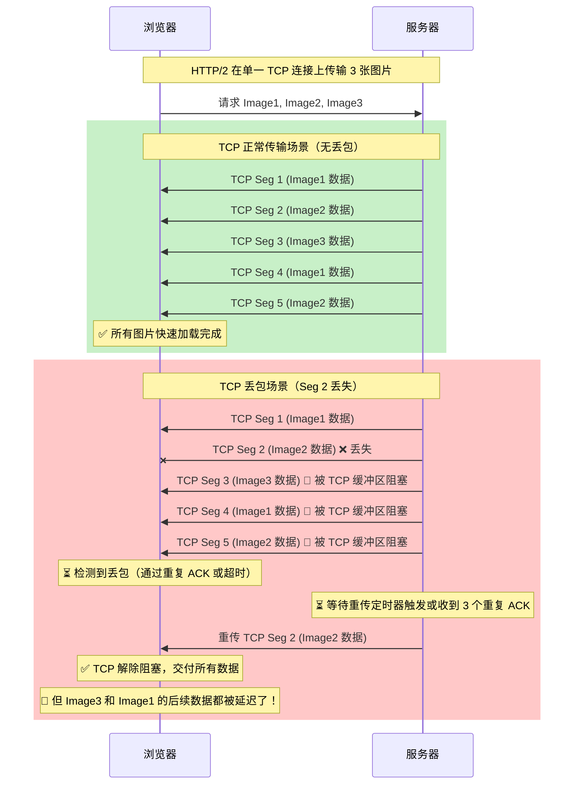
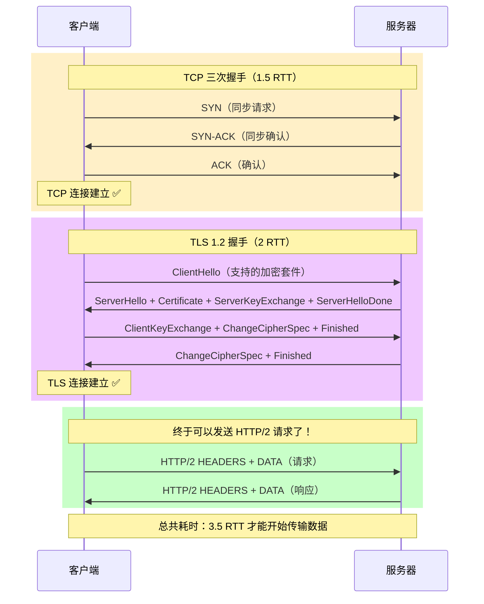
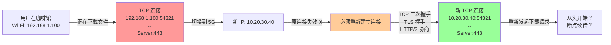
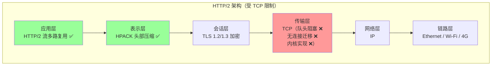
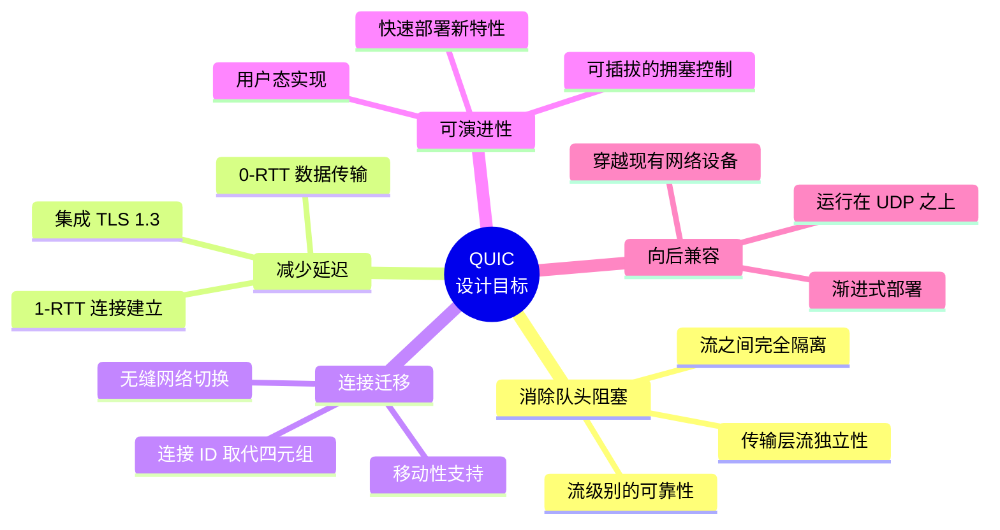
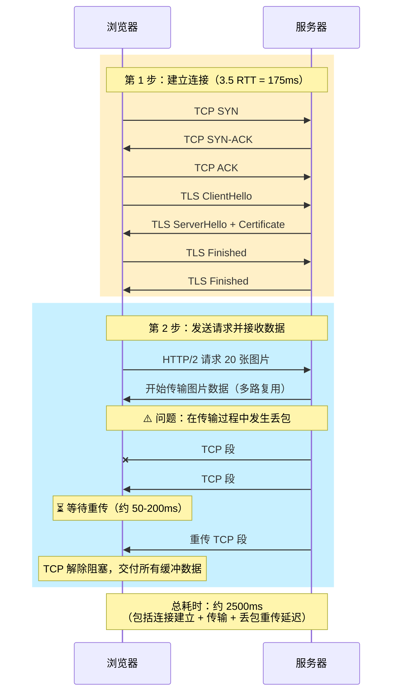
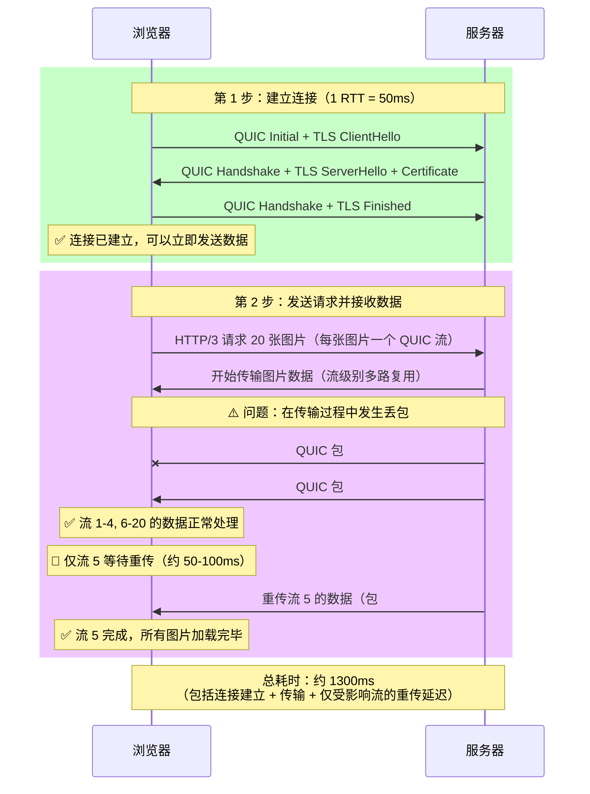

# 第一章：风暴前夜：Web 传输的极限与变革的火种

## 引言：互联网的黄金时代与隐忧

想象一下，你正在使用手机浏览一个新闻网站。页面上有数十张图片、多个视频、各种广告和动态内容。当你从咖啡馆的 Wi-Fi 切换到 5G 网络时，页面突然卡住了。当你终于看到页面加载完成时，已经过去了好几秒钟。这种体验，正是我们今天要探讨的问题的缩影。

在过去的三十年里，互联网经历了翻天覆地的变化。从最初简单的文本页面，到如今充满高清视频、实时互动和复杂应用的现代 Web。然而，支撑这一切的底层传输协议——**TCP/IP 和 HTTP**——却依然沿用着几十年前的设计思路。这就像是用一辆老式汽车的引擎，去驱动一架现代喷气式飞机。

本章将带你深入理解：
1. **TCP 和 HTTP/2 时代的性能瓶颈到底在哪里？**
2. **为什么 HTTP/2 只是"一半的革命"？**
3. **QUIC 诞生的必然性是什么？**

让我们从一个真实的场景开始。

---

## 一、场景重现：一个看似简单的页面加载

### 1.1 现代 Web 的复杂性

假设你正在访问一个典型的现代网站，比如一个在线新闻门户。这个页面包含：
- **1 个 HTML 文档**（50KB）
- **5 个 CSS 样式表**（每个约 30KB）
- **20 个 JavaScript 文件**（从小型工具库到大型框架，总计约 500KB）
- **50 张图片**（缩略图、广告、文章配图，总计约 2MB）
- **3 个视频**（嵌入的播放器和广告）
- **若干第三方资源**（分析脚本、字体文件、社交媒体插件等）

这个页面总共需要加载**超过 100 个资源**，数据量接近 **3MB**。

### 1.2 HTTP/2 的"多路复用"魔法

在 HTTP/1.1 时代，浏览器必须为每个资源建立一个单独的 TCP 连接（或者复用有限的几个连接，但会遭遇"队头阻塞"）。这意味着浏览器需要：
1. 为每个连接完成 **TCP 三次握手**（1.5 个 RTT）
2. 如果是 HTTPS，还需要完成 **TLS 握手**（再加 1-2 个 RTT）
3. 然后才能开始传输数据

这个过程非常缓慢，尤其是在高延迟的移动网络上。

**HTTP/2 的革命性改进** 正是为了解决这个问题。它引入了 **流（Stream）** 的概念：
- **单一 TCP 连接**：所有资源都通过同一个 TCP 连接传输
- **多路复用**：不同的资源可以"交错"传输，不必等待前一个资源完成
- **优先级控制**：可以指定哪些资源更重要，优先传输

这听起来完美无缺，对吧？让我们看看它在实践中的表现。

---

## 二、HTTP/2 的"阿喀琉斯之踵"：TCP 队头阻塞

### 2.1 理论与现实的差距

HTTP/2 在理论上实现了应用层的多路复用，但它有一个致命的弱点：**它依然运行在 TCP 之上**。

TCP 是一个面向连接、保证可靠传输的协议。它有一个核心特性：**严格的顺序传输**。这意味着：
1. TCP 会将数据切分成多个 **TCP 段（Segment）**
2. 每个段都有一个 **序列号（Sequence Number）**
3. 接收方必须按照序列号的顺序，将这些段重新组装成完整的数据流
4. 如果某个段丢失了，**后续所有的段都会被阻塞**，直到丢失的段被重传并到达

### 2.2 图解：TCP 队头阻塞

让我们用一个具体的例子来说明这个问题。假设你的浏览器正在通过 HTTP/2 加载一个图片库页面，页面上有 3 张图片：

### 2.3 问题的本质

在上面的例子中，虽然 **Image1** 和 **Image3** 的数据已经到达了接收方的 TCP 缓冲区，但由于 **Image2** 的某个 TCP 段丢失了，TCP 协议 **拒绝将任何后续数据交付给应用层**（即 HTTP/2 层）。

这就是所谓的 **TCP 队头阻塞（TCP Head-of-Line Blocking, HOL Blocking）**：
- **HTTP/2 在应用层实现了流的独立性**：理论上，Image1、Image2、Image3 是三个独立的流，互不干扰
- **但 TCP 在传输层"冻结"了所有数据**：一个流的丢包，会阻塞所有其他流的传输

这就像是一条单行道上的交通事故：即使你要去的目的地和事故地点完全无关，你也必须等待事故清理完毕后才能通过。

### 2.4 真实世界的影响

在真实的网络环境中，这个问题的影响非常严重：

| 网络条件 | 丢包率 | HTTP/2 性能影响 |
|---------|--------|----------------|
| 优质宽带 | 0.01% - 0.1% | 轻微影响 |
| 4G/5G 移动网络 | 0.5% - 2% | **显著性能下降**（10-30%） |
| 公共 Wi-Fi | 2% - 5% | **严重性能下降**（30-50%） |
| 拥塞/弱信号网络 | 5% - 10%+ | **性能崩溃**（50%+ 甚至不如 HTTP/1.1） |

> **关键洞察**：HTTP/2 的性能优势在"完美"网络中非常明显，但在真实世界（尤其是移动网络）中，TCP 队头阻塞会严重削弱甚至抵消其优势。

---

## 三、HTTP/2 的其他"隐藏成本"

除了 TCP 队头阻塞，HTTP/2 还有其他一些问题，这些问题在设计之初并未完全预见到。

### 3.1 建立连接的"漫长握手"

即使 HTTP/2 使用单一连接，建立这个连接的成本依然很高：

**问题分析**：
- 在 **50ms 延迟** 的网络中（典型的 4G 网络），建立一个 HTTPS/2 连接需要 **175ms**
- 在 **150ms 延迟** 的网络中（跨洋或卫星连接），需要 **525ms**
- 即使使用 **TLS 1.3**（握手减少到 1 RTT），总耗时仍需 **2.5 RTT**

> **对比思考**：如果有一种协议，能将握手时间减少到 **1 RTT 甚至 0 RTT**，会有多大的性能提升？这正是 QUIC 的核心优势之一。

### 3.2 连接迁移的"不可能任务"

TCP 连接由 **四元组** 唯一标识：
1. **源 IP 地址**
2. **源端口号**
3. **目标 IP 地址**
4. **目标端口号**

这意味着，如果你的设备发生了网络切换（例如从 Wi-Fi 切换到移动数据），**四元组中的至少一个元素会改变**，TCP 连接会 **立即中断**。

**真实世界的痛点**：
- **移动用户**：在地铁、公交车上频繁切换基站，每次切换都可能导致连接中断
- **多网卡设备**：笔记本电脑在 Wi-Fi 和有线网络之间切换
- **VPN 用户**：VPN 重连时，所有 TCP 连接都会中断

> **对比思考**：如果有一种协议，能让连接在网络切换时"无缝迁移"，就像 VoLTE 通话那样从不掉线，会带来怎样的用户体验提升？这正是 QUIC 的连接迁移特性。

### 3.3 操作系统内核的"枷锁"

TCP 协议栈通常由 **操作系统内核** 实现。这带来了几个问题：

1. **升级困难**：
   - 要部署新的 TCP 特性（如 TCP Fast Open、更先进的拥塞控制算法），需要升级操作系统内核
   - 在企业环境或移动设备上，这可能需要数年甚至不可能实现

2. **僵化的拥塞控制**：
   - 大多数系统使用 **Cubic** 或 **Reno** 拥塞控制算法，这些算法针对的是"传统"网络环境
   - 在高带宽延迟网络（如卫星、跨洋光缆）或高丢包率网络（如移动网络）中，表现并不理想
   - 更先进的算法（如 **BBR**）需要内核支持，部署缓慢

3. **缺乏灵活性**：
   - 应用程序 **无法控制** TCP 的行为细节（如重传策略、拥塞窗口调整）
   - 无法针对特定应用场景进行优化（如实时视频 vs. 大文件下载）

---

## 四、移动互联网时代的新挑战

### 4.1 网络环境的根本性变化

当 TCP/IP 在 20 世纪 70 年代被设计出来时，网络环境是这样的：
- **有线连接为主**：固定的 IP 地址，稳定的连接
- **低带宽**：几 Kbps 到几 Mbps
- **低延迟**：通常在局域网或城域网内
- **低丢包率**：有线连接相对可靠

今天的网络环境是这样的：
- **无线连接为主**：移动设备占据了绝大多数互联网流量
- **高带宽**：4G/5G 网络可达 100 Mbps 甚至 1 Gbps
- **高延迟**：移动网络基站切换、信号干扰、跨洋传输
- **高丢包率**：无线信号干扰、拥塞、快速移动
- **频繁切换**：在不同网络（Wi-Fi、4G、5G）之间频繁切换

### 4.2 关键指标对比

| 指标 | 1990 年代有线网络 | 2025 年移动网络 | 挑战 |
|-----|------------------|----------------|-----|
| **带宽** | 64 Kbps - 10 Mbps | 50 Mbps - 1 Gbps | 高带宽 × 高延迟 = 大缓冲区需求 |
| **延迟** | 10-50 ms | 30-200 ms | 握手成本变得不可接受 |
| **丢包率** | 0.01% - 0.1% | 0.5% - 5% | TCP 队头阻塞严重影响性能 |
| **连接稳定性** | 高（小时级） | 低（分钟级） | 频繁重连导致用户体验下降 |
| **网络切换** | 罕见 | 频繁 | TCP 连接无法迁移 |

### 4.3 用户体验的"隐形税"

这些技术问题最终转化为用户体验的实际成本：

**场景 1：移动购物**
- 用户在地铁上浏览电商网站
- 每次进出隧道，网络在 4G 和 Wi-Fi 之间切换
- **HTTP/2 表现**：每次切换后，所有商品图片都需要重新加载（TCP 连接中断）
- **用户感受**："这个网站好慢！"

**场景 2：在线会议**
- 用户从办公室走到会议室，从有线网络切换到 Wi-Fi
- **HTTP/2 表现**：WebSocket 连接（运行在 TCP 上）中断，会议掉线，需要重新加入
- **用户感受**："这个会议软件不稳定！"

**场景 3：视频直播**
- 用户在观看直播时，网络出现 1-2% 的丢包率
- **HTTP/2 表现**：TCP 队头阻塞导致视频播放卡顿、缓冲
- **用户感受**："这个视频平台垃圾！"

---

## 五、为什么 HTTP/2 是"一半的革命"？

### 5.1 成就与局限

HTTP/2 的设计者们做出了巨大的努力，取得了显著的成就：

**✅ HTTP/2 的成就**：
1. **应用层多路复用**：在逻辑上实现了请求/响应的并发传输
2. **头部压缩（HPACK）**：显著减少了 HTTP 头部的开销
3. **服务器推送**：允许服务器主动推送资源
4. **流优先级**：允许客户端指定资源的相对重要性

**❌ HTTP/2 的局限**：
1. **无法解决 TCP 队头阻塞**：这是传输层的问题，应用层无能为力
2. **无法改善握手延迟**：TCP + TLS 的握手流程依然冗长
3. **无法实现连接迁移**：TCP 的四元组限制无法突破
4. **无法控制拥塞控制**：完全依赖操作系统内核的实现

### 5.2 根本性的架构限制

HTTP/2 面临的核心问题是：**它试图在应用层解决传输层的问题**。这就像是在一栋老房子的外墙上贴新壁纸——表面看起来焕然一新,但地基和结构问题依然存在。

**问题的根源**：
- HTTP/2 在应用层实现了"虚拟的"流独立性
- 但所有数据最终都要通过 **单一的 TCP 字节流** 传输
- TCP 不知道也不关心 HTTP/2 的流，它只看到一串连续的字节
- 一旦某个字节丢失，TCP 就会阻塞整个字节流，连带阻塞所有 HTTP/2 流

---

## 六、变革的火种：QUIC 的诞生

### 6.1 重新思考传输层

Google 的工程师们在深入分析 HTTP/2 的性能瓶颈后，意识到：**要真正解决问题，必须重新设计传输层**。

这个想法听起来疯狂——TCP 已经运行了 40 多年，全球数十亿设备都在使用它。重新设计传输层，意味着：
1. 需要绕过操作系统内核（因为 TCP 栈在内核中）
2. 需要在用户态实现全新的传输协议
3. 需要能够快速部署和迭代（不能等待操作系统升级）
4. 需要与现有网络基础设施兼容

### 6.2 为什么选择 UDP？

**UDP（User Datagram Protocol）** 是另一个古老的传输层协议，但它与 TCP 完全不同：
- **无连接**：不需要握手，直接发送数据
- **不可靠**：不保证数据送达，不保证顺序，不重传
- **轻量级**：协议头部只有 8 字节（TCP 是 20-60 字节）
- **灵活**：对数据内容没有任何假设，完全由应用层决定如何使用

**UDP 的"原罪"与救���**：
- UDP 一直被认为"不适合"用于 Web 传输，因为它不可靠
- 但正是这种"不可靠"，给了我们 **完全的控制权**
- 我们可以在 UDP 之上 **从零开始** 构建一个新的、现代化的传输协议

**QUIC 的天才之处**：
- **选择 UDP 作为"容器"**：利用 UDP 的灵活性和广泛支持（几乎所有网络设备都支持 UDP）
- **在用户态实现可靠传输**：重新设计确认、重传、流量控制、拥塞控制
- **原生支持多路复用**：从一开始就在传输层设计"流"的概念，真正消除队头阻塞
- **集成加密**：将 TLS 1.3 深度集成到传输层，减少握手往返

### 6.3 QUIC 的革命性设计目标

---

## 七、一个真实的对比：加载图片库

让我们通过一个具体的例子，直观对比 HTTP/2 和 HTTP/3（基于 QUIC）的性能差异。

**场景设置**：
- 网页包含 **20 张图片**，每张 100KB
- 网络条件：**50ms 延迟，1% 丢包率**（典型的 4G 网络）
- 带宽：**10 Mbps**（足够高，不是瓶颈）

### 7.1 HTTP/2 的表现

**性能分析**：
1. **连接建立**：175ms（3.5 RTT）
2. **数据传输**：理想情况下约 160ms（2MB ÷ 10Mbps）
3. **丢包影响**：每次丢包导致 50-200ms 的额外延迟，影响 **所有流**
4. **预期丢包次数**：在 1% 丢包率下，传输 2MB 数据（约 1400 个 TCP 段），预期丢包 14 次
5. **总耗时**：约 **2500ms**

### 7.2 HTTP/3 的表现

**性能分析**：
1. **连接建立**：50ms（1 RTT），**节省 125ms**
2. **数据传输**：理想情况下约 160ms（与 HTTP/2 相同）
3. **丢包影响**：每次丢包只影响 **对应的流**，其他流不受影响
4. **预期丢包次数**：相同的 14 次
5. **总耗时**：约 **1300ms**，**比 HTTP/2 快 48%**

### 7.3 关键差异总结

| 维度 | HTTP/2 (TCP) | HTTP/3 (QUIC) | 优势 |
|-----|-------------|--------------|-----|
| **连接建立** | 3.5 RTT (175ms) | 1 RTT (50ms) | **-71%** |
| **丢包影响范围** | 所有流阻塞 | 仅受影响的流 | **隔离性** |
| **丢包恢复时间** | 50-200ms × 流数量 | 50-100ms × 受影响流 | **-50%** |
| **网络切换** | 连接中断，重新建立 | 连接 ID 迁移，无感知 | **连续性** |
| **总体性能** | 2500ms | 1300ms | **+48%** |

---

## 八、本章总结：从问题到方案

### 8.1 我们发现的问题

1. **TCP 队头阻塞**：
   - HTTP/2 的应用层多路复用无法解决 TCP 传输层的顺序依赖
   - 一个流的丢包会"冻结"所有其他流

2. **握手延迟过高**：
   - TCP + TLS 需要 2.5-3.5 个 RTT 才能开始传输数据
   - 在高延迟网络中不可接受

3. **连接无法迁移**：
   - TCP 的四元组限制导致网络切换时连接中断
   - 移动用户体验严重受损

4. **协议僵化**：
   - TCP 在操作系统内核中实现，升级困难
   - 无法快速部署新特性和优化

### 8.2 QUIC 的解决方案预览

QUIC 通过以下核心设计，从根本上解决了这些问题：

1. **基于 UDP 的用户态实现**：
   - 绕过内核限制，快速迭代
   - 完全控制传输行为

2. **原生的流多路复用**：
   - 在传输层设计"流"，每个流独立可靠传输
   - 彻底消除队头阻塞

3. **集成 TLS 1.3 的快速握手**：
   - 1-RTT 连接建立（首次连接）
   - 0-RTT 数据传输（重连场景）

4. **连接 ID 取代四元组**：
   - 网络切换时连接无缝迁移
   - 真正的"永不掉线"

5. **可插拔的拥塞控制**：
   - 支持 BBR、Cubic 等多种算法
   - 针对不同场景灵活选择

### 8.3 展望

在接下来的章节中，我们将深入探索 QUIC 的每一个核心特性：

- **第二章**：QUIC 协议的整体架构和设计哲学
- **第三章**：如何实现 1-RTT 和 0-RTT 握手
- **第四章**：连接迁移的魔法是如何实现的
- **第五章**：QUIC 流的详细机制
- **第六章**：可靠性、确认和流量控制
- **第七章**：拥塞控制和恢复策略
- **第八章**：HTTP/3 如何映射到 QUIC
- **第九章**：QPACK 头部压缩
- **第十章**：服务器推送等高级特性
- **第十一章**：实战部署和调试
- **第十二章**：未来展望

让我们开始这场激动人心的技术之旅吧！🚀

---

## 参考资料

- RFC 9000: QUIC: A UDP-Based Multiplexed and Secure Transport
- RFC 9114: HTTP/3
- RFC 7540: Hypertext Transfer Protocol Version 2 (HTTP/2)
- RFC 793: Transmission Control Protocol (TCP)
- Chromium QUIC 实现文档
- "HTTP/2 in Action" by Barry Pollard
- "High Performance Browser Networking" by Ilya Grigorik
