# 第二章：QUIC 协议鸟瞰：构建于 UDP 之上的未来

## 引言：一次大胆的架构革新

在上一章中，我们看到了 TCP/HTTP2 时代的种种限制。现在，让我们揭开 QUIC 的神秘面纱，看看这个"激进"的协议是如何从根本上重新定义互联网传输的。

QUIC（Quick UDP Internet Connections）不是对现有协议的"修修补补"，而是一次 **从零开始的重新设计**。它的设计哲学可以用一句话概括：

> **"如果我们今天重新设计互联网传输层，知道了 TCP 所有的问题和限制，我们会怎么做？"**

这一章，我们将从宏观视角理解 QUIC 的整体架构、核心设计哲学，以及它与 HTTP/2 的根本性差异。

---

## 一、QUIC 的"身份证"：基本特征

### 1.1 协议定位

让我们先明确 QUIC 在网络协议栈中的位置：

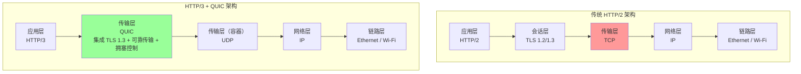

**关键观察**：
1. **HTTP/2 架构**：传输层（TCP）、安全层（TLS）、应用层（HTTP/2）是 **三个独立的层**，各自握手、各自管理状态
2. **HTTP/3 架构**：QUIC **融合了传输、安全、拥塞控制**，成为一个"全能型"传输层
3. UDP 仅仅是一个"容器"，提供基本的端口多路复用和校验和功能

### 1.2 QUIC 的"出生证明"

**正式名称**：QUIC（Quick UDP Internet Connections）
**标准化组织**：IETF（Internet Engineering Task Force）
**核心 RFC 文档**：
- **RFC 9000**：QUIC 传输层协议（Transport Protocol）
- **RFC 9001**：QUIC 与 TLS 1.3 的集成（Using TLS to Secure QUIC）
- **RFC 9002**：QUIC 的丢包检测和拥塞控制（Loss Detection and Congestion Control）
- **RFC 9114**：HTTP/3（基于 QUIC 的 HTTP 映射）
- **RFC 9204**：QPACK（HTTP/3 头部压缩）

**版本演进**：
- **Google QUIC（gQUIC）**：2012-2018 年，Google 内部实验版本，多次迭代（Q043、Q046、Q050 等）
- **IETF QUIC**：2018 年开始标准化，2021 年 5 月发布 RFC 9000（版本 1）

### 1.3 核心设计目标

QUIC 的设计围绕五个核心目标展开：

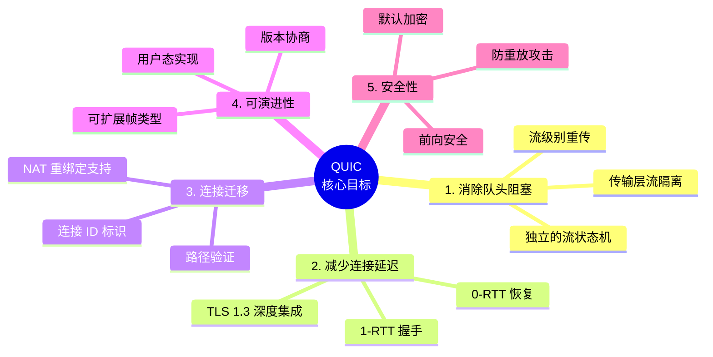

---

## 二、为什么选择 UDP？深入剖析

### 2.1 UDP 的"原罪"与"救赎"

UDP 长期以来被认为是"不可靠"的协议，只适合那些能容忍丢包的应用（如视频通话、在线游戏）。那么，为什么 QUIC 要选择 UDP 作为基础呢？

**UDP 的三大"原罪"**：
1. **不可靠**：不保证数据送达，不重传
2. **无序**：数据报可能乱序到达
3. **无连接**：没有连接状态，没有流量控制和拥塞控制

**但这些"缺陷"正是 QUIC 需要的"自由"**：

| TCP 的"枷锁" | UDP 的"自由" | QUIC 的利用 |
|-------------|-------------|------------|
| 内核实现，无法修改 | 极简协议，用户态可控 | 在用户态实现所有逻辑 |
| 字节流抽象，无消息边界 | 数据报抽象，天然边界 | 自定义帧格式和包结构 |
| 单一字节流，流之间耦合 | 独立数据报，天然隔离 | 实现真正独立的流 |
| 固定的拥塞控制算法 | 无拥塞控制 | 可插拔的算法选择 |
| 依赖四元组标识连接 | 无连接概念 | 自定义连接 ID |

### 2.2 UDP 的广泛支持

选择 UDP 还有一个非常实际的原因：**网络基础设施的兼容性**。

**现实世界的网络环境**：
- **防火墙和 NAT**：几乎所有防火墙都支持 UDP（因为 DNS、VoIP 等关键服务使用 UDP）
- **中间盒（Middlebox）**：路由器、负载均衡器等设备对 UDP 的处理相对"透明"，不会像对 TCP 那样进行复杂的状态跟踪和优化（有时这些"优化"反而是问题）
- **穿透性**：UDP 更容易穿透 NAT（网络地址转换）

**对比：如果 QUIC 试图发明一个全新的传输层协议（不基于 UDP）**：
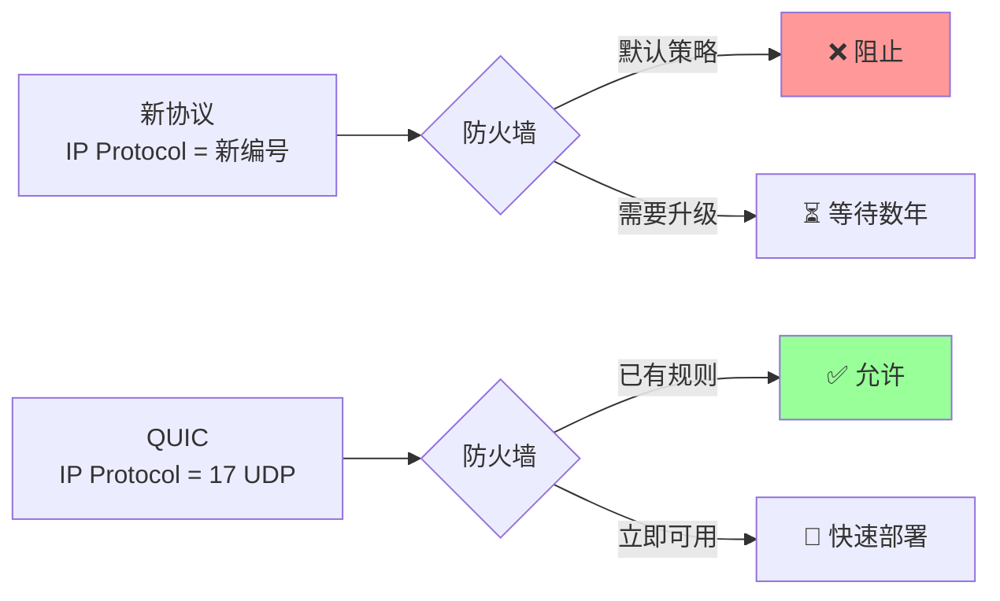

### 2.3 用户态实现的革命性意义

**TCP 的困境**：
- TCP 协议栈通常在 **操作系统内核** 中实现
- 要部署新特性（如 TCP Fast Open、BBR 拥塞控制），需要：
  1. 修改内核代码
  2. 等待操作系统发行版更新
  3. 等待用户升级操作系统（可能需要数年）
  4. 在企业环境中，可能永远无法升级

**QUIC 的自由**：
- QUIC 完全在 **用户态（应用程序空间）** 实现
- 浏览器、App、服务器可以随时升级 QUIC 实现
- 新特性和优化可以在 **数周甚至数天** 内部署到数十亿用户

**实际案例**：
- **Google Chrome**：自动更新周期约 6 周，意味着 QUIC 的新特性可以在 6 周内覆盖全球用户
- **TCP BBR**：2016 年发布，截至 2025 年，仍然只有少数 Linux 服务器启用
- **QUIC BBRv2**：可以通过浏览器和 CDN 的更新快速部署

---

## 三、QUIC 的"X 光片"：核心架构

### 3.1 包（Packet）与帧（Frame）的两层结构

QUIC 使用一个优雅的两层结构来组织数据：

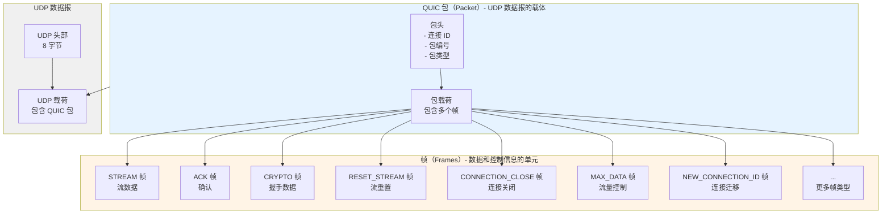

**关键设计**：
1. **UDP 数据报**：基础容器，提供端口和校验和
2. **QUIC 包**：包含包头（连接 ID、包编号等）和载荷
3. **QUIC 帧**：包载荷中可以有 **多个帧**，每个帧可以是：
   - **STREAM 帧**：承载应用数据（HTTP/3 请求和响应）
   - **ACK 帧**：确认收到的包
   - **CRYPTO 帧**：TLS 握手数据
   - **控制帧**：流量控制、连接管理等

**与 TCP 的根本性区别**：
- **TCP**：纯字节流，没有消息边界，应用层需要自己处理"粘包"问题
- **QUIC**：基于帧的结构，每个帧有明确的类型和边界，天然支持多路复用

### 3.2 一个 QUIC 包的真实样子

让我们看一个实际的 QUIC 包的结构（简化版）：

```
+--------------------------------------------------+
|                UDP 头部（8 字节）                  |
+--------------------------------------------------+
|                                                  |
|              QUIC 包头（可变长度）                 |
|                                                  |
|  - 头部形式（Header Form，1 bit）                 |
|  - 固定位（Fixed Bit，1 bit）                     |
|  - 包类型（Long/Short，2 bits）                   |
|  - 连接 ID 长度（可变）                            |
|  - 目标连接 ID（0-20 字节）                        |
|  - 源连接 ID（0-20 字节，仅长包头）                |
|  - 版本（4 字节，仅长包头）                        |
|  - 包编号长度（2 bits）                            |
|  - 包编号（1-4 字节）                              |
|                                                  |
+--------------------------------------------------+
|                                                  |
|              QUIC 包载荷（加密）                   |
|                                                  |
|  +--------------------------------------------+  |
|  | STREAM 帧 (Stream ID 4, Offset 0)         |  |
|  | 类型 = 0x08, Stream ID = 4, Length = 100   |  |
|  | [100 字节的 HTTP/3 数据]                   |  |
|  +--------------------------------------------+  |
|  +--------------------------------------------+  |
|  | ACK 帧                                     |  |
|  | 类型 = 0x02, Largest Acked = 42            |  |
|  | ACK Ranges: 40-42, 35-37                   |  |
|  +--------------------------------------------+  |
|  +--------------------------------------------+  |
|  | MAX_DATA 帧                                |  |
|  | 类型 = 0x10, Max Data = 1048576            |  |
|  +--------------------------------------------+  |
|                                                  |
+--------------------------------------------------+
|           包完整性校验（16 字节）                  |
+--------------------------------------------------+
```

**几个关键观察**：
1. **一个包可以包含多个帧**：上面的例子中，一个包同时包含了数据（STREAM 帧）、确认（ACK 帧）、流量控制（MAX_DATA 帧）
2. **整个载荷是加密的**：除了包头的少数字段，所有内容都经过 AEAD（Authenticated Encryption with Associated Data）加密
3. **包编号是独立的**：每个包都有一个单调递增的包编号（用于确认和丢包检测）

### 3.3 流（Stream）：QUIC 的核心抽象

**流的概念** 是 QUIC 中最重要的抽象。让我们深入理解它：

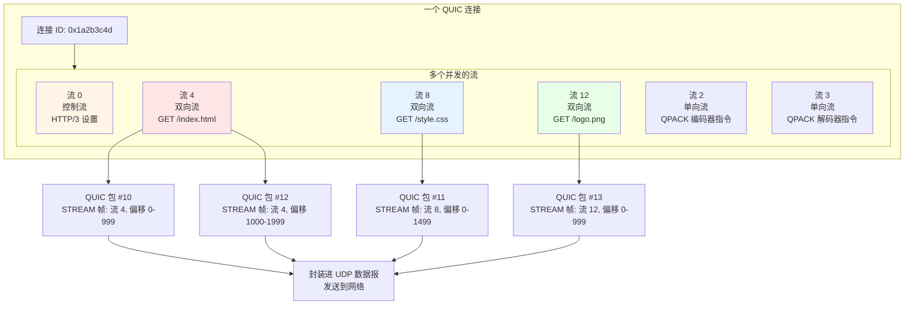

**流的关键特性**：
1. **独立性**：每个流有自己的流 ID、数据缓冲区、流量控制状态
2. **并发性**：多个流可以同时传输，数据帧可以交错出现在不同的 QUIC 包中
3. **顺序保证**：**在单个流内**，数据按照偏移量（Offset）顺序交付；**流之间**完全独立
4. **轻量级**：创建一个新流不需要任何握手，只需在 STREAM 帧中使用一个新的流 ID

**与 HTTP/2 的对比**：

| 特性 | HTTP/2 流（应用层） | QUIC 流（传输层） |
|-----|------------------|-----------------|
| **实现层次** | 应用层（HTTP/2 协议） | 传输层（QUIC 协议） |
| **独立性** | 逻辑独立，传输耦合 | 传输层真正独立 |
| **丢包影响** | 一个流丢包，所有流阻塞 | 仅影响对应的流 |
| **重传粒度** | TCP 段（包含多个流） | STREAM 帧（精确到流和偏移） |
| **流量控制** | 连接级 + 流级 | 连接级 + 流级（但在传输层实现） |

---

## 四、QUIC 的"超能力"：核心特性详解

### 4.1 特性 #1：原生多路复用，真正消除队头阻塞

我们已经在第一章中看到了 TCP 队头阻塞的问题。现在让我们看看 QUIC 是如何彻底解决这个问题的。

**问题回顾**：HTTP/2 在应用层实现了多路复用，但 TCP 在传输层依然是单一字节流，一个 TCP 段丢失会阻塞所有 HTTP/2 流。

**QUIC 的解决方案**：在传输层就实现流的独立性。

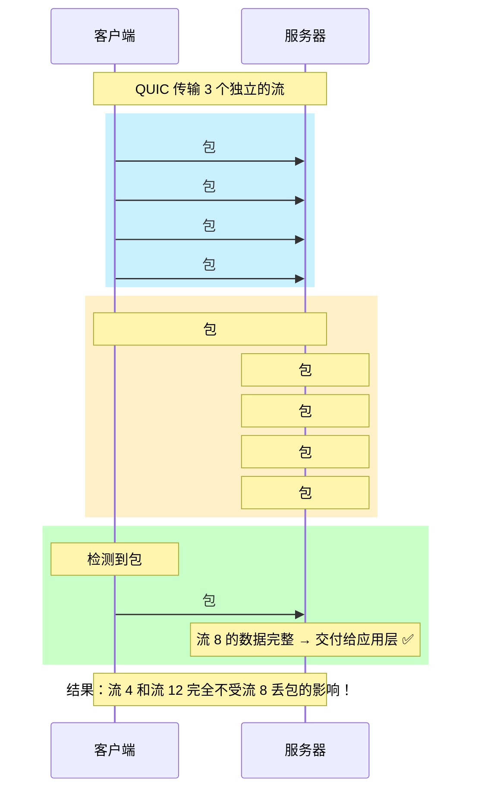

**技术细节**：
1. **每个 STREAM 帧包含流 ID 和偏移量**：接收方可以准确知道这段数据属于哪个流的哪个位置
2. **流之间完全隔离**：流 8 的数据丢失，不会阻止流 4 和流 12 的数据被交付到应用层
3. **重传也是流级别的**：只重传丢失的流的数据，不影响其他流

### 4.2 特性 #2：闪电般的连接建立（1-RTT 和 0-RTT）

QUIC 将 TLS 1.3 握手深度集成到传输层，实现了极快的连接建立。

**首次连接（1-RTT）**：

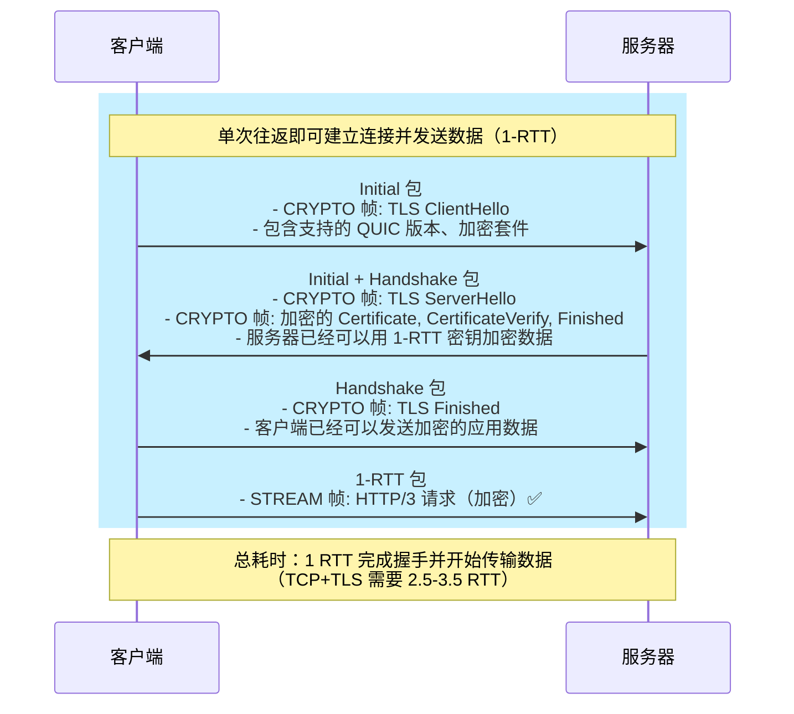

**重连（0-RTT）**：

如果客户端之前连接过服务器，可以利用 **会话恢复（Session Resumption）** 实现 0-RTT：

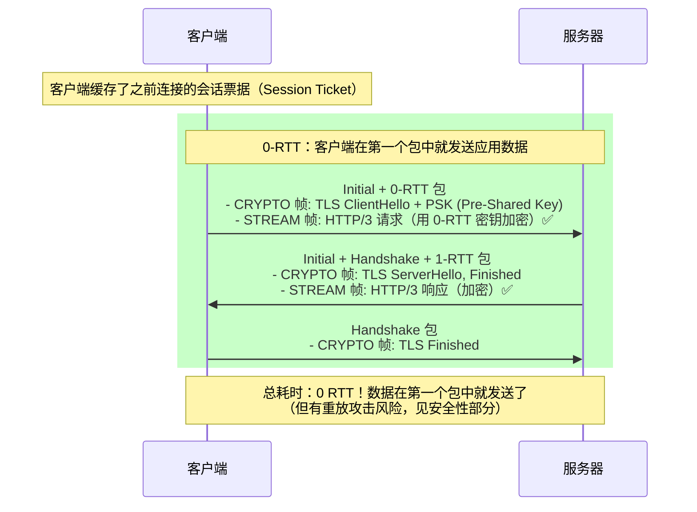

**性能对比**：

| 场景 | TCP + TLS 1.2 | TCP + TLS 1.3 | QUIC 1-RTT | QUIC 0-RTT |
|-----|--------------|--------------|-----------|-----------|
| **握手 RTT** | 3-4 RTT | 2-3 RTT | 1 RTT | 0 RTT |
| **50ms 网络** | 150-200ms | 100-150ms | 50ms | 0ms |
| **200ms 网络** | 600-800ms | 400-600ms | 200ms | 0ms |

### 4.3 特性 #3：连接迁移（Connection Migration）

QUIC 使用 **连接 ID（Connection ID）** 而不是四元组来标识连接，这使得连接可以在网络变化时无缝迁移。

**TCP 的困境**：

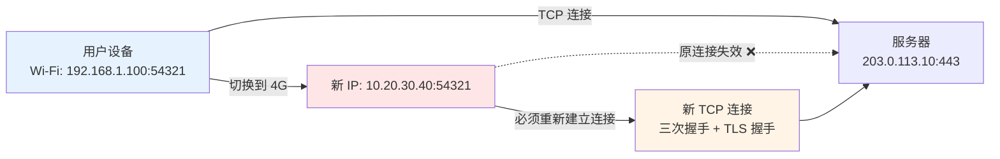

**QUIC 的魔法**：

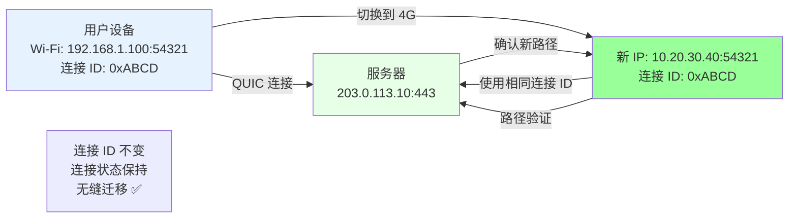

**技术细节**：
1. **连接 ID**：一个随机生成的标识符（通常 8-20 字节），用于标识 QUIC 连接
2. **路径验证**：客户端从新 IP 地址发送包含 PATH_CHALLENGE 帧的包，服务器返回 PATH_RESPONSE 帧确认
3. **状态保持**：所有流的状态、流量控制窗口、拥塞控制状态都保持不变
4. **零感知**：应用层（HTTP/3）完全不知道网络切换发生了

### 4.4 特性 #4：前向安全与默认加密

**QUIC 的安全设计哲学**：
- **默认加密**：除了极少数字段（如连接 ID、版本），所有内容都是加密的
- **前向安全（Forward Secrecy）**：即使长期密钥泄露，历史通信记录也无法被解密
- **防重放攻击**：特别是在 0-RTT 场景下的防护

**加密范围对比**：

| 协议 | 明文部分 | 加密部分 | 备注 |
|-----|---------|---------|------|
| **TCP + TLS** | TCP 头部（20-60 字节）<br/>包括序列号、ACK 号、窗口大小 | TLS Record 层载荷 | TCP 头部信息可被中间盒观察和修改 |
| **QUIC** | UDP 头部（8 字节）<br/>连接 ID<br/>包编号（部分加密） | 几乎所有内容<br/>包括 ACK 帧、流量控制帧 | 中间盒无法观察或修改大部分信息 |

**0-RTT 的权衡**：
- **优势**：零延迟，数据在第一个包中发送
- **风险**：可能遭受 **重放攻击**（Replay Attack）
- **缓解措施**：
  1. 服务器可以选择拒绝 0-RTT 数据
  2. 0-RTT 数据应该是 **幂等的**（如 GET 请求，而不是 POST）
  3. 使用 **单次使用票据（Single-Use Tickets）**

### 4.5 特性 #5：可演进性与版本协商

QUIC 设计时就考虑了未来的演进需求：

**版本协商机制**：

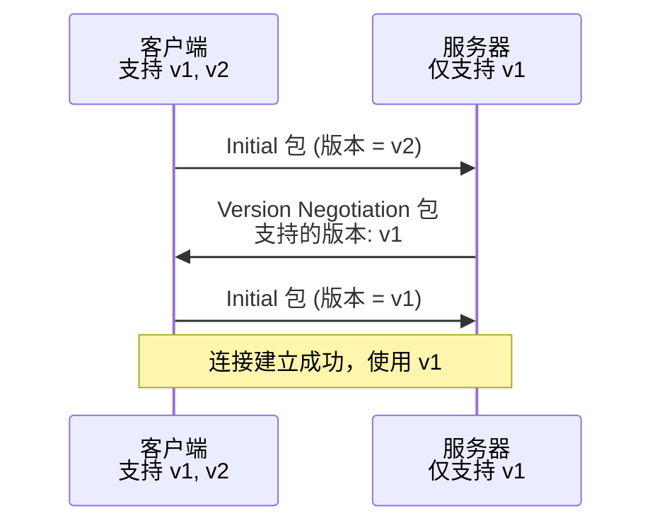

**可扩展的帧类型**：
- QUIC 使用 **可变长度整数（Variable-Length Integer）** 编码帧类型
- 新的帧类型可以随时添加，老版本会忽略不认识的帧类型（通过帧类型的最高位标识）

**用户态实现的优势**：
- **快速迭代**：浏览器和服务器可以独立升级
- **A/B 测试**：可以在不同用户群体中测试新特性
- **渐进式部署**：新特性可以逐步推出，不需要等待全球部署

---

## 五、QUIC vs. TCP+TLS+HTTP/2：全面对比

### 5.1 十个维度的深度对比

| 维度 | TCP + TLS + HTTP/2 | QUIC + HTTP/3 | 优势方 |
|-----|-------------------|--------------|-------|
| **1. 队头阻塞** | ❌ 传输层字节流，一个段丢失阻塞所有流 | ✅ 流级别独立，仅影响对应流 | **QUIC** |
| **2. 握手延迟** | 🔶 2.5-3.5 RTT（TCP + TLS 1.2/1.3） | ✅ 1-RTT（首次），0-RTT（重连） | **QUIC** |
| **3. 连接迁移** | ❌ 四元组标识，网络切换连接中断 | ✅ 连接 ID 标识，无缝迁移 | **QUIC** |
| **4. 拥塞控制** | 🔶 内核实现，升级困难，算法固定 | ✅ 用户态实现，可插拔算法 | **QUIC** |
| **5. 多路复用** | 🔶 应用层实现，受 TCP 限制 | ✅ 传输层原生支持 | **QUIC** |
| **6. 加密范围** | 🔶 TLS 仅加密应用数据，TCP 头部明文 | ✅ 几乎全部加密（除连接 ID、版本） | **QUIC** |
| **7. 协议演进** | ❌ TCP 在内核中，需操作系统升级 | ✅ 用户态实现，快速迭代 | **QUIC** |
| **8. 丢包恢复** | 🔶 重传整个 TCP 段，影响多个流 | ✅ 流级别重传，精确到偏移量 | **QUIC** |
| **9. NAT 穿透** | 🔶 依赖 ALG（应用层网关），复杂 | ✅ 连接 ID 简化了 NAT 重绑定 | **QUIC** |
| **10. 部署复杂度** | ✅ 广泛支持，成熟稳定 | 🔶 需要服务器和客户端升级 | **TCP** |

### 5.2 协议栈架构对比图

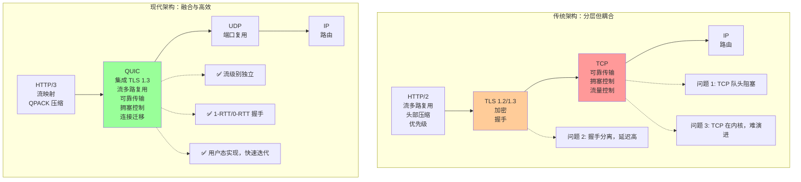

---

## 六、真实世界的 QUIC：性能案例

### 6.1 Google 的大规模部署数据

Google 是 QUIC 的发明者和最大的部署者。以下是他们公开的性能数据：

| 场景 | 性能提升 | 备注 |
|-----|---------|------|
| **Google 搜索（桌面）** | 页面加载时间 -3% | 在良好网络条件下 |
| **Google 搜索（移动）** | 页面加载时间 -8% | 在移动网络（高延迟、丢包）下 |
| **YouTube 视频** | 重新缓冲减少 -30% | 尤其在网络切换场景 |
| **YouTube（移动）** | 视频启动时间 -15% | 利用 0-RTT 和连接迁移 |

### 6.2 Cloudflare 的测量报告

Cloudflare 在 2020 年发布的报告显示：

| 网络条件 | HTTP/2 vs. HTTP/3 性能差异 |
|---------|---------------------------|
| **0% 丢包，低延迟** | HTTP/3 快 0-5% |
| **1% 丢包，50ms 延迟** | HTTP/3 快 15-25% |
| **2% 丢包，100ms 延迟** | HTTP/3 快 30-50% |
| **5% 丢包，150ms 延迟** | HTTP/3 快 50-100% |

**关键洞察**：QUIC/HTTP3 的优势在 **高丢包率和高延迟** 网络中最为显著，这正是移动网络的典型特征。

### 6.3 一个具体的场景：移动购物

假设一个电商网站的商品页面包含：
- 1 个 HTML 文档
- 5 个 CSS 文件
- 10 个 JavaScript 文件
- 30 张商品图片

**用户行为**：用户在地铁上浏览，网络在 4G（100ms 延迟，1% 丢包）和 Wi-Fi（50ms 延迟，0.5% 丢包）之间切换。

**HTTP/2 的表现**：
1. 初始加载：3.5 RTT 握手 + 数据传输 = 约 3-4 秒
2. 第一次网络切换：连接中断，重新握手 = 额外 2-3 秒
3. 受丢包影响：多次阻塞，额外 1-2 秒
4. **总体感受**：页面加载缓慢，切换网络时明显卡顿

**HTTP/3 的表现**：
1. 初始加载：1 RTT 握手 + 数据传输 = 约 1.5-2 秒
2. 第一次网络切换：连接迁移，用户无感知 = 几乎 0 延迟
3. 受丢包影响：仅个别图片略有延迟 = 额外 0.5 秒
4. **总体感受**：页面加载迅速，网络切换完全无感知

---

## 七、QUIC 的挑战与权衡

尽管 QUIC 优势明显，但它也面临一些挑战和权衡：

### 7.1 CPU 开销

**问题**：
- QUIC 在用户态实现，所有加密、解密、包处理都在应用程序中完成
- TCP 的部分工作由内核和网卡硬件（如 TSO、GRO）分担

**实测数据**：
- QUIC 的 CPU 开销通常比 TCP+TLS 高 **10-30%**（取决于实现质量）
- 但随着硬件加速（如 AES-NI）和实现优化，差距在缩小

**权衡**：
- 对于高流量服务器，CPU 成本是一个考虑因素
- 但用户体验的提升通常被认为值得这个成本

### 7.2 UDP 限速

**问题**：
- 一些网络（如企业网络、公共 Wi-Fi）对 UDP 流量有限速或阻断
- UDP 在某些中间盒中的优先级低于 TCP

**现状**：
- 截至 2025 年，约 **95%+** 的网络支持 UDP/QUIC
- 主要浏览器都会自动降级到 HTTP/2（如果 QUIC 失败）

### 7.3 缺乏硬件加速

**问题**：
- TCP 有大量的硬件支持（如网卡的 TSO、LRO、校验和卸载）
- QUIC 是新协议，硬件加速尚在发展中

**趋势**：
- 网卡厂商（如 Intel、Mellanox）已开始支持 QUIC 硬件卸载
- 预计 2025-2027 年，QUIC 硬件加速将逐步普及

### 7.4 调试和监控复杂性

**问题**：
- TCP 的调试工具（如 tcpdump、Wireshark）成熟且广泛使用
- QUIC 的加密特性使得传统抓包工具难以直接查看内容（需要密钥）

**解决方案**：
- 使用 **SSLKEYLOGFILE** 环境变量导出密钥
- 使用 **qlog**（QUIC 日志格式）记录连接事件
- 工具链正在快速成熟（Wireshark 对 QUIC 的支持已相当完善）

---

## 八、本章总结

### 8.1 关键要点

1. **QUIC 是一次架构革新**：
   - 不是对 TCP 的修补，而是从零开始重新设计传输层
   - 选择 UDP 作为"容器"，在用户态实现所有逻辑

2. **QUIC 融合了多个层次的功能**：
   - 传输层：可靠传输、流多路复用、流量控制、拥塞控制
   - 安全层：深度集成 TLS 1.3，默认加密
   - 应用层：为 HTTP/3 提供了理想的传输基础

3. **QUIC 的核心优势**：
   - ✅ **消除队头阻塞**：流级别独立
   - ✅ **减少延迟**：1-RTT/0-RTT 握手
   - ✅ **连接迁移**：网络切换无感知
   - ✅ **可演进性**：用户态实现，快速迭代
   - ✅ **安全性**：默认加密，前向安全

4. **QUIC 的权衡**：
   - CPU 开销略高（但在可接受范围内）
   - 需要客户端和服务器双方支持
   - 调试工具链仍在成熟中

### 8.2 与 HTTP/2 的根本性差异

**HTTP/2 是"一半的革命"**：
- ✅ 在应用层实现了流多路复用、头部压缩
- ❌ 但受制于 TCP，无法解决队头阻塞、握手延迟、连接迁移等问题

**QUIC/HTTP3 是"完整的革命"**：
- ✅ 在传输层重新设计，从根本上解决了 TCP 的限制
- ✅ 为现代 Web（移动优先、低延迟、高可靠性）量身定制

### 8.3 下一步

在后续章节中，我们将深入探讨 QUIC 的每一个核心机制：

- **第三章**：QUIC 如何实现 1-RTT 和 0-RTT 握手？TLS 1.3 是如何集成的？
- **第四章**：连接迁移的完整流程，路径验证是如何工作的？
- **第五章**：流的详细设计，流 ID、状态机、生命周期
- **第六章**：可靠性机制，ACK 设计，流量控制的双层模型
- **第七章**：拥塞控制算法，BBR vs. Cubic，丢包恢复
- **后续章节**：HTTP/3、QPACK、部署实践

让我们继续这场激动人心的技术探索之旅！ 🚀

---

## 参考资料

- RFC 9000: QUIC: A UDP-Based Multiplexed and Secure Transport
- RFC 9001: Using TLS to Secure QUIC
- RFC 9002: QUIC Loss Detection and Congestion Control
- "The QUIC Transport Protocol: Design and Internet-Scale Deployment" (SIGCOMM 2017)
- Cloudflare Blog: "HTTP/3: the past, the present, and the future"
- Google QUIC Design Document
