# 第三章：闪电连接：QUIC 的 1-RTT 与 0-RTT 握手

## 引言：延迟是用户体验的杀手

想象一下，你在地铁上，手机信号时好时坏。你打开一个新闻 App，等待了 2 秒钟，页面还在转圈...你放弃了，关掉 App。这个场景每天都在发生数百万次。

**延迟（Latency）是影响用户体验的核心因素之一**。研究表明：
- 页面加载时间每增加 **100ms**，转化率下降 **1%**
- 页面加载时间超过 **3 秒**，**53%** 的移动用户会放弃
- 每减少 **100ms** 延迟，亚马逊的收入增长 **1%**

而在传统的 TCP+TLS 架构中，建立一个安全连接需要 **2.5-3.5 个 RTT**（Round-Trip Time，往返时间）。在 100ms 延迟的移动网络中，这意味着用户需要等待 **250-350ms** 才能开始传输数据——还没开始加载任何内容！

QUIC 通过深度集成 TLS 1.3，将这个时间缩短到 **1 RTT**（首次连接）甚至 **0 RTT**（重连场景）。本章将详细剖析这个"魔法"是如何实现的。

---

## 一、回顾：TCP+TLS 的"漫长握手"

在深入 QUIC 的握手机制之前，让我们先清楚地理解传统方式的问题。

### 1.1 TCP 三次握手（1.5 RTT）

TCP 是面向连接的协议，在传输数据之前，必须通过"三次握手"建立连接：

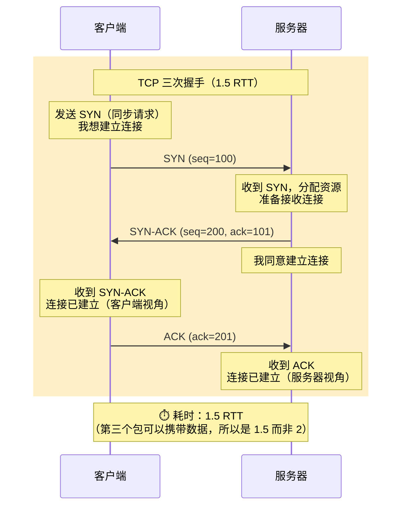

**为什么需要三次握手？**
1. **同步序列号**：双方需要交换初始序列号（ISN），用于后续的数据顺序管理
2. **防止历史连接**：确保不会接受过期的连接请求（如网络延迟导致的重复 SYN）
3. **资源分配**：服务器需要为连接分配资源（内存、端口等）

### 1.2 TLS 1.2 握手（额外 2 RTT）

如果使用 HTTPS，在 TCP 连接建立后，还需要进行 TLS 握手：

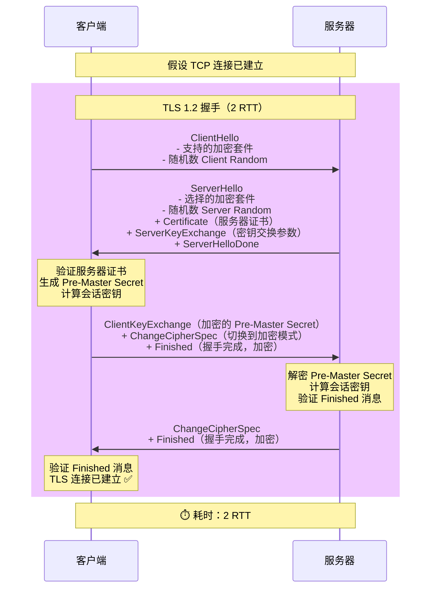

### 1.3 TLS 1.3 握手（改进到 1 RTT）

TLS 1.3 进行了优化，将握手减少到 1 RTT：

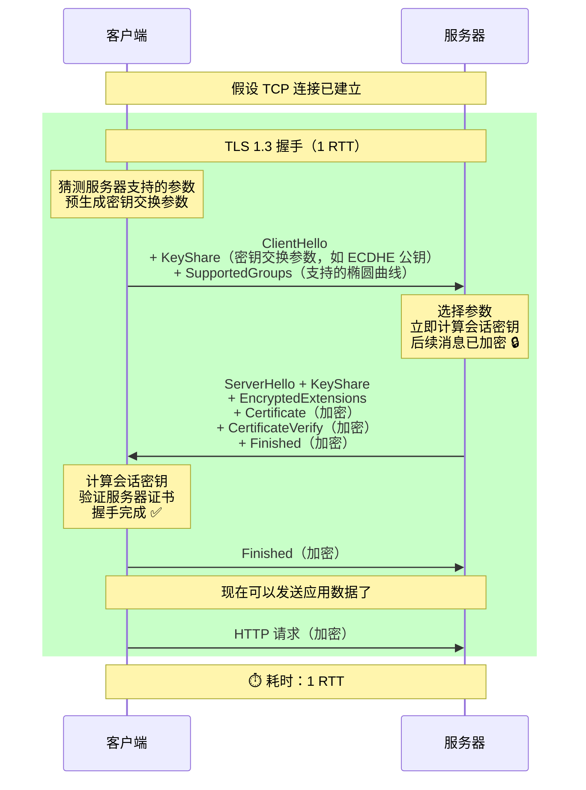

### 1.4 总耗时对比

| 场景 | 握手步骤 | 总 RTT | 50ms 网络 | 100ms 网络 |
|-----|---------|--------|----------|-----------|
| **TCP + TLS 1.2** | TCP (1.5) + TLS (2) | 3.5 RTT | 175ms | 350ms |
| **TCP + TLS 1.3** | TCP (1.5) + TLS (1) | 2.5 RTT | 125ms | 250ms |
| **QUIC (首次)** | QUIC + TLS 1.3 集成 | **1 RTT** | **50ms** | **100ms** |
| **QUIC (重连)** | 0-RTT 恢复 | **0 RTT** | **0ms** | **0ms** |

---

## 二、QUIC 的 1-RTT 握手：深度集成的艺术

QUIC 的核心创新之一，就是将 TLS 1.3 握手 **深度集成** 到传输层握手中，而不是像 TCP+TLS 那样分成两个独立的步骤。

### 2.1 QUIC 握手的整体流程

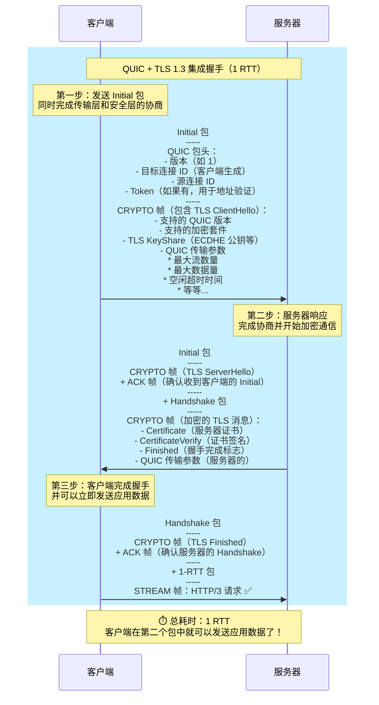

### 2.2 QUIC 包类型详解

QUIC 使用不同的包类型来组织握手和数据传输：

| 包类型 | 用途 | 加密级别 | 何时使用 |
|-------|------|---------|---------|
| **Initial** | 握手初始化 | Initial Keys（基于客户端的 Destination Connection ID 派生） | 握手开始阶段 |
| **Handshake** | 握手完成 | Handshake Keys（基于 TLS 握手派生） | 握手的后半部分 |
| **0-RTT** | 早期数据 | 0-RTT Keys（基于之前的会话） | 重连时发送早期应用数据 |
| **1-RTT** | 应用数据 | 1-RTT Keys（最终的应用数据密钥） | 正常的应用数据传输 |

**加密密钥的演进过程**：

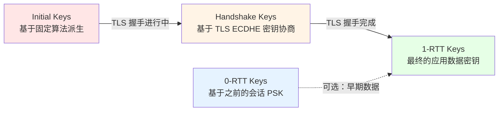

### 2.3 QUIC 传输参数（Transport Parameters）

QUIC 在 TLS 握手中嵌入了 **传输参数（Transport Parameters）**，这是 QUIC 特有的扩展，用于协商传输层的配置：

**客户端发送的传输参数示例**：
```
initial_max_streams_bidi: 100        // 允许打开的双向流数量
initial_max_streams_uni: 100         // 允许打开的单向流数量
initial_max_data: 1048576            // 连接级别的流量控制窗口（1 MB）
initial_max_stream_data_bidi_local: 524288   // 每个双向流的流量控制窗口
max_idle_timeout: 30000              // 空闲超时时间（30 秒）
max_udp_payload_size: 1350           // 最大 UDP 载荷大小
ack_delay_exponent: 3                // ACK 延迟的指数
max_ack_delay: 25                    // 最大 ACK 延迟（25ms）
active_connection_id_limit: 2        // 活跃连接 ID 数量限制
```

**为什么在握手中交换这些参数？**
- **一次性协商**：避免后续的往返开销
- **立即生效**：握手完成后，双方立即按照协商的参数工作
- **灵活配置**：不同应用可以有不同的参数（如视频流 vs. 文件下载）

### 2.4 与 TCP+TLS 的关键差异

| 方面 | TCP + TLS | QUIC |
|-----|-----------|------|
| **握手层次** | 两个独立的握手（传输层 + 安全层） | 单一的集成握手 |
| **参数协商** | TCP 参数在三次握手中，TLS 参数在 TLS 握手中，HTTP/2 参数在 SETTINGS 帧中 | 所有参数在 TLS 扩展中一次性协商 |
| **加密时机** | TCP 头部始终明文 | 除了 Initial 包的部分头部，几乎全部加密 |
| **首字节时间** | 2.5-3.5 RTT | 1 RTT |

---

## 三、QUIC 的 0-RTT：瞬间恢复连接

1-RTT 已经很快了，但 QUIC 还有一个更激进的特性：**0-RTT 恢复（0-RTT Resumption）**。这允许客户端在 **第一个包** 中就发送应用数据，完全跳过握手延迟。

### 3.1 0-RTT 的前提：会话票据（Session Ticket）

0-RTT 基于 **TLS 会话恢复** 机制。在第一次成功连接后，服务器会给客户端一个 **会话票据（Session Ticket）**：

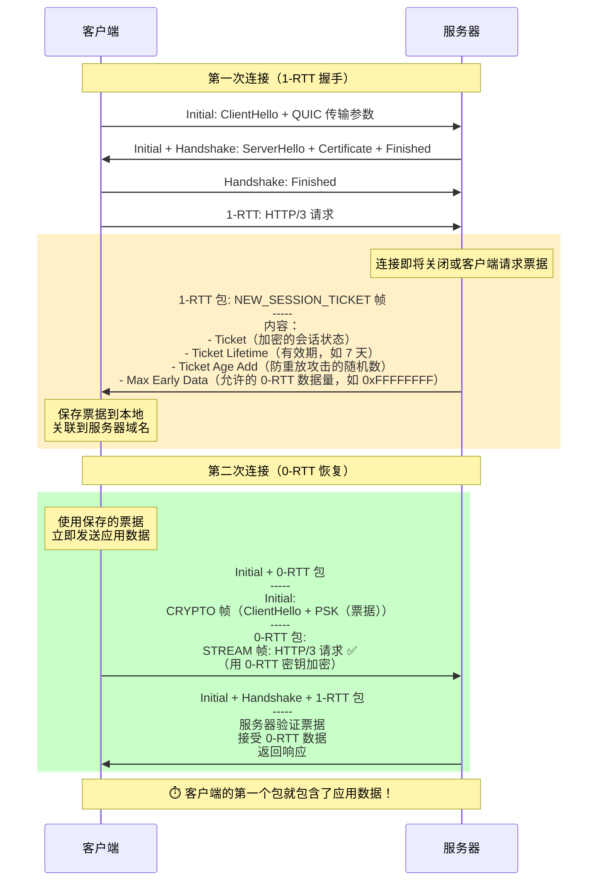

### 3.2 0-RTT 密钥的派生

0-RTT 的加密密钥基于之前会话的 **PSK（Pre-Shared Key）** 派生：

```
PSK = HKDF-Expand-Label(
    resumption_master_secret,  // 来自上一次会话
    "resumption",
    ticket_nonce,              // 票据中的随机数
    Hash.length
)

early_secret = HKDF-Extract(PSK, 0)

0-RTT Keys = Derive-Secret(early_secret, "c e traffic", ClientHello)
```

**关键观察**：
- 0-RTT 密钥是 **对称密钥**（双方都可以提前计算）
- 不需要进行新的 ECDHE 密钥交换（这是 0-RTT 能做到的原因）
- 但这也意味着 **没有前向安全性**（如果 PSK 泄露，0-RTT 数据可能被解密）

### 3.3 0-RTT 的详细流程

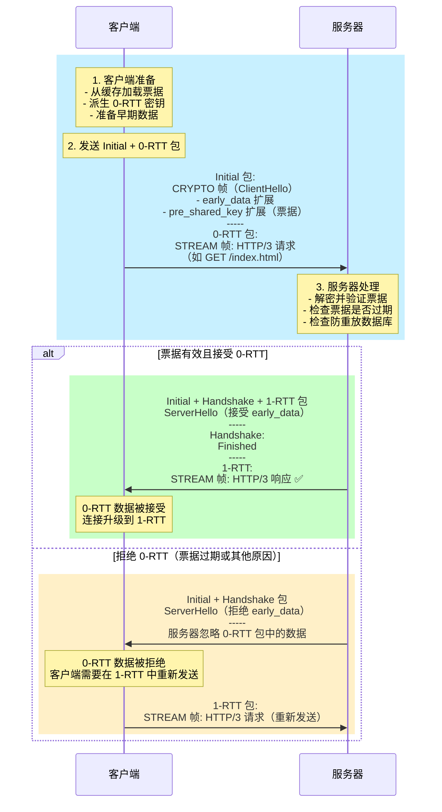

### 3.4 0-RTT 的性能优势

让我们用一个具体的例子来说明 0-RTT 的威力：

**场景**：用户打开一个新闻 App，需要加载首页。网络延迟 100ms。

**传统 HTTP/2（TCP + TLS 1.3）**：
```
时间线：
0ms     → 客户端发送：TCP SYN
100ms   → 服务器返回：TCP SYN-ACK
150ms   → 客户端发送：TCP ACK + TLS ClientHello
250ms   → 服务器返回：TLS ServerHello + Certificate + Finished
250ms   → 客户端发送：TLS Finished + HTTP/2 请求 ✅
350ms   → 服务器返回：HTTP/2 响应

首字节时间（TTFB）：350ms
```

**QUIC 1-RTT**：
```
时间线：
0ms     → 客户端发送：QUIC Initial（ClientHello + 传输参数）
100ms   → 服务器返回：QUIC Handshake + 1-RTT（ServerHello + Finished）
100ms   → 客户端发送：QUIC Handshake（Finished）+ 1-RTT（HTTP/3 请求）✅
200ms   → 服务器返回：HTTP/3 响应

首字节时间（TTFB）：200ms（快 43%）
```

**QUIC 0-RTT**：
```
时间线：
0ms     → 客户端发送：QUIC Initial（ClientHello + PSK）+ 0-RTT（HTTP/3 请求）✅
100ms   → 服务器返回：HTTP/3 响应

首字节时间（TTFB）：100ms（快 71%）
```

---

## 四、0-RTT 的"双刃剑"：安全性挑战

0-RTT 虽然带来了极致的性能，但也引入了安全风险。理解这些风险以及如何缓解它们，对于正确使用 0-RTT 至关重要。

### 4.1 风险 #1：重放攻击（Replay Attack）

**问题**：0-RTT 数据可能被攻击者 **捕获并重放**。

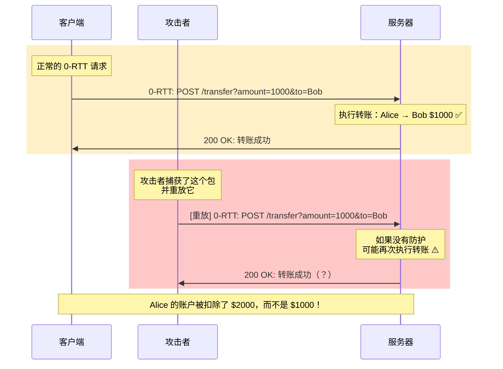

**根本原因**：
- 0-RTT 使用的是 **对称密钥**（PSK），不涉及新的密钥协商
- 攻击者可以捕获 0-RTT 包，并在会话票据有效期内重放它
- 服务器可能无法区分 **重放的包** 和 **正常的包**

**缓解措施**：

1. **服务器端：防重放数据库**
   - 服务器维护一个 **已见过的客户端随机数** 数据库
   - 拒绝重复的随机数

   ```
   伪代码：
   if client_random in replay_database:
       reject_0rtt_data()
   else:
       accept_0rtt_data()
       add_to_replay_database(client_random, expiry_time)
   ```

   **挑战**：在分布式系统中，需要在多个服务器之间同步这个数据库，开销较大。

2. **协议层：单次使用票据（Single-Use Tickets）**
   - 每个会话票据只能使用一次
   - 使用后立即失效

   **挑战**：如果客户端重连频繁，会消耗大量票据。

3. **应用层：限制 0-RTT 的使用范围**
   - **只允许幂等操作**：如 GET、HEAD 请求
   - **禁止非幂等操作**：如 POST、PUT、DELETE

   **最佳实践**：
   ```
   HTTP/3 请求中，服务器应该检查：
   - 请求方法是否为 GET 或 HEAD
   - 请求是否包含敏感操作（如支付、修改数据）

   如果不满足条件，拒绝 0-RTT 数据
   ```

### 4.2 风险 #2：缺乏前向安全性（No Forward Secrecy）

**问题**：如果 PSK 泄露，所有基于该 PSK 的 0-RTT 数据都可能被解密。

**对比**：
| 握手类型 | 密钥协商方式 | 前向安全性 | PSK 泄露的影响 |
|---------|------------|-----------|--------------|
| **1-RTT** | ECDHE（每次协商新密钥） | ✅ 是 | 仅影响当前会话 |
| **0-RTT** | PSK（使用之前的密钥） | ❌ 否 | 影响所有使用该 PSK 的 0-RTT 会话 |

**缓解措施**：
- **短生命周期**：将会话票据的有效期设置为较短时间（如 24 小时）
- **定期轮换**：服务器定期轮换用于加密票据的密钥
- **限制 0-RTT 数据量**：在传输参数中限制 `max_early_data_size`

### 4.3 何时使用 0-RTT？决策树

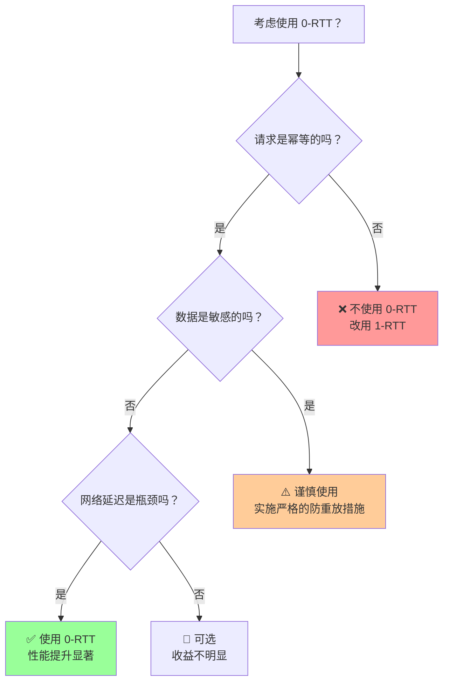

**最佳实践总结**：
1. **✅ 适合 0-RTT 的场景**：
   - GET 请求（如加载网页、图片、视频）
   - HEAD 请求（如检查资源是否更新）
   - 只读 API 调用

2. **❌ 不适合 0-RTT 的场景**：
   - POST/PUT/DELETE 请求（如提交表单、上传文件、删除资源）
   - 任何有副作用的操作（如支付、转账、发送邮件）
   - 高敏感数据传输（如密码、信用卡信息）

3. **🔶 需要额外防护的场景**：
   - 如果必须在 0-RTT 中发送敏感数据，必须实施：
     - 防重放数据库
     - 请求签名和时间戳验证
     - 额外的应用层认证

---

## 五、深入技术细节：加密包的保护

QUIC 的包保护（Packet Protection）是一个精妙的设计，值得深入了解。

### 5.1 AEAD 加密

QUIC 使用 **AEAD（Authenticated Encryption with Associated Data）** 加密包载荷：

**常用的 AEAD 算法**：
- **AES-128-GCM**：最常用，硬件加速支持广泛
- **AES-256-GCM**：更高安全性
- **ChaCha20-Poly1305**：在没有 AES-NI 硬件加速的设备上性能更好（如移动设备）

**AEAD 加密的输入**：
```
密文 = AEAD-Encrypt(
    key: 会话密钥（从 TLS 握手派生）,
    nonce: 包编号（Packet Number）+ IV,
    plaintext: QUIC 帧（STREAM、ACK 等）,
    associated_data: QUIC 包头（连接 ID、包编号长度等）
)
```

**关键观察**：
- **包头作为关联数据**：包头不加密，但参与认证计算（防止篡改）
- **包编号作为 nonce**：保证每个包的 nonce 唯一（包编号单调递增）

### 5.2 包头保护（Header Protection）

为了防止中间盒观察包编号（从而推断流量模式），QUIC 对包头的部分字段进行了额外的 **头部保护**：

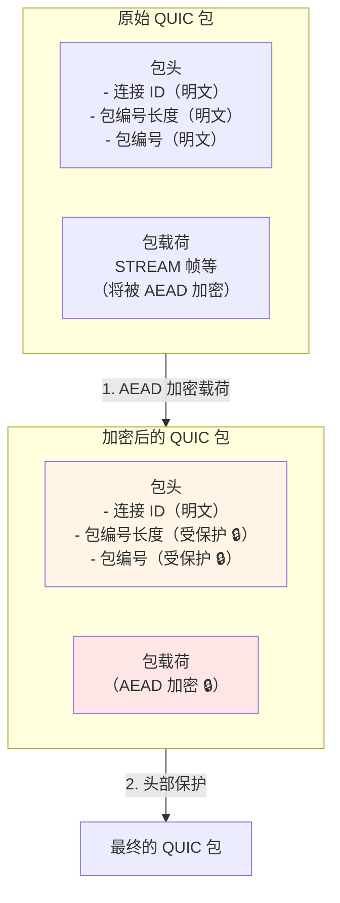

**头部保护的算法**：
```
// 从加密后的载荷中提取样本
sample = encrypted_payload[4:20]  // 取前 16 字节作为样本

// 使用样本派生掩码
mask = HeaderProtection(key, sample)

// 对包头的敏感字段进行异或
protected_flags = original_flags XOR mask[0]
protected_pn = original_pn XOR mask[1:5]
```

**为什么要保护包编号？**
- **防流量分析**：攻击者无法通过观察包编号来推断：
  - 流量模式（如突发流量、周期性流量）
  - 重传行为（如包编号跳跃）
  - 连接活跃度
- **防中间盒干扰**：中间盒无法根据包编号进行"优化"（有时这种优化反而是问题）

### 5.3 密钥更新（Key Update）

QUIC 支持在连接过程中 **更新密钥**，而无需重新握手。这提供了额外的安全保障：

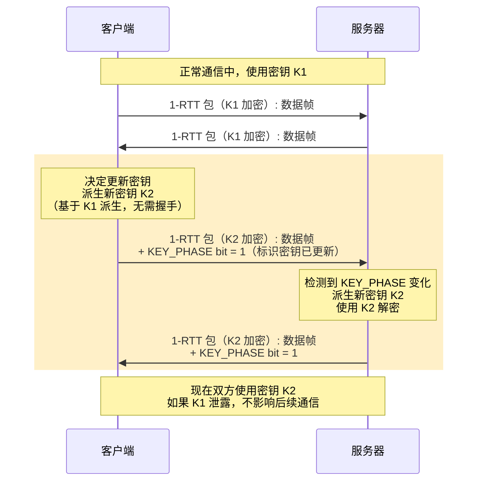

**密钥更新的触发条件**：
- **数据量阈值**：每传输一定量的数据（如 1 GB）后更新
- **时间阈值**：每隔一定时间（如 1 小时）更新
- **主动更新**：应用程序显式请求

**好处**：
- **前向安全性**：即使某个密钥泄露，也只影响使用该密钥的数据
- **无握手开销**：密钥派生是本地操作，不需要网络往返

---

## 六、实战对比：加载一个网页

让我们通过一个完整的例子，对比 TCP+TLS 和 QUIC 的握手过程。

**场景**：用户首次访问 `https://example.com`，网络延迟 50ms。

### 6.1 TCP + TLS 1.3 + HTTP/2

```
时间线：
0ms     → [客户端] DNS 查询（假设已缓存，0ms）
0ms     → [客户端] 发送 TCP SYN
50ms    → [服务器] 返回 TCP SYN-ACK
75ms    → [客户端] 发送 TCP ACK + TLS ClientHello
125ms   → [服务器] 返回 TLS ServerHello + Certificate + Finished
125ms   → [客户端] 验证证书（10ms 本地操作）
135ms   → [客户端] 发送 TLS Finished + HTTP/2 请求（GET /）✅
185ms   → [服务器] 返回 HTTP/2 响应（HTML）
185ms   → [客户端] 开始解析 HTML，发现需要 style.css 和 logo.png
185ms   → [客户端] 发送 HTTP/2 请求（GET /style.css 和 /logo.png）
235ms   → [服务器] 返回 CSS 和图片
235ms   → [客户端] 页面渲染完成 ✅

总耗时：235ms（从第一个字节到页面完成）
握手耗时：135ms（占 57%）
```

### 6.2 QUIC + HTTP/3（1-RTT）

```
时间线：
0ms     → [客户端] DNS 查询（假设已缓存，0ms）
0ms     → [客户端] 发送 QUIC Initial（ClientHello + 传输参数）
50ms    → [服务器] 返回 QUIC Handshake + 1-RTT（ServerHello + Finished）
50ms    → [客户端] 验证证书（10ms 本地操作）
60ms    → [客户端] 发送 QUIC Handshake（Finished）+ 1-RTT（HTTP/3 请求：GET /）✅
110ms   → [服务器] 返回 HTTP/3 响应（HTML）
110ms   → [客户端] 开始解析 HTML，发现需要 style.css 和 logo.png
110ms   → [客户端] 发送 HTTP/3 请求（GET /style.css 和 /logo.png）
160ms   → [服务器] 返回 CSS 和图片
160ms   → [客户端] 页面渲染完成 ✅

总耗时：160ms（比 HTTP/2 快 32%）
握手耗时：60ms（占 38%）
```

### 6.3 QUIC + HTTP/3（0-RTT，重连场景）

```
假设用户之前访问过这个网站，客户端有会话票据

时间线：
0ms     → [客户端] 发送 QUIC Initial（ClientHello + PSK）+ 0-RTT（HTTP/3 请求：GET /）✅
50ms    → [服务器] 返回 HTTP/3 响应（HTML）
50ms    → [客户端] 开始解析 HTML，发现需要 style.css 和 logo.png
50ms    → [客户端] 发送 HTTP/3 请求（GET /style.css 和 /logo.png）
100ms   → [服务器] 返回 CSS 和图片
100ms   → [客户端] 页面渲染完成 ✅

总耗时：100ms（比 HTTP/2 快 57%，比 QUIC 1-RTT 快 38%）
握手耗时：0ms！
```

---

## 七、浏览器和服务器的实现细节

### 7.1 浏览器如何决定使用 QUIC？

现代浏览器（如 Chrome、Edge、Firefox）使用以下策略：

1. **Alt-Svc 头部发现**：
   - 第一次使用 HTTP/2 连接到服务器
   - 服务器返回 `Alt-Svc: h3=":443"; ma=2592000` 头部
   - 浏览器知道这个服务器支持 HTTP/3（h3）

2. **并行竞速（Happy Eyeballs）**：
   - 浏览器同时尝试 HTTP/2 和 HTTP/3 连接
   - 哪个先成功就使用哪个
   - 未来的连接优先使用 HTTP/3

3. **降级策略**：
   - 如果 QUIC 连接失败（如 UDP 被阻断），自动降级到 HTTP/2
   - 记录失败原因，避免频繁重试

### 7.2 服务器如何实现 0-RTT？

**Nginx 配置示例**（Nginx 1.25+ 支持 HTTP/3）：

```nginx
server {
    listen 443 quic reuseport;  # 启用 QUIC
    listen 443 ssl http2;        # 同时支持 HTTP/2（降级）

    ssl_certificate /path/to/cert.pem;
    ssl_certificate_key /path/to/key.pem;

    # 启用 0-RTT
    ssl_early_data on;

    # 限制 0-RTT 数据大小（防止滥用）
    ssl_early_data_size 16k;

    # 添加 Alt-Svc 头部，告知客户端支持 HTTP/3
    add_header Alt-Svc 'h3=":443"; ma=86400';

    location / {
        # 对于接受 early data 的请求，添加标识
        if ($ssl_early_data = "1") {
            set $early_data_flag "early-data";
        }

        # 将标识传递给后端应用（可选）
        proxy_set_header Early-Data $early_data_flag;
        proxy_pass http://backend;
    }
}
```

**应用层检查 0-RTT（Python/Flask 示例）**：

```python
from flask import Flask, request

app = Flask(__name__)

@app.route('/api/data')
def get_data():
    # 检查请求是否来自 0-RTT
    is_early_data = request.headers.get('Early-Data') == '1'

    if is_early_data:
        # 对于 0-RTT 请求，只允许幂等操作
        if request.method not in ['GET', 'HEAD']:
            return "0-RTT 不允许非幂等操作", 400

    return {"message": "数据返回"}

@app.route('/api/transfer', methods=['POST'])
def transfer_money():
    # 关键操作：拒绝 0-RTT
    if request.headers.get('Early-Data') == '1':
        return "此操作不允许使用 0-RTT", 425  # 425 Too Early

    # 正常处理转账逻辑
    return {"status": "转账成功"}
```

---

## 八、本章总结

### 8.1 核心要点

1. **QUIC 将握手延迟从 2.5-3.5 RTT 降低到 1 RTT（首次连接）或 0 RTT（重连）**。

2. **1-RTT 握手**：
   - 深度集成 TLS 1.3 和 QUIC 传输层协商
   - 客户端在第一个包中发送 ClientHello + 传输参数
   - 服务器在第二个包中完成握手并允许客户端发送应用数据

3. **0-RTT 握手**：
   - 基于会话票据（Session Ticket）和 PSK
   - 客户端在第一个包中就发送应用数据
   - 但引入了重放攻击和缺乏前向安全性的风险

4. **安全权衡**：
   - **1-RTT**：前向安全性 ✅，无重放风险 ✅，但需要 1 RTT
   - **0-RTT**：零延迟 ✅，但有重放风险 ⚠️，缺乏前向安全性 ⚠️

5. **最佳实践**：
   - 对所有请求启用 1-RTT
   - 仅对幂等、非敏感操作启用 0-RTT（如 GET 请求）
   - 在应用层实施防重放措施（如请求 ID、时间戳验证）

### 8.2 性能提升总结

| 场景 | 延迟 | TCP+TLS1.3+HTTP/2 | QUIC 1-RTT | QUIC 0-RTT | 提升幅度 |
|-----|------|------------------|-----------|-----------|---------|
| **低延迟（20ms）** | 首次连接 | 50ms | 20ms | - | **60%** |
| **低延迟（20ms）** | 重连 | 50ms | 20ms | 0ms | **100%** |
| **中延迟（50ms）** | 首次连接 | 125ms | 50ms | - | **60%** |
| **中延迟（50ms）** | 重连 | 125ms | 50ms | 0ms | **100%** |
| **高延迟（100ms）** | 首次连接 | 250ms | 100ms | - | **60%** |
| **高延迟（100ms）** | 重连 | 250ms | 100ms | 0ms | **100%** |

### 8.3 展望

在下一章中，我们将探讨 QUIC 的另一个革命性特性：**连接迁移（Connection Migration）**。我们将看到 QUIC 如何让连接在网络切换时"永不掉线"，以及连接 ID 的神奇魔法。

---

## 参考资料

- RFC 9000: QUIC: A UDP-Based Multiplexed and Secure Transport, Section 7 (Connection Establishment)
- RFC 9001: Using TLS to Secure QUIC
- RFC 8446: The Transport Layer Security (TLS) Protocol Version 1.3
- "The QUIC Transport Protocol: Design and Internet-Scale Deployment" (SIGCOMM 2017)
- Cloudflare Blog: "Even faster connection establishment with QUIC 0-RTT resumption"
- Mozilla Blog: "The Road to QUIC"
