# 第四章：永不掉线：连接 ID 与无缝迁移的魔法

## 引言：移动时代的连接难题

想象这样一个场景：你正在地铁上观看一场重要的在线会议直播。当列车驶入隧道时,手机从 4G 信号切换到了地铁的 Wi-Fi。在传统的 TCP 连接中,这意味着：
- 原有的连接会立即中断
- 视频播放停止,显示"连接丢失"
- 需要重新建立连接(TCP 三次握手 + TLS 握手)
- 重新缓冲视频,可能错过了精彩内容

这种体验在今天的移动互联网时代极为常见且令人沮丧。每天有数十亿次这样的连接中断发生。

QUIC 通过一个天才的设计——**连接 ID(Connection ID)**——彻底解决了这个问题。本章将深入探讨这个让连接"永不掉线"的魔法是如何实现的。

---

## 一、问题的根源：TCP 的四元组束缚

### 1.1 TCP 连接的身份危机

在 TCP 协议中,一个连接由 **四元组(4-tuple)** 唯一标识：

```
TCP 连接 = (源 IP 地址, 源端口, 目标 IP 地址, 目标端口)
```

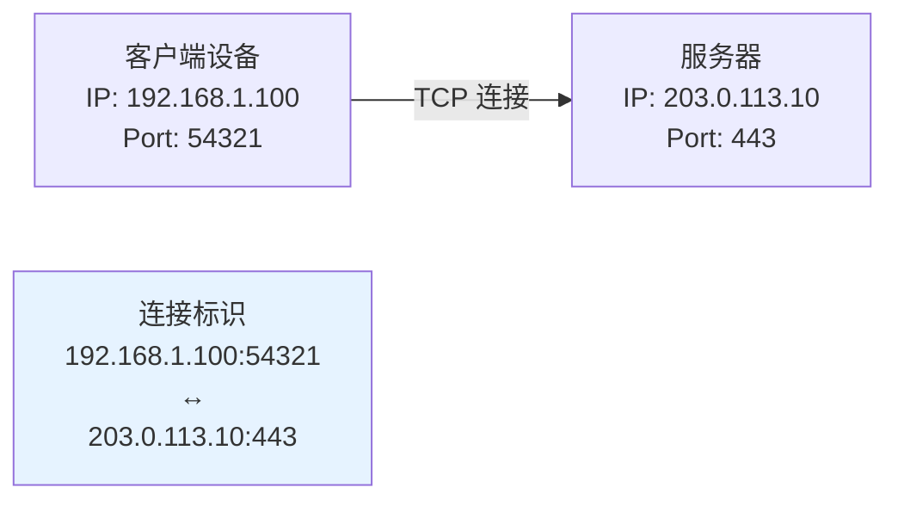

**这个设计在 1980 年代是合理的**：
- 设备通常是固定的(台式机、服务器)
- IP 地址相对稳定
- 网络切换很少发生

**但在今天的移动世界中,这成了严重的问题**：

| 场景 | 网络变化 | TCP 连接的fate |
|-----|---------|---------------|
| Wi-Fi → 4G | 源 IP 地址改变 | ❌ 连接中断 |
| 4G → 5G | 源 IP 地址改变(可能) | ❌ 连接中断 |
| 基站切换 | 源 IP 地址改变(可能) | ❌ 连接中断 |
| NAT 重绑定 | 源端口改变 | ❌ 连接中断 |
| 双网卡设备(如笔记本) | 有线 ↔ 无线切换 | ❌ 连接中断 |

### 1.2 真实场景的痛点

**场景 1：视频会议**
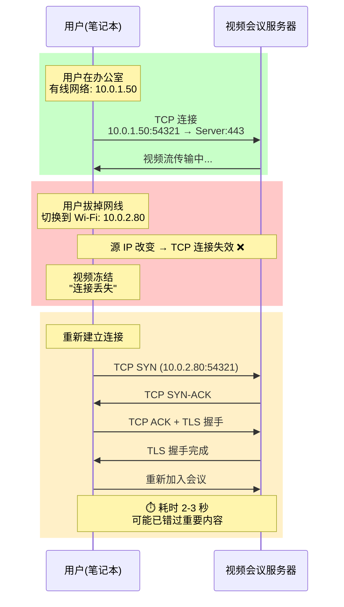

**场景 2：移动购物**
```
用户在地铁上浏览电商 App：
1. 在站台用 4G (IP: 100.20.30.40) 加载商品列表
2. 进站后连接到地铁 Wi-Fi (IP: 192.168.100.50)
3. TCP 连接中断，所有图片重新加载
4. 每次进出隧道重复上述过程
5. 用户体验：卡顿、加载慢、耗费流量

经济损失：
- 用户流失率增加 15-20%
- 转化率下降 10-15%
- 用户投诉增多
```

---

## 二、QUIC 的解决方案：连接 ID

### 2.1 连接 ID 的核心思想

QUIC 引入了一个全新的概念——**连接 ID(Connection ID, CID)**，用于标识连接，而不是依赖四元组：

```
QUIC 连接 = 连接 ID (一个随机的、唯一的标识符)
```

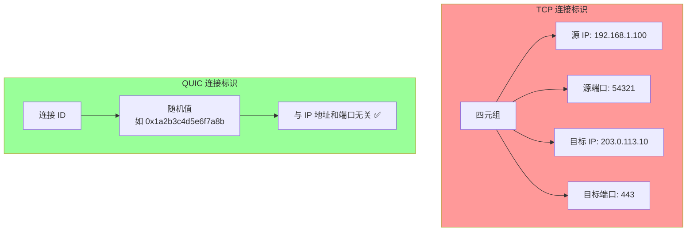

**关键特性**：
1. **独立于网络地址**：连接 ID 是一个随机值，与 IP 地址和端口完全无关
2. **双向协商**：客户端和服务器各自提供自己的连接 ID
3. **可以更换**：一个连接可以有多个连接 ID，随时切换
4. **长度可变**：0-20 字节（通常使用 8 字节）

### 2.2 连接 ID 的生命周期

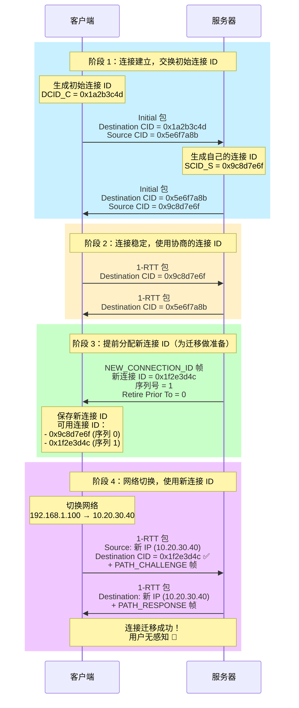

### 2.3 连接 ID 的格式和编码

**QUIC 包头中的连接 ID**：

```
Long Header 包（用于握手阶段）:
+--------------------------------------------------+
| Header Form (1) | Fixed Bit (1) | Type (2) | ... |
+--------------------------------------------------+
| Version (32 bits)                                |
+--------------------------------------------------+
| DCID Len (8 bits) | Destination Connection ID   |
+--------------------------------------------------+
| SCID Len (8 bits) | Source Connection ID        |
+--------------------------------------------------+
| ... 其他字段 ...                                  |
+--------------------------------------------------+

Short Header 包（用于数据传输）:
+--------------------------------------------------+
| Header Form (0) | Fixed Bit (1) | ... (6 bits)  |
+--------------------------------------------------+
| Destination Connection ID (0-160 bits)           |
+--------------------------------------------------+
| Packet Number (8-32 bits)                        |
+--------------------------------------------------+
| Payload (encrypted)                              |
+--------------------------------------------------+
```

**关键观察**：
- **Long Header**：同时包含 Destination CID 和 Source CID（用于连接建立和协商）
- **Short Header**：只包含 Destination CID（节省带宽，因为对方已知道自己的 CID）
- **长度灵活**：CID 长度可以是 0-20 字节，甚至可以是 0（在不需要的场景下）

---

## 三、连接迁移的完整流程

### 3.1 主动迁移（Intentional Migration）

当客户端检测到网络变化时，会主动发起连接迁移：

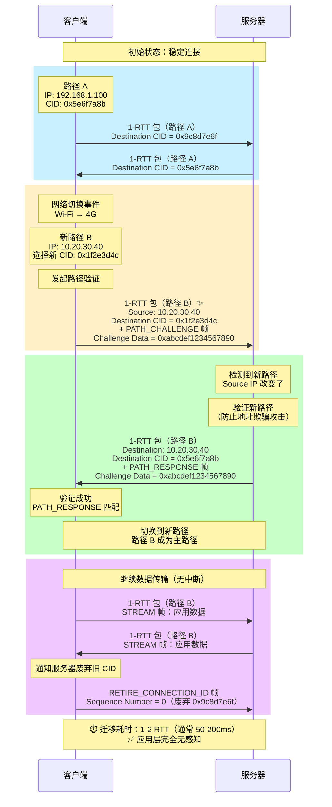

### 3.2 路径验证（Path Validation）

**为什么需要路径验证？**

路径验证是为了防止 **地址欺骗攻击**：

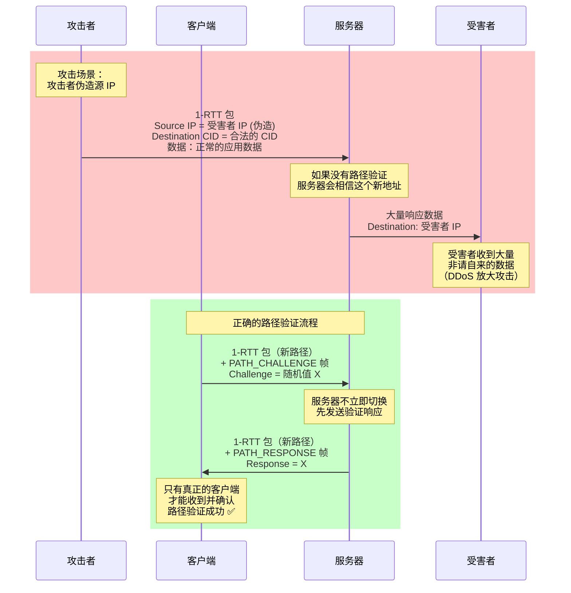

**PATH_CHALLENGE 和 PATH_RESPONSE 帧的格式**：

```
PATH_CHALLENGE 帧：
+--------------------------------------------------+
| Type = 0x1a                                      |
+--------------------------------------------------+
| Data (64 bits, 随机值)                           |
+--------------------------------------------------+

PATH_RESPONSE 帧：
+--------------------------------------------------+
| Type = 0x1b                                      |
+--------------------------------------------------+
| Data (64 bits, 必须与 CHALLENGE 相同)            |
+--------------------------------------------------+
```

### 3.3 NAT 重绑定场景

NAT（网络地址转换）设备可能会在连接空闲时重新分配端口，这在 TCP 中会导致连接中断：

```mermaid
sequenceDiagram
    participant C as 客户端<br/>(内网 IP: 192.168.1.10)
    participant N as NAT 设备
    participant S as 服务器

    rect rgb(200, 240, 255)
        Note over C,N,S: 初始连接

        C->>N: 源: 192.168.1.10:54321
        N->>S: 源: 203.0.113.50:12345 (NAT 分配)<br/>Destination CID = 0x9c8d7e6f
        S->>N: Destination: 203.0.113.50:12345
        N->>C: Destination: 192.168.1.10:54321
    end

    rect rgb(255, 240, 200)
        Note over C,N,S: 连接空闲一段时间...

        Note over N: NAT 超时<br/>释放端口映射 12345
    end

    rect rgb(255, 200, 200)
        Note over C,N,S: TCP 的困境

        C->>N: 源: 192.168.1.10:54321
        N->>S: 源: 203.0.113.50:54399 (新端口) ❌<br/>TCP 四元组改变 → 服务器拒绝
    end

    rect rgb(200, 255, 200)
        Note over C,N,S: QUIC 的优雅处理

        C->>N: 源: 192.168.1.10:54321
        N->>S: 源: 203.0.113.50:54399 (新端口)<br/>Destination CID = 0x9c8d7e6f ✅
        Note over S: 根据 CID 识别连接<br/>端口改变无所谓
        S->>N: Destination: 203.0.113.50:54399<br/>Destination CID = 0x5e6f7a8b
        N->>C: Destination: 192.168.1.10:54321
    end

    Note over C,N,S: QUIC 连接保持，无中断 ✅
```

---

## 四、连接 ID 的高级特性

### 4.1 多个连接 ID 的并发管理

一个 QUIC 连接可以同时拥有多个连接 ID，这带来了额外的灵活性：

**为什么需要多个连接 ID？**
1. **负载均衡**：服务器可以根据 CID 将流量分配到不同的服务器实例
2. **隐私保护**：定期更换 CID 可以防止追踪
3. **平滑迁移**：提前分配新 CID，迁移时无缝切换

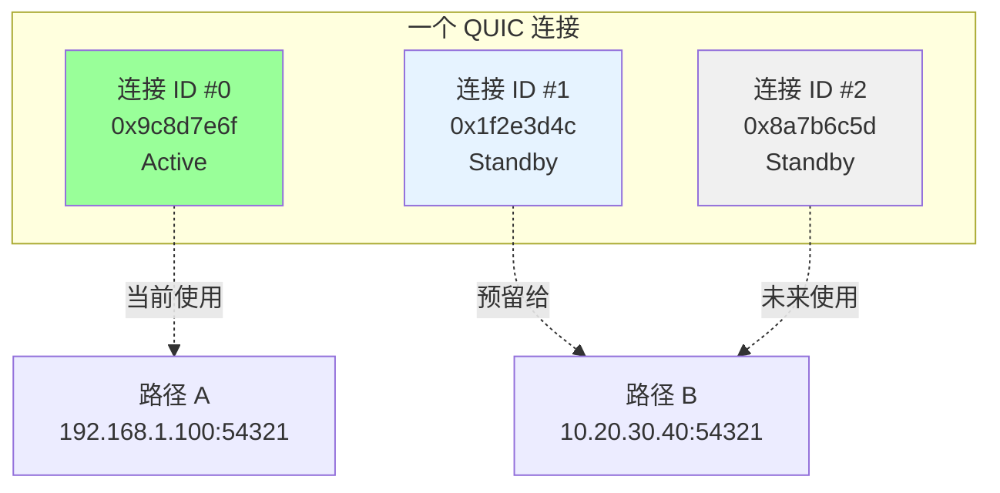

**NEW_CONNECTION_ID 帧**：

```
NEW_CONNECTION_ID 帧结构：
+--------------------------------------------------+
| Type = 0x18                                      |
+--------------------------------------------------+
| Sequence Number (可变长度整数)                    |
|   标识这个 CID 的序列号                          |
+--------------------------------------------------+
| Retire Prior To (可变长度整数)                    |
|   要求客户端废弃序号小于此值的所有 CID            |
+--------------------------------------------------+
| Length (8 bits)                                  |
|   CID 的长度（0-20）                             |
+--------------------------------------------------+
| Connection ID (0-160 bits)                       |
|   新的连接 ID                                    |
+--------------------------------------------------+
| Stateless Reset Token (128 bits)                 |
|   用于无状态重置的令牌                           |
+--------------------------------------------------+
```

**示例**：

```
服务器发送：
NEW_CONNECTION_ID {
    Sequence Number: 3
    Retire Prior To: 1  // 要求客户端废弃序号 0 的 CID
    Length: 8
    Connection ID: 0x8a7b6c5d4e3f2a1b
    Stateless Reset Token: 0x1234567890abcdef...
}

客户端响应：
RETIRE_CONNECTION_ID {
    Sequence Number: 0  // 废弃旧的 CID
}
```

### 4.2 无状态重置（Stateless Reset）

当服务器丢失了连接状态（如服务器重启、负载均衡器故障转移），它无法正常关闭连接。此时可以使用 **无状态重置** 机制：

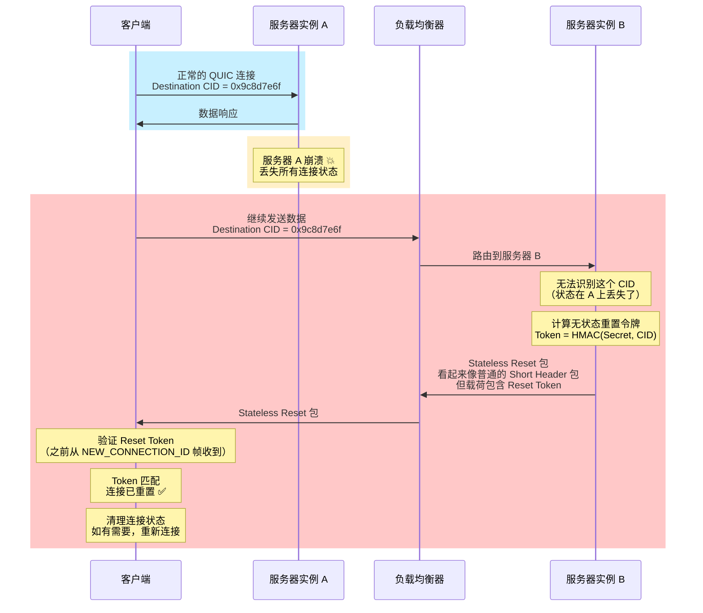

**Stateless Reset 包的格式**：

```
Stateless Reset 包（伪装成 Short Header 包）：
+--------------------------------------------------+
| Header Form (0) | Fixed Bit (1) | ... (6 bits)  |
+--------------------------------------------------+
| Unpredictable Bits (至少 38 字节)                |
|   随机数据，伪装成正常包                         |
+--------------------------------------------------+
| Stateless Reset Token (128 bits)                 |
|   最后 16 字节是重置令牌                         |
+--------------------------------------------------+
```

**关键特性**：
1. **无状态**：服务器不需要任何连接状态就能发送重置
2. **不可伪造**：Token 基于密钥和 CID 的 HMAC，攻击者无法伪造
3. **隐蔽性**：看起来像普通的 QUIC 包，防止被识别和过滤

### 4.3 连接 ID 的隐私保护

**问题**：如果连接 ID 长期不变，可能被用于追踪用户。

**解决方案**：定期轮换连接 ID。

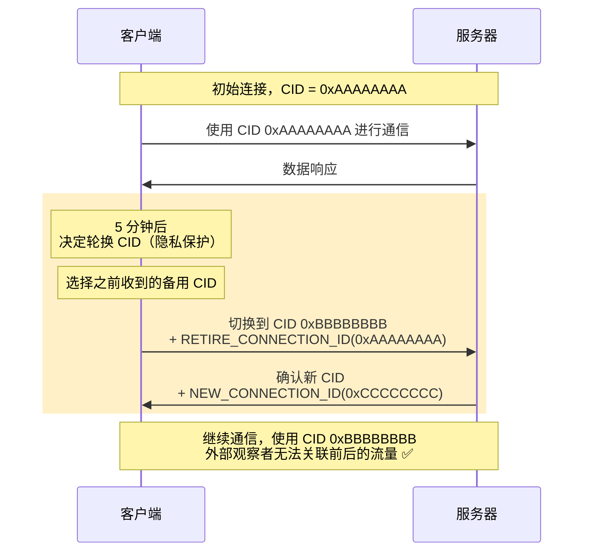

---

## 五、连接迁移的性能优化

### 5.1 探测新路径的性能

在正式迁移之前，QUIC 可以 **探测** 新路径的性能：

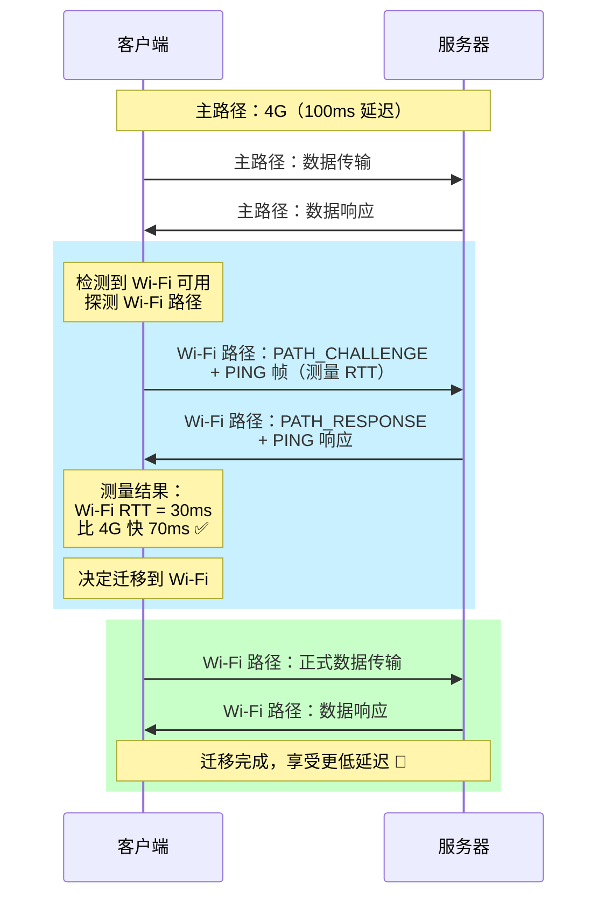

### 5.2 多路径QUIC（Multipath QUIC，MPQUIC）

这是一个正在标准化的扩展（draft-ietf-quic-multipath），允许同时使用多条路径：

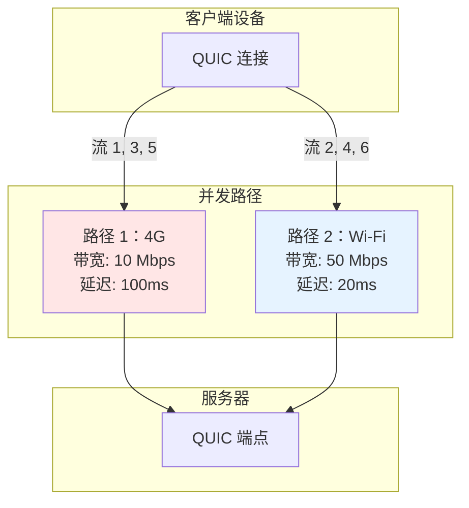

**好处**：
1. **聚合带宽**：同时使用 4G 和 Wi-Fi 的带宽
2. **冗余**：一条路径失败，另一条立即接管
3. **智能调度**：低延迟流走 Wi-Fi，大文件走 4G

**应用场景**：
- **视频直播**：控制信令走低延迟路径，视频数据走高带宽路径
- **云游戏**：操作指令走低延迟路径，视频流走高带宽路径
- **文件下载**：聚合所有可用带宽，加速下载

---

## 六、与 TCP 的性能对比

### 6.1 网络切换场景的对比

| 场景 | TCP + HTTP/2 | QUIC + HTTP/3 | 性能提升 |
|-----|-------------|--------------|---------|
| **Wi-Fi → 4G** | 连接中断，重新建立（2.5 RTT）| 连接迁移（1-2 RTT）| **50-60%** |
| **4G → 5G** | 连接中断，重新建立（2.5 RTT）| 连接迁移（1-2 RTT）| **50-60%** |
| **基站切换** | 可能中断（取决于 IP 是否变化）| 无影响（CID 不变）| **100%**（无中断）|
| **NAT 重绑定** | 连接中断 | 无影响（CID 识别）| **100%**（无中断）|

### 6.2 真实世界的数据

**Google 的测量数据（2020）**：

| 指标 | TCP + HTTP/2 | QUIC + HTTP/3 |
|-----|-------------|--------------|
| **视频重新缓冲次数**（网络切换时）| 平均 2.3 次 | 平均 0.1 次（**减少 96%**）|
| **连接恢复时间**（50ms 网络）| 125ms（2.5 RTT）| 50-100ms（1-2 RTT）|
| **连接恢复时间**（200ms 网络）| 500ms（2.5 RTT）| 200-400ms（1-2 RTT）|
| **用户感知延迟** | 明显卡顿 | 几乎无感知 |

**Facebook 的案例研究（2019）**：

在 Instagram 移动应用中启用 QUIC 连接迁移后：
- **错误率下降 27%**（减少了因网络切换导致的请求失败）
- **重试次数下降 38%**（减少了需要重新发起的请求）
- **用户满意度提升 15%**（减少了加载失败和卡顿）

---

## 七、实现细节和最佳实践

### 7.1 服务器端的连接 ID 管理

**挑战**：在大规模分布式系统中，如何管理连接 ID？

**方案 1：集中式状态存储**
```
优点：
- 简单直观
- 状态一致性强

缺点：
- 单点故障
- 性能瓶颈
- 不适合大规模部署
```

**方案 2：编码式连接 ID（推荐）**

将服务器实例信息编码到连接 ID 中：

```
连接 ID 结构（8 字节示例）：
+--------------------------------------------------+
| 服务器实例 ID (2 字节)                            |
|   如：0x0042（服务器 #66）                       |
+--------------------------------------------------+
| 路由键 (2 字节)                                  |
|   用于一致性哈希                                 |
+--------------------------------------------------+
| 随机数 (4 字节)                                  |
|   保证唯一性和不可预测性                         |
+--------------------------------------------------+

负载均衡器根据前 4 字节路由流量到正确的服务器实例
```

**代码示例（伪代码）**：

```python
def generate_connection_id(server_id, routing_key):
    """
    生成编码式连接 ID
    """
    cid = bytearray(8)
    cid[0:2] = server_id.to_bytes(2, 'big')
    cid[2:4] = routing_key.to_bytes(2, 'big')
    cid[4:8] = os.urandom(4)  # 随机数
    return bytes(cid)

def route_by_connection_id(cid, server_pool):
    """
    负载均衡器根据 CID 路由
    """
    server_id = int.from_bytes(cid[0:2], 'big')
    routing_key = int.from_bytes(cid[2:4], 'big')

    # 一致性哈希
    target_server = server_pool[routing_key % len(server_pool)]
    return target_server
```

### 7.2 客户端的最佳实践

**策略 1：主动探测**
```python
async def monitor_network_changes():
    """
    监控网络接口变化
    """
    while True:
        current_interfaces = get_network_interfaces()

        if current_interfaces != previous_interfaces:
            # 检测到网络变化
            for interface in current_interfaces:
                if interface not in previous_interfaces:
                    # 新接口出现，探测其性能
                    await probe_new_path(interface)

        previous_interfaces = current_interfaces
        await asyncio.sleep(1)

async def probe_new_path(interface):
    """
    探测新路径的性能
    """
    # 发送 PATH_CHALLENGE
    challenge = os.urandom(8)
    send_path_challenge(interface, challenge)

    # 等待 PATH_RESPONSE，测量 RTT
    response = await wait_for_path_response(challenge, timeout=1.0)

    if response:
        rtt = response.timestamp - challenge.timestamp
        if rtt < current_path_rtt * 0.8:  # 如果新路径快 20% 以上
            await migrate_to_new_path(interface)
```

**策略 2：智能决策**
```python
def should_migrate(new_path, current_path):
    """
    决定是否应该迁移到新路径
    """
    # 考虑多个因素
    factors = {
        'rtt': new_path.rtt < current_path.rtt * 0.8,  # RTT 改善 20% 以上
        'bandwidth': new_path.bandwidth > current_path.bandwidth * 1.5,  # 带宽提升 50% 以上
        'cost': new_path.is_wifi and current_path.is_cellular,  # 优先 Wi-Fi（免费）
        'stability': new_path.packet_loss < 1.0,  # 丢包率低于 1%
    }

    # 至少满足 2 个条件才迁移
    return sum(factors.values()) >= 2
```

### 7.3 Nginx 配置示例

```nginx
http {
    # 启用 QUIC 和 HTTP/3
    server {
        listen 443 quic reuseport;
        listen 443 ssl http2;

        ssl_certificate /path/to/cert.pem;
        ssl_certificate_key /path/to/key.pem;

        # QUIC 连接 ID 长度（8 字节）
        quic_connection_id_length 8;

        # 主动连接 ID 数量限制
        quic_active_connection_id_limit 4;

        # 启用地址验证
        quic_address_validation on;

        # Alt-Svc 头部，告知客户端支持 HTTP/3
        add_header Alt-Svc 'h3=":443"; ma=86400';

        location / {
            proxy_pass http://backend;
        }
    }
}
```

---

## 八、本章总结

### 8.1 核心要点

1. **TCP 的根本性问题**：
   - 使用四元组标识连接，导致网络变化时连接必须中断
   - 在移动互联网时代，这个问题严重影响用户体验

2. **QUIC 的解决方案**：
   - **连接 ID**：独立于网络地址的连接标识符
   - **连接迁移**：网络变化时无缝切换，应用层无感知
   - **路径验证**：防止地址欺骗攻击

3. **关键机制**：
   - **NEW_CONNECTION_ID 帧**：服务器提前分配新 CID
   - **PATH_CHALLENGE/PATH_RESPONSE**：验证新路径的可达性
   - **RETIRE_CONNECTION_ID 帧**：废弃旧的 CID

4. **高级特性**：
   - **多 CID 管理**：一个连接可以有多个 CID，灵活切换
   - **无状态重置**：服务器丢失状态时也能优雅关闭连接
   - **隐私保护**：定期轮换 CID 防止追踪

5. **性能提升**：
   - 网络切换时，连接恢复时间减少 **50-60%**
   - 视频重新缓冲次数减少 **96%**
   - 用户感知延迟显著降低

### 8.2 实际应用场景

| 场景 | TCP/HTTP2 体验 | QUIC/HTTP3 体验 | 改善 |
|-----|---------------|----------------|-----|
| **地铁通勤** | 进出隧道频繁断连 | 无缝切换 | ⭐⭐⭐⭐⭐ |
| **移动办公** | 网络切换需重连 | 连接保持 | ⭐⭐⭐⭐⭐ |
| **视频会议** | 切换网络会掉线 | 完全无感知 | ⭐⭐⭐⭐⭐ |
| **在线游戏** | 延迟峰值高 | 平滑过渡 | ⭐⭐⭐⭐ |
| **文件传输** | 中断后需重新开始 | 自动恢复 | ⭐⭐⭐⭐⭐ |

### 8.3 展望

在下一章中，我们将深入探讨 QUIC 的 **流（Stream）** 机制——这是 QUIC 真正消除队头阻塞的关键。我们将看到流 ID、流状态机、流的生命周期管理等核心概念。

---

## 参考资料

- RFC 9000: QUIC: A UDP-Based Multiplexed and Secure Transport, Section 5 (Connections) 和 Section 9 (Connection Migration)
- RFC 9000: Section 10.3 (Stateless Reset)
- draft-ietf-quic-multipath: Multipath Extension for QUIC
- "QUIC: A UDP-Based Secure and Reliable Transport for HTTP/3" (RFC 9114)
- Google Blog: "A QUIC Update on Google's Experimental Transport"
- Facebook Engineering Blog: "Building Zero protocol for fast, secure mobile connections"
- Cloudflare Blog: "QUIC Connection Migration"
