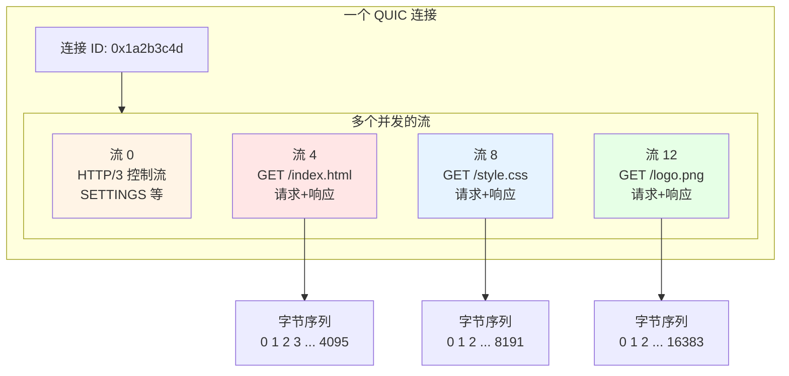
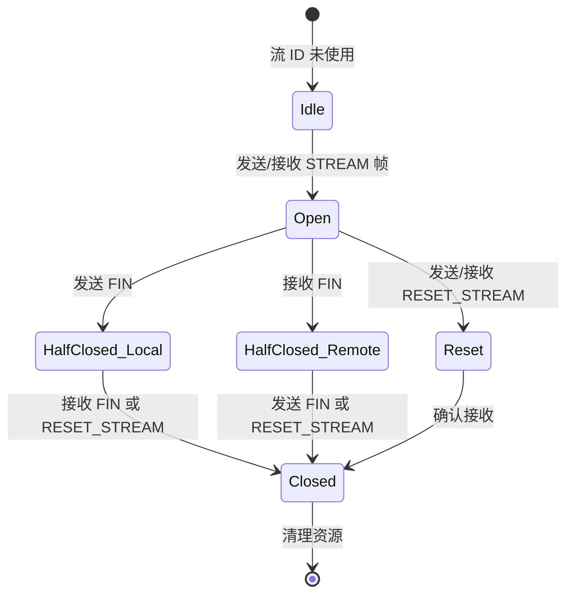
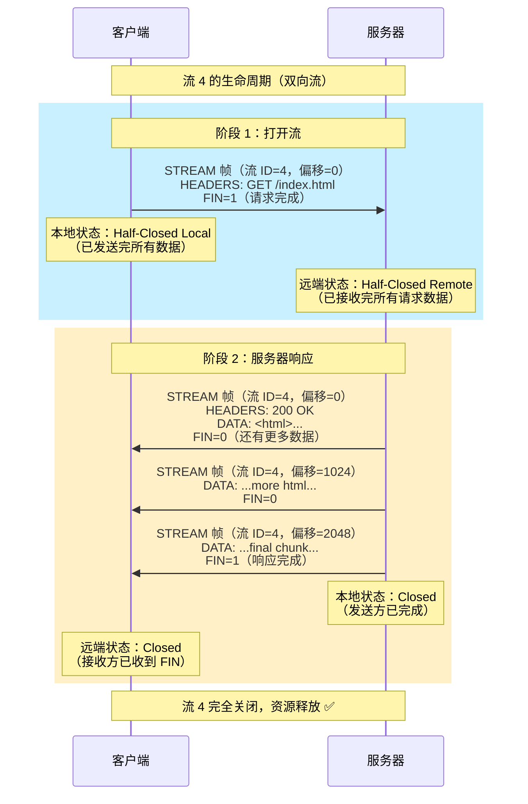
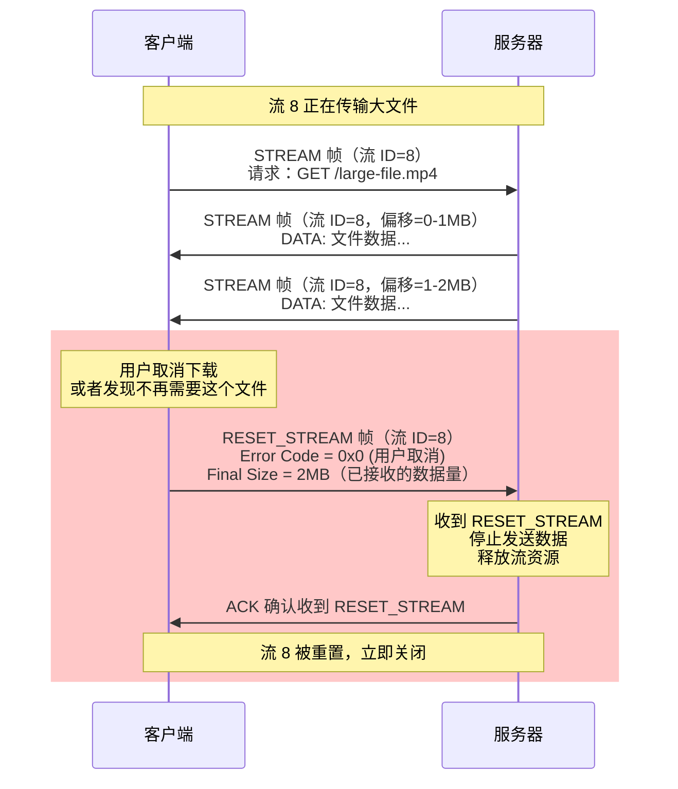
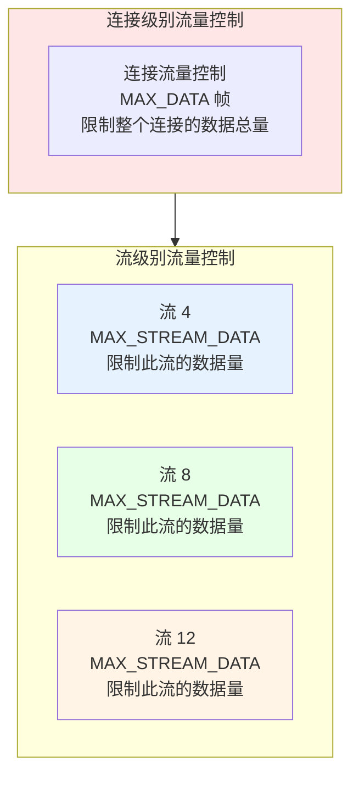
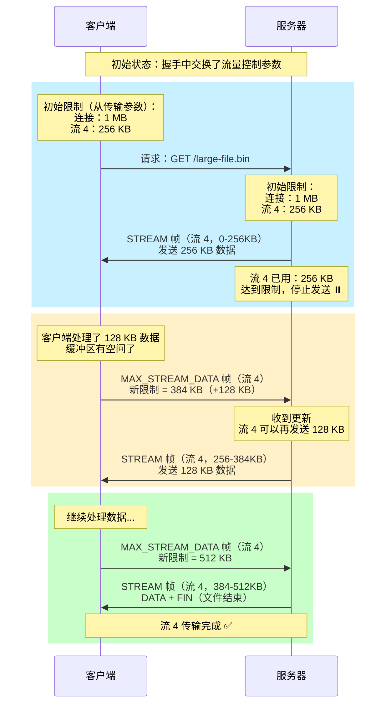
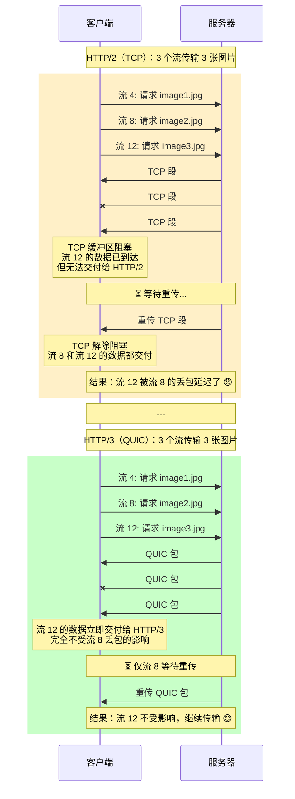

# 第五章：数据动脉：深入理解 QUIC 的流

## 引言：流——QUIC 的灵魂

在前面的章节中，我们多次提到"流"这个概念。现在，是时候深入探讨这个让 QUIC 真正消除队头阻塞的核心抽象了。

**流（Stream）**是 QUIC 传输层的基本数据传输单元。与 TCP 的单一字节流不同，一个 QUIC 连接可以承载 **数百甚至数千个并发的独立流**。每个流都是一个独立的、有序的字节序列，流之间完全隔离——一个流的丢包不会影响其他流的传输。

本章将深入探讨：
- 流的类型和 ID 分配规则
- 流的完整生命周期和状态机
- 流级别的流量控制
- 流的优先级和调度
- 与 HTTP/2 流的本质区别

---

## 一、流的基本概念

### 1.1 什么是流？

**流**是一个逻辑上的、有序的字节序列，用于承载应用数据。可以把它想象成一条"虚拟的管道"：



**关键特性**：
1. **独立性**：每个流有自己的数据缓冲区和流量控制状态
2. **有序性**：在单个流内，数据按照字节偏移量顺序交付
3. **并发性**：多个流可以同时传输，帧可以交错出现在不同的 QUIC 包中
4. **轻量级**：创建流不需要握手，只需在 STREAM 帧中使用一个新的流 ID

### 1.2 流 ID 的编码规则

QUIC 使用一个 **62 位的整数** 作为流 ID，其中 **最低 2 位** 用于编码流的属性：

```
流 ID 结构（62 位）：
+----------------------------------------------------------+
| 流标识符 (60 bits)                                        |
+----------------------------------------------------------+
| 发起者 (1 bit) | 方向性 (1 bit)                           |
+----------------------------------------------------------+

最低 2 位的编码：
- Bit 0（最低位）：发起者
  * 0 = 客户端发起
  * 1 = 服务器发起

- Bit 1：方向性
  * 0 = 双向流（Bidirectional）
  * 1 = 单向流（Unidirectional）
```

**流 ID 的类型**：

| 最低 2 位 | 流类型 | 示例 ID | 用途 |
|----------|--------|---------|------|
| **0b00** | 客户端发起的双向流 | 0, 4, 8, 12, ... | HTTP/3 请求/响应 |
| **0b01** | 服务器发起的双向流 | 1, 5, 9, 13, ... | 服务器推送（HTTP/3）|
| **0b10** | 客户端发起的单向流 | 2, 6, 10, 14, ... | HTTP/3 QPACK 编码器流 |
| **0b11** | 服务器发起的单向流 | 3, 7, 11, 15, ... | HTTP/3 控制流、QPACK 解码器流 |

**示例**：

```
流 ID = 8:
  二进制：...0000 1000
  最低 2 位：00
  → 客户端发起的双向流
  → 这是客户端创建的第 3 个双向流（0, 4, 8）

流 ID = 13:
  二进制：...0000 1101
  最低 2 位：01
  → 服务器发起的双向流
  → 这是服务器创建的第 4 个双向流（1, 5, 9, 13）
```

### 1.3 流的分类

**双向流（Bidirectional Streams）**：
- 双方都可以发送和接收数据
- HTTP/3 的请求/响应使用双向流
- 流的两个方向独立管理（可以单独关闭）

**单向流（Unidirectional Streams）**：
- 只有发起方可以发送数据，对方只能接收
- HTTP/3 的控制流（如 SETTINGS）使用单向流
- QPACK 的编解码器指令流使用单向流

---

## 二、流的生命周期

### 2.1 流的状态机

一个 QUIC 流的生命周期可以用状态机来描述：



**状态说明**：

1. **Idle（空闲）**：
   - 流 ID 尚未使用
   - 没有分配任何资源

2. **Open（开放）**：
   - 流处于活跃状态
   - 双方都可以发送/接收数据

3. **Half-Closed Local（本地半关闭）**：
   - 本地发送方已发送 FIN（表示"我没有更多数据要发送了"）
   - 但仍可以接收数据

4. **Half-Closed Remote（远端半关闭）**：
   - 远端发送方已发送 FIN
   - 本地仍可以发送数据，但不会再接收到新数据

5. **Reset（重置）**：
   - 流被异常终止（通过 RESET_STREAM 帧）
   - 所有缓冲的数据被丢弃

6. **Closed（关闭）**：
   - 流完全关闭
   - 资源可以被释放

### 2.2 正常关闭流程

**场景：HTTP/3 GET 请求的完整流程**



### 2.3 异常关闭：RESET_STREAM

有时需要提前终止流（例如用户取消下载），这时使用 **RESET_STREAM 帧**：



**RESET_STREAM 帧的格式**：

```
RESET_STREAM 帧：
+--------------------------------------------------+
| Type = 0x04                                      |
+--------------------------------------------------+
| Stream ID (可变长度整数)                          |
|   被重���的流 ID                                   |
+--------------------------------------------------+
| Application Protocol Error Code (可变长度整数)    |
|   应用层定义的错误码（如 HTTP/3 的 H3_REQUEST_CANCELLED）|
+--------------------------------------------------+
| Final Size (可变长度整数)                         |
|   发送方在此流上发送的总字节数                     |
+--------------------------------------------------+
```

**常见的错误码（HTTP/3）**：

| 错误码 | 名称 | 含义 |
|-------|------|------|
| 0x0100 | H3_NO_ERROR | 正常关闭（不是错误）|
| 0x0101 | H3_GENERAL_PROTOCOL_ERROR | 协议违规 |
| 0x0102 | H3_INTERNAL_ERROR | 内部错误 |
| 0x0103 | H3_STREAM_CREATION_ERROR | 无法创建流 |
| 0x010a | H3_REQUEST_CANCELLED | 用户取消请求 |
| 0x010b | H3_REQUEST_INCOMPLETE | 请求未完成就关闭 |

---

## 三、流级别的流量控制

### 3.1 为什么需要流量控制？

**问题场景**：服务器向客户端发送一个大文件，但客户端的处理速度跟不上：

```
没有流量控制的后果：
1. 服务器不断发送数据
2. 客户端的接收缓冲区溢出
3. 内存耗尽，程序崩溃 💥
```

**解决方案**：接收方告诉发送方"我只能接收这么多数据，请不要发太快"。

### 3.2 QUIC 的双层流量控制

QUIC 实现了 **两个层次** 的流量控制：



**双层控制的目的**：
1. **连接级别**：防止所有流的总数据量超过接收方的总缓冲区
2. **流级别**：防止单个流占用过多资源，确保公平性

### 3.3 流量控制的工作流程



**流量控制帧的格式**：

```
MAX_DATA 帧（连接级别）：
+--------------------------------------------------+
| Type = 0x10                                      |
+--------------------------------------------------+
| Maximum Data (可变长度整数)                       |
|   连接上允许的最大字节数                          |
+--------------------------------------------------+

MAX_STREAM_DATA 帧（流级别）：
+--------------------------------------------------+
| Type = 0x11                                      |
+--------------------------------------------------+
| Stream ID (可变长度整数)                          |
|   流的 ID                                        |
+--------------------------------------------------+
| Maximum Stream Data (可变长度整数)                |
|   此流上允许的最大字节数                          |
+--------------------------------------------------+
```

### 3.4 流量控制的实现细节

**发送方的视角**：

```python
class StreamSender:
    def __init__(self, stream_id):
        self.stream_id = stream_id
        self.bytes_sent = 0  # 已发送的字节数
        self.max_stream_data = 0  # 接收方允许的最大值
        self.send_buffer = b''  # 待发送的数据

    def on_max_stream_data(self, new_limit):
        """接收到 MAX_STREAM_DATA 帧"""
        self.max_stream_data = max(self.max_stream_data, new_limit)
        self.try_send()  # 尝试发送更多数据

    def try_send(self):
        """尝试发送数据"""
        available = self.max_stream_data - self.bytes_sent
        if available > 0 and self.send_buffer:
            # 发送不超过 available 字节
            data = self.send_buffer[:available]
            send_stream_frame(self.stream_id, data, self.bytes_sent)
            self.bytes_sent += len(data)
            self.send_buffer = self.send_buffer[len(data):]
```

**接收方的视角**：

```python
class StreamReceiver:
    def __init__(self, stream_id, initial_window=65536):
        self.stream_id = stream_id
        self.bytes_received = 0  # 已接收的字节数
        self.bytes_consumed = 0  # 应用层已消费的字节数
        self.max_stream_data = initial_window  # 当前限制
        self.receive_buffer = {}  # {offset: data}

    def on_stream_frame(self, offset, data):
        """接收到 STREAM 帧"""
        self.receive_buffer[offset] = data
        self.bytes_received = max(self.bytes_received, offset + len(data))

        # 检查是否需要更新流量控制窗口
        if self.bytes_received > self.max_stream_data * 0.5:
            # 如果已接收超过 50%，扩大窗口
            self.max_stream_data += 65536
            send_max_stream_data_frame(self.stream_id, self.max_stream_data)

    def consume_data(self, length):
        """应用层消费了数据"""
        self.bytes_consumed += length

        # 可以进一步扩大窗口
        available = self.max_stream_data - self.bytes_received
        consumed_but_not_released = self.bytes_consumed - (self.max_stream_data - 65536)

        if consumed_but_not_released > 32768:
            # 释放已消费的空间
            self.max_stream_data += consumed_but_not_released
            send_max_stream_data_frame(self.stream_id, self.max_stream_data)
```

---

## 四、流的优先级和调度

### 4.1 为什么需要优先级？

在一个 HTTP/3 连接中，可能同时有数十个流在传输：

```
流 4:  HTML 文档（关键资源）
流 8:  CSS 样式表（关键资源）
流 12: JavaScript（关键资源）
流 16: logo.png（非关键）
流 20: ad1.jpg（广告，低优先级）
流 24: ad2.jpg（广告，低优先级）
...
```

**问题**：如果所有流平等对待，关键资源可能被延迟，影响页面加载速度。

**解决方案**：让关键资源优先传输。

### 4.2 QUIC 的优先级扩展

QUIC 本身没有内置优先级机制，但提供了 **扩展帧** 的机制。HTTP/3 定义了 **PRIORITY_UPDATE 帧**：

```
PRIORITY_UPDATE 帧（HTTP/3 扩展）：
+--------------------------------------------------+
| Type = 0x0f (可变长度整数)                        |
+--------------------------------------------------+
| Prioritized Element Type (可变长度整数)           |
|   0x00 = 请求流                                  |
|   0x01 = 推送流                                  |
+--------------------------------------------------+
| Element ID (可变长度整数)                         |
|   流的 ID                                        |
+--------------------------------------------------+
| Priority Field Value (长度可变的字符串)           |
|   优先级信息（如 "u=3, i"）                      |
+--------------------------------------------------+
```

**优先级参数**：

```
优先级字符串格式：
"u=3, i"

- u (urgency)：紧急度，范围 0-7
  * 0 = 最高优先级（如关键 CSS、JavaScript）
  * 3 = 默认优先级（如 HTML）
  * 7 = 最低优先级（如分析脚本、广告）

- i (incremental)：是否增量传输
  * 存在 = 增量（如视频流，可以边下载边播放）
  * 不存在 = 非增量（如图片，需要完整下载才能显示）
```

**示例**：

```
浏览器加载网页时的优先级策略：

PRIORITY_UPDATE {
    Element Type: 请求流
    Element ID: 4 (HTML)
    Priority: "u=0"  // 最高优先级，非增量
}

PRIORITY_UPDATE {
    Element Type: 请求流
    Element ID: 8 (critical.css)
    Priority: "u=0"  // 最高优先级
}

PRIORITY_UPDATE {
    Element Type: 请求流
    Element ID: 12 (main.js)
    Priority: "u=1"  // 次高优先级
}

PRIORITY_UPDATE {
    Element Type: 请求流
    Element ID: 16 (logo.png)
    Priority: "u=4, i"  // 中等优先级，增量传输
}

PRIORITY_UPDATE {
    Element Type: 请求流
    Element ID: 20 (analytics.js)
    Priority: "u=7"  // 最低优先级
}
```

### 4.3 服务器端的调度算法

服务器根据优先级信息调度流的传输：

```python
class StreamScheduler:
    def __init__(self):
        # 按优先级分组的流队列
        self.queues = {urgency: [] for urgency in range(8)}
        self.stream_priorities = {}  # {stream_id: (urgency, incremental)}

    def update_priority(self, stream_id, urgency, incremental):
        """更新流的优先级"""
        self.stream_priorities[stream_id] = (urgency, incremental)

    def schedule_next_stream(self):
        """选择下一个要发送数据的流"""
        # 按优先级从高到低（0 → 7）选择
        for urgency in range(8):
            streams = [
                sid for sid, (u, _) in self.stream_priorities.items()
                if u == urgency and self.has_data(sid)
            ]

            if streams:
                # 在同一优先级内，轮询（Round Robin）
                return streams[0]

        return None

    def send_data(self, congestion_window_available):
        """根据拥塞窗口发送数据"""
        while congestion_window_available > 0:
            stream_id = self.schedule_next_stream()
            if stream_id is None:
                break  # 没有数据要发送

            # 发送一个 QUIC 包的数据
            data = self.get_stream_data(stream_id, min(1200, congestion_window_available))
            send_stream_frame(stream_id, data)
            congestion_window_available -= len(data)
```

---

## 五、QUIC 流 vs. HTTP/2 流

### 5.1 核心差异对比

| 维度 | HTTP/2 流 | QUIC 流 | 优势方 |
|-----|-----------|---------|-------|
| **实现层次** | 应用层（HTTP/2 协议）| 传输层（QUIC 协议）| QUIC |
| **独立性** | 逻辑独立，传输耦合 | 传输层真正独立 | QUIC |
| **丢包影响** | 一个流丢包，所有流阻塞 | 仅影响对应的流 | **QUIC** ⭐ |
| **重传粒度** | TCP 段（可能包含多个流）| STREAM 帧（精确到流和偏移）| **QUIC** ⭐ |
| **流量控制** | 连接级 + 流级 | 连接级 + 流级 | 相同 |
| **优先级** | 内置（流依赖树）| 扩展（HTTP/3 定义）| HTTP/2 更丰富 |
| **流 ID** | 31 位整数（奇偶区分）| 62 位整数（低 2 位编码类型）| QUIC 更灵活 |
| **流数量限制** | MAX_CONCURRENT_STREAMS | QUIC 传输参数 | 相同 |

### 5.2 队头阻塞的彻底解决

这是 QUIC 流最核心的优势。让我们再次对比：



---

## 六、实战：流的创建和使用

### 6.1 STREAM 帧的格式

STREAM 帧是 QUIC 中最常用的帧，用于承载应用数据：

```
STREAM 帧：
+--------------------------------------------------+
| Type = 0x08-0x0f (8 种变体)                      |
|   Bit 2: OFF (是否包含 Offset 字段)              |
|   Bit 1: LEN (是否包含 Length 字段)              |
|   Bit 0: FIN (是否是流的最后一个帧)              |
+--------------------------------------------------+
| Stream ID (可变长度整数)                          |
+--------------------------------------------------+
| [Offset (可变长度整数)]                           |
|   可选，数据在流中的字节偏移量                     |
+--------------------------------------------------+
| [Length (可变长度整数)]                           |
|   可选，数据长度                                 |
+--------------------------------------------------+
| Stream Data (...)                                |
|   实际的应用数据                                 |
+--------------------------------------------------+
```

**示例**：

```
发送第一个 STREAM 帧（偏移量 0）：
STREAM {
    Type: 0x0e  // OFF=1, LEN=1, FIN=0
    Stream ID: 4
    Offset: 0
    Length: 1024
    Data: [1024 字节的 HTTP/3 请求数据]
}

发送最后一个 STREAM 帧：
STREAM {
    Type: 0x0f  // OFF=1, LEN=1, FIN=1
    Stream ID: 4
    Offset: 1024
    Length: 512
    Data: [512 字节的数据]
}
```

### 6.2 创建双向流（HTTP/3 请求/响应）

```python
# 客户端代码示例
async def send_http3_request(connection, url):
    """发送 HTTP/3 请求"""
    # 1. 选择下一个可用的客户端双向流 ID
    stream_id = connection.get_next_bidi_stream_id()  # 返回 0, 4, 8, 12, ...

    # 2. 构造 HTTP/3 请求（简化版）
    headers = [
        (b':method', b'GET'),
        (b':scheme', b'https'),
        (b':authority', url.host.encode()),
        (b':path', url.path.encode()),
    ]
    request_data = encode_qpack_headers(headers)  # 使用 QPACK 编码

    # 3. 发送 STREAM 帧（带 FIN，表示请求结束）
    connection.send_stream_data(
        stream_id=stream_id,
        data=request_data,
        fin=True  # 客户端的请求发送完毕
    )

    # 4. 等待响应
    response_data = b''
    async for chunk in connection.receive_stream_data(stream_id):
        response_data += chunk

    # 5. 解析 HTTP/3 响应
    status, headers, body = parse_http3_response(response_data)
    return status, headers, body
```

```python
# 服务器代码示例
async def handle_http3_request(connection, stream_id, request_data):
    """处理 HTTP/3 请求"""
    # 1. 解析请求
    headers = decode_qpack_headers(request_data)
    method = dict(headers)[b':method']
    path = dict(headers)[b':path']

    # 2. 处理请求（如读取文件）
    if path == b'/index.html':
        body = read_file('/var/www/index.html')
        status = 200
    else:
        body = b'404 Not Found'
        status = 404

    # 3. 构造响应
    response_headers = [
        (b':status', str(status).encode()),
        (b'content-type', b'text/html'),
        (b'content-length', str(len(body)).encode()),
    ]
    response_data = encode_qpack_headers(response_headers) + body

    # 4. 发送响应（带 FIN）
    connection.send_stream_data(
        stream_id=stream_id,
        data=response_data,
        fin=True  # 响应发送完毕
    )
```

### 6.3 创建单向流（HTTP/3 控制流）

```python
# 服务器发送 HTTP/3 SETTINGS 帧（在单向流上）
async def send_http3_settings(connection):
    """发送 HTTP/3 设置"""
    # 1. 选择服务器单向流 ID（第一个是 3）
    control_stream_id = connection.get_next_uni_stream_id()  # 返回 3

    # 2. 构造 HTTP/3 控制流数据
    # 首先发送流类型（0x00 = 控制流）
    stream_type = encode_varint(0x00)

    # 然后发送 SETTINGS 帧
    settings = {
        0x01: 65536,  # SETTINGS_MAX_FIELD_SECTION_SIZE
        0x06: 100,    # SETTINGS_MAX_HEADER_LIST_SIZE
    }
    settings_frame = encode_http3_settings(settings)

    # 3. 发送到单向流（不带 FIN，控制流保持打开）
    connection.send_stream_data(
        stream_id=control_stream_id,
        data=stream_type + settings_frame,
        fin=False  # 控制流在整个连接期间保持打开
    )
```

---

## 七、本章总结

### 7.1 核心要点

1. **流是 QUIC 的核心抽象**：
   - 独立的、有序的字节序列
   - 一个连接可以有数百个并发流
   - 流之间完全隔离，真正消除队头阻塞

2. **流 ID 的编码**：
   - 62 位整数，最低 2 位编码类型
   - 客户端发起的流：ID 最低位为 0
   - 服务器发起的流：ID 最低位为 1
   - 双向流：第 2 位为 0
   - 单向流：第 2 位为 1

3. **流的生命周期**：
   - 状态机：Idle → Open → Half-Closed → Closed
   - 正常关闭：FIN 标志
   - 异常关闭：RESET_STREAM 帧

4. **流量控制**：
   - 双层控制：连接级 + 流级
   - 防止缓冲区溢出
   - 确保公平性

5. **优先级**：
   - HTTP/3 定义了 PRIORITY_UPDATE 扩展
   - 紧急度（urgency）：0-7
   - 增量传输（incremental）标志

6. **与 HTTP/2 的关键区别**：
   - QUIC 流在传输层实现，HTTP/2 流在应用层
   - QUIC 彻底解决了队头阻塞问题
   - QUIC 的重传精确到流和偏移量

### 7.2 性能影响

| 场景 | TCP+HTTP/2 | QUIC+HTTP/3 | 改善 |
|-----|-----------|------------|-----|
| **1% 丢包率** | 所有流受影响 | 仅丢失包的流受影响 | **流隔离** ⭐ |
| **高并发流** | 队头阻塞严重 | 完全独立 | **10-30% 性能提升** |
| **大文件 + 小请求** | 大文件阻塞小请求 | 完全独立 | **显著改善响应时间** |

### 7.3 展望

在下一章中，我们将深入探讨 QUIC 的 **可靠性、确认与流量控制** 机制。我们将看到 QUIC 如何在 UDP 之上构建可靠传输，以及其高效的 ACK 机制和流量控制算法。

---

## 参考资料

- RFC 9000: QUIC: A UDP-Based Multiplexed and Secure Transport, Section 2 (Streams)
- RFC 9114: HTTP/3, Section 6 (Stream Mapping and Usage)
- RFC 9218: Extensible Prioritization Scheme for HTTP
- "HTTP/3 From A To Z: Core Concepts" by Robin Marx
- Cloudflare Blog: "HTTP/3 deep dive"
