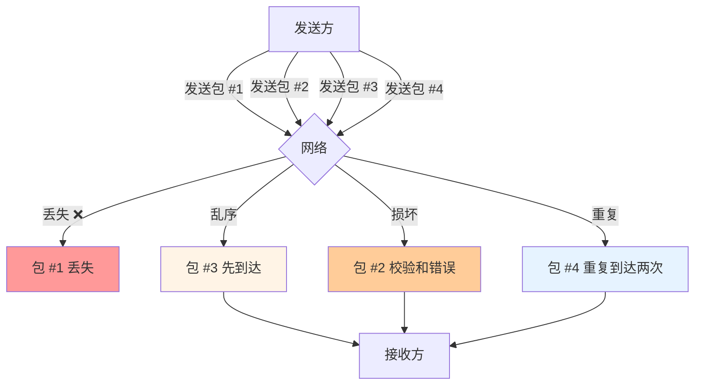
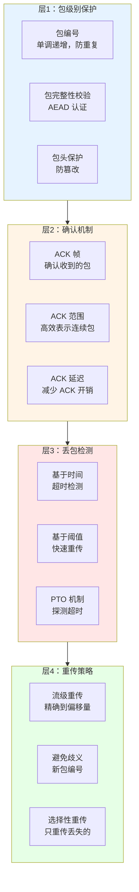
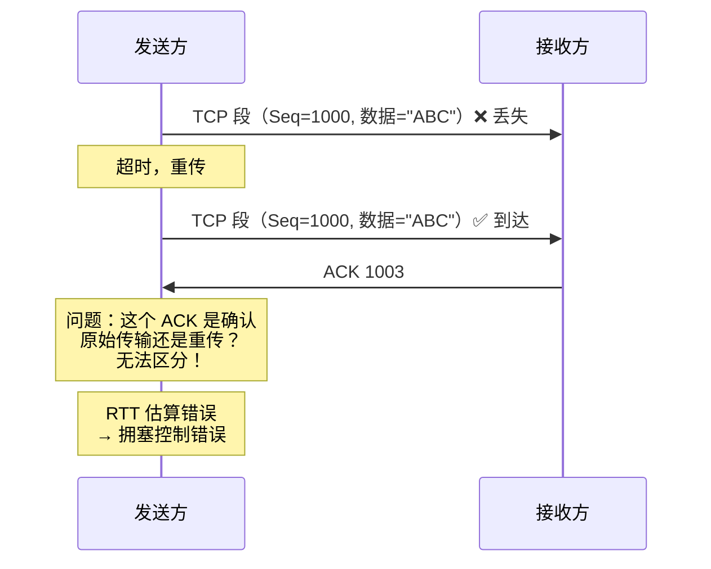
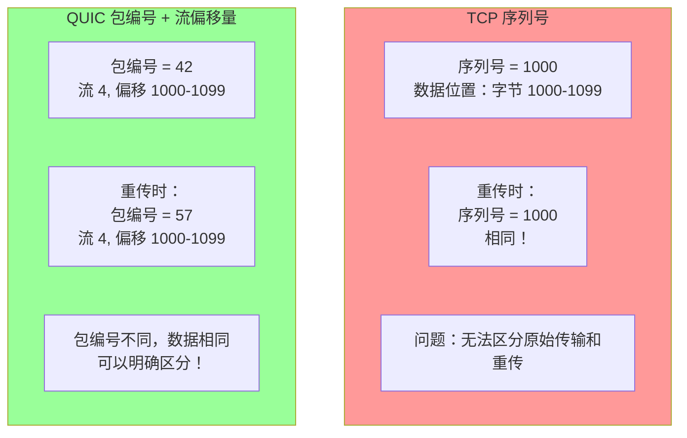
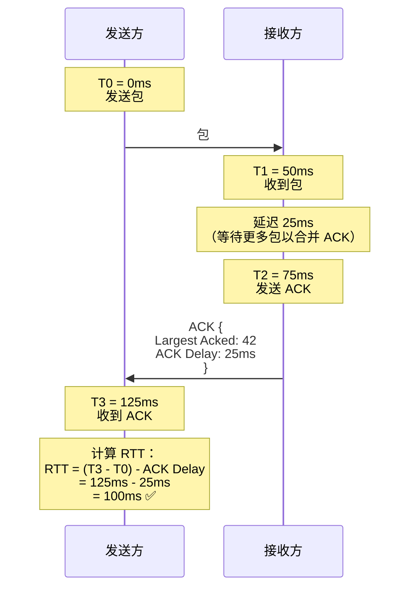
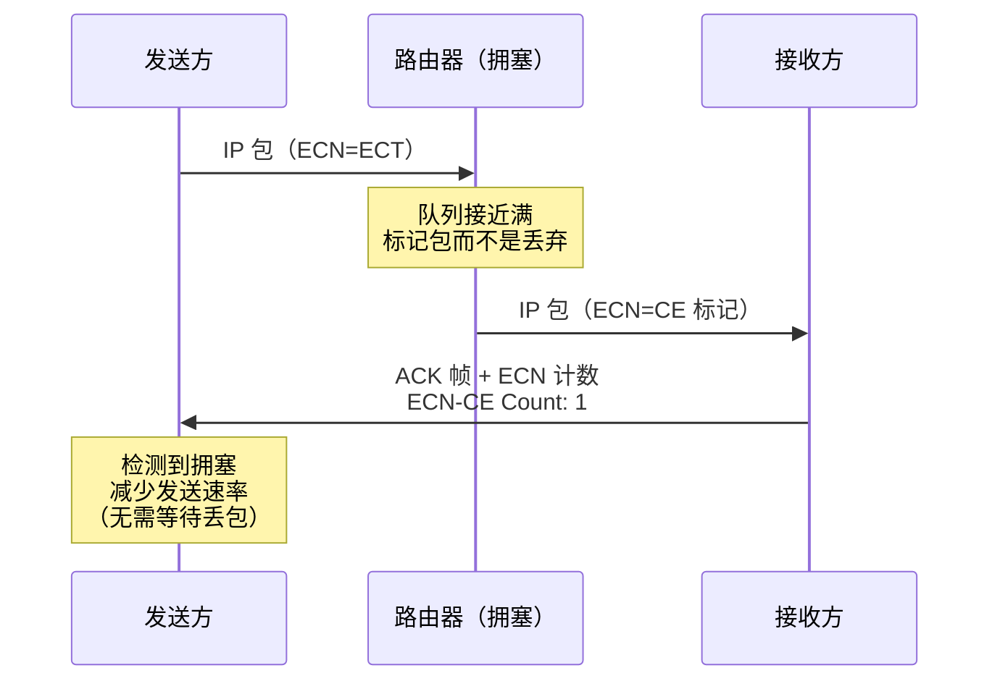
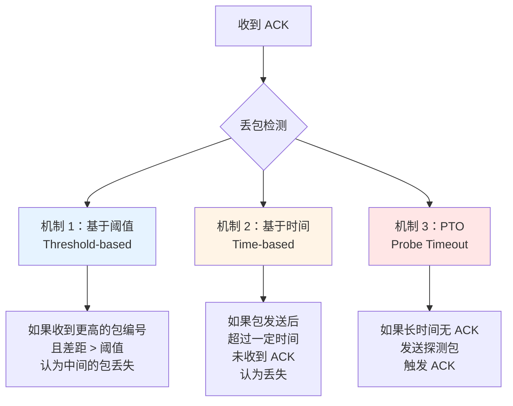
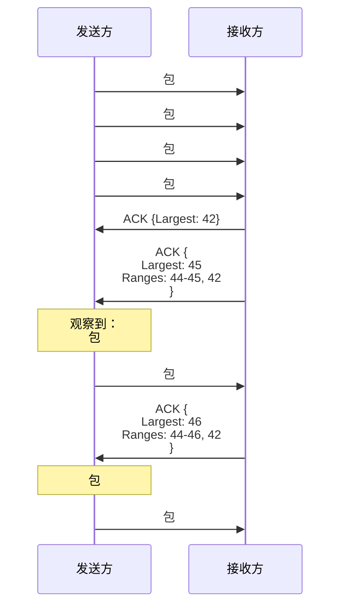
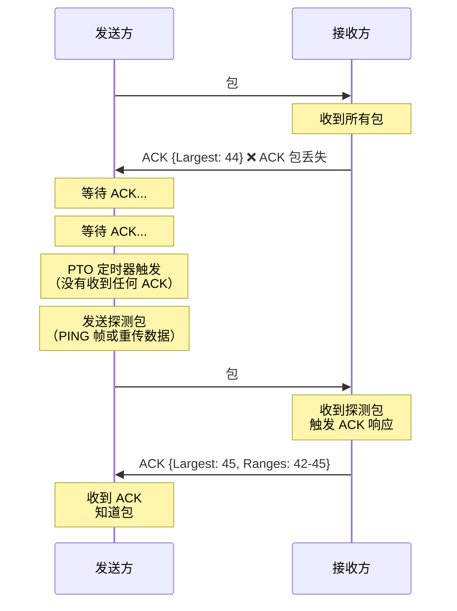
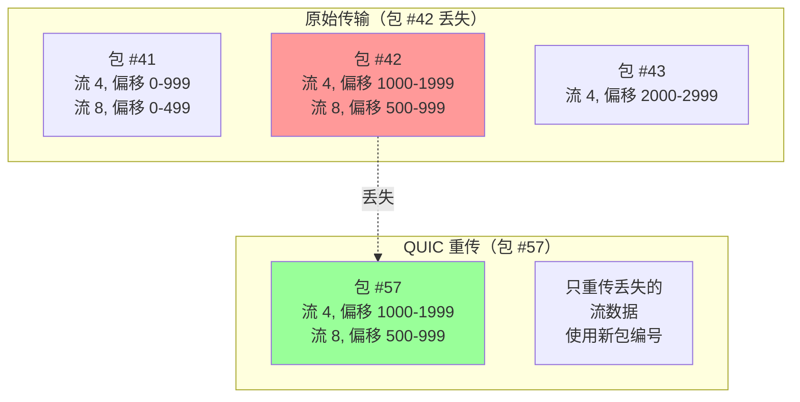

# 第六章：坚如磐石：QUIC 的可靠性、确认与流量控制

## 引言：在不可靠之上构建可靠

这听起来像一个悖论：UDP 是一个"不可靠"的传输协议——它不保证数据送达、不保证顺序、不重传丢失的包。那么，QUIC 如何在这样一个"不靠谱"的基础上，构建出一个比 TCP 更可靠、更高效的传输协议呢？

答案在于：**精心设计的可靠性机制**。QUIC 不是简单地复制 TCP 的可靠性机制，而是从零开始重新思考，利用 40 年来在网络传输领域积累的经验和教训，设计出了一套更现代、更高效的可靠传输机制。

本章将深入探讨：
1. **ACK 机制**：如何高效地确认收到的数据
2. **丢包检测**：如何快速准确地发现丢包
3. **重传策略**：如何智能地重传丢失的数据
4. **流量控制**：如何防止发送方压垮接收方
5. **与 TCP 的对比**：QUIC 的设计为何更优秀

---

## 一、QUIC 的可靠性基础

### 1.1 可靠性的核心挑战

在网络传输中，数据包可能遭遇各种问题：



**可靠性机制需要解决的问题**：
1. **丢包检测**：如何知道哪些包丢失了？
2. **重传**：如何重传丢失的包？
3. **乱序处理**：如何处理乱序到达的包？
4. **重复检测**：如何识别并丢弃重复的包？
5. **完整性验证**：如何确保数据没有被篡改？

### 1.2 QUIC 的可靠性架构

QUIC 采用了一个多层次的可靠性架构：



---

## 二、包编号空间：QUIC 的创新设计

### 2.1 TCP 的序列号问题

TCP 使用 **序列号（Sequence Number）** 来标识数据的字节位置：

```
TCP 序列号的问题：
1. 序列号标识的是字节，而不是包
2. 重传的数据使用相同的序列号（重传歧义）
3. 序列号会回绕（32 位空间，约 4GB 后回到 0）
```

**重传歧义示例**：



### 2.2 QUIC 的包编号（Packet Number）

QUIC 引入了 **包编号（Packet Number）** 的概念，与数据的偏移量完全分离：

**核心设计原则**：
1. **包编号标识的是包，而不是数据**
2. **每个包都有唯一的包编号，即使重传也使用新的包编号**
3. **包编号单调递增，永不重复**



**示例**：

```
原始传输：
QUIC 包 #42:
  STREAM 帧（流 ID=4, 偏移=1000, 长度=100, 数据="..."）

丢失后重传：
QUIC 包 #57:
  STREAM 帧（流 ID=4, 偏移=1000, 长度=100, 数据="..."）

关键观察：
- 包编号从 42 变成了 57（不同）
- 流 ID 和偏移量保持不变（数据相同）
- 接收方可以明确知道这是一个重传
- 发送方可以准确计算 RTT（从包 #42 发送到 ACK #57 收到）
```

### 2.3 包编号的编码优化

为了节省带宽，QUIC 使用 **截断的包编号**：

**问题**：如果包编号是 64 位，每个包需要 8 字节来编码包编号，开销太大。

**解决方案**：只发送包编号的 **最低若干位**，接收方根据上下文推断完整的包编号。

```
包编号截断算法：

假设：
- 最后确认的包编号 = 100
- 预期的下一个包编号 = 101-200

编码：
- 如果发送包 #105，只需发送 5（最低 8 位足够）
- 接收方看到 5，知道完整包编号是 105（在 101-200 范围内）

如果发送包 #205（更大的跳跃）：
- 需要发送更多位（如 16 位：0x00CD = 205）
```

**包编号长度字段**：

```
QUIC 包头中的包编号长度字段（2 位）：
00 = 1 字节（最多跳跃 256）
01 = 2 字节（最多跳跃 65536）
10 = 3 字节（最多跳跃 16M）
11 = 4 字节（最多跳跃 4B）
```

---

## 三、ACK 机制：高效的确认设计

### 3.1 ACK 帧的结构

QUIC 的 ACK 帧设计非常紧凑和高效：

```
ACK 帧结构：
+--------------------------------------------------+
| Type = 0x02 或 0x03                              |
|   0x02 = ACK                                     |
|   0x03 = ACK + ECN 计数                          |
+--------------------------------------------------+
| Largest Acknowledged (可变长度整数)               |
|   收到的最大包编号                                |
+--------------------------------------------------+
| ACK Delay (可变长度整数)                          |
|   从收到包到发送 ACK 的延迟（编码后）             |
+--------------------------------------------------+
| ACK Range Count (可变长度整数)                    |
|   ACK 范围的数量                                 |
+--------------------------------------------------+
| First ACK Range (可变长度整数)                    |
|   从 Largest Acknowledged 开始的连续包数量        |
+--------------------------------------------------+
| [ACK Range ...]                                  |
|   可选的额外 ACK 范围                            |
+--------------------------------------------------+
```

### 3.2 ACK 范围（ACK Ranges）的妙用

**问题**：如果单独确认每个包，开销很大。

**解决方案**：使用 **范围压缩**，连续的包用一个范围表示。

**示例**：

```
收到的包编号：42, 43, 44, 45, 48, 49, 50, 52, 54, 55

天真的 ACK 方式（需要 10 个条目）：
ACK: 42, 43, 44, 45, 48, 49, 50, 52, 54, 55

QUIC 的范围压缩方式：
ACK {
    Largest Acknowledged: 55
    First ACK Range: 1  // 55-54 = 1 (包 54-55，共 2 个)
    ACK Ranges: [
        Gap: 1, Range: 0,  // 跳过 53，包 52（1 个）
        Gap: 1, Range: 2,  // 跳过 51，包 48-50（3 个）
        Gap: 2, Range: 3,  // 跳过 47、46，包 42-45（4 个）
    ]
}

编码后的大小：约 15-20 字节（vs. 40-80 字节）
```

**可视化**：


### 3.3 ACK 延迟（ACK Delay）

**目的**：让发送方准确计算 RTT（往返时间）。

**问题**：接收方可能不会立即发送 ACK（为了减少 ACK 包的数量），这会影响 RTT 计算。

**解决方案**：在 ACK 帧中包含 **ACK Delay** 字段，告诉发送方"我延迟了多久才发送这个 ACK"。



**ACK Delay 的编码**：

```
ACK Delay 字段使用特殊的编码方式：

ACK Delay（编码后）= 实际延迟（微秒）>> ack_delay_exponent

默认 ack_delay_exponent = 3（在传输参数中协商）

示例：
实际延迟 = 25000 微秒 = 25ms
ACK Delay = 25000 >> 3 = 3125
编码为可变长度整数

接收方解码：
实际延迟 = 3125 << 3 = 25000 微秒 = 25ms
```

### 3.4 ACK 的发送策略

**问题**：何时发送 ACK？太频繁浪费带宽，太晚影响性能。

**QUIC 的策略**：

```python
class AckManager:
    def __init__(self):
        self.ack_eliciting_packets_received = 0  # 收到的需要 ACK 的包数
        self.max_ack_delay = 25  # 最大 ACK 延迟（ms）
        self.ack_timer = None

    def on_packet_received(self, packet):
        """收到包时的处理"""
        self.ack_eliciting_packets_received += 1

        # 策略 1：收到第 2 个需要 ACK 的包时立即发送
        if self.ack_eliciting_packets_received >= 2:
            self.send_ack_immediately()
            self.ack_eliciting_packets_received = 0
            return

        # 策略 2：启动定时器，在 max_ack_delay 后发送
        if self.ack_timer is None:
            self.ack_timer = set_timer(self.max_ack_delay, self.send_ack)

    def send_ack_immediately(self):
        """立即发送 ACK"""
        self.cancel_timer()
        self.send_ack_frame()

    def send_ack(self):
        """定时器触发时发送 ACK"""
        self.ack_timer = None
        self.send_ack_frame()
```

**优化**：
1. **Ack-Eliciting 包**：只有"需要 ACK"的包才触发上述策略（如包含 STREAM、CRYPTO 等帧）
2. **纯 ACK 包**：不需要被 ACK（避免"ACK 的 ACK"的无限循环）
3. **合并 ACK**：如果有数据要发送，把 ACK 帧附加在数据包中，节省包数量

### 3.5 ECN 支持（显式拥塞通知）

QUIC 支持 **ECN（Explicit Congestion Notification）**，这是一种网络层的拥塞信号机制。

**ECN 的工作原理**：



**ACK 帧中的 ECN 字段**：

```
ACK 帧（Type = 0x03，包含 ECN）：
+--------------------------------------------------+
| ... 标准 ACK 字段 ...                            |
+--------------------------------------------------+
| ECT(0) Count (可变长度整数)                      |
|   收到的 ECT(0) 标记的包数量                     |
+--------------------------------------------------+
| ECT(1) Count (可变长度整数)                      |
|   收到的 ECT(1) 标记的包数量                     |
+--------------------------------------------------+
| ECN-CE Count (可变长度整数)                      |
|   收到的 Congestion Experienced 标记的包数量     |
+--------------------------------------------------+
```

**好处**：
- **更早检测拥塞**：在丢包之前就能感知拥塞
- **避免不必要的丢包**：路由器标记而不是丢弃包
- **更平滑的速率调整**：不需要等待超时和重传

---

## 四、丢包检测：快速而准确

### 4.1 丢包检测的挑战

**问题**：如何知道一个包丢失了？

**不能太早**：网络可能只是延迟，包还在路上
**不能太晚**：影响性能，用户等待时间长

### 4.2 QUIC 的三种丢包检测机制



### 4.3 机制 1：基于阈值的快速重传

**核心思想**：如果收到了更高编号的包的 ACK，且中间有包未被确认，很可能这些包丢失了。



**阈值设置**：

```
QUIC 的默认阈值：
- kPacketThreshold = 3

含义：如果收到了比某个包编号大 3 的包的 ACK，
     且该包仍未被确认，认为该包丢失。

示例：
- 发送了包 42, 43, 44, 45, 46
- 收到 ACK: 42, 44, 45, 46（43 未确认）
- 因为 46 - 43 = 3 ≥ kPacketThreshold
- 认为包 #43 丢失，立即重传
```

### 4.4 机制 2：基于时间的丢包检测

**核心思想**：如果一个包在发送后超过一定时间仍未被确认，认为它丢失了。

```python
class LossDetection:
    def __init__(self):
        self.kTimeThreshold = 9/8  # 时间阈值因子
        self.latest_rtt = 100  # 最近的 RTT（ms）
        self.rttvar = 50  # RTT 方差

    def compute_loss_detection_timer(self):
        """计算丢包检测定时器"""
        # 基于时间的阈值 = max(kTimeThreshold * latest_rtt, kGranularity)
        time_threshold = max(
            self.kTimeThreshold * self.latest_rtt,
            1  # 最小粒度 1ms
        )
        return time_threshold

    def detect_lost_packets(self, current_time):
        """检测丢失的包"""
        lost_packets = []
        time_threshold = self.compute_loss_detection_timer()

        for packet in self.sent_packets:
            if packet.acked:
                continue  # 已确认的包跳过

            # 计算包的"年龄"
            time_since_sent = current_time - packet.time_sent

            if time_since_sent > time_threshold:
                # 超过阈值，认为丢失
                lost_packets.append(packet)

        return lost_packets
```

**时间阈值的计算**：

```
时间阈值 = max(9/8 × latest_rtt, 1ms)

为什么是 9/8？
- 考虑到网络抖动，不能用 1 × RTT（太激进）
- 9/8 = 1.125 是一个经验值，平衡了性能和准确性

示例：
如果 latest_rtt = 100ms
时间阈值 = 9/8 × 100ms = 112.5ms

如果一个包在发送后 120ms 仍未被确认，认为它丢失了。
```

### 4.5 机制 3：探测超时（PTO, Probe Timeout）

**问题场景**：如果所有包都丢失了（包括 ACK），发送方无法通过前两种机制检测丢包。

**解决方案**：**PTO** 机制——如果长时间没有收到任何 ACK，主动发送一个"探测包"来触发接收方的 ACK。



**PTO 定时器的计算**：

```python
def compute_pto(self):
    """计算 PTO 超时时间"""
    # PTO = smoothed_rtt + 4 × rttvar + max_ack_delay
    pto = self.smoothed_rtt + 4 * self.rttvar + self.max_ack_delay

    # 最小 PTO
    pto = max(pto, self.kMinPTO)  # kMinPTO = 10ms

    # 如果没有未确认的包，使用初始 RTT
    if self.bytes_in_flight == 0:
        pto = max(self.kInitialRtt, 2 * self.smoothed_rtt)

    return pto
```

**PTO 的退避（Backoff）**：

```
如果 PTO 触发后仍未收到 ACK，指数退避：

第 1 次 PTO: timeout = PTO
第 2 次 PTO: timeout = 2 × PTO
第 3 次 PTO: timeout = 4 × PTO
...
最多退避到 60 秒

如果连续多次 PTO 失败，最终会关闭连接。
```

---

## 五、重传策略：智能而高效

### 5.1 TCP 的重传问题

**TCP 的重传单位是段（Segment）**：

```
问题：
1. 一个 TCP 段可能包含多个 HTTP/2 流的数据
2. 重传时，会重传整个段（包括已正确接收的数据）
3. 造成带宽浪费
```

### 5.2 QUIC 的流级重传

**QUIC 的重传单位是流和偏移量**：



**关键优势**：
1. **精确重传**：只重传丢失的流数据，不重传已收到的
2. **避免歧义**：使用新的包编号，发送方可以准确测量 RTT
3. **灵活组合**：重传时可以将多个流的数据合并到一个包中

### 5.3 重传的优化策略

**策略 1：选择性重传**

```python
def retransmit_lost_data(self, lost_packets):
    """重传丢失的数据"""
    for packet in lost_packets:
        for frame in packet.frames:
            if isinstance(frame, StreamFrame):
                # 检查这段数据是否已被后续包重传
                if not self.is_data_acked(frame.stream_id, frame.offset, frame.length):
                    # 只重传未被确认的数据
                    self.send_stream_data(
                        stream_id=frame.stream_id,
                        offset=frame.offset,
                        data=frame.data
                    )
```

**策略 2：重传时的优先级调整**

```python
def prioritize_retransmissions(self, lost_packets):
    """优先重传重要的数据"""
    high_priority = []
    low_priority = []

    for packet in lost_packets:
        for frame in packet.frames:
            if isinstance(frame, StreamFrame):
                stream_priority = self.get_stream_priority(frame.stream_id)
                if stream_priority <= 2:  # 高优先级流（如 HTML、CSS）
                    high_priority.append(frame)
                else:
                    low_priority.append(frame)

    # 先重传高优先级数据
    return high_priority + low_priority
```

**策略 3：合并重传**

```python
def pack_retransmissions(self, frames_to_retransmit, max_packet_size):
    """将多个重传数据打包到一个包中"""
    packet = QuicPacket()
    remaining_size = max_packet_size

    for frame in frames_to_retransmit:
        frame_size = estimate_frame_size(frame)
        if frame_size <= remaining_size:
            packet.add_frame(frame)
            remaining_size -= frame_size
        else:
            # 包已满，发送
            send_packet(packet)
            packet = QuicPacket()
            remaining_size = max_packet_size

    if packet.frames:
        send_packet(packet)
```

---

## 六、流量控制：防止压垮接收方

### 6.1 流量控制的目的

**问题场景**：发送方发送数据的速度远超接收方处理的速度。

```
没有流量控制的后果：
1. 接收方的缓冲区溢出
2. 内存耗尽
3. 程序崩溃或性能严重下降
```

### 6.2 QUIC 的双层流量控制

我们在第五章已经介绍了流量控制的基本概念，这里深入探讨其实现细节。

**连接级别流量控制**：

```python
class ConnectionFlowControl:
    def __init__(self, initial_max_data):
        self.max_data = initial_max_data  # 总限制
        self.bytes_sent = 0  # 已发送的字节数
        self.bytes_acked = 0  # 已确认的字节数

    def can_send(self, length):
        """检查是否可以发送指定长度的数据"""
        return (self.bytes_sent + length) <= self.max_data

    def on_data_sent(self, length):
        """发送数据后更新状态"""
        self.bytes_sent += length

    def on_max_data_frame(self, new_limit):
        """收到 MAX_DATA 帧"""
        self.max_data = max(self.max_data, new_limit)

    def on_data_acked(self, length):
        """数据被确认"""
        self.bytes_acked += length
```

**流级别流量控制**：

```python
class StreamFlowControl:
    def __init__(self, stream_id, initial_max_stream_data):
        self.stream_id = stream_id
        self.max_stream_data = initial_max_stream_data
        self.bytes_sent = 0
        self.bytes_acked = 0

    def can_send(self, length):
        """检查此流是否可以发送数据"""
        return (self.bytes_sent + length) <= self.max_stream_data

    def on_data_sent(self, length):
        """发送数据"""
        self.bytes_sent += length

    def on_max_stream_data_frame(self, new_limit):
        """收到 MAX_STREAM_DATA 帧"""
        self.max_stream_data = max(self.max_stream_data, new_limit)
```

**双层检查**：

```python
def send_stream_data(self, stream_id, data):
    """发送流数据（需同时满足连接级和流级限制）"""
    length = len(data)

    # 检查连接级别限制
    if not self.connection_flow_control.can_send(length):
        return False  # 连接级别流量控制阻塞

    # 检查流级别限制
    stream_fc = self.get_stream_flow_control(stream_id)
    if not stream_fc.can_send(length):
        return False  # 流级别流量控制阻塞

    # 两个条件都满足，可以发送
    send_stream_frame(stream_id, data)
    self.connection_flow_control.on_data_sent(length)
    stream_fc.on_data_sent(length)
    return True
```

### 6.3 自动调优（Auto-tuning）

**问题**：初始窗口大小可能不合适（太小或太大）。

**解决方案**：接收方根据实际情况动态调整窗口大小。

```python
class AdaptiveFlowControl:
    def __init__(self):
        self.receive_window = 65536  # 初始窗口 64KB
        self.bytes_received = 0
        self.bytes_consumed = 0  # 应用层已消费
        self.last_update_time = 0

    def on_data_received(self, length):
        """收到数据"""
        self.bytes_received += length

        # 如果窗口使用率 > 50%，考虑扩大窗口
        window_used = self.bytes_received - self.bytes_consumed
        if window_used > self.receive_window * 0.5:
            self.expand_window()

    def expand_window(self):
        """扩大窗口"""
        # 基于带宽延迟积（BDP）扩展
        estimated_bw = self.estimate_bandwidth()  # 估算带宽
        estimated_rtt = self.estimate_rtt()  # 估算 RTT

        # BDP = 带宽 × RTT
        bdp = estimated_bw * estimated_rtt

        # 新窗口 = max(当前窗口 × 2, BDP × 2)
        new_window = max(self.receive_window * 2, bdp * 2)

        # 限制最大窗口（如 16MB）
        new_window = min(new_window, 16 * 1024 * 1024)

        self.receive_window = new_window
        self.send_max_data_frame(self.bytes_consumed + new_window)

    def on_data_consumed(self, length):
        """应用层消费了数据"""
        self.bytes_consumed += length

        # 定期释放窗口空间
        if self.bytes_consumed - self.last_update_time > 32768:
            self.send_max_data_frame(self.bytes_consumed + self.receive_window)
            self.last_update_time = self.bytes_consumed
```

---

## 七、与 TCP 的性能对比

### 7.1 关键指标对比

| 指标 | TCP | QUIC | 优势方 |
|-----|-----|------|-------|
| **重传歧义** | 有（序列号重用）| 无（包编号唯一）| **QUIC** ⭐ |
| **RTT 测量精度** | 低（歧义影响）| 高（无歧义）| **QUIC** ⭐ |
| **丢包检测延迟** | 依赖超时（RTO）| 多种机制（阈值+PTO）| **QUIC** ⭐ |
| **重传粒度** | TCP 段（粗粒度）| 流+偏移量（细粒度）| **QUIC** ⭐ |
| **流量控制层次** | 连接级 | 连接级+流级 | **QUIC** ⭐ |
| **ECN 支持** | 可选，不广泛使用 | 内置，易于部署 | **QUIC** |
| **成熟度** | 40+ 年，极其成熟 | 相对较新（5-10 年）| **TCP** |

### 7.2 真实场景的性能对比

**场景 1：1% 丢包率，100ms RTT**

```
TCP + HTTP/2:
- 每次丢包：所有流阻塞
- 重传延迟：约 200-300ms（RTO）
- 吞吐量下降：30-50%

QUIC + HTTP/3:
- 每次丢包：仅受影响的流阻塞
- 重传延迟：约 125ms（1.25 × RTT）
- 吞吐量下降：10-20%

性能提升：QUIC 比 TCP 快 40-60%
```

**场景 2：高并发流（20+ 个流）**

```
TCP + HTTP/2:
- 单一字节流，队头阻塞严重
- 一个流的丢包影响所有流
- 用户感知延迟：明显增加

QUIC + HTTP/3:
- 流完全独立
- 丢包仅影响对应流
- 用户感知延迟：几乎无影响

性能提升：QUIC 比 TCP 快 50-100%（在高丢包率下）
```

---

## 八、本章总结

### 8.1 核心要点

1. **包编号的创新设计**：
   - 与数据偏移量分离
   - 每个包唯一，重传使用新编号
   - 彻底解决重传歧义问题

2. **高效的 ACK 机制**：
   - ACK 范围压缩，节省带宽
   - ACK Delay 字段，精确测量 RTT
   - ECN 支持，提前感知拥塞

3. **多层次的丢包检测**：
   - 基于阈值的快速重传
   - 基于时间的丢包检测
   - PTO 机制处理极端情况

4. **智能的重传策略**：
   - 流级别的精确重传
   - 避免重传歧义
   - 选择性重传，节省带宽

5. **双层流量控制**：
   - 连接级别防止总体过载
   - 流级别确保公平性
   - 自动调优适应网络条件

6. **相比 TCP 的优势**：
   - 更精确的 RTT 测量
   - 更快的丢包检测
   - 更细粒度的重传
   - 更好的流隔离性

### 8.2 性能提升总结

| 场景 | TCP + HTTP/2 性能 | QUIC + HTTP/3 性能 | 提升幅度 |
|-----|------------------|-------------------|---------|
| **0.1% 丢包** | 基准 | 5-10% 提升 | 轻微 |
| **1% 丢包** | -30% | -10% | **40-60%** ⭐ |
| **5% 丢包** | -60% | -25% | **50-100%** ⭐ |
| **高并发流** | 严重阻塞 | 流独立 | **显著改善** ⭐ |

### 8.3 展望

在下一章中，我们将探讨 QUIC 的 **拥塞控制与恢复**机制。我们将看到 QUIC 如何实现可插拔的拥塞控制算法，以及 BBR、Cubic 等先进算法如何提升网络利用率。

---

## 参考资料

- RFC 9000: QUIC: A UDP-Based Multiplexed and Secure Transport
  - Section 13: Packet and Frame Handling
  - Section 17.2: ACK Frames
  - Section 4: Flow Control
- RFC 9002: QUIC Loss Detection and Congestion Control
  - Section 6: Loss Detection
- "The QUIC Transport Protocol: Design and Internet-Scale Deployment" (SIGCOMM 2017)
- Chromium QUIC Implementation: Loss Detection Code
- "Understanding QUIC Wire Protocol" by Robin Marx
