# 第七章：智慧交通：QUIC 的拥塞控制与恢复

## 引言：网络中的"交通管制"

想象一下城市的交通系统：如果所有车辆都以最高速度行驶，不考虑道路容量，结果会是灾难性的——交通拥堵、事故频发、效率低下。网络传输也是如此：如果发送方不加节制地发送数据，网络很快就会过载，导致大量丢包、延迟飙升、吞吐量下降。

**拥塞控制（Congestion Control）**就是网络中的"交通管制员"，它的职责是：
- 探测网络的可用带宽
- 动态调整发送速率
- 在拥塞时减速，避免雪崩
- 在畅通时加速，充分利用带宽

QUIC 继承了数十年来在拥塞控制领域的研究成果，并做出了重要创新：**可插拔的拥塞控制算法**。这意味着 QUIC 可以灵活地选择不同的算法（如传统的 Cubic，或现代的 BBR），甚至可以根据网络环境实时切换。

本章将深入探讨：
1. 拥塞控制的基本原理
2. QUIC 如何实现可插拔的拥塞控制
3. Cubic 算法详解
4. BBR 算法详解
5. 拥塞控制的实战优化

---

## 一、拥塞控制的基本原理

### 1.1 什么是网络拥塞？

**拥塞（Congestion）**发生在网络资源（如路由器的缓冲区、链路带宽）无法满足需求时：

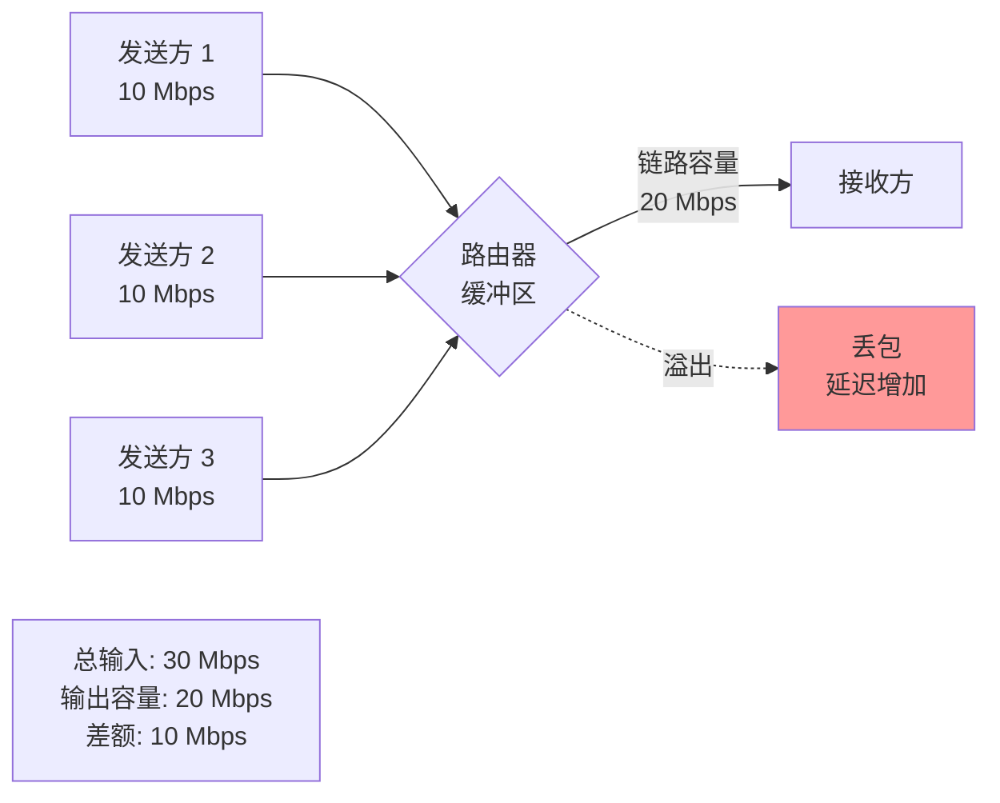

**拥塞的后果**：
1. **丢包率上升**：路由器缓冲区溢出，包被丢弃
2. **延迟增加**：包在路由器队列中等待的时间变长
3. **吞吐量下降**：丢包导致重传，浪费带宽
4. **拥塞崩溃**：如果发送方不减速，拥塞会越来越严重，最终导致网络瘫痪

### 1.2 拥塞控制的目标

**多维度的平衡**：

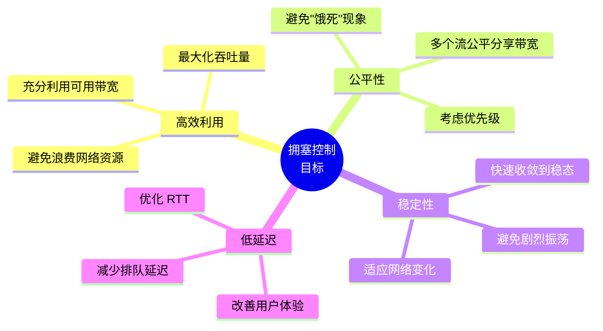

**经典的权衡**：
- **激进 vs. 保守**：激进可以快速占用带宽，但容易引发拥塞；保守安全，但可能浪费带宽
- **效率 vs. 公平**：一个流占用所有带宽效率高，但对其他流不公平
- **吞吐量 vs. 延迟**：大缓冲区提高吞吐量，但增加延迟

### 1.3 拥塞控制的核心机制

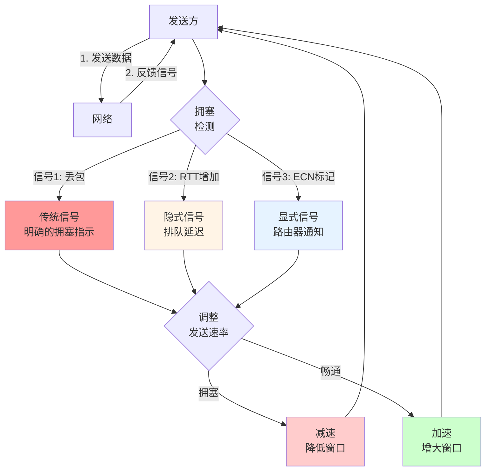

---

## 二、QUIC 拥塞控制的架构

### 2.1 可插拔设计

QUIC 最大的创新之一是将拥塞控制算法从传输层**解耦**出来：

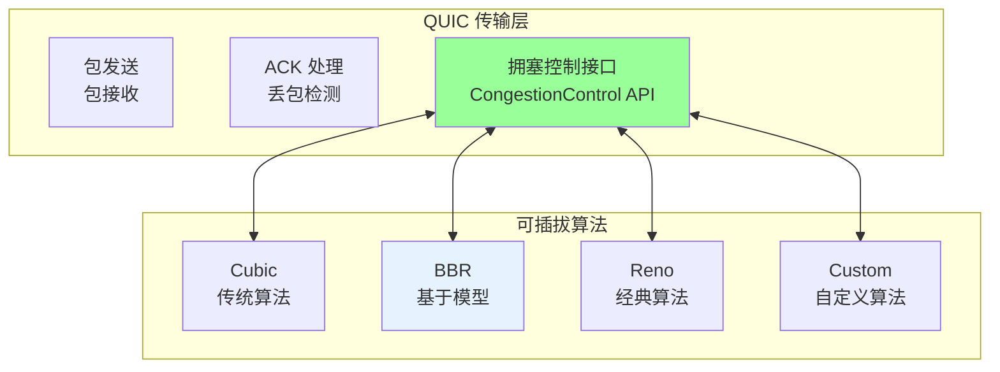

**CongestionControl 接口（伪代码）**：

```python
class CongestionControl(ABC):
    """拥塞控制算法的抽象接口"""
    
    @abstractmethod
    def on_packet_sent(self, packet_number, bytes_sent, is_retransmittable):
        """包发送时的回调"""
        pass
    
    @abstractmethod
    def on_packet_acked(self, packet_number, bytes_acked, rtt):
        """包被确认时的回调"""
        pass
    
    @abstractmethod
    def on_packet_lost(self, packet_number, bytes_lost):
        """包丢失时的回调"""
        pass
    
    @abstractmethod
    def on_congestion_event(self, event_time):
        """拥塞事件（如检测到丢包）时的回调"""
        pass
    
    @abstractmethod
    def get_congestion_window(self):
        """获取当前的拥塞窗口大小（字节）"""
        pass
    
    @abstractmethod
    def can_send(self, bytes_to_send):
        """检查是否可以发送指定字节数的数据"""
        pass
```

**好处**：
1. **快速迭代**：可以在应用层更新算法，无需修改内核
2. **A/B 测试**：可以在不同用户群体中测试不同算法
3. **场景适配**：根据网络环境选择最优算法（如卫星网络 vs. 数据中心）
4. **持续改进**：可以部署最新的研究成果

### 2.2 拥塞窗口（Congestion Window, CWND）

**核心概念**：拥塞窗口是发送方可以"在途"（即已发送但未被确认）的最大数据量。

```
发送条件：
bytes_in_flight < min(congestion_window, flow_control_window)

其中：
- bytes_in_flight = 已发送但未确认的字节数
- congestion_window = 拥塞窗口（由拥塞控制算法动态调整）
- flow_control_window = 流量控制窗口（由接收方决定）
```

**可视化**：

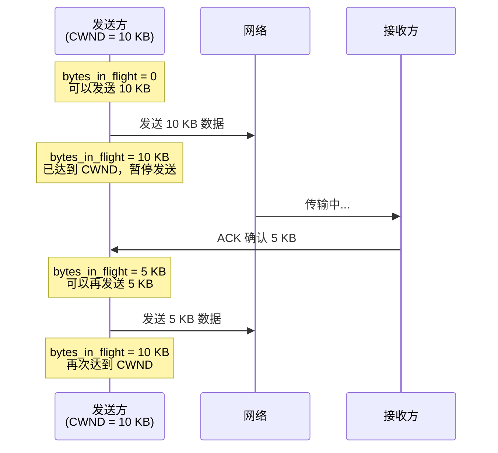

### 2.3 慢启动与拥塞避免

几乎所有拥塞控制算法都包含两个阶段：

**1. 慢启动（Slow Start）**：
- **目标**：快速探测可用带宽
- **策略**：每收到一个 ACK，CWND 增加 1 个 MSS（最大段大小）
- **效果**：CWND **指数增长**（1 → 2 → 4 → 8 → ...）

**2. 拥塞避免（Congestion Avoidance）**：
- **目标**：稳定地利用带宽，避免过度拥塞
- **策略**：每个 RTT，CWND 增加 1 个 MSS
- **效果**：CWND **线性增长**

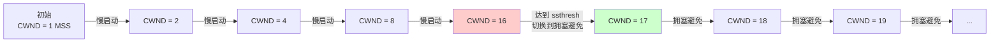

**慢启动阈值（ssthresh, Slow Start Threshold）**：
- 初始值：通常设为一个很大的值（如 ∞）
- 当检测到拥塞时：`ssthresh = CWND / 2`
- 作用：标记慢启动结束、拥塞避免开始的点

---

## 三、Cubic 算法：TCP 的经典继承者

### 3.1 Cubic 的设计理念

**背景**：Cubic 是 TCP 最常用的拥塞控制算法之一，设计目标是在高带宽延迟网络（如跨洋链路）中表现良好。

**核心思想**：使用一个 **三次函数（Cubic Function）** 来控制 CWND 的增长，而不是简单的线性增长。

```
CWND(t) = C × (t - K)³ + W_max

其中：
- t = 当前时间（自上次拥塞事件以来的时间）
- K = 函数到达 W_max 所需的时间
- W_max = 拥塞事件发生时的 CWND
- C = 缩放因子（常量，通常为 0.4）
```

### 3.2 Cubic 的三个阶段

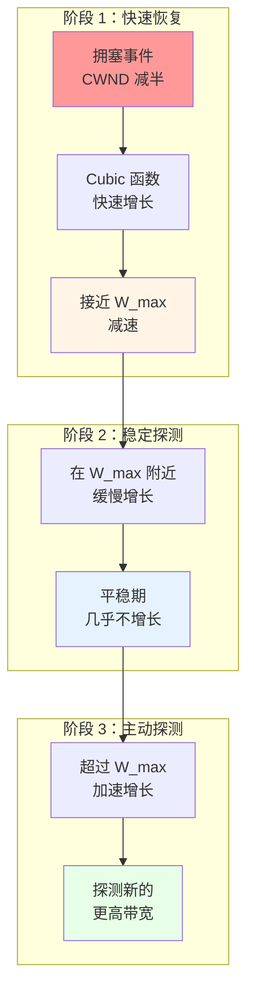

**可视化 Cubic 曲线**：

```
CWND
  ^
  |                               
  |                        /
  |                      /
W_max |------------------/------  (凹函数)
  |               /  
  |             /
  |          /
  |       /     (凸函数)
  |    /
  | /
  +------------------------> 时间
    拥塞事件    K
```

**关键观察**：
1. **凸阶段（t < K）**：快速恢复到 W_max，弥补拥塞事件导致的速率下降
2. **平稳期（t ≈ K）**：在 W_max 附近缓慢增长，避免立即再次拥塞
3. **凹阶段（t > K）**：超过 W_max，主动探测更高的带宽

### 3.3 Cubic 的实现

```python
class CubicCongestionControl:
    def __init__(self):
        # Cubic 常量
        self.C = 0.4  # 缩放因子
        self.beta = 0.7  # 乘法减少因子
        
        # 状态变量
        self.cwnd = 10 * MSS  # 拥塞窗口（初始值 10 个 MSS）
        self.ssthresh = float('inf')  # 慢启动阈值
        self.W_max = 0  # 上次拥塞事件时的 CWND
        self.K = 0  # Cubic 函数的时间常数
        self.epoch_start = 0  # 当前 epoch 的开始时间
        self.bytes_in_flight = 0  # 在途字节数
        
    def on_packet_sent(self, packet_number, bytes_sent):
        """发送包时更新在途字节数"""
        self.bytes_in_flight += bytes_sent
    
    def on_packet_acked(self, packet_number, bytes_acked, rtt):
        """收到 ACK 时更新 CWND"""
        self.bytes_in_flight -= bytes_acked
        
        if self.cwnd < self.ssthresh:
            # 慢启动阶段：指数增长
            self.cwnd += bytes_acked
        else:
            # 拥塞避免阶段：Cubic 增长
            self.cubic_update(rtt)
    
    def cubic_update(self, rtt):
        """Cubic 函数更新 CWND"""
        # 计算自上次拥塞事件以来的时间
        t = time.time() - self.epoch_start
        
        # Cubic 函数：CWND(t) = C × (t - K)³ + W_max
        target = self.C * (t - self.K) ** 3 + self.W_max
        
        # 增量 = (target - cwnd) / cwnd
        if target > self.cwnd:
            delta = (target - self.cwnd) / self.cwnd
            self.cwnd += delta * MSS
    
    def on_congestion_event(self):
        """检测到拥塞事件（如丢包）"""
        # 记录当前 CWND 作为 W_max
        self.W_max = self.cwnd
        
        # 乘法减少
        self.cwnd = self.cwnd * self.beta
        self.ssthresh = self.cwnd
        
        # 重新计算 K
        self.K = (self.W_max * (1 - self.beta) / self.C) ** (1/3)
        
        # 重置 epoch
        self.epoch_start = time.time()
    
    def can_send(self, bytes_to_send):
        """检查是否可以发送数据"""
        return self.bytes_in_flight + bytes_to_send <= self.cwnd
```

### 3.4 Cubic 的特点

**优点**：
1. **在高 BDP 网络中表现良好**：快速恢复到高速率
2. **公平性好**：多个流可以相对公平地共享带宽
3. **成熟稳定**：经过十多年的实战验证

**缺点**：
1. **基于丢包**：依赖丢包作为拥塞信号，导致缓冲区膨胀
2. **RTT 不公平**：高 RTT 的流相对不利（增长更慢）
3. **在浅缓冲区网络中表现不佳**：容易触发不必要的拥塞

---

## 四、BBR 算法：革命性的新思路

### 4.1 BBR 的设计理念

**BBR（Bottleneck Bandwidth and RTT）** 是 Google 在 2016 年提出的革命性拥塞控制算法。

**核心思想转变**：
- **传统算法（如 Cubic）**：基于 **丢包** 作为拥塞信号
- **BBR**：基于 **带宽和 RTT 的测量** 来主动控制发送速率

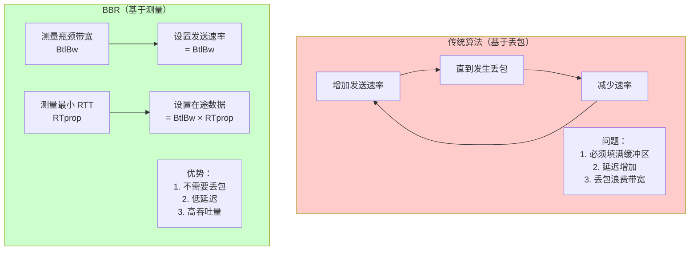

### 4.2 BBR 的核心概念

**1. 瓶颈带宽（BtlBw, Bottleneck Bandwidth）**：
- 定义：路径上最窄链路的容量
- 测量：通过观察已确认数据的速率（delivery rate）

**2. 往返传播延迟（RTprop, Round-Trip Propagation Time）**：
- 定义：在没有排队的情况下的最小 RTT
- 测量：记录观察到的最小 RTT

**3. 带宽延迟积（BDP, Bandwidth-Delay Product）**：
```
BDP = BtlBw × RTprop
```

**关键洞察**：
```
理想状态下，发送方应该保持：
  在途数据量 = BDP

如果：
- 在途数据 < BDP：链路未充分利用，吞吐量低
- 在途数据 > BDP：数据在排队，延迟增加
- 在途数据 = BDP：完美平衡，高吞吐 + 低延迟 ✅
```

### 4.3 BBR 的状态机

BBR 在四个状态之间循环：

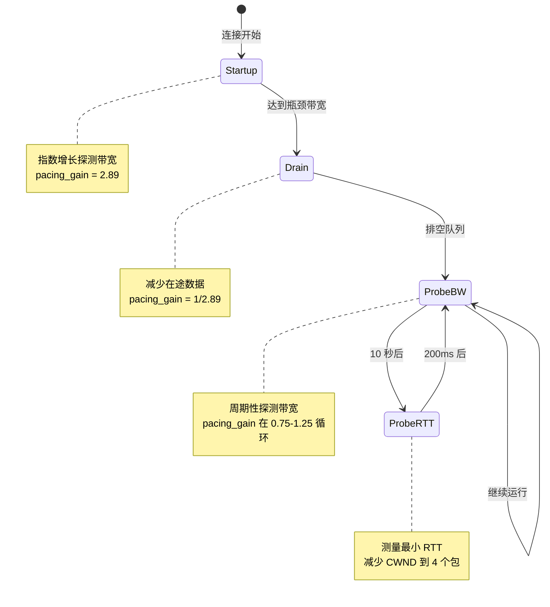

**各状态详解**：

**1. Startup（启动）**：
- **目标**：快速探测瓶颈带宽
- **策略**：以 2.89 倍的速率增长（类似慢启动）
- **退出条件**：连续 3 个 RTT 带宽增长 < 25%

```python
class BBR:
    def startup_phase(self):
        """Startup 阶段"""
        self.pacing_gain = 2.89  # 高增益，快速探测
        self.cwnd_gain = 2.89
        
        # 每个 RTT 检查带宽增长
        if self.is_full_bandwidth_reached():
            # 带宽不再显著增长，切换到 Drain
            self.state = State.DRAIN
    
    def is_full_bandwidth_reached(self):
        """检查是否达到瓶颈带宽"""
        # 如果连续 3 个 RTT，带宽增长 < 25%
        if len(self.bw_samples) >= 3:
            growth = self.bw_samples[-1] / self.bw_samples[-3]
            return growth < 1.25
        return False
```

**2. Drain（排空）**：
- **目标**：排空 Startup 阶段积累的队列
- **策略**：以 1/2.89 的速率发送
- **退出条件**：在途数据量 ≤ BDP

```python
def drain_phase(self):
    """Drain 阶段"""
    self.pacing_gain = 1.0 / 2.89  # 低增益，排空队列
    self.cwnd_gain = 2.89  # 保持窗口，只降低速率
    
    # 检查是否排空完成
    if self.bytes_in_flight <= self.bdp:
        self.state = State.PROBE_BW
```

**3. ProbeBW（探测带宽）**：
- **目标**：稳定运行，周期性探测是否有更多带宽
- **策略**：在 8 个阶段中循环，pacing_gain 为 [0.75, 1, 1, 1, 1, 1, 1, 1.25]
- **持续时间**：每个阶段约 1 个 RTT

```python
def probe_bw_phase(self):
    """ProbeBW 阶段"""
    # 8 个阶段的 pacing_gain 值
    pacing_gains = [0.75, 1, 1, 1, 1, 1, 1, 1.25]
    
    # 在这 8 个值中循环
    self.pacing_gain = pacing_gains[self.cycle_index % 8]
    self.cwnd_gain = 2.0  # 允许一些排队
    
    # 每个 RTT 切换到下一个阶段
    if self.round_start:
        self.cycle_index += 1
    
    # 每 10 秒进入 ProbeRTT
    if time.time() - self.last_probe_rtt > 10:
        self.state = State.PROBE_RTT
```

**4. ProbeRTT（探测 RTT）**：
- **目标**：测量最新的最小 RTT（RTprop）
- **策略**：减少 CWND 到 4 个包，持续 200ms
- **退出条件**：200ms 后返回 ProbeBW

```python
def probe_rtt_phase(self):
    """ProbeRTT 阶段"""
    self.pacing_gain = 1.0
    self.cwnd = max(4 * MSS, self.bdp * 0.5)  # 减少到 4 个包
    
    # 持续 200ms
    if time.time() - self.probe_rtt_start > 0.2:
        self.state = State.PROBE_BW
        self.last_probe_rtt = time.time()
```

### 4.4 BBR 的速率控制

BBR 不直接控制 CWND，而是控制 **发送速率（pacing rate）**：

```python
def compute_pacing_rate(self):
    """计算发送速率"""
    # 基础速率 = 瓶颈带宽
    base_rate = self.btl_bw
    
    # 应用 pacing_gain
    pacing_rate = base_rate * self.pacing_gain
    
    return pacing_rate

def can_send_packet(self, packet_size):
    """检查是否可以发送包"""
    # 计算当前的发送速率
    pacing_rate = self.compute_pacing_rate()
    
    # 计算距离上次发送的时间间隔
    time_since_last_send = time.time() - self.last_send_time
    
    # 允许发送的字节数 = 速率 × 时间
    allowed_bytes = pacing_rate * time_since_last_send
    
    return allowed_bytes >= packet_size
```

### 4.5 BBR vs. Cubic：性能对比

| 指标 | Cubic | BBR | 优势方 |
|-----|-------|-----|-------|
| **吞吐量** | 高（在高 BDP 网络）| 高+ | **BBR** ⭐ |
| **延迟** | 高（缓冲区膨胀）| 低（控制排队）| **BBR** ⭐⭐⭐ |
| **丢包容忍度** | 低（丢包 → 减速）| 高（基于测量）| **BBR** ⭐⭐ |
| **公平性** | 好 | 较差（激进）| **Cubic** |
| **浅缓冲区性能** | 差 | 好 | **BBR** ⭐⭐ |
| **深缓冲区性能** | 差（延迟高）| 好（不填满）| **BBR** ⭐⭐ |
| **成熟度** | 非常成熟 | 较新（但快速成熟）| **Cubic** |

**实际测量数据（Google 2016 年论文）**：

| 场景 | Cubic 吞吐量 | BBR 吞吐量 | BBR 延迟改善 |
|-----|-------------|-----------|------------|
| **美国 ↔ 欧洲** | 基准 | +10-15% | **-50%** ⭐ |
| **移动网络** | 基准 | +15-20% | **-40%** ⭐ |
| **YouTube 视频** | 基准 | +4% | **重新缓冲减少 -10%** |

---

## 五、拥塞控制的实战优化

### 5.1 Pacing（速率平滑）

**问题**：如果在一个 RTT 开始时发送所有允许的数据，会导致"突发"（burst），可能瞬间填满路由器缓冲区。

**解决方案**：**Pacing** —— 将数据平滑地分散在整个 RTT 期间发送。

```mermaid
gantt
    title 突发 vs. Pacing
    dateFormat X
    axisFormat %L
    
    section 突发发送
    发送 10 个包 :0, 10
    空闲 :10, 100
    
    section Pacing 发送
    包 1 :0, 10
    包 2 :10, 20
    包 3 :20, 30
    包 4 :30, 40
    包 5 :40, 50
    包 6 :50, 60
    包 7 :60, 70
    包 8 :70, 80
    包 9 :80, 90
    包 10 :90, 100
```

**实现**：

```python
class Pacer:
    def __init__(self):
        self.pacing_rate = 0  # 字节/秒
        self.last_send_time = 0
        self.tokens = 0  # 令牌桶
    
    def set_pacing_rate(self, rate_bps):
        """设置发送速率（字节/秒）"""
        self.pacing_rate = rate_bps
    
    def can_send(self, packet_size):
        """检查是否可以发送包"""
        now = time.time()
        elapsed = now - self.last_send_time
        
        # 补充令牌
        self.tokens += self.pacing_rate * elapsed
        
        # 限制令牌数（不超过 burst_size）
        self.tokens = min(self.tokens, self.burst_size)
        
        self.last_send_time = now
        
        # 检查令牌是否足够
        if self.tokens >= packet_size:
            self.tokens -= packet_size
            return True
        return False
```

### 5.2 HyStart（混合慢启动）

**问题**：传统慢启动可能在接近 BDP 时过度增长，导致突然的大量丢包。

**解决方案**：**HyStart** —— 提前退出慢启动。

**检测机制**：

1. **RTT 增加检测**：如果 RTT 突然增加（超过最小 RTT 的 1/8），说明队列开始积累，提前退出慢启动。

```python
def hystart_check_rtt_increase(self):
    """检查 RTT 是否显著增加"""
    current_rtt = self.get_current_rtt()
    min_rtt = self.get_min_rtt()
    
    if current_rtt > min_rtt + (min_rtt / 8):
        # RTT 增加超过 12.5%，退出慢启动
        self.exit_slow_start()
```

2. **ACK 延迟检测**：如果 ACK 之间的间隔突然增加，说明遇到瓶颈，提前退出。

```python
def hystart_check_ack_delay(self):
    """检查 ACK 间隔是否增加"""
    ack_interval = self.get_ack_interval()
    
    if ack_interval > self.threshold:
        # ACK 间隔增加，退出慢启动
        self.exit_slow_start()
```

### 5.3 PRR（比例速率减少）

**问题**：在拥塞事件后，如何"优雅地"减少发送速率？

**传统方法**：立即将 CWND 减半，可能导致短时间内没有数据发送（"空窗期"）。

**PRR 方法**：**比例地**减少发送速率，保持管道充满。

```python
def prr_on_ack(self, bytes_acked):
    """PRR：收到 ACK 时的处理"""
    # sndcnt = 本 ACK 允许发送的数据量
    
    if self.bytes_in_flight > self.ssthresh:
        # 仍在恢复中，比例减少
        sndcnt = (bytes_acked * self.ssthresh) / self.pipe
    else:
        # 恢复完成，正常发送
        sndcnt = bytes_acked
    
    return sndcnt
```

### 5.4 ECN 的利用

**ECN（Explicit Congestion Notification）** 允许路由器在拥塞早期标记包，而不是丢弃：

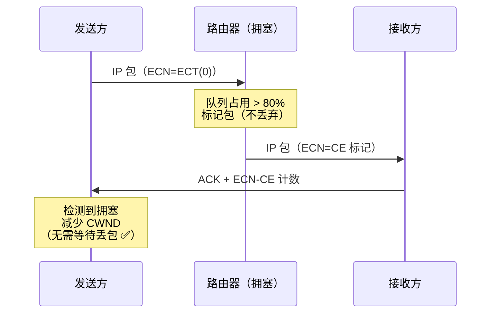

**好处**：
1. **更早检测拥塞**：在丢包之前就能感知
2. **避免丢包**：不浪费带宽重传
3. **更平滑**：拥塞控制反应更及时

---

## 六、QUIC 拥塞控制的特殊考虑

### 6.1 多流的拥塞控制

**问题**：一个 QUIC 连接中有多个流，拥塞控制应该如何处理？

**QUIC 的方案**：**连接级别的拥塞控制**。

```
所有流共享同一个拥塞窗口：
  
  流 4, 8, 12 都从同一个 CWND "借用" 配额
  
  好处：
  - 简单，实现容易
  - 公平性由连接级别控制保证
  
  挑战：
  - 流之间没有优先级区分（需要在应用层实现）
```

### 6.2 0-RTT 的拥塞控制

**问题**：在 0-RTT 恢复连接时，发送方对网络状态一无所知，应该使用什么 CWND？

**QUIC 的保守策略**：

```python
def init_cwnd_for_0rtt(self):
    """0-RTT 的初始 CWND"""
    if self.has_previous_connection_state():
        # 如果有上次连接的状态，使用保守值
        previous_cwnd = self.get_previous_cwnd()
        self.cwnd = min(previous_cwnd, 10 * MSS)  # 不超过 10 个 MSS
    else:
        # 没有历史状态，使用默认的初始 CWND
        self.cwnd = 10 * MSS
```

**原因**：
- 网络条件可能已变化
- 避免在 0-RTT 中过度发送导致拥塞
- 平衡性能和安全性

### 6.3 连接迁移后的拥塞控制

**问题**：当连接从 4G 切换到 Wi-Fi 时，网络特性完全不同，应该如何调整拥塞控制？

**QUIC 的策略**：

```python
def on_connection_migration(self):
    """连接迁移后重置拥塞状态"""
    # 方案 1：完全重置（保守）
    self.cwnd = 10 * MSS
    self.ssthresh = float('inf')
    
    # 方案 2：保留部分状态（激进）
    self.cwnd = min(self.cwnd, 20 * MSS)  # 保留一些，但限制上限
    
    # 重新测量 RTT 和带宽
    self.reset_rtt_estimates()
```

---

## 七、本章总结

### 7.1 核心要点

1. **拥塞控制的目标**：
   - 高效利用网络资源
   - 公平性
   - 低延迟
   - 稳定性

2. **QUIC 的可插拔设计**：
   - 拥塞控制算法与传输层解耦
   - 可以在应用层快速迭代和部署
   - 支持多种算法（Cubic、BBR、自定义）

3. **Cubic 算法**：
   - 基于三次函数的窗口增长
   - 在高 BDP 网络中表现良好
   - 成熟稳定，广泛使用

4. **BBR 算法**：
   - 革命性的"基于模型"方法
   - 不依赖丢包，基于带宽和 RTT 测量
   - 实现低延迟 + 高吞吐量
   - 在各种网络环境中表现优异

5. **实战优化**：
   - Pacing：平滑发送，避免突发
   - HyStart：提前退出慢启动
   - PRR：优雅地恢复拥塞
   - ECN：提前感知拥塞

6. **QUIC 特殊考虑**：
   - 多流共享拥塞窗口
   - 0-RTT 的保守策略
   - 连接迁移后的状态重置

### 7.2 算法选择建议

| 网络环境 | 推荐算法 | 原因 |
|---------|---------|------|
| **数据中心网络** | BBR | 低延迟至关重要 |
| **移动网络** | BBR | 高丢包率，BBR 更鲁棒 |
| **跨洋链路（高 BDP）** | BBR 或 Cubic | 都能快速利用高带宽 |
| **浅缓冲区网络** | BBR | Cubic 容易丢包 |
| **深缓冲区网络** | BBR | 避免填满缓冲区，降低延迟 |
| **与 TCP 共存** | Cubic | 更公平，不会"欺负" TCP |

### 7.3 展望

在下一章中，我们将探讨 **HTTP/3 如何在 QUIC 上运行**。我们将看到 HTTP/3 如何利用 QUIC 的流、如何映射 HTTP 语义到 QUIC 帧、以及 HTTP/3 特有的控制机制。

---

## 参考资料

- RFC 9002: QUIC Loss Detection and Congestion Control
- RFC 8312: CUBIC for Fast Long-Distance Networks
- "BBR: Congestion-Based Congestion Control" (ACM Queue 2016)
- "TCP Congestion Control" (RFC 5681)
- Google BBR 论文：https://research.google/pubs/pub45646/
- Chromium QUIC 实现：拥塞控制代码
- "A Deep Dive into BBR Congestion Control" by Geoff Huston
