# 第八章：天作之合：HTTP/3 如何在 QUIC 上驰骋

## 引言：从 HTTP/2 到 HTTP/3 的演进

在前面的章节中，我们深入探讨了 QUIC 协议的方方面面——从快速握手、连接迁移，到流的多路复用、可靠性机制，再到拥塞控制。现在，是时候看看这一切如何服务于 Web 的核心协议：**HTTP**。

HTTP/3 不是 HTTP/2 的简单移植，而是一次深思熟虑的重新设计。它充分利用了 QUIC 的优势，同时保持了与 HTTP/2 的语义兼容性。可以说，**QUIC 是为 HTTP/3 量身定制的传输层，HTTP/3 是 QUIC 能力的完美展现**。

本章将深入探讨：
1. HTTP/3 的架构设计
2. HTTP 语义如何映射到 QUIC 
3. HTTP/3 的帧类型和控制机制
4. 服务器推送在 HTTP/3 中的实现
5. 与 HTTP/2 的兼容性和过渡策略

---

## 一、HTTP/3 的整体架构

### 1.1 协议栈对比

让我们首先从宏观视角对比 HTTP/2 和 HTTP/3 的协议栈：

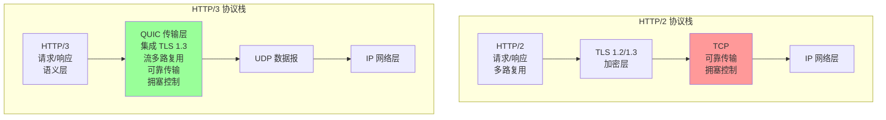

**关键差异**：
1. **层次简化**：HTTP/3 直接运行在 QUIC 之上，不再需要单独的 TLS 层（QUIC 内置加密）
2. **传输层统一**：QUIC 集成了可靠传输、流控、拥塞控制
3. **基于 UDP**：绕过了 TCP 的限制

### 1.2 HTTP/3 的设计目标

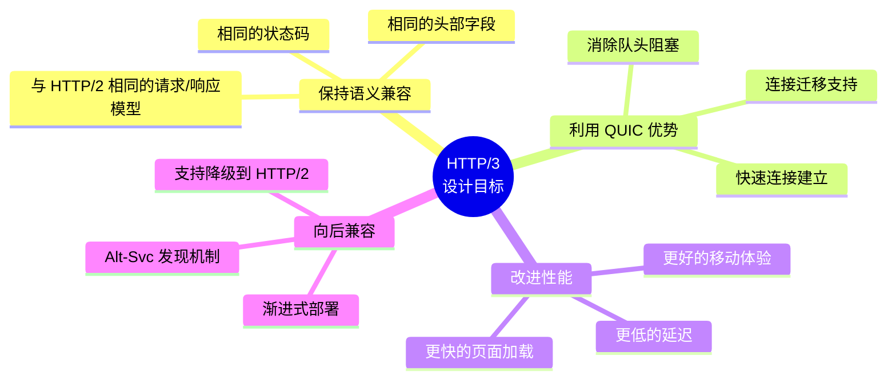

### 1.3 HTTP/3 标识符

**HTTP/3 的官方标识**：`h3`

**版本协商**：
```http
HTTP/2 响应中的 Alt-Svc 头部：
Alt-Svc: h3=":443"; ma=2592000, h3-29=":443"; ma=2592000

含义：
- h3=":443"：服务器在端口 443 支持 HTTP/3
- ma=2592000：此信息有效期 30 天
- h3-29：草案版本 29（可选）
```

---

## 二、HTTP/3 的流映射

### 2.1 QUIC 流类型的使用

HTTP/3 使用 QUIC 的不同类型的流来承载不同的功能：

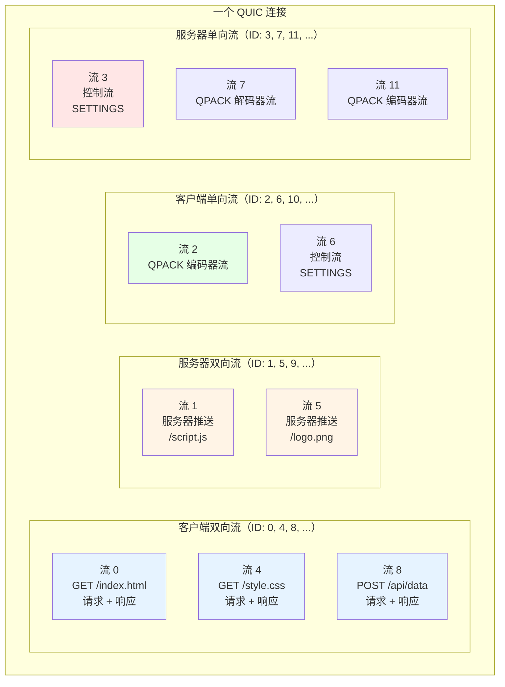

**流的用途总结**：

| 流类型 | 发起者 | 用途 | 示例 ID |
|-------|--------|------|---------|
| **双向流** | 客户端 | HTTP 请求/响应 | 0, 4, 8, 12, ... |
| **双向流** | 服务器 | 服务器推送 | 1, 5, 9, 13, ... |
| **单向流** | 客户端 | 控制流、QPACK 编码器 | 2, 6, 10, ... |
| **单向流** | 服务器 | 控制流、QPACK 编码器/解码器 | 3, 7, 11, ... |

### 2.2 HTTP 请求/响应的映射

一个典型的 HTTP/3 请求/响应使用一个双向流：

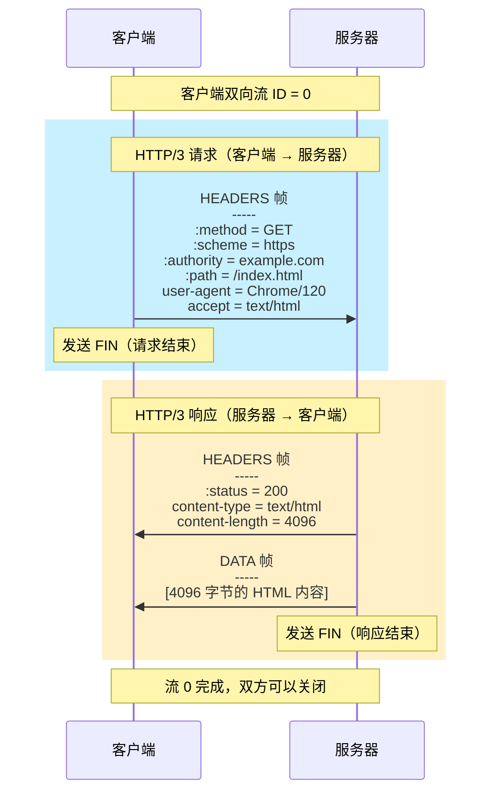

**关键观察**：
1. **一个请求 = 一个流**：每个 HTTP 请求使用一个独立的 QUIC 双向流
2. **头部在前**：HEADERS 帧在 DATA 帧之前
3. **FIN 标志**：QUIC 的 FIN 标志表示流的结束（等同于 HTTP/2 的 END_STREAM）

### 2.3 流的生命周期

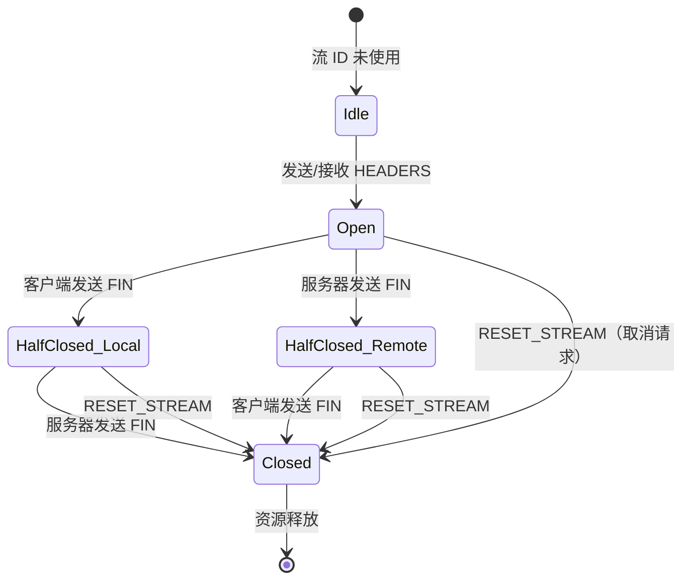

---

## 三、HTTP/3 的帧类型

HTTP/3 定义了多种帧类型，用于不同的功能：

### 3.1 DATA 帧

**用途**：承载 HTTP 消息体（如 HTML、JSON、图片等）

```
DATA 帧格式：
+--------------------------------------------------+
| Type = 0x00                                      |
+--------------------------------------------------+
| Length (可变长度整数)                             |
|   数据长度                                        |
+--------------------------------------------------+
| Data (...)                                       |
|   HTTP 消息体数据                                |
+--------------------------------------------------+
```

**示例**：
```python
# 发送 HTTP 响应体
data_frame = {
    'type': 0x00,  # DATA
    'length': len(response_body),
    'data': response_body
}
send_http3_frame(stream_id=0, frame=data_frame)
```

### 3.2 HEADERS 帧

**用途**：承载 HTTP 头部字段（经过 QPACK 压缩）

```
HEADERS 帧格式：
+--------------------------------------------------+
| Type = 0x01                                      |
+--------------------------------------------------+
| Length (可变长度整数)                             |
+--------------------------------------------------+
| Encoded Field Section (...)                      |
|   QPACK 编码的头部字段                           |
+--------------------------------------------------+
```

**伪头部字段**：

HTTP/3 使用特殊的"伪头部"来表示 HTTP 请求/响应的元信息：

| 伪头部 | 方向 | 含义 | 示例 |
|-------|------|------|------|
| `:method` | 请求 | HTTP 方法 | GET, POST, PUT |
| `:scheme` | 请求 | URL 方案 | https |
| `:authority` | 请求 | 主机和端口 | example.com:443 |
| `:path` | 请求 | 路径和查询 | /index.html?q=test |
| `:status` | 响应 | HTTP 状态码 | 200, 404, 500 |

**示例**：
```python
# HTTP/3 请求头部
request_headers = [
    (':method', 'GET'),
    (':scheme', 'https'),
    (':authority', 'example.com'),
    (':path', '/api/users'),
    ('user-agent', 'Mozilla/5.0'),
    ('accept', 'application/json'),
]

# 使用 QPACK 编码
encoded_headers = qpack_encode(request_headers)

# 发送 HEADERS 帧
headers_frame = {
    'type': 0x01,
    'length': len(encoded_headers),
    'data': encoded_headers
}
send_http3_frame(stream_id=4, frame=headers_frame)
```

### 3.3 SETTINGS 帧

**用途**：在控制流上交换 HTTP/3 配置参数

```
SETTINGS 帧格式：
+--------------------------------------------------+
| Type = 0x04                                      |
+--------------------------------------------------+
| Length (可变长度整数)                             |
+--------------------------------------------------+
| Settings:                                        |
|   [Identifier (可变长度整数)]                     |
|   [Value (可变长度整数)]                          |
|   ...                                            |
+--------------------------------------------------+
```

**常用的 SETTINGS 参数**：

| 标识符 | 名称 | 默认值 | 含义 |
|-------|------|--------|------|
| 0x01 | QPACK_MAX_TABLE_CAPACITY | 0 | QPACK 动态表最大容量 |
| 0x06 | MAX_FIELD_SECTION_SIZE | 无限 | 头部字段集的最大大小 |
| 0x07 | QPACK_BLOCKED_STREAMS | 0 | 允许阻塞的流数量 |

**示例**：
```python
# 服务器发送 SETTINGS
settings = {
    0x01: 4096,   # QPACK_MAX_TABLE_CAPACITY = 4KB
    0x06: 16384,  # MAX_FIELD_SECTION_SIZE = 16KB
    0x07: 100,    # QPACK_BLOCKED_STREAMS = 100
}

# 编码 SETTINGS 帧
settings_data = b''
for identifier, value in settings.items():
    settings_data += encode_varint(identifier)
    settings_data += encode_varint(value)

settings_frame = {
    'type': 0x04,
    'length': len(settings_data),
    'data': settings_data
}

# 在控制流上发送
send_http3_frame(stream_id=control_stream_id, frame=settings_frame)
```

### 3.4 CANCEL_PUSH 帧

**用途**：客户端取消服务器推送

```
CANCEL_PUSH 帧格式：
+--------------------------------------------------+
| Type = 0x03                                      |
+--------------------------------------------------+
| Length (可变长度整数)                             |
+--------------------------------------------------+
| Push ID (可变长度整数)                            |
|   要取消的推送 ID                                |
+--------------------------------------------------+
```

**使用场景**：
```python
# 客户端发现不需要某个推送的资源
def cancel_push(push_id):
    """取消服务器推送"""
    cancel_push_frame = {
        'type': 0x03,
        'length': varint_size(push_id),
        'push_id': push_id
    }
    send_http3_frame(control_stream_id, cancel_push_frame)
```

### 3.5 GOAWAY 帧

**用途**：优雅地关闭连接

```
GOAWAY 帧格式：
+--------------------------------------------------+
| Type = 0x07                                      |
+--------------------------------------------------+
| Length (可变长度整数)                             |
+--------------------------------------------------+
| Stream ID / Push ID (可变长度整数)                |
|   最后处理的流 ID 或推送 ID                       |
+--------------------------------------------------+
```

**示例**：
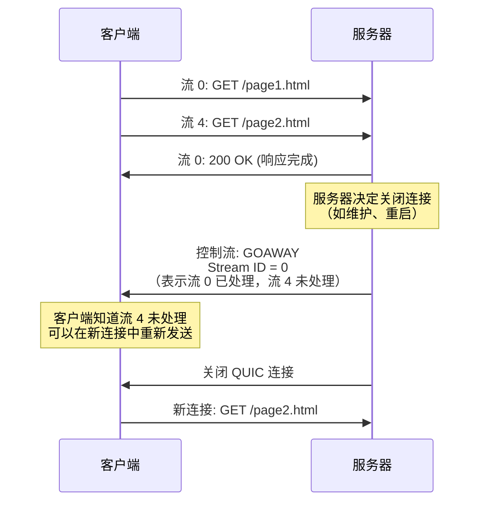

---

## 四、HTTP/3 的控制流

### 4.1 控制流的作用

**控制流（Control Stream）**是一个特殊的单向流，用于：
1. 交换 SETTINGS 参数
2. 发送 GOAWAY 通知
3. 发送 CANCEL_PUSH 请求

**特点**：
- **单向**：只有发送方可以发送数据
- **唯一**：每个端点只能创建一个控制流
- **持久**：在整个连接期间保持打开
- **优先**：在建立连接后立即创建

### 4.2 控制流的初始化

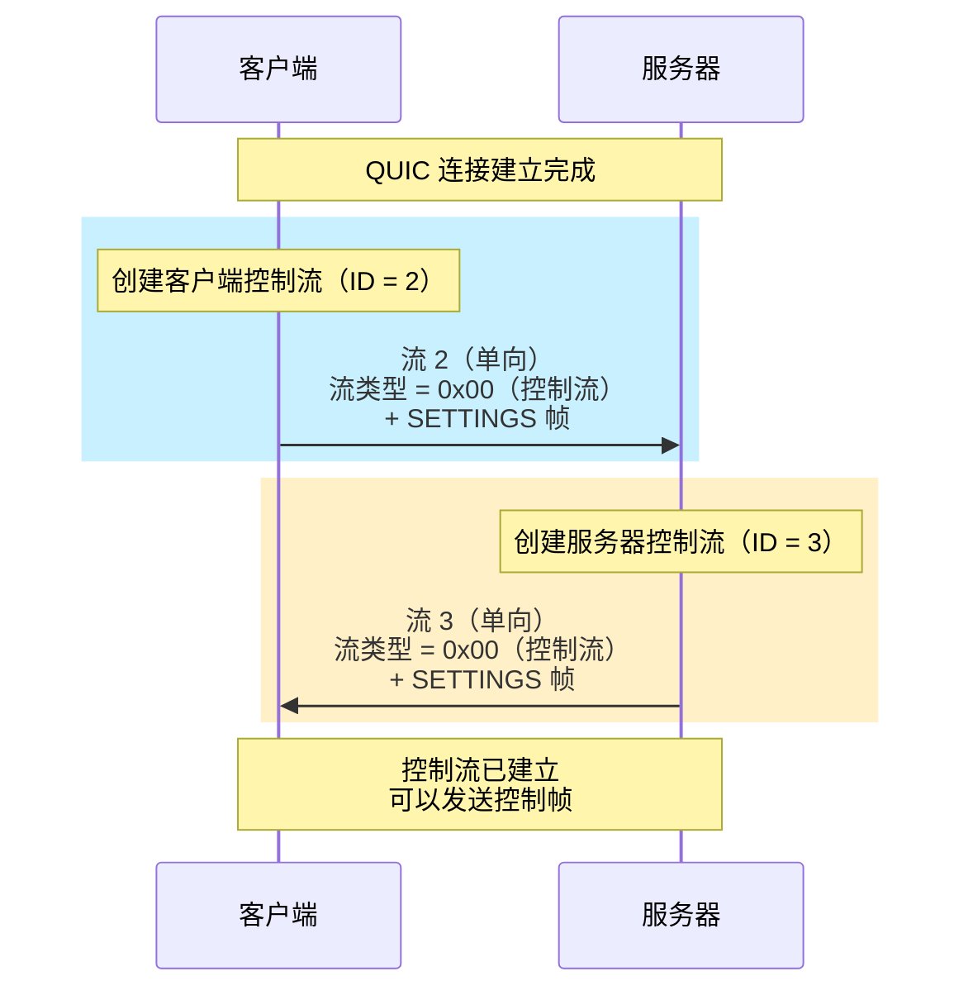

**流类型标识**：

HTTP/3 在每个单向流的开头发送一个"流类型"字节，标识流的用途：

| 流类型值 | 名称 | 用途 |
|---------|------|------|
| 0x00 | 控制流 | SETTINGS, GOAWAY, CANCEL_PUSH |
| 0x01 | 推送流 | 服务器推送的响应 |
| 0x02 | QPACK 编码器流 | QPACK 动态表更新 |
| 0x03 | QPACK 解码器流 | QPACK 确认和取消 |

### 4.3 控制流的代码实现

```python
class HTTP3ControlStream:
    def __init__(self, quic_connection, is_client):
        self.quic_conn = quic_connection
        self.is_client = is_client
        self.stream_id = None
    
    def initialize(self):
        """初始化控制流"""
        # 创建单向流
        if self.is_client:
            self.stream_id = self.quic_conn.create_uni_stream()  # 返回 2, 6, 10, ...
        else:
            self.stream_id = self.quic_conn.create_uni_stream()  # 返回 3, 7, 11, ...
        
        # 发送流类型（0x00 = 控制流）
        self.quic_conn.send_stream_data(
            self.stream_id,
            data=encode_varint(0x00),
            fin=False  # 控制流保持打开
        )
        
        # 发送 SETTINGS 帧
        self.send_settings()
    
    def send_settings(self):
        """发送 SETTINGS 帧"""
        settings = {
            0x01: 4096,   # QPACK_MAX_TABLE_CAPACITY
            0x06: 16384,  # MAX_FIELD_SECTION_SIZE
            0x07: 100,    # QPACK_BLOCKED_STREAMS
        }
        
        frame_data = encode_varint(0x04)  # Type = SETTINGS
        settings_data = b''
        for key, value in settings.items():
            settings_data += encode_varint(key)
            settings_data += encode_varint(value)
        
        frame_data += encode_varint(len(settings_data))  # Length
        frame_data += settings_data
        
        self.quic_conn.send_stream_data(self.stream_id, frame_data, fin=False)
    
    def send_goaway(self, last_stream_id):
        """发送 GOAWAY 帧"""
        frame_data = encode_varint(0x07)  # Type = GOAWAY
        frame_data += encode_varint(varint_size(last_stream_id))  # Length
        frame_data += encode_varint(last_stream_id)
        
        self.quic_conn.send_stream_data(self.stream_id, frame_data, fin=False)
```

---

## 五、HTTP/3 的优先级

### 5.1 从 HTTP/2 到 HTTP/3 的变化

**HTTP/2 的优先级模型**：
- 使用"依赖树"：流可以依赖其他流
- 复杂且难以正确实现
- 实际部署中效果不佳

**HTTP/3 的优先级模型**（RFC 9218）：
- 使用"紧急度（Urgency）"和"增量（Incremental）"参数
- 简单且直观
- 通过扩展帧实现（而不是内置）

### 5.2 PRIORITY_UPDATE 帧

```
PRIORITY_UPDATE 帧格式：
+--------------------------------------------------+
| Type = 0x0f (可变长度整数)                        |
+--------------------------------------------------+
| Length (可变长度整数)                             |
+--------------------------------------------------+
| Prioritized Element Type (可变长度整数)           |
|   0x00 = 请求流                                  |
|   0x01 = 推送流                                  |
+--------------------------------------------------+
| Element ID (可变长度整数)                         |
|   流 ID 或推送 ID                                |
+--------------------------------------------------+
| Priority Field Value (长度可变的字符串)           |
|   如 "u=3, i"                                   |
+--------------------------------------------------+
```

**优先级参数**：

```
紧急度（Urgency, u）：0-7
- 0 = 最高优先级（关键资源，如 HTML、关键 CSS）
- 3 = 默认优先级
- 7 = 最低优先级（如后台分析脚本）

增量（Incremental, i）：布尔标志
- 存在 = 增量传输（如视频流，可以边下载边播放）
- 不存在 = 非增量（如图片，需要完整下载）
```

**示例**：

```python
def set_stream_priority(stream_id, urgency, incremental):
    """设置流的优先级"""
    priority_str = f"u={urgency}"
    if incremental:
        priority_str += ", i"
    
    frame_data = encode_varint(0x0f)  # Type = PRIORITY_UPDATE
    frame_data += encode_varint(0x00)  # Prioritized Element Type = Request Stream
    element_id_bytes = encode_varint(stream_id)
    priority_bytes = priority_str.encode('ascii')
    
    frame_data += encode_varint(len(element_id_bytes) + len(priority_bytes))
    frame_data += element_id_bytes
    frame_data += priority_bytes
    
    # 在控制流上发送
    send_on_control_stream(frame_data)

# 使用示例
set_stream_priority(stream_id=0, urgency=0, incremental=False)  # HTML，最高优先级
set_stream_priority(stream_id=4, urgency=1, incremental=False)  # 关键 CSS
set_stream_priority(stream_id=8, urgency=4, incremental=True)   # 图片，增量
set_stream_priority(stream_id=12, urgency=7, incremental=False) # 分析脚本，最低
```

---

## 六、服务器推送在 HTTP/3 中的实现

### 6.1 服务器推送的概念

**服务器推送（Server Push）**允许服务器主动向客户端发送资源，而无需等待客户端请求。

**典型场景**：
```
客户端请求：GET /index.html

服务器响应：
1. 200 OK (index.html)
2. 同时推送：
   - /style.css
   - /script.js
   - /logo.png

好处：减少往返次数，加速页面加载
```

### 6.2 HTTP/3 推送的流程

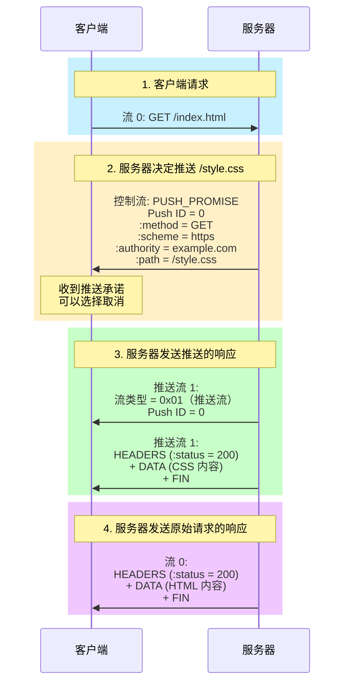

### 6.3 PUSH_PROMISE 帧

```
PUSH_PROMISE 帧格式（在控制流上发送）：
+--------------------------------------------------+
| Type = 0x05                                      |
+--------------------------------------------------+
| Length (可变长度整数)                             |
+--------------------------------------------------+
| Push ID (可变长度整数)                            |
|   唯一标识此推送                                 |
+--------------------------------------------------+
| Encoded Field Section (...)                      |
|   QPACK 编码的请求头部                           |
|   （包含 :method, :scheme, :authority, :path）   |
+--------------------------------------------------+
```

### 6.4 推送流

**推送流的结构**：

```
推送流（服务器双向流，如 ID = 1, 5, 9）:
+--------------------------------------------------+
| 流类型 = 0x01（推送流）                           |
+--------------------------------------------------+
| Push ID (可变长度整数)                            |
|   关联到 PUSH_PROMISE 的 Push ID                 |
+--------------------------------------------------+
| HTTP/3 帧（HEADERS, DATA, ...）                  |
|   推送的响应内容                                 |
+--------------------------------------------------+
```

### 6.5 取消推送

**客户端可以随时取消不需要的推送**：

```python
def cancel_push(push_id):
    """客户端取消推送"""
    # 在控制流上发送 CANCEL_PUSH 帧
    frame_data = encode_varint(0x03)  # Type = CANCEL_PUSH
    frame_data += encode_varint(varint_size(push_id))
    frame_data += encode_varint(push_id)
    
    send_on_control_stream(frame_data)

# 示例：浏览器已经缓存了 /style.css，取消推送
cancel_push(push_id=0)
```

---

## 七、与 HTTP/2 的兼容性和过渡

### 7.1 语义兼容性

**HTTP/3 保持了与 HTTP/2 的语义兼容性**：
- 相同的请求/响应模型
- 相同的头部字段和伪头部
- 相同的状态码
- 相同的方法（GET, POST, etc.）

**应用层代码几乎无需修改**！

### 7.2 发现机制：Alt-Svc

**Alt-Svc（Alternative Services）**是 HTTP/3 的发现机制：

```http
# HTTP/2 或 HTTP/1.1 响应
HTTP/1.1 200 OK
Content-Type: text/html
Alt-Svc: h3=":443"; ma=2592000

含义：
- 服务器在同一主机的端口 443 支持 HTTP/3
- 客户端可以尝试使用 HTTP/3 连接
- 此信息有效期 30 天（ma = max-age）
```

**浏览器的行为**：

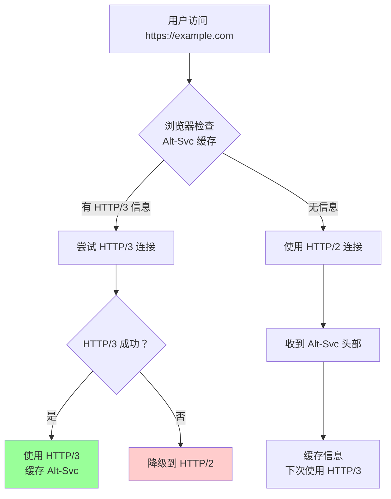

### 7.3 Happy Eyeballs v2（并行竞速）

**问题**：如果 HTTP/3 不可用（如 UDP 被阻断），如何快速降级？

**解决方案**：Happy Eyeballs v2 —— 同时尝试 HTTP/3 和 HTTP/2，哪个先成功用哪个。

```mermaid
gantt
    title Happy Eyeballs v2
    dateFormat X
    axisFormat %L ms
    
    section HTTP/3 尝试
    开始 HTTP/3 连接 :0, 50
    QUIC 握手 :50, 150
    HTTP/3 成功 :150, 200
    
    section HTTP/2 备份
    等待 100ms :0, 100
    开始 HTTP/2 连接 :100, 150
    TCP+TLS 握手 :150, 300
    HTTP/2 成功 :300, 350
    
    section 结果
    使用 HTTP/3 :200, 400
```

**策略**：
1. 立即尝试 HTTP/3
2. 等待 100-200ms
3. 如果 HTTP/3 未成功，并行尝试 HTTP/2
4. 哪个先成功就使用哪个

### 7.4 渐进式部署策略

**阶段 1：试验**
```
- 在少量服务器上启用 HTTP/3
- 监控错误率和性能
- 收集用户反馈
```

**阶段 2：扩大**
```
- 逐步增加 HTTP/3 服务器比例
- 对比 HTTP/2 和 HTTP/3 的性能数据
- 优化配置参数
```

**阶段 3：默认启用**
```
- 在所有服务器上启用 HTTP/3
- 保留 HTTP/2 作为降级选项
- 持续监控和优化
```

---

## 八、HTTP/3 的性能优势

### 8.1 实际性能数据

**Google 的测量结果（YouTube, 2020）**：

| 指标 | HTTP/2 | HTTP/3 | 改善 |
|-----|--------|--------|------|
| **页面加载时间（移动）** | 基准 | -8% | 更快 |
| **视频重新缓冲** | 基准 | -30% | 显著减少 |
| **错误率** | 基准 | -15% | 更可靠 |

**Cloudflare 的测量结果（2019）**：

| 网络条件 | HTTP/2 | HTTP/3 | 性能提升 |
|---------|--------|--------|---------|
| **0% 丢包** | 基准 | +5% | 轻微提升 |
| **1% 丢包** | 基准 | +15-20% | 显著提升 |
| **3% 丢包** | 基准 | +30-40% | 巨大提升 |

### 8.2 关键性能优势

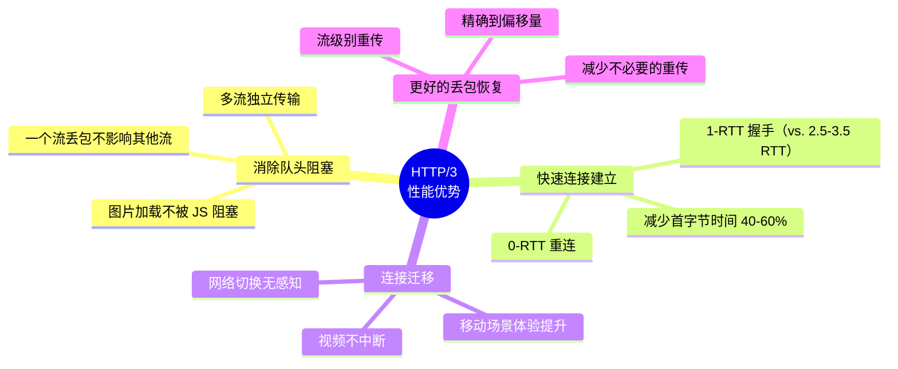

---

## 九、HTTP/3 的实战部署

### 9.1 服务器配置（Nginx）

```nginx
# Nginx 1.25+ 支持 HTTP/3
server {
    listen 443 quic reuseport;  # 启用 QUIC
    listen 443 ssl http2;        # 保留 HTTP/2（降级）
    
    server_name example.com;
    
    ssl_certificate /path/to/cert.pem;
    ssl_certificate_key /path/to/key.pem;
    
    # 启用 0-RTT
    ssl_early_data on;
    
    # 添加 Alt-Svc 头部
    add_header Alt-Svc 'h3=":443"; ma=86400';
    
    # QUIC 特定配置
    quic_retry on;  # 启用地址验证
    quic_gso on;    # 启用 GSO 优化（Linux）
    
    location / {
        root /var/www/html;
        index index.html;
    }
}
```

### 9.2 客户端实现（Python 示例）

```python
import aioquic
from aioquic.h3.connection import H3Connection
from aioquic.quic.configuration import QuicConfiguration

async def fetch_http3(url):
    """使用 HTTP/3 获取资源"""
    # 配置 QUIC
    config = QuicConfiguration(is_client=True)
    config.verify_mode = ssl.CERT_REQUIRED
    
    # 创建 QUIC 连接
    async with connect(url, configuration=config) as protocol:
        # 创建 H3 连接
        h3 = H3Connection(protocol._quic)
        
        # 发送 HTTP/3 请求
        stream_id = h3.get_next_available_stream_id()
        headers = [
            (b":method", b"GET"),
            (b":scheme", b"https"),
            (b":authority", url.encode()),
            (b":path", b"/"),
        ]
        h3.send_headers(stream_id, headers, end_stream=True)
        
        # 接收响应
        response_headers = await h3.receive_headers(stream_id)
        response_data = await h3.receive_data(stream_id)
        
        return response_data
```

---

## 十、本章总结

### 10.1 核心要点

1. **HTTP/3 的架构**：
   - 直接运行在 QUIC 之上
   - 利用 QUIC 的流进行多路复用
   - 保持与 HTTP/2 的语义兼容性

2. **流的映射**：
   - 双向流：HTTP 请求/响应
   - 单向流：控制流、QPACK 流
   - 每个请求使用独立的流

3. **帧类型**：
   - DATA：消息体
   - HEADERS：头部字段（QPACK 编码）
   - SETTINGS：配置参数
   - PUSH_PROMISE：服务器推送
   - GOAWAY：优雅关闭

4. **优先级**：
   - 使用紧急度（0-7）和增量标志
   - 通过 PRIORITY_UPDATE 帧设置
   - 比 HTTP/2 的依赖树更简单

5. **服务器推送**：
   - 通过 PUSH_PROMISE 帧通知
   - 使用推送流发送响应
   - 客户端可以取消不需要的推送

6. **部署策略**：
   - Alt-Svc 发现机制
   - Happy Eyeballs v2 并行竞速
   - 渐进式部署，保留 HTTP/2 降级

7. **性能优势**：
   - 消除队头阻塞（10-40% 提升）
   - 快速连接建立（40-60% 提升）
   - 连接迁移（移动场景显著改善）

### 10.2 HTTP/3 vs. HTTP/2 总结

| 维度 | HTTP/2 | HTTP/3 | 优势方 |
|-----|--------|--------|-------|
| **传输层** | TCP | QUIC (UDP) | **HTTP/3** ⭐ |
| **队头阻塞** | 有（TCP 层）| 无 | **HTTP/3** ⭐⭐⭐ |
| **握手延迟** | 2.5-3.5 RTT | 1-RTT (0-RTT) | **HTTP/3** ⭐⭐ |
| **连接迁移** | 不支持 | 支持 | **HTTP/3** ⭐⭐ |
| **头部压缩** | HPACK | QPACK | **HTTP/3** ⭐ |
| **优先级** | 依赖树（复杂）| 紧急度+增量（简单）| **HTTP/3** |
| **成熟度** | 非常成熟 | 快速成熟 | **HTTP/2** |
| **部署难度** | 低 | 中等 | **HTTP/2** |

### 10.3 展望

在下一章中，我们将深入探讨 **QPACK**——HTTP/3 的头部压缩算法。我们将看到为什么 HTTP/2 的 HPACK 不适合 QUIC，以及 QPACK 如何解决乱序传输带来的挑战。

---

## 参考资料

- RFC 9114: HTTP/3
- RFC 9204: QPACK: Field Compression for HTTP/3
- RFC 9218: Extensible Prioritization Scheme for HTTP
- RFC 7838: HTTP Alternative Services
- "HTTP/3 From A To Z: Core Concepts" by Robin Marx
- Cloudflare Blog: "HTTP/3: the past, present, and future"
- Chrome DevTools: HTTP/3 and QUIC Debugging
