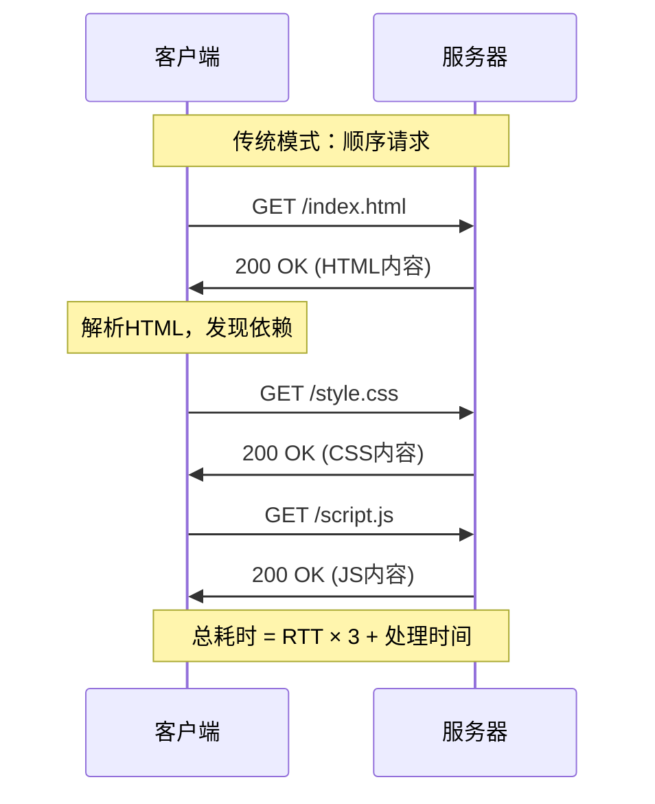
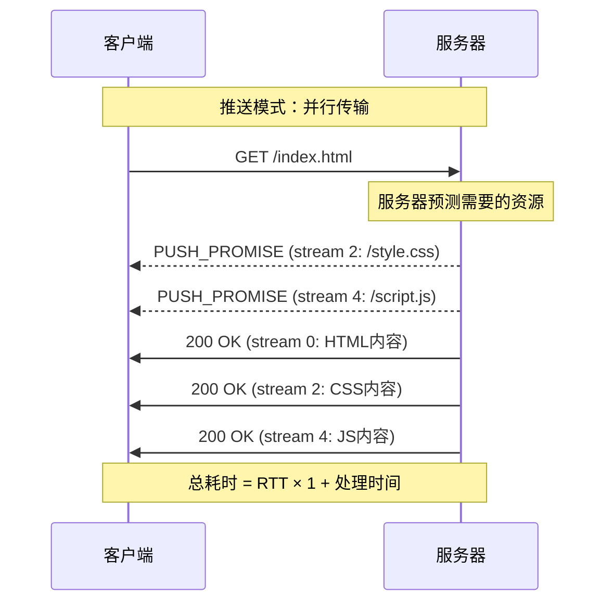
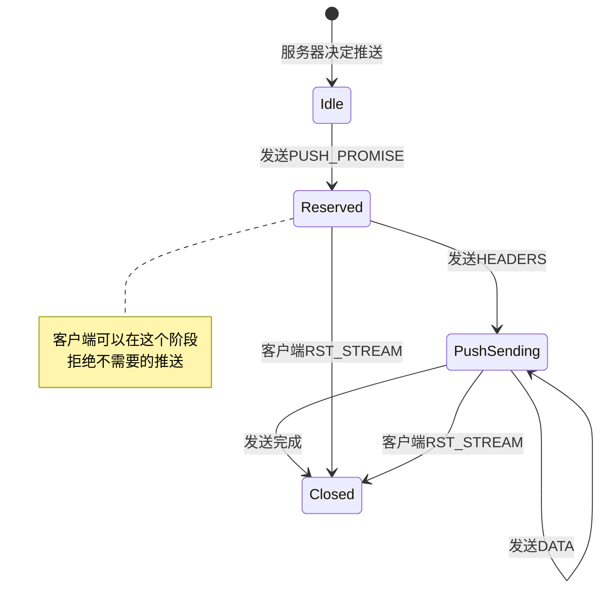

# 第十章：锦上添花 - HTTP/3的服务器推送

## 引言：预判的艺术

想象这样一个场景：你走进一家咖啡馆点了一杯拿铁，聪明的咖啡师在递给你咖啡的同时，还主动给你准备了糖包和搅拌棒——因为他观察到大多数点拿铁的客人都会需要这些。这就是服务器推送（Server Push）的核心思想：**在客户端明确请求之前，服务器主动推送它预测客户端会需要的资源**。

在HTTP/2中，服务器推送被寄予厚望，但在实践中却遇到了诸多挑战。HTTP/3继承并改进了这一特性，但同时也更加审慎地对待它的使用场景。本章将深入探讨HTTP/3中服务器推送的机制、优势、挑战以及最佳实践。

## 10.1 服务器推送的愿景与现实

### 10.1.1 传统请求-响应模式的局限

在传统的HTTP交互中，客户端必须先解析HTML，然后才能发现并请求CSS、JavaScript等依赖资源：



这种模式存在明显的性能瓶颈：

1. **往返延迟（RTT）累积**：每个资源都需要一次完整的请求-响应往返
2. **关键渲染路径阻塞**：CSS和JavaScript等关键资源延迟加载会推迟首次渲染
3. **带宽利用不充分**：在客户端解析和发起新请求期间，网络连接处于空闲状态

### 10.1.2 服务器推送的承诺

服务器推送旨在解决这些问题：



**理论优势**：

- **消除额外RTT**：客户端在收到HTML的同时就开始接收依赖资源
- **提前占用带宽**：在客户端空闲时就开始传输数据
- **优化关键渲染路径**：CSS和JavaScript可以更早到达

### 10.1.3 现实中的挑战

然而，实践证明服务器推送的应用并不如预期般理想：

**1. 缓存失效问题**

```
客户端已缓存 style.css (版本 v1.2.3)
服务器推送 style.css (版本 v1.2.3)
结果：浪费带宽传输已缓存的资源
```

**2. 推送决策困难**

服务器难以准确预测客户端需要什么：
- 不知道客户端的缓存状态
- 不了解客户端的网络条件
- 无法预测用户行为（是否会浏览到需要该资源的页面）

**3. 优先级冲突**

推送的资源可能与客户端真正需要的资源竞争带宽：

```
服务器推送：图片资源（低优先级）
客户端需要：API数据（高优先级）
结果：高优先级请求被低优先级推送阻塞
```

**4. 实际使用率低**

根据HTTP Archive的统计（2020年数据）：
- 仅0.05%的网站使用服务器推送
- 启用推送的网站中，约75%推送的资源实际上已经在客户端缓存中
- 性能提升往往不足10%，有时甚至导致性能下降

## 10.2 HTTP/3中的推送机制

尽管存在挑战，HTTP/3仍然保留了服务器推送功能，但在设计上更加谨慎和灵活。

### 10.2.1 推送流的生命周期



**关键阶段**：

1. **推送预告（PUSH_PROMISE）**：服务器宣告即将推送的资源
2. **保留状态（Reserved）**：客户端可以决定是否接受推送
3. **数据传输（Push Sending）**：实际传输推送的内容
4. **完成或取消（Closed）**：推送完成或被客户端取消

### 10.2.2 PUSH_PROMISE帧详解

PUSH_PROMISE帧在HTTP/3中的结构：

```
HTTP/3 PUSH_PROMISE Frame (Type=0x05):

+-------------------------------+
|       Push ID (varint)        |  推送标识符
+-------------------------------+
|    Header Block Fragment      |  请求头部（编码后）
+-------------------------------+

推送ID由服务器单向分配，必须严格递增
```

**示例**：

```python
class HTTP3PushPromise:
    """HTTP/3 PUSH_PROMISE帧结构"""

    def __init__(self, push_id: int, headers: dict):
        self.push_id = push_id  # 推送ID（必须递增）
        self.headers = headers  # 请求头部

    def encode(self) -> bytes:
        """编码PUSH_PROMISE帧"""
        frame_type = 0x05  # PUSH_PROMISE类型

        # 编码Push ID（varint）
        push_id_bytes = encode_varint(self.push_id)

        # 编码头部（使用QPACK）
        header_block = qpack_encode(self.headers)

        # 组装帧
        frame_length = len(push_id_bytes) + len(header_block)

        return (
            encode_varint(frame_type) +
            encode_varint(frame_length) +
            push_id_bytes +
            header_block
        )

# 使用示例
push_promise = HTTP3PushPromise(
    push_id=2,
    headers={
        ':method': 'GET',
        ':scheme': 'https',
        ':authority': 'example.com',
        ':path': '/style.css',
        'accept': 'text/css'
    }
)

# 在控制流或请求流上发送PUSH_PROMISE
control_stream.send(push_promise.encode())
```

### 10.2.3 推送流的管理

**1. 推送流ID分配**

在HTTP/3中，推送使用单向流（Unidirectional Stream）：

```
服务器发起的推送流ID计算：
- 必须是服务器发起的单向流
- Stream ID = 0x03 (类型标识) + increment * 4

示例：
- 第1个推送：Stream 3 (0x03)
- 第2个推送：Stream 7 (0x07)
- 第3个推送：Stream 11 (0x0B)
```

**2. MAX_PUSH_ID控制**

客户端使用MAX_PUSH_ID帧控制服务器可以使用的最大推送ID：

```python
class MAX_PUSH_ID_Frame:
    """限制服务器推送ID上限"""

    def __init__(self, max_push_id: int):
        self.max_push_id = max_push_id

    def encode(self) -> bytes:
        """编码MAX_PUSH_ID帧"""
        frame_type = 0x0D  # MAX_PUSH_ID类型
        push_id_bytes = encode_varint(self.max_push_id)

        return (
            encode_varint(frame_type) +
            encode_varint(len(push_id_bytes)) +
            push_id_bytes
        )

# 客户端示例：允许最多100个推送
client.send_control_frame(
    MAX_PUSH_ID_Frame(max_push_id=100)
)
```

**3. CANCEL_PUSH帧**

客户端可以在任何时候取消推送：

```python
class CANCEL_PUSH_Frame:
    """取消服务器推送"""

    def __init__(self, push_id: int):
        self.push_id = push_id

    def encode(self) -> bytes:
        """编码CANCEL_PUSH帧"""
        frame_type = 0x03  # CANCEL_PUSH类型
        push_id_bytes = encode_varint(self.push_id)

        return (
            encode_varint(frame_type) +
            encode_varint(len(push_id_bytes)) +
            push_id_bytes
        )

# 客户端取消不需要的推送
if resource_already_cached:
    client.send_control_frame(
        CANCEL_PUSH_Frame(push_id=2)
    )
```

### 10.2.4 完整的推送交互示例

```python
import asyncio
from typing import Dict, List

class HTTP3ServerPush:
    """HTTP/3服务器推送实现"""

    def __init__(self):
        self.next_push_id = 0
        self.active_pushes: Dict[int, dict] = {}
        self.max_push_id = 0  # 客户端设置的上限

    async def handle_request(self, stream_id: int, headers: dict):
        """处理客户端请求并决定推送"""
        path = headers.get(':path')

        # 1. 确定需要推送的资源
        push_resources = self.determine_push_resources(path)

        # 2. 发送PUSH_PROMISE
        for resource in push_resources:
            if self.next_push_id < self.max_push_id:
                await self.send_push_promise(stream_id, resource)

        # 3. 发送主响应
        await self.send_response(stream_id, headers)

        # 4. 发送推送内容
        for push_id, resource in self.active_pushes.items():
            await self.send_push_data(push_id, resource)

    def determine_push_resources(self, path: str) -> List[dict]:
        """根据请求路径确定要推送的资源"""
        # 简化的推送决策逻辑
        if path == '/':
            return [
                {
                    'path': '/style.css',
                    'type': 'text/css',
                    'priority': 'high'
                },
                {
                    'path': '/script.js',
                    'type': 'application/javascript',
                    'priority': 'high'
                },
                {
                    'path': '/logo.png',
                    'type': 'image/png',
                    'priority': 'low'
                }
            ]
        return []

    async def send_push_promise(self, request_stream_id: int,
                                resource: dict):
        """在请求流上发送PUSH_PROMISE"""
        push_id = self.next_push_id
        self.next_push_id += 1

        # 构造推送请求头部
        push_headers = {
            ':method': 'GET',
            ':scheme': 'https',
            ':authority': 'example.com',
            ':path': resource['path'],
            'accept': resource['type']
        }

        # 发送PUSH_PROMISE帧
        promise_frame = HTTP3PushPromise(push_id, push_headers)
        await self.send_frame(request_stream_id, promise_frame.encode())

        # 记录活动推送
        self.active_pushes[push_id] = resource

        print(f"📤 PUSH_PROMISE sent: Push ID {push_id}, "
              f"Path {resource['path']}")

    async def send_push_data(self, push_id: int, resource: dict):
        """在推送流上发送实际数据"""
        # 创建推送流（单向流）
        push_stream_id = 0x03 + (push_id * 4)

        # 1. 发送流类型（0x01表示推送流）
        await self.send_stream_type(push_stream_id, 0x01)

        # 2. 发送Push ID
        await self.send_varint(push_stream_id, push_id)

        # 3. 发送响应头部
        response_headers = {
            ':status': '200',
            'content-type': resource['type'],
            'cache-control': 'public, max-age=31536000'
        }
        headers_frame = encode_headers_frame(response_headers)
        await self.send_frame(push_stream_id, headers_frame)

        # 4. 发送响应数据
        content = await self.load_resource(resource['path'])
        data_frame = encode_data_frame(content)
        await self.send_frame(push_stream_id, data_frame)

        print(f"✅ Push completed: Push ID {push_id}, "
              f"Size {len(content)} bytes")

    async def handle_cancel_push(self, push_id: int):
        """处理客户端取消推送"""
        if push_id in self.active_pushes:
            resource = self.active_pushes.pop(push_id)
            print(f"❌ Push cancelled: Push ID {push_id}, "
                  f"Path {resource['path']}")

            # 停止相应推送流的数据传输
            push_stream_id = 0x03 + (push_id * 4)
            await self.reset_stream(push_stream_id)

    async def handle_max_push_id(self, max_push_id: int):
        """处理客户端设置的MAX_PUSH_ID"""
        self.max_push_id = max_push_id
        print(f"ℹ️ MAX_PUSH_ID updated: {max_push_id}")

# 客户端示例
class HTTP3ClientPush:
    """HTTP/3客户端推送处理"""

    def __init__(self):
        self.promised_pushes: Dict[int, dict] = {}
        self.cache = {}  # 简化的缓存

    async def handle_push_promise(self, push_id: int, headers: dict):
        """处理服务器的PUSH_PROMISE"""
        path = headers.get(':path')

        # 检查缓存
        if path in self.cache:
            print(f"⚠️ Push declined (cached): {path}")
            await self.cancel_push(push_id)
            return

        # 检查是否需要该资源
        if not self.will_need_resource(path):
            print(f"⚠️ Push declined (not needed): {path}")
            await self.cancel_push(push_id)
            return

        # 接受推送
        self.promised_pushes[push_id] = {
            'headers': headers,
            'path': path,
            'received': False
        }
        print(f"✅ Push accepted: Push ID {push_id}, Path {path}")

    async def handle_push_data(self, push_id: int, headers: dict,
                               data: bytes):
        """处理推送的实际数据"""
        if push_id not in self.promised_pushes:
            print(f"⚠️ Unexpected push data: Push ID {push_id}")
            return

        push_info = self.promised_pushes[push_id]
        path = push_info['path']

        # 存入缓存
        self.cache[path] = {
            'headers': headers,
            'data': data,
            'timestamp': time.time()
        }

        push_info['received'] = True
        print(f"📥 Push received: {path}, Size {len(data)} bytes")

    def will_need_resource(self, path: str) -> bool:
        """预测是否需要该资源"""
        # 简化的决策逻辑
        # 实际应用中可以基于：
        # - 当前页面结构
        # - 历史访问模式
        # - 用户行为预测
        return path.endswith(('.css', '.js'))

    async def cancel_push(self, push_id: int):
        """取消不需要的推送"""
        frame = CANCEL_PUSH_Frame(push_id)
        await self.send_control_frame(frame.encode())

    async def set_max_push_id(self, max_id: int):
        """设置允许的最大推送ID"""
        frame = MAX_PUSH_ID_Frame(max_id)
        await self.send_control_frame(frame.encode())
```

## 10.3 推送的性能影响

### 10.3.1 理想场景下的收益

当服务器推送应用得当时，可以显著减少页面加载时间：

```
测试场景：加载包含HTML、CSS、JS的简单页面
网络条件：RTT=100ms，带宽=10Mbps

传统模式：
├─ GET /index.html (100ms RTT + 50ms传输)
├─ 解析HTML (20ms)
├─ GET /style.css (100ms RTT + 30ms传输)
├─ GET /script.js (100ms RTT + 40ms传输)
└─ 总计：440ms

推送模式：
├─ GET /index.html (100ms RTT)
├─ PUSH_PROMISE /style.css (0ms，在HTML响应中)
├─ PUSH_PROMISE /script.js (0ms，在HTML响应中)
├─ 并行传输：HTML(50ms) + CSS(30ms) + JS(40ms) = 50ms（并行）
└─ 总计：150ms

性能提升：(440-150)/440 = 65.9%
```

### 10.3.2 缓存失效的代价

当推送已缓存的资源时，反而会降低性能：

```
场景：客户端已缓存CSS和JS

传统模式（有缓存）：
├─ GET /index.html (100ms RTT + 50ms传输)
├─ 从缓存加载CSS和JS (5ms)
└─ 总计：155ms

错误推送模式：
├─ GET /index.html (100ms RTT)
├─ 推送CSS (30ms传输，浪费)
├─ 推送JS (40ms传输，浪费)
├─ HTML传输 (50ms)
└─ 总计：150ms（看似更快）

实际影响：
- 浪费带宽：70KB
- 浪费服务器资源
- 占用连接流控额度
- 可能延迟其他关键请求
```

### 10.3.3 优先级冲突的风险

推送资源可能与关键请求竞争带宽：

```mermaid
gantt
    title 带宽竞争示例（10Mbps连接）
    dateFormat X
    axisFormat %L

    section 无推送
    HTML响应     :0, 50
    API请求      :50, 100

    section 有推送
    HTML响应     :0, 50
    图片推送     :50, 250
    API请求(阻塞) :250, 300

    note 推送的低优先级图片延迟了关键API请求
```

**真实案例（Shopify的经验）**：

Shopify在2017年测试服务器推送后发现：
- 对于有缓存的用户，性能下降约5%
- 推送决策错误率高达70%
- 最终决定不使用服务器推送

## 10.4 最佳实践与使用建议

### 10.4.1 何时使用服务器推送

**适合使用的场景**：

1. **首次访问的关键资源**

```python
def should_push_resource(resource_path: str,
                         client_state: dict) -> bool:
    """推送决策逻辑"""
    # 1. 仅推送首次访问的关键资源
    if client_state.get('is_first_visit'):
        critical_resources = [
            '/critical.css',      # 关键CSS
            '/above-fold.js'      # 首屏JS
        ]
        return resource_path in critical_resources

    # 2. 不推送已缓存的资源
    if resource_path in client_state.get('cache', []):
        return False

    # 3. 不推送大文件
    resource_size = get_resource_size(resource_path)
    if resource_size > 50 * 1024:  # 大于50KB
        return False

    return False
```

2. **可预测的导航路径**

```
用户访问产品列表页 → 高概率访问产品详情页
可以推送：产品详情页的关键CSS/JS
```

3. **内联资源的替代**

```html
<!-- 传统方案：内联CSS（增加HTML大小） -->
<style>
    /* 5KB的关键CSS */
</style>

<!-- 推送方案：保持缓存能力 -->
<link rel="stylesheet" href="/critical.css">
<!-- 服务器推送critical.css -->
```

**不适合使用的场景**：

1. ❌ 推送大文件（图片、视频）
2. ❌ 推送低优先级资源
3. ❌ 推送个性化内容（用户登录状态依赖）
4. ❌ 推送可能已缓存的资源

### 10.4.2 缓存摘要（Cache Digest）

为了解决缓存失效问题，有提案建议使用缓存摘要：

```python
class CacheDigest:
    """缓存摘要：客户端告知服务器缓存状态"""

    def __init__(self):
        self.bloom_filter = BloomFilter(size=1024, hash_count=3)

    def add_cached_url(self, url: str):
        """添加已缓存的URL"""
        self.bloom_filter.add(url)

    def generate_digest(self) -> bytes:
        """生成缓存摘要"""
        return self.bloom_filter.to_bytes()

    def check_url(self, url: str) -> bool:
        """检查URL是否可能已缓存"""
        return url in self.bloom_filter

# 客户端发送缓存摘要
client_cache = CacheDigest()
client_cache.add_cached_url('/style.css')
client_cache.add_cached_url('/script.js')

digest = client_cache.generate_digest()
await client.send_header('cache-digest', base64.b64encode(digest))

# 服务器检查缓存摘要
server_cache_digest = CacheDigest.from_bytes(
    base64.b64decode(request_headers['cache-digest'])
)

if not server_cache_digest.check_url('/style.css'):
    # 客户端可能没有缓存，推送
    await server.push_resource('/style.css')
```

**注意**：缓存摘要目前仍在草案阶段，尚未广泛部署。

### 10.4.3 推送策略的演进

**策略1：激进推送（已废弃）**

```
推送所有依赖资源
问题：缓存失效、带宽浪费
```

**策略2：选择性推送（当前）**

```python
def selective_push_strategy(request: dict,
                            client_hints: dict) -> List[str]:
    """选择性推送策略"""
    resources_to_push = []

    # 仅推送关键资源
    if request.path == '/':
        critical = ['/critical.css', '/critical.js']

        # 检查客户端提示
        if client_hints.get('rtt', 0) > 200:
            # 高延迟网络，推送更积极
            resources_to_push.extend(critical)
        elif client_hints.get('downlink', 0) < 1.5:
            # 低带宽网络，谨慎推送
            resources_to_push.append('/critical.css')
        else:
            # 正常网络，推送关键CSS
            resources_to_push.append('/critical.css')

    return resources_to_push
```

**策略3：103 Early Hints（推荐）**

现代趋势是使用HTTP 103 Early Hints代替服务器推送：

```python
async def handle_request_with_early_hints(request: dict):
    """使用103 Early Hints代替推送"""
    # 1. 立即发送103响应，提示浏览器预加载
    early_hints = {
        ':status': '103',
        'link': '</style.css>; rel=preload; as=style, '
                '</script.js>; rel=preload; as=script'
    }
    await send_response(early_hints)

    # 2. 生成主响应（可能需要时间）
    content = await generate_response(request)

    # 3. 发送最终响应
    final_response = {
        ':status': '200',
        'content-type': 'text/html'
    }
    await send_response(final_response, content)

# 浏览器行为：
# - 收到103后立即发起预加载请求
# - 等待最终响应
# - 如果资源已缓存，不会重复请求
```

**优势对比**：

| 特性 | 服务器推送 | 103 Early Hints |
|------|-----------|----------------|
| 缓存感知 | ❌ 服务器不知道客户端缓存 | ✅ 浏览器自动检查缓存 |
| 取消能力 | ⚠️ 需要客户端主动取消 | ✅ 浏览器自动决定 |
| 优先级控制 | ⚠️ 服务器决定 | ✅ 浏览器决定 |
| 实现复杂度 | 高 | 低 |
| 浏览器支持 | 部分支持 | 广泛支持 |

### 10.4.4 监控与优化

**1. 推送效果指标**

```python
class PushMetrics:
    """推送效果监控"""

    def __init__(self):
        self.push_attempts = 0
        self.push_completed = 0
        self.push_cancelled = 0
        self.bytes_pushed = 0
        self.bytes_wasted = 0

    def record_push_attempt(self, push_id: int, size: int):
        """记录推送尝试"""
        self.push_attempts += 1
        self.bytes_pushed += size

    def record_push_cancelled(self, push_id: int, size: int):
        """记录推送取消"""
        self.push_cancelled += 1
        self.bytes_wasted += size

    def record_push_completed(self, push_id: int):
        """记录推送完成"""
        self.push_completed += 1

    def get_effectiveness(self) -> dict:
        """计算推送有效性"""
        return {
            'completion_rate': self.push_completed / self.push_attempts
                               if self.push_attempts > 0 else 0,
            'cancellation_rate': self.push_cancelled / self.push_attempts
                                 if self.push_attempts > 0 else 0,
            'waste_ratio': self.bytes_wasted / self.bytes_pushed
                          if self.bytes_pushed > 0 else 0
        }

# 监控示例
metrics = PushMetrics()

# ... 推送操作 ...

stats = metrics.get_effectiveness()
if stats['cancellation_rate'] > 0.5:
    print("⚠️ 警告：推送取消率过高，需要优化推送策略")
if stats['waste_ratio'] > 0.3:
    print("⚠️ 警告：带宽浪费严重，考虑使用103 Early Hints")
```

**2. A/B测试推送策略**

```python
class PushABTest:
    """推送策略A/B测试"""

    def __init__(self):
        self.control_group_metrics = PushMetrics()
        self.test_group_metrics = PushMetrics()

    def assign_group(self, client_id: str) -> str:
        """分配测试组"""
        return 'test' if hash(client_id) % 2 == 0 else 'control'

    async def handle_request(self, client_id: str, request: dict):
        """根据分组处理请求"""
        group = self.assign_group(client_id)

        if group == 'control':
            # 控制组：不使用推送
            metrics = self.control_group_metrics
            await self.serve_without_push(request, metrics)
        else:
            # 测试组：使用推送
            metrics = self.test_group_metrics
            await self.serve_with_push(request, metrics)

    def get_results(self) -> dict:
        """获取A/B测试结果"""
        control = self.control_group_metrics.get_effectiveness()
        test = self.test_group_metrics.get_effectiveness()

        return {
            'control': control,
            'test': test,
            'improvement': {
                'completion_rate': (
                    (test['completion_rate'] - control['completion_rate']) /
                    control['completion_rate'] * 100
                    if control['completion_rate'] > 0 else 0
                )
            }
        }
```

## 10.5 实战示例：构建智能推送系统

下面是一个完整的示例，展示如何构建一个考虑多种因素的智能推送系统：

```python
import asyncio
from dataclasses import dataclass
from typing import List, Optional
from enum import Enum

class ResourcePriority(Enum):
    """资源优先级"""
    CRITICAL = 1    # 关键资源（阻塞渲染）
    HIGH = 2        # 高优先级（首屏需要）
    MEDIUM = 3      # 中优先级
    LOW = 4         # 低优先级

@dataclass
class Resource:
    """资源定义"""
    path: str
    content_type: str
    size: int
    priority: ResourcePriority
    cacheable: bool = True

class IntelligentPushEngine:
    """智能推送引擎"""

    def __init__(self):
        self.resource_graph = {}  # 资源依赖图
        self.push_history = {}    # 推送历史
        self.metrics = PushMetrics()

        # 配置参数
        self.max_push_size = 100 * 1024  # 100KB
        self.max_concurrent_pushes = 3
        self.use_early_hints = True

    def register_page_resources(self, page_path: str,
                                resources: List[Resource]):
        """注册页面的资源依赖"""
        self.resource_graph[page_path] = resources

    async def handle_request(self, stream_id: int, headers: dict,
                            client_state: dict):
        """处理请求并决定推送策略"""
        path = headers.get(':path', '/')

        # 1. 获取该页面的资源依赖
        resources = self.resource_graph.get(path, [])

        # 2. 分析客户端状态
        push_candidates = self.analyze_push_candidates(
            resources, client_state
        )

        # 3. 决定使用推送还是Early Hints
        if self.use_early_hints and self.should_use_early_hints(
            push_candidates
        ):
            await self.send_early_hints(stream_id, push_candidates)
        else:
            await self.send_server_push(stream_id, push_candidates)

        # 4. 发送主响应
        await self.send_main_response(stream_id, path)

    def analyze_push_candidates(self, resources: List[Resource],
                                client_state: dict) -> List[Resource]:
        """分析推送候选资源"""
        candidates = []

        for resource in resources:
            # 过滤条件
            if not self.should_push(resource, client_state):
                continue

            candidates.append(resource)

        # 按优先级排序
        candidates.sort(key=lambda r: r.priority.value)

        # 限制推送数量
        return candidates[:self.max_concurrent_pushes]

    def should_push(self, resource: Resource,
                   client_state: dict) -> bool:
        """判断是否应该推送资源"""
        # 1. 检查大小限制
        if resource.size > self.max_push_size:
            return False

        # 2. 检查缓存状态
        if resource.path in client_state.get('cache', []):
            return False

        # 3. 检查优先级
        if resource.priority == ResourcePriority.LOW:
            return False

        # 4. 检查网络条件
        rtt = client_state.get('rtt', 0)
        bandwidth = client_state.get('downlink', 0)

        if rtt > 300 or bandwidth < 1.0:
            # 高延迟或低带宽网络，仅推送关键资源
            return resource.priority == ResourcePriority.CRITICAL

        # 5. 检查历史效果
        history = self.push_history.get(resource.path, {})
        if history.get('cancellation_rate', 0) > 0.7:
            return False  # 历史上经常被取消

        return True

    def should_use_early_hints(self,
                               candidates: List[Resource]) -> bool:
        """决定是否使用Early Hints代替推送"""
        # 如果候选资源都是可缓存的，优先使用Early Hints
        return all(r.cacheable for r in candidates)

    async def send_early_hints(self, stream_id: int,
                               resources: List[Resource]):
        """发送103 Early Hints"""
        links = []
        for resource in resources:
            # 构建Link头部
            as_type = self.get_resource_type(resource.content_type)
            links.append(
                f'<{resource.path}>; rel=preload; as={as_type}'
            )

        early_hints = {
            ':status': '103',
            'link': ', '.join(links)
        }

        await self.send_response(stream_id, early_hints)
        print(f"💡 Early Hints sent: {len(resources)} resources")

    async def send_server_push(self, stream_id: int,
                               resources: List[Resource]):
        """执行服务器推送"""
        for resource in resources:
            push_id = self.get_next_push_id()

            # 发送PUSH_PROMISE
            push_headers = {
                ':method': 'GET',
                ':scheme': 'https',
                ':authority': 'example.com',
                ':path': resource.path
            }

            await self.send_push_promise(stream_id, push_id,
                                        push_headers)

            # 异步发送推送数据
            asyncio.create_task(
                self.send_push_content(push_id, resource)
            )

            # 记录指标
            self.metrics.record_push_attempt(push_id, resource.size)

    async def send_push_content(self, push_id: int,
                                resource: Resource):
        """发送推送内容"""
        try:
            # 创建推送流
            push_stream_id = self.create_push_stream(push_id)

            # 加载资源内容
            content = await self.load_resource(resource.path)

            # 发送响应头部
            response_headers = {
                ':status': '200',
                'content-type': resource.content_type,
                'content-length': str(len(content)),
                'cache-control': 'public, max-age=31536000'
            }

            await self.send_headers(push_stream_id, response_headers)
            await self.send_data(push_stream_id, content)

            # 记录成功
            self.metrics.record_push_completed(push_id)
            self.update_push_history(resource.path, success=True)

            print(f"✅ Push completed: {resource.path}")

        except asyncio.CancelledError:
            # 推送被取消
            self.metrics.record_push_cancelled(push_id, resource.size)
            self.update_push_history(resource.path, success=False)
            print(f"❌ Push cancelled: {resource.path}")

    def update_push_history(self, path: str, success: bool):
        """更新推送历史"""
        if path not in self.push_history:
            self.push_history[path] = {
                'attempts': 0,
                'successes': 0,
                'cancellations': 0
            }

        history = self.push_history[path]
        history['attempts'] += 1

        if success:
            history['successes'] += 1
        else:
            history['cancellations'] += 1

        history['cancellation_rate'] = (
            history['cancellations'] / history['attempts']
        )

    @staticmethod
    def get_resource_type(content_type: str) -> str:
        """获取资源类型（用于preload）"""
        if 'css' in content_type:
            return 'style'
        elif 'javascript' in content_type:
            return 'script'
        elif 'image' in content_type:
            return 'image'
        elif 'font' in content_type:
            return 'font'
        return 'fetch'

# 使用示例
async def main():
    engine = IntelligentPushEngine()

    # 注册首页资源依赖
    engine.register_page_resources('/', [
        Resource(
            path='/critical.css',
            content_type='text/css',
            size=15 * 1024,
            priority=ResourcePriority.CRITICAL
        ),
        Resource(
            path='/critical.js',
            content_type='application/javascript',
            size=25 * 1024,
            priority=ResourcePriority.CRITICAL
        ),
        Resource(
            path='/analytics.js',
            content_type='application/javascript',
            size=10 * 1024,
            priority=ResourcePriority.LOW
        ),
        Resource(
            path='/hero-image.jpg',
            content_type='image/jpeg',
            size=150 * 1024,
            priority=ResourcePriority.MEDIUM
        )
    ])

    # 处理请求
    client_state = {
        'is_first_visit': True,
        'cache': [],
        'rtt': 100,
        'downlink': 5.0
    }

    await engine.handle_request(
        stream_id=0,
        headers={':path': '/'},
        client_state=client_state
    )

    # 查看效果
    stats = engine.metrics.get_effectiveness()
    print(f"\n📊 Push Statistics:")
    print(f"   Completion Rate: {stats['completion_rate']:.2%}")
    print(f"   Cancellation Rate: {stats['cancellation_rate']:.2%}")
    print(f"   Waste Ratio: {stats['waste_ratio']:.2%}")

if __name__ == '__main__':
    asyncio.run(main())
```

## 10.6 总结与建议

### 核心要点

1. **服务器推送的本质**：提前推送预测的资源，减少RTT延迟
2. **主要挑战**：缓存失效、推送决策困难、优先级冲突
3. **现代趋势**：从服务器推送转向103 Early Hints

### 使用建议

| 场景 | 推荐方案 | 理由 |
|------|---------|------|
| 首次访问关键CSS/JS | 103 Early Hints | 避免缓存失效，浏览器自动管理 |
| 高延迟网络 | 谨慎推送关键资源 | 减少RTT效果明显 |
| 低带宽网络 | 避免推送 | 带宽竞争风险高 |
| 可预测导航 | 考虑推送下一页资源 | 预加载效果好 |
| 大文件 | 不推送 | 带宽浪费风险 |
| 动态内容 | 不推送 | 缓存和个性化问题 |

### 检查清单

在实施服务器推送前，请确认：

- [ ] 已测试推送策略的实际效果（A/B测试）
- [ ] 考虑使用103 Early Hints作为替代
- [ ] 仅推送关键且小型的资源（<50KB）
- [ ] 实现了推送取消机制
- [ ] 监控推送取消率和带宽浪费
- [ ] 考虑客户端网络条件
- [ ] 避免推送可能已缓存的资源

### 展望

虽然服务器推送的实际效果不如预期，但它代表了Web性能优化的重要思想：**主动性**。未来的优化方向可能包括：

1. **更智能的缓存协商**：如缓存摘要（Cache Digest）
2. **客户端提示（Client Hints）**：客户端主动告知服务器其需求
3. **机器学习预测**：基于历史数据预测用户需求
4. **边缘计算**：在CDN层面做更智能的推送决策

在下一章，我们将探讨如何在实际环境中部署、调试和分析QUIC/HTTP3，包括性能监控、问题排查以及优化技巧。
