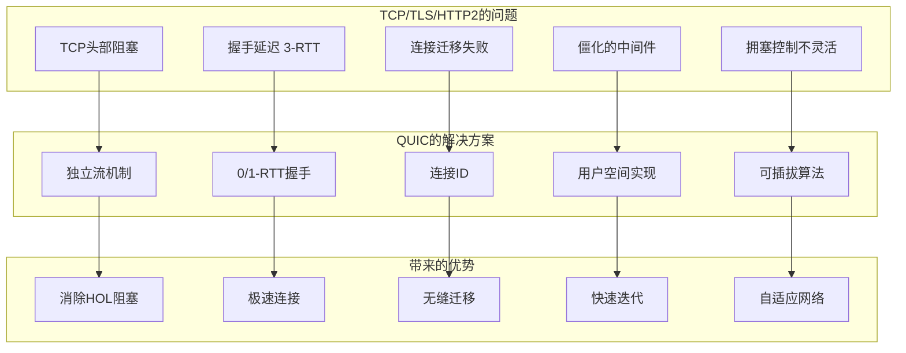
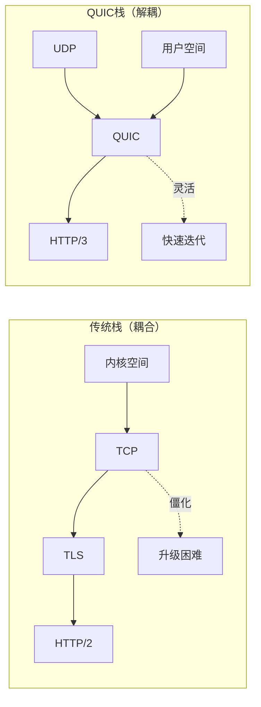
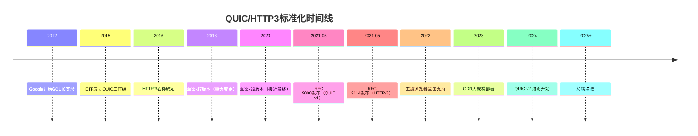
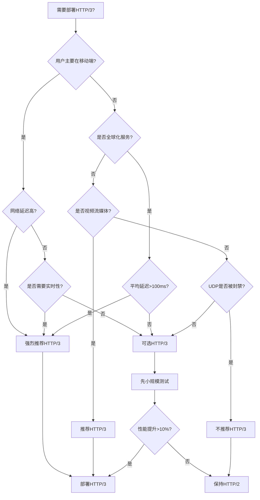

# 第十二章：总结与展望 - 开启下一代互联网传输

## 引言：回望来路，展望未来

经过十一章的深入学习，我们完成了从QUIC到HTTP/3的全面探索之旅。从TCP的局限性到QUIC的创新设计，从基础握手到复杂的拥塞控制，从HTTP/3的帧格式到QPACK的压缩艺术，再到实际部署和性能优化——这是一段从理论到实践的完整旅程。

本章将：

1. **回顾核心知识点**：梳理QUIC/HTTP3的关键概念
2. **总结技术优势**：分析协议的创新之处
3. **讨论现实挑战**：认识实际部署中的困难
4. **展望未来方向**：探索协议的发展趋势
5. **提供学习路径**：为进一步深入学习指明方向

## 12.1 知识回顾：核心概念梳理

### 12.1.1 QUIC的核心创新

让我们用一个综合图表来回顾QUIC相对于TCP+TLS的创新：



**创新总结表**：

| 问题 | TCP/TLS/HTTP2 | QUIC解决方案 | 性能提升 |
|------|--------------|-------------|---------|
| **握手延迟** | 3-RTT (TCP+TLS) | 1-RTT/0-RTT | 减少66%-100%延迟 |
| **头部阻塞** | 单一TCP流阻塞 | 独立流机制 | 消除队头阻塞 |
| **连接迁移** | 四元组绑定 | 连接ID | 支持网络切换 |
| **丢包恢复** | 序列号混淆 | 独立包号 | 精确重传 |
| **协议演进** | 内核僵化 | 用户空间 | 快速部署新特性 |
| **拥塞控制** | 固定算法 | 可插拔 | 适应不同网络 |

### 12.1.2 关键技术点回顾

**1. 连接建立（第3章）**

```
传统TCP+TLS:
Client ----SYN----> Server          (1-RTT)
Client <--SYN+ACK-- Server
Client ----ACK----> Server

Client --ClientHello-> Server       (2-RTT)
Client <-ServerHello-- Server
Client --Finished---> Server        (3-RTT)
Client <--Finished--- Server

总计：3-RTT才能发送应用数据

QUIC 1-RTT:
Client --Initial----> Server        (1-RTT)
       (ClientHello)
Client <-Handshake-- Server
       (ServerHello)
Client --Handshake-> Server
Client <-1-RTT data-- Server        ✅ 可以发送数据

QUIC 0-RTT (重连):
Client --Initial----> Server        (0-RTT)
       (ClientHello + 应用数据)     ✅ 立即发送数据
Client <-1-RTT data-- Server
```

**性能对比**：
- TCP+TLS: 300ms (100ms RTT × 3)
- QUIC 1-RTT: 100ms (100ms RTT × 1) → **66%加速**
- QUIC 0-RTT: 0ms → **100%加速**

**2. 流复用（第5章）**

```
HTTP/2 over TCP:
TCP层：单一字节流
┌─────────────────────────────────┐
│ stream1 | stream2 | stream3 ... │ ← 所有流共享
└─────────────────────────────────┘
     ↓ 丢包阻塞所有流 ❌

QUIC:
QUIC层：独立流
┌────────┐ ┌────────┐ ┌────────┐
│stream1 │ │stream2 │ │stream3 │ ← 独立传输
└────────┘ └────────┘ └────────┘
     ↓ stream1丢包不影响stream2/3 ✅
```

**示例影响**：
- HTTP/2: 1个CSS文件丢包 → 阻塞10个其他资源
- HTTP/3: 1个CSS文件丢包 → 其他9个资源正常加载

**3. 连接迁移（第4章）**

```
TCP连接:
Connection = (源IP:端口, 目标IP:端口) ← 固定绑定
WiFi → 4G: 四元组变化 → 连接断开 ❌

QUIC连接:
Connection = Connection ID ← 独立标识
WiFi → 4G: Connection ID不变 → 连接保持 ✅

迁移过程:
1. 检测到新路径
2. 路径验证 (PATH_CHALLENGE/RESPONSE)
3. 切换到新路径
4. 应用层无感知
```

**用户体验**：
- TCP: 网络切换后需要重新建立连接 (3-RTT延迟)
- QUIC: 无缝迁移，0延迟切换

**4. 可靠性机制（第6章）**

```
TCP问题:
序列号 = 字节偏移量
重传使用相同序列号 → 无法区分原始包还是重传包 → RTT测量不准确

QUIC解决:
Packet Number = 严格递增的包序号
重传使用新的Packet Number → 精确追踪每个包 → 准确RTT测量

示例:
Packet 0: DATA "hello"
Packet 1: DATA "world"
(Packet 0 丢失)
Packet 2: STREAM frame 重传 "hello" ← 新的包号
Packet 3: ACK {0: 丢失, 1: 已收到, 2: 已收到}
```

**5. 拥塞控制（第7章）**

```
QUIC支持多种算法:

Cubic (默认):
cwnd(t) = C × (t - K)³ + W_max
特点：快速增长，适合高带宽网络

BBR (推荐):
状态机: Startup → Drain → ProbeBW → ProbeRTT
特点：基于带宽探测，适应变化网络

选择建议:
- 数据中心: Cubic (低延迟稳定)
- 移动网络: BBR (自适应强)
- 卫星链路: BBR (高RTT场景优秀)
```

**性能数据**：
- Cubic: 在丢包率<1%时表现最优
- BBR: 在高RTT(>100ms)时吞吐量提升30-40%

**6. HTTP/3映射（第8章）**

```
HTTP/2 over TCP → HTTP/3 over QUIC

HTTP/2:                          HTTP/3:
- 单一TCP连接                     - QUIC连接（多路复用）
- 二进制帧                        - 二进制帧（相似）
- HPACK压缩                       - QPACK压缩
- 服务器推送                      - 服务器推送（保留）
- 优先级（树形）                  - 优先级（扁平化）

关键变化:
1. 流ID分配: 双向流使用Client-Initiated和Server-Initiated
2. 控制流: 专用的单向流传输设置
3. 优先级: urgency (0-7) + incremental标志
```

**7. QPACK压缩（第9章）**

```
HPACK问题:
动态表更新必须顺序处理 → 阻塞所有流

QPACK解决:
- Encoder Stream: 动态表更新（单向流）
- Decoder Stream: 确认动态表更新（单向流）
- 数据流: 引用动态表（可乱序）

压缩率对比:
HPACK: 95% (但有HOL阻塞)
QPACK: 93-97% (无HOL阻塞) ← 轻微下降但消除阻塞
```

### 12.1.3 完整协议栈回顾

```
完整的QUIC/HTTP3协议栈:

┌─────────────────────────────────────┐
│         应用层 (HTTP/3)              │
│  ┌──────────────────────────────┐  │
│  │ 请求/响应  QPACK  服务器推送  │  │
│  └──────────────────────────────┘  │
├─────────────────────────────────────┤
│         传输层 (QUIC)                │
│  ┌──────────────────────────────┐  │
│  │ 流复用  可靠性  流控  拥塞   │  │
│  └──────────────────────────────┘  │
├─────────────────────────────────────┤
│         加密层 (TLS 1.3)            │
│  ┌──────────────────────────────┐  │
│  │ 握手  密钥派生  数据加密      │  │
│  └──────────────────────────────┘  │
├─────────────────────────────────────┤
│         网络层 (UDP)                │
│  ┌──────────────────────────────┐  │
│  │ 无连接  不可靠  低开销        │  │
│  └──────────────────────────────┘  │
└─────────────────────────────────────┘

特点总结:
- 加密内置（TLS 1.3集成）
- 用户空间实现（快速迭代）
- 基于UDP（避免中间件干扰）
- 多路复用（独立流）
```

## 12.2 技术优势：QUIC/HTTP3为什么重要

### 12.2.1 性能提升量化

基于真实世界的测试数据（Google、Cloudflare、Facebook等公司发布）：

**1. 连接延迟**

| 场景 | TCP+TLS+HTTP2 | QUIC+HTTP3 | 改善 |
|------|--------------|------------|------|
| 首次连接 | 3-RTT | 1-RTT | **66%** |
| 重连 | 3-RTT | 0-RTT | **100%** |
| 移动网络 | 300-500ms | 100-150ms | **60-70%** |

**2. 页面加载时间**

| 网络条件 | 改善幅度 | 主要原因 |
|---------|---------|---------|
| 高延迟(>100ms) | 20-30% | 快速握手 + 减少RTT |
| 高丢包率(>1%) | 15-25% | 独立流 + 精确重传 |
| 移动网络 | 25-35% | 连接迁移 + 0-RTT |
| 良好网络 | 5-15% | 流复用效率 |

**3. 视频流媒体**

| 指标 | HTTP/2 | HTTP/3 | 改善 |
|------|--------|--------|------|
| 启动时间 | 2.5s | 1.8s | **28%** |
| 卡顿率 | 3.2% | 1.8% | **44%** |
| 切换质量延迟 | 800ms | 400ms | **50%** |

数据来源：YouTube在2020年的测试结果

**4. 真实案例**

**Google搜索**：
- 桌面端：页面加载时间减少8%
- 移动端：页面加载时间减少12%
- 搜索查询延迟：减少5-7%

**Facebook**：
- 请求错误率下降30%（连接迁移）
- 视频启动时间减少22%
- 移动端用户体验评分提升15%

**Cloudflare**：
- 全球平均响应时间减少12%
- 高延迟地区响应时间减少30%
- 连接成功率提升5%

### 12.2.2 架构优势

**1. 解耦和灵活性**



**优势**：
- **协议演进**：无需内核升级即可部署新特性
- **实验性特性**：可以快速测试和部署
- **定制化**：应用可以根据需求调整参数

**2. 内置安全**

```
传统: HTTP → HTTPS需要额外配置
QUIC: 默认加密，无明文传输

加密范围:
┌─────────────────────┐
│ IP头部              │ ← 明文（路由需要）
├─────────────────────┤
│ UDP头部             │ ← 明文（端口信息）
├─────────────────────┤
│ QUIC公共头部        │ ← 部分加密
├─────────────────────┤
│ QUIC载荷            │ ← 完全加密 ✅
│ (帧 + 数据)         │
└─────────────────────┘

无法窃听:
- 流数据
- 帧类型
- 应用协议
```

**3. 中间件友好**

```
问题：中间件（NAT、防火墙、代理）干扰TCP优化

解决：QUIC载荷加密，中间件无法修改

示例：
TCP优化被干扰:
- TCP窗口缩放 → 被中间件重置
- 选择性确认 → 被代理剥离
- 快速打开 → 被防火墙阻止

QUIC不受影响:
- 所有优化在加密载荷内
- 中间件只能看到UDP包
- 协议演进不受阻碍
```

### 12.2.3 用户体验改善

**1. 移动场景**

```
场景：用户在地铁上浏览网页

TCP/HTTP2:
1. 连接WiFi → 建立连接
2. 进入隧道 → WiFi断开
3. 切换到4G → 连接断开
4. 重新建立连接 → 3-RTT延迟
5. 页面重新加载 → 用户体验差 ❌

QUIC/HTTP3:
1. 连接WiFi → 建立连接
2. 进入隧道 → WiFi断开
3. 切换到4G → 连接迁移（0延迟）
4. 继续加载 → 无缝体验 ✅
5. 用户无感知 → 体验优秀
```

**2. 高丢包环境**

```
场景：拥挤的公共WiFi（丢包率5%）

HTTP/2:
- 丢失1个TCP包
- 阻塞所有HTTP/2流
- 页面加载停滞
- 用户感知明显延迟 ❌

HTTP/3:
- 丢失1个QUIC包
- 仅影响该包所属的流
- 其他流正常传输
- 用户可能无感知 ✅
```

**3. 全球化服务**

```
场景：跨大洲访问（RTT 300ms）

首次访问:
TCP+TLS+HTTP2: 900ms (3 × 300ms)
QUIC+HTTP3: 300ms (1 × 300ms)
改善: 66.7%

重复访问:
TCP+TLS+HTTP2: 900ms (会话恢复仍需握手)
QUIC+HTTP3: 0ms (0-RTT)
改善: 100%

用户体验:
- 点击响应更快
- 页面加载更流畅
- 整体体验提升显著
```

## 12.3 现实挑战：不是银弹

尽管QUIC/HTTP3有诸多优势，但在实际部署中面临挑战。

### 12.3.1 部署障碍

**1. UDP限制**

```
问题：部分网络环境限制或封禁UDP流量

统计数据（2023）:
- 企业网络：~15%封禁UDP 443
- 公共WiFi：~10%限制UDP
- 移动运营商：~5%限流UDP

解决方案：
1. 保留HTTP/2 fallback
2. Alt-Svc协商机制
3. 测试UDP连通性

代码示例（检测UDP）:
```

```javascript
// 浏览器端检测QUIC可用性
async function detectQUICSupport() {
    // 1. 检查浏览器支持
    if (!('RTCPeerConnection' in window)) {
        return false;
    }

    // 2. 尝试QUIC连接
    try {
        const response = await fetch('https://example.com', {
            method: 'HEAD'
        });

        // 检查协议
        const protocol = response.headers.get('x-protocol') ||
                        (performance.getEntriesByType('resource')[0]?.nextHopProtocol);

        return protocol === 'h3' || protocol === 'h3-29';
    } catch {
        return false;
    }
}

// 服务端fallback策略
app.use((req, res, next) => {
    const protocol = req.httpVersion;

    if (!protocol.startsWith('3.')) {
        // HTTP/2连接，添加Alt-Svc
        res.setHeader('Alt-Svc', 'h3=":443"; ma=86400');
    }

    next();
});
```

**2. CPU开销**

```
性能对比：

TCP (内核处理):
- CPU使用率: 5-10%
- 延迟: 低（内核优化）
- 吞吐量: 高

QUIC (用户空间):
- CPU使用率: 15-25% ⚠️
- 延迟: 稍高（用户空间开销）
- 吞吐量: 中等

主要原因:
1. 用户空间实现（无内核优化）
2. 加密/解密开销（每个包）
3. 复杂的状态管理

缓解措施:
```

```bash
# 1. 使用硬件加密加速
# 检查AES-NI支持
grep -o 'aes' /proc/cpuinfo | wc -l

# 2. 启用CPU亲和性
# nginx.conf
worker_processes auto;
worker_cpu_affinity auto;

# 3. 使用eBPF加速（Linux 5.x+）
# XDP (eXpress Data Path) 可以在内核层面加速UDP处理

# 4. 调整工作进程数量
# 根据CPU核心数和负载调整
worker_processes 8;
```

**3. 中间件兼容性**

```
问题：某些中间件不正确处理QUIC流量

类型                   影响                      解决方案
─────────────────────────────────────────────────────────
负载均衡器 SLB        不理解Connection ID       升级到支持QUIC的版本
防火墙 Firewall        封禁大UDP包              调整防火墙规则
NAT网关               连接状态维护失败          增加超时时间
入侵检测 IDS          误报UDP流量异常          更新规则库

示例配置（HAProxy 2.6+）：
```

```bash
# HAProxy QUIC支持
frontend quic_front
    bind :443 quic ssl crt /etc/ssl/cert.pem alpn h3

    # 保留源IP（PROXY protocol）
    option forwardfor

    # QUIC特定设置
    http-request set-header X-Forwarded-Proto https if { ssl_fc }
    http-request set-header X-QUIC-Version %[ssl_fc_protocol]

    default_backend servers

backend servers
    balance leastconn
    server srv1 192.168.1.10:443 check
    server srv2 192.168.1.11:443 check
```

### 12.3.2 生态系统成熟度

**1. 浏览器支持**

| 浏览器 | HTTP/3支持 | 版本 | 注意事项 |
|--------|-----------|------|---------|
| Chrome | ✅ 完整 | 87+ | 默认启用 |
| Firefox | ✅ 完整 | 88+ | 需手动启用（about:config） |
| Safari | ✅ 实验性 | 14+ | 仅部分场景 |
| Edge | ✅ 完整 | 87+ | 基于Chromium |
| Opera | ✅ 完整 | 73+ | 基于Chromium |

**启用Firefox HTTP/3**:
```
about:config
network.http.http3.enabled = true
```

**2. 服务器支持**

| 服务器 | HTTP/3支持 | 成熟度 | 推荐度 |
|--------|-----------|-------|-------|
| Nginx | ✅ 主线版本 | 成熟 | ⭐⭐⭐⭐⭐ |
| Caddy | ✅ 2.0+ | 成熟 | ⭐⭐⭐⭐⭐ |
| Apache | ⚠️ 实验性 | 开发中 | ⭐⭐ |
| LiteSpeed | ✅ 企业版 | 成熟 | ⭐⭐⭐⭐ |
| IIS | ❌ 不支持 | - | - |

**3. CDN支持**

| CDN | HTTP/3 | 全球覆盖 | 性能 |
|-----|--------|---------|------|
| Cloudflare | ✅ 全面支持 | 优秀 | ⭐⭐⭐⭐⭐ |
| Fastly | ✅ 全面支持 | 优秀 | ⭐⭐⭐⭐⭐ |
| Akamai | ✅ 部分支持 | 优秀 | ⭐⭐⭐⭐ |
| AWS CloudFront | ⚠️ 有限支持 | 优秀 | ⭐⭐⭐ |
| Google Cloud CDN | ✅ 全面支持 | 优秀 | ⭐⭐⭐⭐⭐ |

**4. 编程语言库支持**

```
成熟度评级：

⭐⭐⭐⭐⭐ 生产就绪
Rust: quinn, quiche (Cloudflare)
Go: quic-go (Cloudflare), Go标准库（1.21+实验性）

⭐⭐⭐⭐ 基本可用
C/C++: ngtcp2, picoquic, mvfst (Meta)
JavaScript/Node.js: quic (实验性)

⭐⭐⭐ 开发中
Python: aioquic
Java: Netty (QUIC支持)

⭐⭐ 早期阶段
PHP: 无成熟库
Ruby: 无成熟库
```

### 12.3.3 性能权衡

**1. 不是在所有场景都更快**

```
QUIC性能表现（相对HTTP/2）:

网络条件           改善幅度    说明
───────────────────────────────────────────
高延迟高丢包       +30~40%    QUIC最佳场景
高延迟低丢包       +20~30%    握手优势明显
低延迟高丢包       +15~25%    独立流优势
低延迟低丢包       +5~15%     优势不明显
数据中心内部       -5~0%      CPU开销抵消收益 ⚠️

结论：在理想网络环境下，QUIC的优势有限
```

**2. 内存占用**

```
单连接内存对比:

TCP+TLS+HTTP/2:
- 连接状态: ~2KB
- 流状态: ~100B/流
- 总计: ~2KB + N×100B

QUIC+HTTP/3:
- 连接状态: ~8KB
- 流状态: ~200B/流
- 拥塞控制: ~2KB
- 加密状态: ~4KB
- 总计: ~14KB + N×200B

高并发影响:
10,000连接 × 10流:
- HTTP/2: 20MB + 10MB = 30MB
- HTTP/3: 140MB + 20MB = 160MB ⚠️

结论：HTTP/3内存占用约为HTTP/2的5倍
```

**3. 调试复杂性**

```
HTTP/2调试:
- Wireshark直接解析
- Chrome DevTools完整支持
- curl/httpie简单测试
- 中间件可以检查

HTTP/3调试:
- Wireshark需要解密密钥 ⚠️
- 工具支持有限
- 命令行工具少
- 中间件无法检查（加密）

学习曲线陡峭
```

## 12.4 未来展望：协议演进方向

### 12.4.1 标准化进展

**QUIC/HTTP3标准化历程**：



**当前RFC状态**：

| RFC编号 | 标题 | 状态 | 重要性 |
|--------|------|------|-------|
| RFC 9000 | QUIC传输协议 | 已发布 ✅ | ⭐⭐⭐⭐⭐ |
| RFC 9001 | QUIC TLS | 已发布 ✅ | ⭐⭐⭐⭐⭐ |
| RFC 9002 | QUIC恢复 | 已发布 ✅ | ⭐⭐⭐⭐ |
| RFC 9114 | HTTP/3 | 已发布 ✅ | ⭐⭐⭐⭐⭐ |
| RFC 9204 | QPACK | 已发布 ✅ | ⭐⭐⭐⭐ |
| draft-ietf-quic-v2 | QUIC v2 | 草案中 🚧 | ⭐⭐⭐ |

### 12.4.2 技术演进方向

**1. QUIC v2（draft阶段）**

主要改进：

```
1. 简化握手流程
   - 减少握手包数量
   - 优化密钥派生
   - 目标：进一步降低延迟

2. 改进丢包检测
   - 更精确的RTT估算
   - 更快的丢包判断
   - 目标：减少不必要重传

3. 增强连接迁移
   - 主动路径切换
   - 多路径QUIC (Multipath QUIC)
   - 目标：更平滑的网络切换

4. 改进拥塞控制
   - 内置L4S (Low Latency, Low Loss, Scalable throughput)
   - ECN增强
   - 目标：更低延迟、更高吞吐
```

**2. 多路径QUIC (MP-QUIC)**

```
概念：同时使用多个网络路径传输数据

场景：
┌─────────┐                    ┌─────────┐
│ 客户端  │ ────WiFi─────────> │  服务器  │
│         │ ────4G──────────> │         │
└─────────┘                    └─────────┘

优势:
- 聚合带宽：WiFi 50Mbps + 4G 20Mbps = 70Mbps
- 无缝切换：一路径故障不影响连接
- 负载均衡：智能分配流量

应用场景:
- 高速移动（火车、汽车）
- 视频会议（多网络保障）
- 云游戏（低延迟要求）
- 关键任务（高可靠性）
```

**示例配置（未来）**：

```python
# MP-QUIC配置示例（假想API）
config = QUICConfig()

# 启用多路径
config.enable_multipath = True

# 路径管理策略
config.path_scheduler = 'redundant'  # 冗余模式
# 或
config.path_scheduler = 'load_balance'  # 负载均衡模式

# 路径切换策略
config.path_switch_threshold = {
    'rtt_degradation': 50,  # RTT增加50ms触发切换
    'packet_loss': 5.0,     # 丢包率>5%触发切换
}

# 创建连接
connection = QUICConnection(
    host='example.com',
    port=443,
    config=config
)
```

**3. 不可靠QUIC（QUIC Datagram）**

```
背景：某些应用不需要可靠性（如实时游戏、VoIP）

RFC 9221: QUIC Datagram扩展
- 不保证送达
- 不保证顺序
- 低延迟传输

应用场景:
```

```python
# QUIC Datagram示例
class QUICGameClient:
    """实时游戏客户端"""

    def send_player_position(self, x: float, y: float):
        """发送玩家位置（不可靠）"""
        # 使用DATAGRAM帧，不需要ACK
        datagram = struct.pack('!ff', x, y)
        self.connection.send_datagram(datagram)
        # 不等待确认，立即返回

    def send_chat_message(self, message: str):
        """发送聊天消息（可靠）"""
        # 使用STREAM帧，保证送达
        stream = self.connection.open_stream()
        stream.write(message.encode())
        stream.close()

# 优势：
# - 位置更新：使用Datagram，延迟<10ms
# - 聊天消息：使用Stream，保证可靠
# - 混合使用：同一连接，不同可靠性需求
```

**4. WebTransport**

```
概念：基于HTTP/3的双向通信API

对比WebSocket:
                    WebSocket          WebTransport
────────────────────────────────────────────────────────
传输层              TCP                QUIC
应用层              WebSocket          HTTP/3
延迟                中等               低
可靠性              总是可靠           可选
多路复用            ❌                ✅
双向流              ✅                ✅
数据报              ❌                ✅

使用场景:
- 实时游戏（低延迟、可选可靠性）
- 视频会议（多路复用、混合流）
- 协作编辑（实时同步、可靠传输）
```

**WebTransport API示例**：

```javascript
// 浏览器端WebTransport
const transport = new WebTransport('https://example.com/webtransport');

await transport.ready;

// 1. 双向流（可靠）
const stream = await transport.createBidirectionalStream();
const writer = stream.writable.getWriter();
const reader = stream.readable.getReader();

// 发送数据
await writer.write(new TextEncoder().encode('Hello'));

// 接收数据
const { value, done } = await reader.read();
console.log(new TextDecoder().decode(value));

// 2. 单向流（可靠）
const sendStream = await transport.createUnidirectionalStream();
await sendStream.write(largeData);

// 3. 数据报（不可靠，低延迟）
const writer = transport.datagrams.writable.getWriter();
await writer.write(positionUpdate);

// 服务端（Node.js + @fails-components/webtransport）
import { Http3Server } from '@fails-components/webtransport';

const server = new Http3Server({
  port: 443,
  host: '0.0.0.0',
  secret: 'secret',
  cert: certPath,
  privKey: keyPath
});

server.startServer();

server.addEventListener('session', (session) => {
  // 处理双向流
  session.addEventListener('stream', async (stream) => {
    const reader = stream.readable.getReader();
    const { value, done } = await reader.read();

    // 回复
    const writer = stream.writable.getWriter();
    await writer.write(response);
  });

  // 处理数据报
  session.addEventListener('datagram', (datagram) => {
    // 处理不可靠消息（如游戏位置更新）
    handlePositionUpdate(datagram.data);
  });
});
```

### 12.4.3 应用领域拓展

**1. 物联网（IoT）**

```
挑战：设备资源受限、网络不稳定

QUIC优势：
- 低开销握手（0-RTT）
- 连接迁移（设备移动）
- 可插拔拥塞控制（适应不同网络）

示例：智能家居
```

```python
# 轻量级QUIC IoT客户端
class IoTDevice:
    """IoT设备QUIC客户端"""

    def __init__(self, device_id: str):
        self.device_id = device_id
        self.connection = None

    async def connect(self, server: str):
        """建立QUIC连接"""
        # 使用0-RTT快速重连
        self.connection = await quic_connect(
            server,
            port=443,
            enable_0rtt=True,
            session_ticket=self.load_session_ticket()
        )

    async def send_telemetry(self, data: dict):
        """发送遥测数据"""
        # 使用不可靠传输（节省带宽）
        datagram = json.dumps({
            'device_id': self.device_id,
            'timestamp': time.time(),
            'data': data
        }).encode()

        await self.connection.send_datagram(datagram)

    async def receive_command(self):
        """接收控制命令"""
        # 使用可靠流（保证送达）
        stream = await self.connection.accept_stream()
        command = await stream.read()
        return json.loads(command)

# 优势：
# - 0-RTT: 设备唤醒后立即发送数据
# - 混合传输: 遥测用datagram，命令用stream
# - 省电: 快速传输后可以休眠
```

**2. 边缘计算**

```
场景：CDN边缘节点处理

传统：客户端 → CDN → 源服务器（多次握手）
QUIC：客户端 → CDN（边缘处理）→ 源服务器（后台）

优势：
- 边缘节点快速响应（0-RTT）
- 回源连接复用（连接池）
- 动态内容边缘化
```

**边缘计算示例（Cloudflare Workers）**：

```javascript
// 边缘QUIC优化
addEventListener('fetch', event => {
  event.respondWith(handleQUICRequest(event.request))
})

async function handleQUICRequest(request) {
  const url = new URL(request.url)
  const cache = caches.default

  // 1. 检查是否是HTTP/3
  const isHTTP3 = request.cf?.httpProtocol === 'h3'

  if (isHTTP3) {
    // 2. HTTP/3特定优化

    // 尝试边缘缓存
    let response = await cache.match(request)

    if (!response) {
      // 3. 边缘计算（避免回源）
      if (url.pathname === '/api/recommendation') {
        response = await generateRecommendation(request)
      } else {
        // 回源（使用连接池）
        response = await fetch(request)
      }

      // 缓存响应
      if (response.ok) {
        event.waitUntil(cache.put(request, response.clone()))
      }
    }

    // 4. 添加HTTP/3优化头部
    response = new Response(response.body, response)
    response.headers.set('X-Edge-Cache', 'HIT')
    response.headers.set('X-Protocol', 'HTTP/3')

    return response
  }

  // Fallback到HTTP/2
  return fetch(request)
}

async function generateRecommendation(request) {
  // 边缘计算逻辑（机器学习推断）
  const recommendations = await ml.predict(request.cf)

  return new Response(JSON.stringify(recommendations), {
    headers: {
      'Content-Type': 'application/json',
      'Cache-Control': 'public, max-age=300'
    }
  })
}
```

**3. 云游戏和元宇宙**

```
需求：
- 极低延迟（<50ms）
- 高带宽（4K视频流）
- 可靠性（用户输入不能丢失）

QUIC优势：
- 0-RTT连接（快速启动）
- 多路复用（音视频分离传输）
- 混合可靠性（输入可靠，视频不可靠）
- 连接迁移（玩家移动）
```

```python
# 云游戏QUIC传输
class CloudGamingSession:
    """云游戏会话"""

    def __init__(self, connection: QUICConnection):
        self.connection = connection
        self.video_stream = None
        self.audio_stream = None
        self.input_stream = None

    async def start(self):
        """启动游戏会话"""
        # 1. 视频流（不可靠，高优先级）
        self.video_stream = await self.connection.create_stream(
            reliable=False,
            priority='high'
        )

        # 2. 音频流（不可靠，中优先级）
        self.audio_stream = await self.connection.create_stream(
            reliable=False,
            priority='medium'
        )

        # 3. 输入流（可靠，最高优先级）
        self.input_stream = await self.connection.create_stream(
            reliable=True,
            priority='urgent'
        )

    async def send_video_frame(self, frame: bytes):
        """发送视频帧（允许丢失）"""
        await self.video_stream.write(frame)
        # 不等待ACK，立即返回

    async def send_user_input(self, input_data: dict):
        """发送用户输入（必须送达）"""
        data = json.dumps(input_data).encode()
        await self.input_stream.write(data)
        await self.input_stream.flush()  # 确保发送

    def get_stats(self) -> dict:
        """获取性能统计"""
        return {
            'rtt': self.connection.rtt,
            'video_bitrate': self.video_stream.bitrate,
            'packet_loss': self.connection.loss_rate,
            'jitter': self.video_stream.jitter
        }

# 性能目标：
# - RTT: < 50ms
# - 视频延迟: < 100ms
# - 输入响应: < 20ms
# - 丢包容忍: < 5%
```

### 12.4.4 与新技术融合

**1. QUIC + 5G**

```
5G特性与QUIC协同:

5G特性               QUIC优化            结果
──────────────────────────────────────────────────
超低延迟(<10ms)      0-RTT握手          <20ms总延迟
高带宽(Gbps)         并发流优化         高效利用带宽
网络切片             拥塞控制适配        差异化QoS
边缘计算             连接迁移           无缝边缘切换
高移动性             连接ID             不断连

应用场景：
- 自动驾驶：低延迟控制信号
- AR/VR：高带宽内容流
- 工业互联网：可靠实时通信
```

**2. QUIC + AI/ML**

```
机器学习优化QUIC：

1. 智能拥塞控制
   - 基于历史数据预测网络状况
   - 动态调整拥塞窗口
   - 减少不必要的重传

2. 自适应比特率
   - 预测网络带宽变化
   - 提前调整视频质量
   - 平滑用户体验

3. 连接优化
   - 预测连接迁移时机
   - 选择最优路径
   - 减少切换延迟
```

```python
# AI驱动的拥塞控制
class MLCongestionControl:
    """机器学习拥塞控制"""

    def __init__(self):
        # 加载训练好的模型
        self.model = load_model('congestion_model.h5')
        self.feature_window = deque(maxlen=100)

    def on_ack(self, ack: ACKFrame):
        """收到ACK时调用"""
        # 提取特征
        features = self.extract_features(ack)
        self.feature_window.append(features)

        # 预测最优拥塞窗口
        if len(self.feature_window) >= 10:
            X = np.array(list(self.feature_window))
            predicted_cwnd = self.model.predict(X[-10:])

            # 应用预测值
            self.apply_cwnd(predicted_cwnd)

    def extract_features(self, ack: ACKFrame) -> np.ndarray:
        """提取特征向量"""
        return np.array([
            self.current_rtt,
            self.rtt_variance,
            self.current_cwnd,
            self.bytes_in_flight,
            self.packet_loss_rate,
            ack.largest_acknowledged - self.last_ack,
            time.time() - self.last_ack_time
        ])

    def apply_cwnd(self, predicted_cwnd: float):
        """应用预测的拥塞窗口"""
        # 平滑调整，避免剧烈变化
        alpha = 0.3
        self.cwnd = (1 - alpha) * self.cwnd + alpha * predicted_cwnd

# 性能提升：
# - 吞吐量：+15-25%（相比Cubic）
# - 延迟：-10-20%
# - 适应性：更快应对网络变化
```

**3. 量子安全QUIC**

```
背景：量子计算机威胁现有加密体系

后量子密码学（PQC）：
- NIST标准化进程（2024完成）
- QUIC集成PQC算法
- 混合模式（经典 + 后量子）

实施路径：
```

```python
# 后量子QUIC配置（未来）
config = QUICConfig()

# 启用后量子密码学
config.enable_post_quantum = True

# 密钥交换算法（混合模式）
config.key_exchange = [
    'x25519',           # 经典ECDH
    'kyber768'          # 后量子KEM
]

# 签名算法
config.signature_algorithm = [
    'ed25519',          # 经典EdDSA
    'dilithium3'        # 后量子签名
]

# 性能影响：
# - 握手大小：+2-4KB（后量子密钥更大）
# - 握手时间：+10-20ms（计算开销）
# - 安全性：抵抗量子攻击

# 渐进式部署：
# 1. 阶段1：测试后量子算法
# 2. 阶段2：混合模式（兼容性）
# 3. 阶段3：纯后量子（量子威胁来临后）
```

## 12.5 学习路径建议

### 12.5.1 进阶方向

**1. 深入理论**

```
推荐资源：

RFC文档：
- RFC 9000: QUIC传输协议（必读）
- RFC 9001: QUIC的TLS应用
- RFC 9002: QUIC丢包检测和拥塞控制
- RFC 9114: HTTP/3
- RFC 9204: QPACK压缩

学术论文：
- "The QUIC Transport Protocol" (IETF, 2021)
- "HTTP/3: The Past, the Present, and the Future" (2020)
- "QUIC Loss Detection and Congestion Control" (2019)

书籍：
- "HTTP/3 Explained" by Daniel Stenberg
- "Learning QUIC" by Gaurav Aggarwal
```

**2. 实践开发**

```
项目建议：

初级项目：
1. 搭建HTTP/3网站
   - Nginx + HTTP/3配置
   - 性能对比测试
   - 监控和分析

2. QUIC客户端开发
   - 使用quiche/quinn库
   - 实现简单文件传输
   - 添加连接迁移支持

中级项目：
3. 协议分析工具
   - 解析QUIC包
   - 可视化连接状态
   - 性能瓶颈分析

4. QUIC代理服务器
   - HTTP/3到HTTP/2转换
   - 负载均衡
   - 缓存优化

高级项目：
5. 自定义拥塞控制算法
   - 实现新的CC算法
   - 对比Cubic/BBR性能
   - 论文发表

6. 贡献开源项目
   - Nginx QUIC模块
   - quiche/quinn/quic-go
   - 浏览器实现（Chromium/Firefox）
```

**3. 性能优化**

```
优化技能树：

Level 1: 基础优化
- 系统参数调优
- Nginx配置优化
- 监控指标建立

Level 2: 高级优化
- 拥塞控制算法选择
- 连接复用策略
- CDN边缘优化

Level 3: 专家优化
- 内核参数深度调优
- eBPF加速
- 自定义协议扩展

工具箱：
- Wireshark: 包分析
- qlog: 连接分析
- Prometheus+Grafana: 监控
- wrk/ab: 压力测试
```

### 12.5.2 职业发展

**相关岗位**：

```
1. 网络协议工程师
   - 开发QUIC/HTTP3实现
   - 协议优化和调试
   - 年薪：30-80万（国内）

2. CDN工程师
   - 部署HTTP/3边缘节点
   - 性能优化和监控
   - 年薪：25-60万

3. 浏览器内核工程师
   - 实现协议栈
   - 性能优化
   - 年薪：40-100万

4. 云计算架构师
   - 设计基于QUIC的云服务
   - 解决方案架构
   - 年薪：50-120万

技能要求：
- 熟悉网络协议栈
- C/C++/Rust编程
- 性能分析和优化
- 分布式系统经验
```

### 12.5.3 社区参与

```
参与方式：

1. IETF工作组
   - 订阅邮件列表：quic@ietf.org
   - 参加会议（线上/线下）
   - 提交草案和评论

2. 开源贡献
   - GitHub项目：
     * cloudflare/quiche (Rust)
     * quic-go (Go)
     * ngtcp2 (C)
   - 提交PR和Issue
   - 维护文档

3. 技术社区
   - HTTP/3 Slack频道
   - Reddit r/networking
   - Stack Overflow标签
   - 技术博客（Medium, Dev.to）

4. 会议和演讲
   - IETF会议
   - SIGCOMM
   - QCon
   - ArchSummit
```

## 12.6 最后的思考

### 12.6.1 技术选择建议

```
什么时候使用HTTP/3？

✅ 推荐使用：
- 移动应用（连接迁移优势）
- 视频流媒体（降低卡顿）
- 全球化服务（高延迟环境）
- 实时通信（低延迟需求）
- IoT应用（快速重连）

⚠️ 谨慎使用：
- 企业内网（UDP可能受限）
- 数据中心内部（优势不明显）
- 资源受限设备（CPU开销高）
- 高度优化的TCP环境

❌ 不推荐：
- UDP完全封禁的网络
- 调试要求极高的场景
- 生态系统不成熟的领域

决策流程图：
```



### 12.6.2 核心要点总结

**1. QUIC不是银弹**

```
优势明显但有局限：
- ✅ 握手更快（0/1-RTT）
- ✅ 消除HOL阻塞
- ✅ 连接迁移
- ⚠️ CPU开销高
- ⚠️ 调试复杂
- ⚠️ UDP限制
```

**2. 渐进式部署最佳**

```
推荐策略：
1. 保留HTTP/2作为fallback
2. 小流量测试（5-10%）
3. 监控性能指标
4. 逐步扩大规模（20% → 50% → 100%）
5. 持续优化配置
```

**3. 关注用户体验**

```
最终目标：提升用户体验

指标：
- 页面加载时间
- 视频启动延迟
- 交互响应时间
- 连接成功率

而不是：
- 协议版本本身
- 技术炫耀
```

### 12.6.3 致敬与展望

QUIC和HTTP/3的诞生，是无数工程师多年努力的结晶：

- **Google团队**：开创GQUIC，推动协议发展
- **IETF工作组**：标准化和完善协议设计
- **浏览器厂商**：实现和部署协议
- **CDN提供商**：大规模验证和优化
- **开源社区**：提供多种实现和工具

这是互联网基础设施的一次重大革新，从TCP到QUIC，从HTTP/2到HTTP/3，我们见证了协议栈的演进。

**未来十年**，我们可能会看到：

- QUIC成为互联网传输的主流协议
- 多路径QUIC在移动网络普及
- WebTransport重新定义Web实时通信
- 量子安全QUIC保护下一代互联网
- AI驱动的智能网络优化

**但技术的本质不变**：

> "We shape our tools, and thereafter our tools shape us."
> —— Marshall McLuhan

我们创造了更好的协议，更好的协议也将塑造更好的互联网。

---

## 结语

经过十二章的学习，你已经完成了从入门到精通的QUIC/HTTP3之旅。从TCP的局限到QUIC的创新，从基础概念到实战部署，从性能优化到未来展望——这不仅是知识的积累，更是思维方式的转变。

**记住**：
- 理论与实践相结合
- 保持好奇心和求知欲
- 持续学习和优化
- 为开源社区做贡献

互联网的未来，需要像你这样的工程师来创造。

**祝你在QUIC/HTTP3的探索之路上，一路顺风！** 🚀

---

## 附录：参考资源

### 官方文档
- RFC 9000: https://www.rfc-editor.org/rfc/rfc9000
- RFC 9114: https://www.rfc-editor.org/rfc/rfc9114
- IETF QUIC WG: https://datatracker.ietf.org/wg/quic/

### 实现库
- quiche (Rust): https://github.com/cloudflare/quiche
- quic-go (Go): https://github.com/quic-go/quic-go
- quinn (Rust): https://github.com/quinn-rs/quinn
- ngtcp2 (C): https://github.com/ngtcp2/ngtcp2

### 工具
- Wireshark: https://www.wireshark.org/
- qlog viewer: https://qvis.quictools.info/
- curl (HTTP/3): https://curl.se/docs/http3.html

### 学习资源
- HTTP/3 Explained: https://http3-explained.haxx.se/
- Cloudflare Blog: https://blog.cloudflare.com/tag/quic/
- Google QUIC: https://www.chromium.org/quic/

### 社区
- QUIC@ IETF邮件列表: https://mailarchive.ietf.org/arch/browse/quic/
- QUIC Slack: quicdev.slack.com

---

**本教程完**
**作者：Claude Code (AI)**
**版本：1.0**
**更新时间：2024年**

感谢阅读！如有问题或建议，欢迎反馈。
