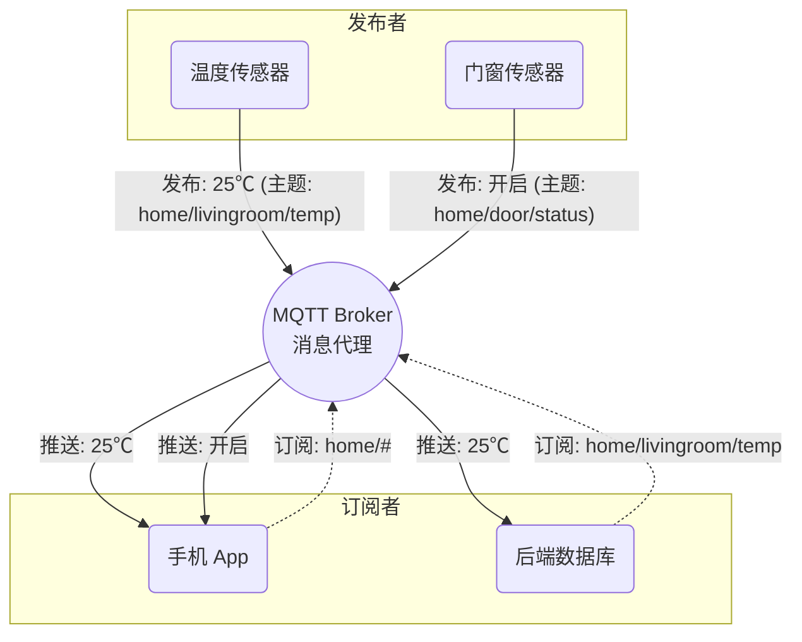
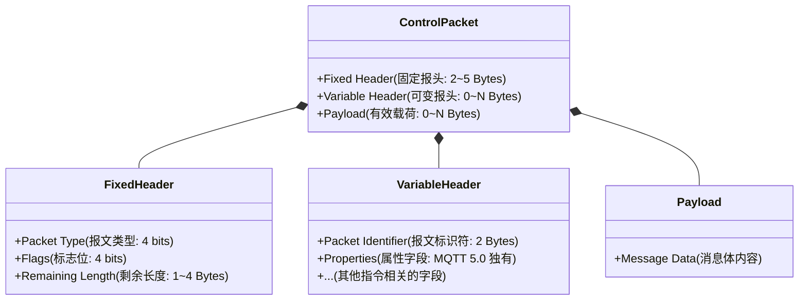

# MQTT 核心概念与架构

MQTT（Message Queuing Telemetry Transport）是一种轻量级、基于发布/订阅模式的物联网（IoT）消息传输协议。它最初由 IBM 在 1999 年设计，专为受限设备和低带宽、高延迟或不可靠的网络环境而打造。今天，MQTT 已经成为物联网领域的“通用语言”。

为了让你能轻松上手这套协议，我们先从最基本的架构和核心概念开始。

## 1. 核心模型：发布与订阅（Pub/Sub）

理解 MQTT，首先要抛弃传统的“客户端-服务器”（Client-Server）请求/响应思维。在 HTTP 世界中，客户端直接向服务器要数据；而在 MQTT 世界里，一切建立在**发布/订阅（Pub/Sub）模型**之上。

**通俗类比：报纸的订阅与投递系统**
想象一下传统的报纸发行：
- **发布者（Publisher）**：报社记者写了一篇新闻稿，他们不需要知道这篇报道具体要发给哪位读者，只需要把它交给邮局。
- **代理（Broker）**：邮局或报刊亭。它负责接收所有记者的新闻稿，并根据读者的订阅记录，将对应的报纸准确地投递给每一位订户。
- **订阅者（Subscriber）**：读者。读者不需要认识记者，只要告诉邮局“我想要订阅《体育周刊》”，每当有新的体育新闻送达邮局时，邮局就会派发给该读者。

在这个模型中，发布者和订阅者是**空间和时间上解耦**的：
- **空间解耦**：发布者和订阅者互不认识，甚至不需要知道对方的 IP 地址，它们只与 Broker 通信。
- **时间解耦**：发布者和订阅者不需要同时在线（依靠后面会讲到的保留消息和持久会话等机制）。

### Mermaid 可视化：MQTT 架构图



---

## 2. 主题（Topic）与通配符机制

在上述的 Pub/Sub 模型中，邮局怎么知道谁订阅了哪篇新闻？这就要靠**主题（Topic）**了。

主题就像是消息的“信封地址”，它是一个 UTF-8 编码的字符串，通常由斜杠（`/`）分隔的多个层级组成，例如：
- `home/livingroom/temp` (家里/客厅/温度)
- `factory/machine1/rpm` (工厂/机器1/转速)

### 灵活的通配符（Wildcards）

为了方便订阅者一次性获取多类消息，MQTT 提供了通配符功能。通配符只能用于**订阅**，不能用于**发布**。

1. **单层通配符（`+`）**
   只匹配一个层级的主题。
   - 订阅 `home/+/temp` 可以匹配 `home/livingroom/temp` 和 `home/bedroom/temp`。
   - 但它**不能**匹配 `home/livingroom/ac/temp`。

2. **多层通配符（`#`）**
   匹配当前层级及以下的所有层级。**必须放在主题的最后面**。
   - 订阅 `home/#` 可以收到 `home/livingroom/temp`、`home/door/status` 以及 `home` 本身。

---

## 3. 窥探底层：MQTT 控制报文结构

为什么 MQTT 被称为“轻量级”？它的协议开销极低，最少只需要 2 个字节就能完成一次心跳维持。这得益于其高度紧凑的二进制报文格式。

在 MQTT 的传输协议中，所有的指令交互（如连接、发布、确认）被称为**控制报文（Control Packet）**。一个标准的 MQTT 报文由三部分组成：



### 3.1 固定报头（Fixed Header）
所有 MQTT 报文都**必须**包含固定报头，由 2 到 5 个字节组成：
- **Byte 1**：前 4 位（高 4 位）指定**报文类型**（如 CONNECT 为 1，PUBLISH 为 3）。后 4 位（低 4 位）是特定于报文类型的**标志位**（如是否重传 DUP、服务质量 QoS、是否保留 RETAIN）。
- **Byte 2 ~ Byte 5**：**剩余长度（Remaining Length）**。这里使用了一种非常巧妙的编码方式：**可变字节整数（Variable Byte Integer）**。

#### 💡 深度剖析：可变字节整数
为了让协议体积尽可能小，MQTT 设计了可变字节整数来表示长度。最多使用 4 个字节，每个字节有 8 位：
- **低 7 位**（0-6）用来编码具体的值（0~127）。
- **最高位**（第 7 位，标志位）作为一个延续位（Continuation Bit）。如果是 `1`，表示“还有下一个字节”；如果是 `0`，表示“这是最后一个字节”。
通过这种机制，如果消息很短，只需要 1 个字节就能表示长度；最长使用 4 个字节，可表示高达约 256MB 的剩余长度，这对物联网场景绰绰有余。

### 3.2 可变报头（Variable Header）
不是所有报文都有可变报头。如果存在，它通常包含：
- **报文标识符（Packet Identifier）**：一个 2 字节的数字（1~65535），用于追踪具有 QoS 1 和 QoS 2 级别的消息确认流程（比如 PUBLISH 和 PUBACK）。
- **属性（Properties）**：这是 **MQTT 5.0 引入的重大升级**。通过动态属性长度和类似于键值对的结构，MQTT 5.0 可以在可变报头里附加如“消息过期间隔”、“内容类型”、“用户属性”等高级配置，而不需要破坏原本紧凑的结构。

### 3.3 有效载荷（Payload）
实际承载的数据（如传感器的温度 JSON，或是视频流片段）。它的格式由应用层自己决定，MQTT 作为一个传输层协议，对其内部结构并不关心，一律当成二进制字节流传输。

---

## 4. 结合实战：第一条命令
要在本地体会这种“发布/订阅”的乐趣，你可以安装开源的 `Mosquitto` 代理。

在一个终端窗口中，我们充当“订阅者”：
```bash
# -h 指定 broker 地址，-t 指定主题
mosquitto_sub -h localhost -t "home/#" -v
```

在另一个终端窗口中，我们充当“发布者”：
```bash
mosquitto_pub -h localhost -t "home/livingroom/temp" -m "24.5"
```
此时，在订阅者的窗口，你马上会看到终端打印出：
```
home/livingroom/temp 24.5
```
一条最简单的跨进程/跨网络的数据传输就这样在毫秒间完成了！

在接下来的章节中，我们将深入连接层，看看客户端和 Broker 之间是如何通过握手协议建立这种稳定连接的。