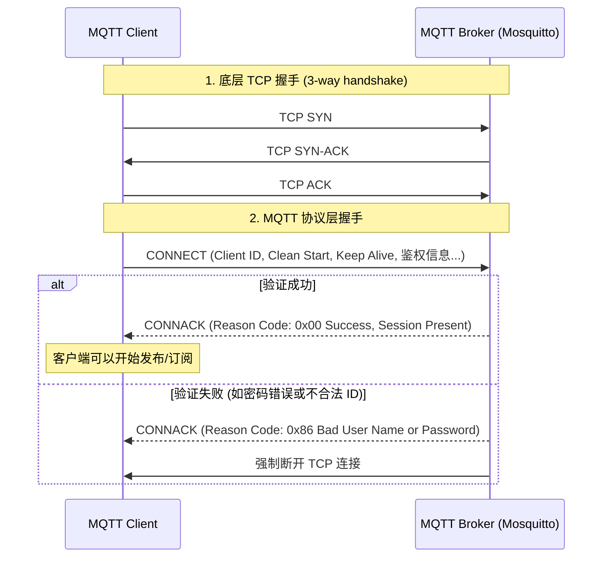

# 连接与会话管理

在客户端能够发布或订阅消息之前，它必须先与 MQTT Broker 建立稳定的网络连接（通常是基于 TCP/IP 或 WebSocket）。在这一章中，我们将深入探讨 MQTT 客户端和代理之间是如何“握手”的，以及它们是如何管理持久状态（会话）的。

## 1. CONNECT 与 CONNACK 交互

当底层的 TCP 连接建立后，客户端必须发送的第一个控制报文就是 `CONNECT`。Broker 在收到 `CONNECT` 后，必须回复一个 `CONNACK`（Connect Acknowledgment）报文来告知连接是否成功。

### Mermaid 可视化：连接建立时序图



### CONNECT 报文里的关键字段
- **Client Identifier (Client ID)**：每个客户端必须有一个唯一的 ID。Broker 靠这个 ID 来识别客户端并关联对应的会话状态。
- **User Name 和 Password**：可选。用于传统的身份认证（稍后的安全章节我们会看到它们如何被用于传输 Token）。
- **Keep Alive (保活时间)**：以秒为单位的 2 字节整数。

---

## 2. 保活机制 (Keep Alive) 与 PING

在物联网环境中，网络波动、NAT 路由断开是非常常见的。如果客户端突然掉线（如电池没电、直接断网），底层的 TCP 连接可能不会立刻抛出错误（即遇到了“半开连接”问题）。

为了及时发现这类问题，MQTT 设计了应用层的心跳机制。

### 工作原理
1. 在 `CONNECT` 时，客户端通过 `Keep Alive` 字段告诉 Broker：“如果在连续的 `Keep Alive` 时间内我没有发送任何报文，请认为我掉线了。”
2. 为了维持连接，即使客户端没有业务数据要发送，它也必须在超时前发送一个 `PINGREQ`（Ping Request）报文。
3. Broker 收到后，会立即回复一个 `PINGRESP`（Ping Response）报文。

如果 Broker 等待了 **1.5 倍的 Keep Alive 时间** 仍未收到客户端的任何报文，Broker 就会主动断开连接。

### 💡 实战配置：Mosquitto 的 `max_keepalive`
如果你不希望某些糟糕的客户端占用连接太久，可以在 `mosquitto.conf` 中配置：
```ini
# mosquitto.conf
max_keepalive 600
```
这意味着如果客户端在 CONNECT 时请求的 Keep Alive 超过 600 秒，Mosquitto 会在 `CONNACK` 中通过 **Server Keep Alive（服务端保活属性，MQTT 5.0 特性）** 强制将其覆盖为 600 秒。

---

## 3. 会话状态 (Session State) 演进：从 3.1.1 到 5.0

这是 MQTT 5.0 最重要且最精妙的改进之一。

在 MQTT 3.1.1 中，连接报文里有一个布尔标志：**Clean Session (清理会话)**。
- 如果 `Clean Session = 1`：客户端断开后，Broker 会清理掉关于它的所有订阅记录和未确认的消息（阅后即焚）。
- 如果 `Clean Session = 0`：Broker 会在客户端断线期间，记住它的订阅，并将属于它（且 QoS > 0）的消息缓存起来。等客户端重新上线，立刻把消息补发给它。

**3.1.1 的痛点**：`Clean Session = 0` 是个“无限期的承诺”。如果这个客户端永远不回来了，Broker 就必须永远为它缓存消息，最终导致内存溢出。

### MQTT 5.0 的解法：拆分与限制
MQTT 5.0 将 `Clean Session` 拆分为了两个更细粒度的机制：**Clean Start (清理起始)** 和 **Session Expiry Interval (会话过期间隔)**。

1. **Clean Start (1 bit 标志位)**
   告诉 Broker 在**当前连接建立时**如何处理之前的会话。
   - `1`：丢弃之前的会话，重新开始。
   - `0`：尝试恢复之前的会话。如果之前没有会话，则创建一个新的。

2. **Session Expiry Interval (4 字节整数属性)**
   告诉 Broker 在**网络断开后**，会话状态应该在服务器上保留多久（以秒为单位）。
   - `0`：网络一断开，会话立刻销毁（等同于 3.1.1 的 Clean Session = 1）。
   - `> 0`：例如 `3600`，表示如果客户端断线 1 小时内未重连，Broker 才销毁会话。
   - `0xFFFFFFFF`：永久保留会话。

通过 `Session Expiry Interval`，Broker 管理员终于可以松一口气了，因为可以设置统一的会话过期时间。

### 💡 实战配置与抓包验证
在 `mosquitto.conf` 中，你可以限制客户端的最大会话保留时间，防止恶意消耗内存：
```ini
# 设置全局持久客户端的过期时间为 1 天 (86400 秒)
persistent_client_expiration 1d
```

**抓包观察 `CONNACK` 中的 `Session Present`：**
当客户端以 `Clean Start = 0` 重连时，如果 Broker 成功找到了并恢复了之前的会话，它会在 `CONNACK` 的标志位中设置 `Session Present = 1`。这明确地告诉客户端：“别担心，你的订阅关系我还留着，马上把攒着的消息发给你。”

---

## 4. 遗嘱消息 (Will Message)

想象一个场景：一个智能门锁因为断电突然离线，如何让用户手机上的 App 第一时间知道门锁掉线了？
靠常规手段很难，因为门锁断电瞬间根本来不及发送“我要下线了”的消息。

**遗嘱消息（Will Message）** 就是为此而生的。

在 `CONNECT` 时，客户端可以预先将一条消息以及对应的主题、QoS、保留标志交托给 Broker（这就叫立遗嘱）。
只有在客户端**意外断开连接**时（例如网络超时、底层 TCP 故障，或未发送 DISCONNECT 就断开），Broker 才会代替该客户端发布这条预先设定的遗嘱消息。

如果客户端发送了正常的 `DISCONNECT` 报文然后优雅退出，Broker 会直接删除遗嘱消息而不发布。

### 遗嘱延迟 (Will Delay Interval) - MQTT 5.0
在移动网络下，短暂掉线重连很正常。如果一掉线就发遗嘱，会导致系统里充斥着“假警报”。
MQTT 5.0 在遗嘱属性中增加了 `Will Delay Interval`。例如设置为 `60` 秒：如果客户端掉线，Broker 会等待 60 秒。如果客户端在 60 秒内重连成功了，遗嘱就不会被发布；如果没连上，才会发布遗嘱。这一机制极大地减少了不必要的误报干扰。