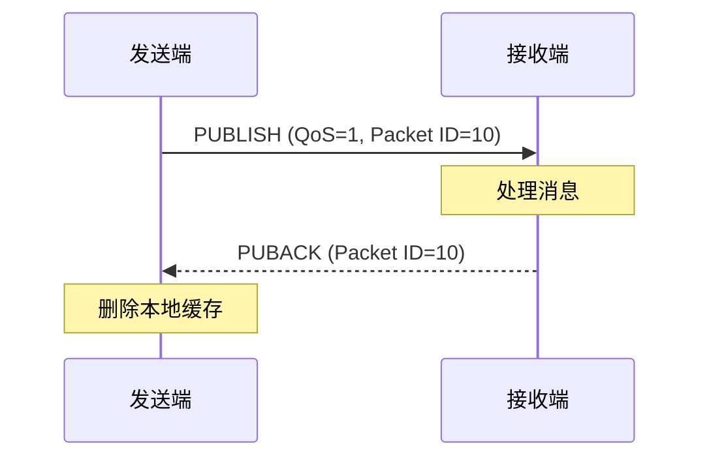
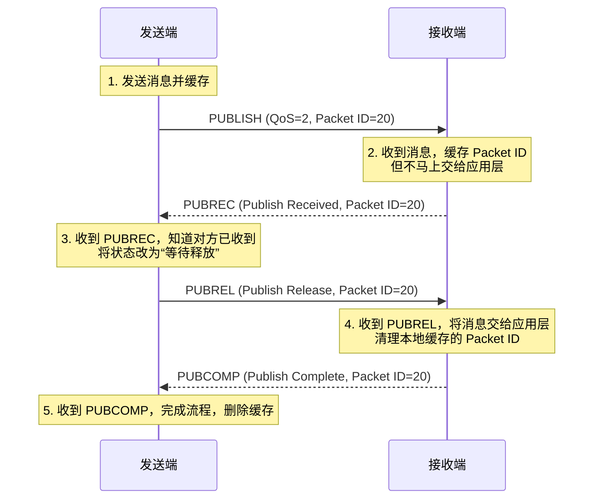

# 服务质量与可靠传递

在复杂的网络环境中，消息可能会丢失、延迟或重复。MQTT 为了适应不同重要程度的数据传输，提供了三种不同级别的**服务质量（Quality of Service, QoS）**。同时，为了解决异步环境下的数据获取问题，它还提供了**保留消息（Retained Messages）**机制。

## 1. 深入解析 QoS 级别

QoS 决定了发布者和 Broker（或 Broker 和订阅者）之间为了保证消息送达，愿意付出多少“网络开销”的代价。

### QoS 0: 最多一次 (At most once)
“发后不理”（Fire and forget）。消息尽最大努力交付，底层依赖 TCP 的可靠性，但 MQTT 协议层没有任何确认机制。
- **代价**：最低。
- **风险**：如果中途网络断开或 Broker 奔溃，消息就会丢失。
- **场景**：高频更新且丢失一两条无所谓的数据（如每秒上报一次的温湿度）。

### QoS 1: 至少一次 (At least once)
保证消息一定会到达接收端，但接收端可能会收到**重复**的消息。
在 QoS 1 中，发送端在发出 `PUBLISH` 报文后，会将消息保存在本地缓存中，直到收到接收端返回的 `PUBACK`（Publish Acknowledgment）才会删除缓存。如果超时未收到 `PUBACK`，发送端会重传 `PUBLISH`（并将 DUP 标志位置 1）。

- **场景**：不能丢失的数据，但应用层能够处理重复数据（幂等操作，比如开灯指令，开一次和开多次效果一样）。

### QoS 2: 只有一次 (Exactly once)
最高级别的服务质量。既保证消息不丢失，也保证绝不重复到达。为了达到这个目的，MQTT 设计了复杂的**四次握手**。

**用 Wireshark 抓包观察 QoS 2 过程：**
如果你使用 Wireshark 监听 Broker 端口（默认 1883），并发起一次 QoS 2 发布，你会清晰看到这四个报文连续飞过：
1. `MQ Telemetry Transport Protocol, Publish Message (QoS: 2, Message URI: my/topic)`
2. `MQ Telemetry Transport Protocol, Publish Received (PUBREC)`
3. `MQ Telemetry Transport Protocol, Publish Release (PUBREL)`
4. `MQ Telemetry Transport Protocol, Publish Complete (PUBCOMP)`
其中，这四个报文的**报文标识符 (Packet Identifier)** 都是一致的，将它们完美串联起来。

- **场景**：核心计费数据、不可重复执行的交易指令。

### 💡 QoS 降级机制
需要注意的是，MQTT 消息的传递分两段：`Publisher -> Broker` 和 `Broker -> Subscriber`。
最终订阅者收到的 QoS，是**发布时的 QoS 和订阅时请求的 QoS 取较小值**。
例如，即使发布者以 QoS 2 发布，但如果某客户端在订阅时指定的最大 QoS 为 1，那么 Broker 转发给该客户端时，会自动降级为 QoS 1。

---

## 2. 保留消息 (Retained Messages)

由于 MQTT 是时间解耦的，经常会有这样尴尬的情况：
设备 A 刚刚发布了 `home/door/status` = `开启`。
1 分钟后，用户打开了手机 App（刚连上 Broker并订阅了该主题）。
由于发布动作已经发生过了，手机 App 此时只能干等，直到门再次被开关一次，它才能知道门现在的状态。这显然不合理。

**保留消息**完美解决了这个问题。

发布者可以在发送 `PUBLISH` 报文时，将固定报头中的 `RETAIN` 标志位设为 `1`。
Broker 看到这个标志后，会做两件事：
1. 像往常一样把消息分发给当前的订阅者。
2. **把这条消息缓存在服务器上**（每个主题只能保留最后一条）。

当任何新的订阅者订阅该主题时，Broker 会**立刻**将缓存的这条保留消息发送给它。这就相当于为某个主题设置了一个“全局状态寄存器”。

**清除保留消息**：
如果你想清空 Broker 上某个主题的保留消息，只需要向该主题发送一个 `Payload` 为空（0 字节）且 `RETAIN=1` 的消息即可。

---

## 3. 消息过期间隔 (Message Expiry Interval) - MQTT 5.0 特性

在 3.1.1 时代，如果你发了一条保留消息或者 QoS 1/2 的离线消息，只要 Broker 不重启或客户端不主动清除，它会一直存在。如果是时效性很强的数据（比如优惠券秒杀通知，过了 5 分钟就没意义了），这就会变成无用的垃圾。

MQTT 5.0 引入了**消息过期间隔 (Message Expiry Interval)** 属性（4 字节整数，单位秒）。
发布者在发送消息时附带这个属性（例如设定为 300 秒）。
- 如果消息在 Broker 停滞了 300 秒还没能发给订阅者（比如订阅者一直离线），Broker 将直接丢弃该消息。
- 如果在过期前发出了，Broker 转发消息时，还会动态更新这个属性，告诉订阅者：“这条消息还有 X 秒就过期了。”