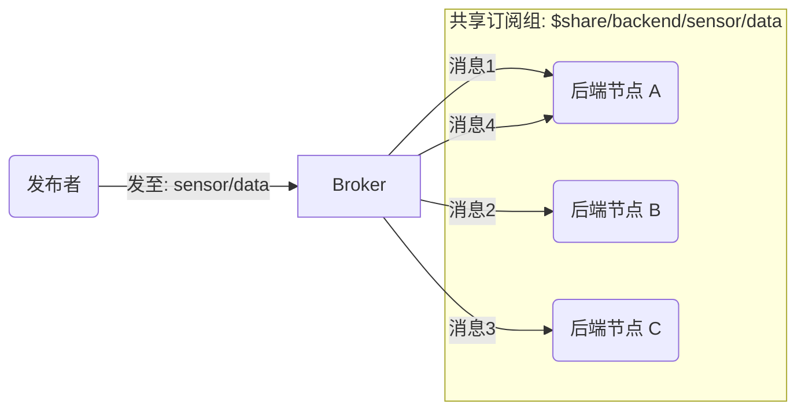

# MQTT 5.0 高级与高性能特性

在经历了 MQTT 3.1.1 长达数年的广泛应用后，OASIS 标准委员会发现虽然 3.1.1 极度轻量，但在大型云原生和复杂企业级物联网场景中显得有些捉襟见肘。因此，**MQTT 5.0 带来了一次彻底的现代化升级**。它保持了原本轻量的 Fixed Header 结构，但在 Variable Header 中引入了灵活的**属性（Properties）**。

本章将挑选 5.0 中最激动人心的几个新特性进行深入剖析。

## 1. 无处不在的原因码 (Reason Codes)

在 3.1.1 中，如果由于某种原因（比如你没有权限订阅某个主题） Broker 拒绝了你，它只能在 SUBACK 中回复一个极其有限的失败码（0x80），或者干脆直接断开 TCP 连接（不辞而别）。客户端很难排查到底出了什么问题。

MQTT 5.0 引入了**报文级别的错误反馈**——原因码（Reason Code，1 字节整数）。
除了 CONNECT/CONNACK 外，所有的确认报文（PUBACK, PUBREC, SUBACK, UNSUBACK）甚至断开连接（DISCONNECT）都附带原因码。

**举个例子**：
如果发布消息时超出了 Broker 的限制（比如单条消息太大），Broker 可以在断开客户端前发送 `DISCONNECT (Reason Code: 0x95 Packet Too Large)`。客户端立刻就知道是由于自己发的数据太大，而不是网络崩了。

---

## 2. 共享订阅 (Shared Subscriptions)

**通俗类比：银行柜台的排队叫号系统**
在传统的 Pub/Sub 中，如果 10 个后端服务订阅了同一个传感器的上报主题，那么这 10 个服务都会收到同一份数据的拷贝。
但如果是为了“处理数据”（比如将温度写入数据库），我们希望 10 个后端服务像 10 个银行窗口一样，**分摊**处理这些传感器发来的数据（负载均衡），而不是重复处理。

这就是共享订阅（Shared Subscriptions）的作用。

客户端在订阅时，使用一种特殊的主题语法：
`$share/{ShareName}/{filter}`

### Mermaid 可视化：共享订阅



**命令行实战：**
打开三个终端窗口。前两个窗口启动共享订阅者（同属 `group1` 组）：
```bash
# 窗口 1
mosquitto_sub -h localhost -t '$share/group1/sensor/data'
```
```bash
# 窗口 2
mosquitto_sub -h localhost -t '$share/group1/sensor/data'
```
在第三个窗口发布数据：
```bash
# 窗口 3
mosquitto_pub -h localhost -t 'sensor/data' -m 'msg1'
mosquitto_pub -h localhost -t 'sensor/data' -m 'msg2'
mosquitto_pub -h localhost -t 'sensor/data' -m 'msg3'
```
你会观察到 `msg1` 发给了窗口1，`msg2` 发给了窗口2，`msg3` 又发给了窗口1。Broker 完美实现了负载均衡。这在构建高可用后端消费者集群时极其重要。

---

## 3. 主题别名 (Topic Alias)

在物联网中，传感器每次发布数据时，都要把完整的主题字符串带上。例如：
`factory/plant-1/machine-42/sensor/temperature/value`。
这个字符串占据了 55 个字节，而实际的温度数据可能只有 2 个字节（如 `25`）。长此以往，白白浪费了大量带宽。

**主题别名**机制允许客户端在发布消息时，用一个 2 字节的整数（如 `1`）来映射一个长字符串主题。

**工作流程**：
1. **首次发布**：包含完整长主题，同时在属性中附带 `Topic Alias = 1`。Broker 收到后，在内存中将 `1` 映射为该长主题。
2. **后续发布**：只需要包含空字符串的主题（0 字节）和 `Topic Alias = 1` 属性。Broker 会自动将其还原为原始长主题。

通过使用主题别名，报文体积可以大幅压缩，这对 NB-IoT 等计流量的网络（甚至限制月流量几十兆）来说是省钱利器。

---

## 4. 流量控制：接收最大值 (Receive Maximum)

在一个强劲的云端 Broker 和一个性能孱弱的单片机设备之间，速度极不匹配。如果 Broker 瞬间并发推下 1000 条 QoS 1 消息，单片机的内存会立刻爆掉。

为了解决这个问题，MQTT 5.0 在 `CONNECT` 报文的属性中引入了 `Receive Maximum`。
- 如果客户端在 `CONNECT` 时附带 `Receive Maximum = 10`。
- 它是在警告 Broker：“在等待 PUBACK/PUBCOMP 确认的过程中，你最多只能同时发送 10 条未确认的 QoS 1/2 消息给我。”
- Broker 必须遵守这个限制（反之亦然，Broker 也可以在 `CONNACK` 告诉客户端服务器的并发上限）。

---

## 5. 请求/响应模式 (Request/Response)

MQTT 传统上是单向推送的，但在实际应用中，有时也需要像 HTTP 一样的“即时问答”机制。比如手机 App 想立刻知道当前的灯泡状态。

MQTT 5.0 通过在报文属性中加入以下两个字段，标准化了 RPC（远程过程调用）流程：
1. **Response Topic（响应主题）**：发送请求时，告诉对方你应该把结果发到哪个主题。
2. **Correlation Data（对比数据）**：一个由请求方生成的随机字符串或 UUID，用于将请求和响应关联起来。

**流程**：
1. App 订阅一个自己独享的主题（如 `client/app/response`）。
2. App 向灯泡发布请求消息，主题为 `device/bulb/status/get`，并在属性中附带 `Response Topic = client/app/response` 和 `Correlation Data = 12345`。
3. 灯泡收到消息，处理完毕后，向 `client/app/response` 发布状态数据，并在属性中附带同样的 `Correlation Data = 12345`。
4. App 收到响应，通过对比数据确认这是针对之前哪个请求的回复。