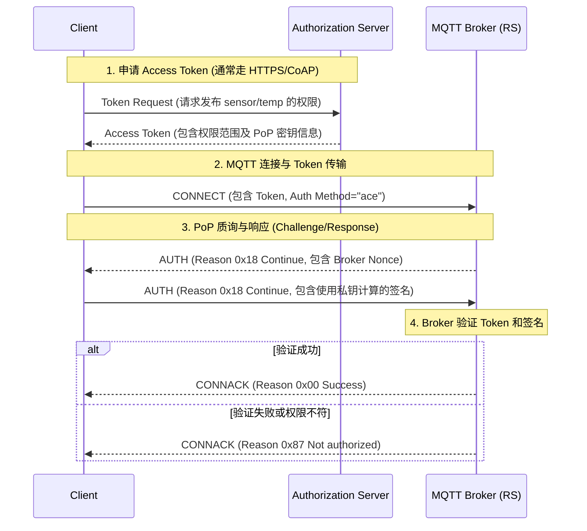

# 安全、身份验证与授权 (结合 RFC 9431)

随着物联网设备的大规模部署，安全问题变得前所未有的重要。传统的 MQTT 安全通常依赖于简单的 TLS 加密加上用户名/密码验证。但在复杂的、多租户的零信任网络环境中，这种静态的安全配置已经无法满足需求。

为此，IETF 发布了 **RFC 9431**（基于 MQTT 的 ACE 框架授权），它将 OAuth 2.0 和基于令牌（Token）的现代授权机制引入了 MQTT 的受限环境中。

本章我们将结合传统的 Mosquitto 安全配置与前沿的 RFC 9431 标准，深入解析 MQTT 的安全体系。

## 1. 基础安全层：TLS 与身份认证

所有安全的基石都是传输层安全（TLS）。强烈建议在任何生产环境中使用 MQTTS（MQTT over TLS，默认端口 8883）。

### 服务端配置：Mosquitto TLS 设置
在 `mosquitto.conf` 中，你需要提供 CA 证书、服务端证书和私钥：
```ini
listener 8883
cafile /etc/mosquitto/certs/ca.crt
certfile /etc/mosquitto/certs/server.crt
keyfile /etc/mosquitto/certs/server.key
```

### 传统授权：ACL 与动态安全插件
在没有使用 Token 机制前，Broker 通常通过 ACL（访问控制列表）来限制用户权限。
```ini
# mosquitto.acl
user sensor_01
topic write factory/machine1/temp
topic read config/machine1/#
```
而在较新的 Mosquitto 中，推荐使用**动态安全插件 (Dynamic Security Plugin)**。它允许你在不重启 Broker 的情况下，通过向特殊的主题（如 `$CONTROL/dynamic-security/v1`）发送 JSON 报文来动态增删用户和修改权限。

---

## 2. 现代授权：RFC 9431 与 ACE 框架

传统的用户名/密码在设备端容易泄露，且权限往往是全局绑定的。**RFC 9431** 提出了一种更为精细、基于**受限环境认证与授权 (ACE)** 框架的解决方案。

在这个框架中，有三个核心角色：
1. **Client（客户端）**：比如物联网传感器。
2. **Resource Server / RS（资源服务器）**：也就是 MQTT Broker。
3. **Authorization Server / AS（授权服务器）**：负责颁发令牌的独立认证中心。

### 核心思想：所有权证明 (Proof-of-Possession, PoP)
如果仅仅是携带一个 Bearer Token，一旦 Token 在网络中被拦截，黑客就可以伪造身份。
为了防范这一点，RFC 9431 强制使用 **PoP Token**。授权服务器在颁发 Token 给客户端时，会把 Token 和一个加密密钥（对称密钥或公钥）绑定。客户端在连接 Broker 时，不仅要出示 Token，**还必须用自己掌握的私钥对握手信息进行签名**，向 Broker 证明“我确实拥有这个 Token 绑定的密钥”。

### Mermaid 可视化：RFC 9431 授权连接时序图



---

## 3. Token 是如何传输的？

RFC 9431 规定了两种主要的将 Token 传输给 Broker 的方式：

### 方式一：借用 MQTT 5.0 的 AUTH 扩展特性
在 MQTT 5.0 中，`CONNECT` 报文的属性（Properties）可以包含**认证方法 (Authentication Method)** 和 **认证数据 (Authentication Data)**。
- 客户端在 `CONNECT` 中将 `Authentication Method` 设置为字符串 `"ace"`。
- 在 `Authentication Data` 中塞入 Token。
- 随后通过上面提到的 `AUTH` 报文进行 PoP 签名质询。

### 方式二：发布到 `authz-info` 主题
对于不支持 MQTT 5.0 高级认证流程的旧设备，RFC 9431 提供了一个巧妙的后备方案：
1. 客户端先通过 TLS 匿名连接到 Broker。
2. 将 Token 发布到受系统保护的特殊主题 `authz-info`。
3. 断开连接。
4. Broker 收到 Token 后会在内部关联。
5. 客户端使用与 Token 绑定的密钥进行双向 TLS (mTLS) 重连。Broker 验证证书后，自动提取之前上传的 Token 权限。

---

## 4. 深入 Token 结构与 Scope 范围

为了在极低带宽下工作，Token 不一定是我们常见的 JSON Web Token (JWT)，而常常是经过高度压缩的 **CBOR Web Token (CWT)**。

Token 内部最重要的字段是 `scope`（权限范围）。为了表示客户端能对哪些主题执行什么操作（发布/订阅），RFC 9431 采用了 AIF（Authorization Information Format）结构。

以下是一个以 JSON 格式表示的 Token 载荷（Payload）示例，帮助你理解内部结构：

```json
{
  "iss": "https://auth.iot.example.com",
  "aud": "mqtt-broker.example.com",
  "exp": 1690000000,
  "scope": [
    ["sensor/+/temp", 1],  // 1 = 允许 Publish (发布)
    ["command/valve/#", 2], // 2 = 允许 Subscribe (订阅)
    ["diagnostics/log", 3]  // 3 = 允许 Publish 和 Subscribe
  ],
  "cnf": {
    "jwk": {
      "kty": "EC",
      "crv": "P-256",
      "x": "...",
      "y": "..."
    }
  }
}
```
**解析：**
- `scope` 数组精确定义了主题与权限的映射。
- `cnf` (Confirmation) 字段就是 PoP 的核心。它包含了一个公钥（如这里的椭圆曲线公钥）。Broker 提取这个公钥，就可以用来验证客户端在握手阶段发送的签名，从而确保连接的绝对安全。

### 总结
通过结合 MQTT 5.0 和 RFC 9431，现代物联网可以实现从底层字节结构到高层身份授权的全面现代化。它不仅极大地提升了网络使用效率，还为零信任架构打下了坚实基础。这使得 MQTT 无愧为当今 IoT 领域当之无愧的霸主。