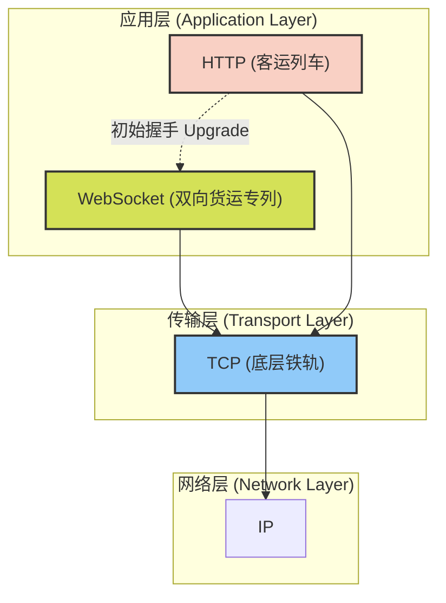

# 01. 协议栈总览与基础 —— 铺设双向通信的铁轨

欢迎来到 WebSocket 的专家导读教程！在接下来的旅程中，我们将深入解析 WebSocket 这项伟大的技术。为了让你更容易理解其中复杂的机制，我们将使用一套统一的**“铁道交通”**比喻体系：

- **TCP 连接**：这是底层的**铁轨**，负责承载所有的运输任务。
- **HTTP 协议**：传统的**客运列车**，乘客（客户端）买票上车（发送请求），到达目的地后下车（获取响应），单向且一次性。
- **WebSocket 协议**：一条全天候的**双向高速货运专列**，随时可以将货物（数据）在两地之间自由调度。

---

## 1. 为什么我们需要 WebSocket？

在 WebSocket 诞生之前，如果你想通过 Web 实时获取股票行情或聊天消息，只能采用“轮询（Polling）”或“长轮询（Long-Polling）”技术。

用我们的比喻来说：
- **轮询**就像是你每隔几分钟就跑去火车站问售票员：“有我的快递吗？有我的快递吗？”。这极大地浪费了体力（网络带宽和服务器性能）。
- **长轮询**则是你跑去火车站，售票员让你在窗口干等，直到有快递才把快递给你并把你赶走。你拿完快递后，又得重新排队等下一次。

这显然不够高效。为了彻底解决这个问题，IETF 制定了 **WebSocket 协议（RFC 6455）**。它在原本的 HTTP 客运列车基础上进行了一次“升级改造”，把单次的客运列车变成了长期的、双向的货运专列。只需一次握手，通信双方就可以自由地相互发送数据。

---

## 2. WebSocket 协议栈总览

WebSocket 并不是一个完全独立的协议，它与 HTTP 紧密纠缠，同时又直接建立在 TCP 之上。为了直观地理解它的定位，请看下方的协议栈总览图：

**图解说明：**
1. **IP 和 TCP** 构成了网络通信的基石（铁轨）。
2. 最初，客户端通过发送一个特殊的 **HTTP 请求**（如同发送一封调度申请信）来发起连接。
3. 一旦服务器同意“升级（Upgrade）”，原本的 HTTP 客运列车立刻变身为 **WebSocket 货运专列**。之后的通信完全脱离 HTTP 的限制，直接在 TCP 铁轨上高效穿梭。

---

## 3. 本教程的路线图与 RFC 映射

本教程将基于 IETF 的核心 RFC 文档，为你提供从基础到实战的深度解析。我们的行程安排如下：

1. **核心协议：握手与生命周期 (RFC 6455)**：讲解列车是如何从 HTTP 升级为 WebSocket 的，以及列车的发车与停运。
2. **核心协议：数据帧与掩码 (RFC 6455)**：拆解 WebSocket 的标准化集装箱格式，了解防伪封条（Masking）机制。
3. **压缩扩展 (RFC 7692)**：探讨 `permessage-deflate` 货物真空打包技术，如何极致压缩大文本数据。
4. **最佳实践 (RFC 7936 及网络拓扑指导)**：在防火墙、代理服务器等复杂地形下，如何保障铁道的畅通无阻。
5. **双向快车道 - HTTP/2 隧道复用 (RFC 8441)**：终极形态！将 WebSocket 货运专列塞进 HTTP/2 高铁的多车道中，实现无与伦比的连接复用。

准备好了吗？下一章我们将正式发车，深入解析 WebSocket 的“握手协议”！