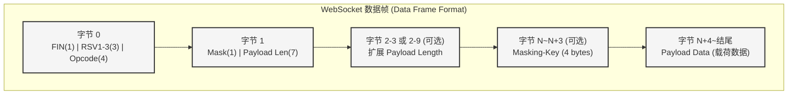

# 03. 核心协议：数据帧与掩码 —— 标准化集装箱与安全封条 (RFC 6455)

当 HTTP “升级”成功后，双向货运专列正式开通。在这条专列上，所有的货物都不再是松散的文本，而是被装进了一个个高度标准化的**“集装箱”**中。

在 RFC 6455 中，这种集装箱被称为 **数据帧（Data Framing）**。

---

## 1. 为什么需要数据帧（Framing）？

TCP 是一条无边界的字节流铁轨，就像一条连续不断的传送带。如果你把两件货物连续放到传送带上，接收方根本不知道第一件货物在哪里结束，第二件货物从哪里开始（这就是著名的**TCP 粘包问题**）。

WebSocket 协议通过“数据帧”完美解决了这个问题。每个帧都有一个固定格式的**“集装箱头部”**，明确标明了这批货物的类型、长度以及安全校验信息。

---

## 2. WebSocket 数据帧格式图谱

让我们通过 Mermaid 图表来直观感受 WebSocket 集装箱的设计有多么精妙：

### 逐个拆解集装箱头部：

1. **FIN (1 bit)**：
   - 标识这是不是这批货物的**最后**一个集装箱。如果一条消息太长（比如几百兆的视频），可以拆成多个帧发送。第一个帧和中间的帧 FIN 为 0，最后一个帧 FIN 为 1。
   
2. **RSV1, RSV2, RSV3 (各 1 bit)**：
   - 预留位。平时都是 0。如果在握手时协商了扩展（比如我们下一章要讲的压缩扩展），这些位才会被启用。

3. **Opcode (操作码, 4 bits)**：
   - 这是集装箱的“货物标签”，告诉接收方这到底装的是什么：
     - `0x1`：文本数据 (UTF-8 编码的 Text)
     - `0x2`：二进制数据 (Binary)
     - `0x8`：关闭连接控制帧 (Close)
     - `0x9`：Ping 帧 (查岗)
     - `0xA`：Pong 帧 (报平安)
     - `0x0`：连续帧 (Continuation Frame，表示这是前面未完消息的后续部分)

4. **Mask (掩码标志, 1 bit)**：
   - 安全封条标志位。规定：**从客户端发往服务器的所有帧，必须将此位置为 1**。

5. **Payload Length (载荷长度, 7 bits / 7+16 bits / 7+64 bits)**：
   - 集装箱设计的绝妙之处在于其**动态长度指示**。
   - 如果数据长度 0~125：直接用这 7 bits 表示。
   - 如果长度是 126：接下来的 2 个字节（16 bits）表示真实长度（上限约 64 KB）。
   - 如果长度是 127：接下来的 8 个字节（64 bits）表示真实长度（上限大到地球装不下）。
   - 这种设计确保了传输几个字节的小消息时，头部只有区区 2 个字节，极其节省带宽！

---

## 3. 掩码机制（Masking）—— 防止沿途投毒的安全封条

RFC 6455 强制规定：**客户端发送给服务器的所有数据帧必须被“掩码（Masked）”处理。如果服务器收到了一个未掩码的帧，必须立刻断开连接（返回状态码 1002）。相反，服务器发给客户端的帧不能被掩码。**

### 为什么要这么做？
这不是为了加密（防止中间人偷看，那是 TLS/WSS 该做的事），而是为了**防止“缓存投毒（Cache Poisoning）”和代理服务器混淆攻击**。

在早期的网络环境中，有些老旧的透明代理服务器不认识 WebSocket。如果攻击者通过 WebSocket 发送了一段精心构造的文本（比如伪造的 HTTP 请求 `GET /malicious HTTP/1.1`），代理服务器如果正好在窥探数据流，可能会把这段数据误认为是一个新的 HTTP 请求，并将其缓存，从而导致其他无辜用户受害。

**掩码是如何工作的？**
1. 客户端生成一个 32-bit 的随机数作为 `Masking-Key`，附在头部。
2. 将真实的载荷数据与这个 `Masking-Key` 按照字节进行**循环异或（XOR）**操作。
3. 异或运算后，原本有意义的字符串（如 `GET /`）变成了一堆乱码。老旧的代理服务器看到一堆乱码，就不会去解析它，而是直接放行。
4. 服务器收到后，用同样的 `Masking-Key` 再次异或，就能完美还原出原始数据（因为 `A XOR B XOR B = A`）。

---

## 4. 实战与调试 (The "Live" WebSocket)

**使用 Wireshark 抓包深度剖析**

如果要用 Wireshark 抓包看到这层原本的样子：
1. 建议在没有开启 TLS (使用 `ws://`) 的环境下抓包，或者在 Wireshark 中配置好 TLS 密钥。
2. 在过滤器中输入 `websocket`。
3. 找到任意一个从客户端发往服务器的包。你会在包详情中看到：
   - `Mask: True`
   - `Masking-Key: <随机的4字节>`
   - `Masked payload` (异或后的乱码数据)
   - `Unmasked payload` (Wireshark 非常贴心地帮你进行了异或运算，展示了真实内容)。

通过这些底层的“集装箱”，WebSocket 实现了比 HTTP 高效得多的全双工通信。但在面对海量文本时，我们还能不能更进一步优化带宽呢？下一章，我们将揭开 **RFC 7692 压缩扩展** 的神秘面纱。