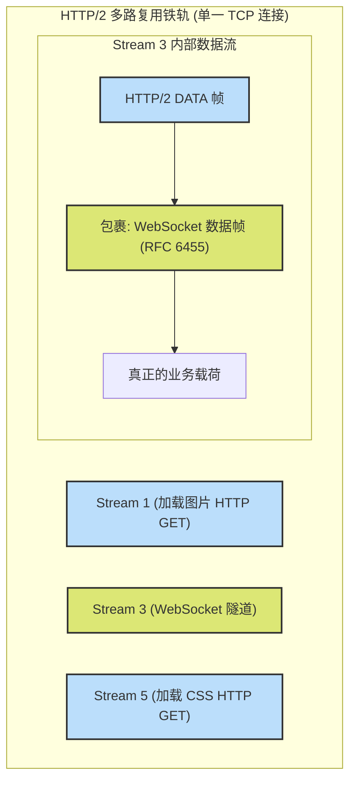

# 06. 双向快车道 —— HTTP/2 隧道复用技术 (RFC 8441)

欢迎来到 WebSocket 协议栈的最前沿领域。

在 HTTP/1.1 时代，WebSocket 就像一条霸道的实体专线。一旦 HTTP 完成握手“升级（Upgrade）”，这条 TCP 铁轨（连接）就归 WebSocket **独占**了，其他 HTTP 请求再也不能走这条路。如果你要打开 5 个 WebSocket 通信通道，你必须向操作系统申请 5 个底层的 TCP 连接。

随着 **HTTP/2 高铁** 的全面普及，这种“独占 TCP 连接”的机制显得极其落后和浪费。HTTP/2 最大的卖点就是**多路复用（Multiplexing）**：允许在同一条 TCP 铁轨上，同时并行跑成百上千个“流（Streams）”。

为了解决这个矛盾，IETF 颁布了极具里程碑意义的 **RFC 8441: Bootstrapping WebSockets with HTTP/2**。

---

## 1. RFC 8441 的核心魔法：化专线为隧道

RFC 8441 提出了一个绝妙的理念：**不再独占 TCP 铁轨，而是将 WebSocket 货运专列作为一个特殊的“流（Stream）”，直接开进 HTTP/2 的虚拟多车道中。**

这意味着，你的网页在拉取图片、CSS 文件的同时，可以在**同一个 TCP 连接**里无缝建立 WebSocket 会话。这就是“隧道复用技术（Tunneling）”。

---

## 2. 新时代的握手协议

在 HTTP/2 中，不再有 `Connection: Upgrade` 这种头部了（HTTP/2 彻底禁用了 Upgrade 机制）。那么，WebSocket 该如何握手呢？

RFC 8441 引入了一种全新的**扩展的 CONNECT 方法**。

### 客户端发起（HTTP/2 Stream）：
客户端开启一个新的 HTTP/2 Stream，并发送包含以下伪头部（Pseudo-headers）的请求：

```http2
HEADERS
- END_STREAM
+ END_HEADERS
  :method = CONNECT
  :protocol = websocket      <-- 新引入的核心字段！
  :scheme = https
  :path = /chat
  :authority = server.example.com
  sec-websocket-protocol = chat, superchat
  sec-websocket-version = 13
```
*看！传统的 `Upgrade` 变成了高级的 `:protocol = websocket` 伪头部。而且最有趣的是，**不再需要 `Sec-WebSocket-Key` 了！** 因为 HTTP/2 本身的 Stream 机制已经完美防止了缓存投毒问题。*

### 服务器响应：
如果服务器支持 RFC 8441，它会回复一个 200 状态码：

```http2
HEADERS
- END_STREAM
+ END_HEADERS
  :status = 200
  sec-websocket-protocol = chat
```
一旦收到 `200` 响应，这个特定的 HTTP/2 Stream 就正式变成了 WebSocket 的专属隧道！

---

## 3. 在 HTTP/2 帧中封装 WebSocket 数据帧

当 Stream 转变为 WebSocket 隧道后，原来的 RFC 6455 中定义的数据帧（集装箱，带有 FIN, Opcode, Mask 等）并没有消失。

相反，这些 WebSocket 的二进制集装箱，会被**原封不动地直接塞进 HTTP/2 的 `DATA` 帧里**进行传输。



---

## 4. RFC 8441 带来的巨大优势

1. **极致的资源复用**：无论你打开几个 WebSocket，整个浏览器和该域名的通信**永远只占用一个 TCP 连接**。省去了每次建立新连接时繁琐的三次握手和 TLS 握手，极大降低了首包延迟（TTFB）。
2. **摆脱队头阻塞（Head-of-Line Blocking）**：即便 WebSocket 正在发送超大尺寸的数据，由于 HTTP/2 具有强大的优先级控制和分帧交错传输能力，它完全不会阻塞同一域名下其他资源的加载。
3. **安全与统一**：完全复用 HTTP/2 的安全特性和流量控制（Flow Control）机制，防攻击能力更上一个台阶。

---

## 5. 调试与实战支持情况

**如何知道我的应用是否正在使用 HTTP/2 WebSocket？**

1. 目前，绝大多数现代浏览器（Chrome 84+, Firefox, Safari）都已经默认支持 RFC 8441。
2. 服务器端需要前置的反向代理（如 Nginx 1.19+ 配合特殊配置，或 Envoy、HAProxy）支持将 HTTP/2 上的 WebSocket 连接代理到后端。
3. 打开 Chrome 开发者工具的 **Network** 面板。
4. 右键点击列标题，勾选 **Protocol**。
5. 找到你的 WebSocket 请求，如果它的 Protocol 显示为 `h2`，恭喜你，你已经登上了新时代的高铁快车道！

---

# 结语

从基础的 **RFC 6455 核心协议**（握手升级与数据帧掩码），到 **RFC 7692 压缩扩展**（上下文滑动窗口真空打包），再到复杂的 **RFC 7936 最佳拓扑实践**，最后进化到终极形态的 **RFC 8441 HTTP/2 隧道复用**。

我们完整地走过了 WebSocket 这条双向货运铁轨的百年演进史。

作为一名开发者，深入理解这些底层的 RFC 规范不仅能让你在面试中脱颖而出，更能在面对断网、丢包、内存泄漏、带宽瓶颈等疑难杂症时，拥有透视现象看本质的“火眼金睛”。

愿你的代码犹如 WebSocket 专列一般，双向奔赴，畅通无阻！